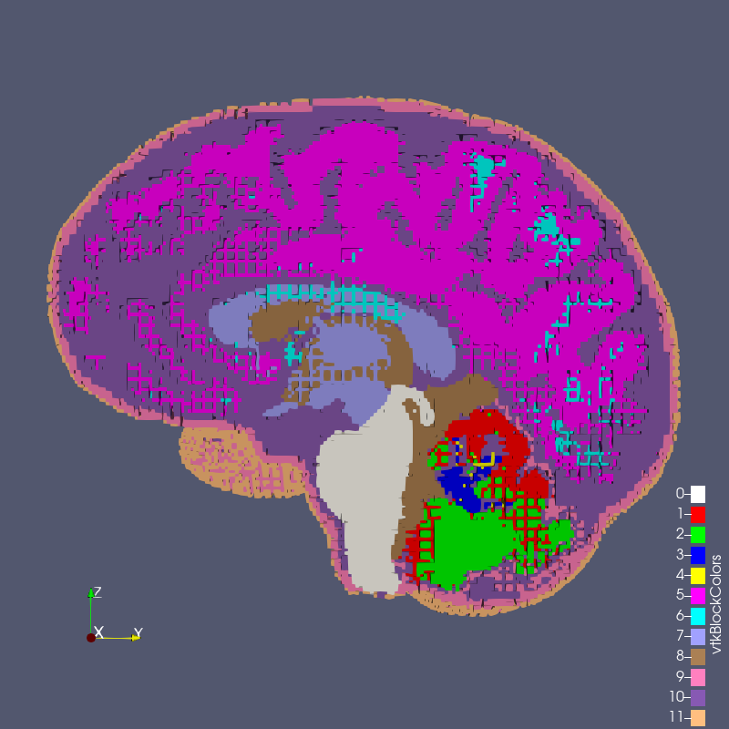
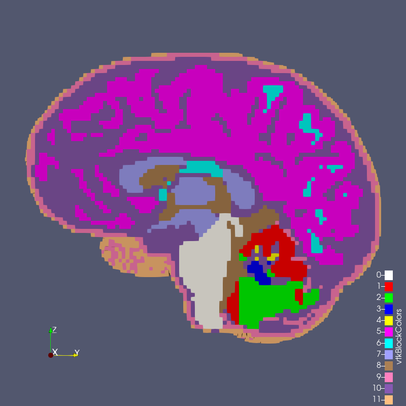
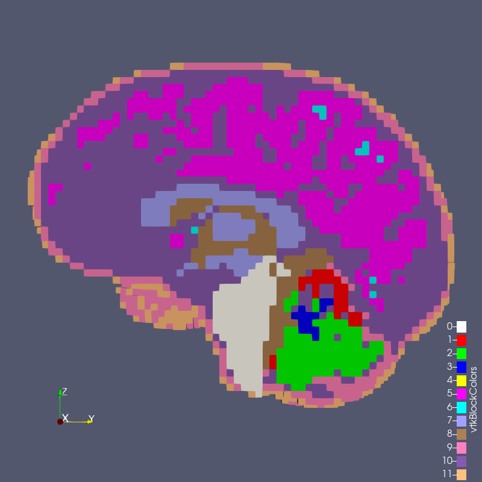
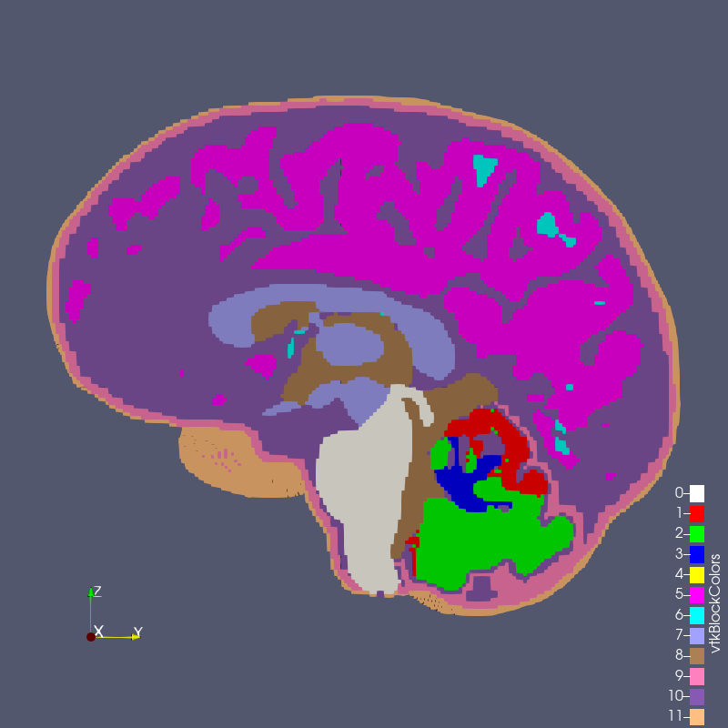

# Conforming versus Segmented Meshes

We define a **conforming mesh** as a traditional finite element mesh that
has nodal placement on the boundary of the geometry approximated by the mesh.
A conforming mesh has a piecewise approximation of the curvature on the boundary.

In contrast, a **segmented mesh** (also known as a **voxelized** or "sugar-cube" mesh) is composed of voxels that approximate
the boundary in a "stair-step" fashion, with nodal placement fixed on a regular, uniform grid
of cube-shaped elements.  A segmented mesh has a stair-step approximation
of the curvature on the boundary.

The [*spheres with shells*](../sphere_with_shells/README.md) meshes illustrate these two mesh types:

conforming | segmented
:---: | :---:
 | 
 | 

Both the conforming and segmented meshes approximate the true geometry: a sphere with concentric shells.  Both approaches introduce error when used in finite element analysis in the calculation of quantities of interest, such as stress and strain.

We are interested in comparing the two methods, and quantifying what error the segmented approach introduces relative to the conforming approach.

For the *spheres with shells* example above, we were able to readily create two *de novo* meshes.  There are instances, however, where a traditional, conforming finite element mesh exists, but a segmented version of the same geometry does not exist.

To create a segmented version of a conforming mesh, we created the [`segment`](../../cli/segment.md) command.  Following is an example using the segment functionality.

## RMU Brain Model

The RMU brain model, `All_Hex_Dec`, is a model of a human head.  The model has 12 blocks composing the various anatomy of the head and brain, shown below.


**Figure: RMU brain model `All_Hex_Dec.exo`**

With this conforming mesh, we create segmented meshes with the `segment` command, for example,

```sh
automesh segment hex --input All_Hex_Dec.exo --output test_3_0p8.exo --grid 3 --size 0.8
```

The output files have the naming convention `test_x_y.exo` where 

* `x` is the grid number,
* `y` is the element length in mm,
* and `0p8` means `0.8 mm`.



**Figure: `test_1_1.exo` created with options `--grid 1 --size 1`**



**Figure: `test_1_2.exo` created with options `--grid 1 --size 2`**



**Figure: `test_1_3.exo` created with options `--grid 1 --size 3`**



**Figure: `test_2_1.exo` created with options `--grid 2 --size 1`**


**Figure: `test_3_0p8.exo` created with options `--grid 3 --size 0.8`**

## Comparison

`All_Hex_Dec.exo` | `test_3_0p8.exo`
:---: | :---:
 | 

## Source Files

file | `md5` checksum | size
:---: | :---: | :---:
[`All_Hex_Dec.inp`](https://1drv.ms/u/c/3cc1bee5e2795295/EclQLxv89d9IkTv69BhiN3MBccPVhVq7VoT7TvHAiktbag?e=eDW8ii) | `4e376f7d551890b807cabc1d89630772` | 212 MB
[`All_Hex_Dec.exo`](https://1drv.ms/u/c/3cc1bee5e2795295/EaIAW30tkq9PqYWj28QHX9IBscQ9-U2RCtNwBWxELuDLMQ?e=Bx9jjr) | `5df6f584a30139cb89e6e6917f843f55` | 66 MB
[`test_1_1.exo`](https://1drv.ms/u/c/3cc1bee5e2795295/ERuNL-yuEv9CmYdQYdUQkhABn_1mcAQq-Ci_JAm1rsLY0A?e=EzbYmC) | `5c0f02a7960890ffbe536493c4993104` | 95 MB
[`test_1_2.exo`](https://1drv.ms/u/c/3cc1bee5e2795295/ERcVQwrJC85Ou2RXchhKIhQB55y1rUP4iT3uUnaDbocgfQ?e=RknQ0S) | `db674b42065cd9de9c8eb30ce2945c0f` | 13 MB
[`test_1_3.exo`](https://1drv.ms/u/c/3cc1bee5e2795295/EUsr5WUMGC5HpU5gbc6MIvYBikf3payAmtWGPtlZxjpEog?e=wBRYZv) | `50da29122a0435672e62156308120ea9` | 4 MB
[`test_2_1.exo`](https://1drv.ms/u/c/3cc1bee5e2795295/ETotW7_4XSxAtEPO0iZofI4BJ_n7H6MWsK0sgIKt2_J-RQ?e=eEF6Me) | `d108b4fe0aa524610fbe036e337fc6e1` | 105 MB
[`test_3_0p8.exo`](https://1drv.ms/u/c/3cc1bee5e2795295/Ec-kJ6y0TSJDoPicl9mxNpsB18imZdEslq0EEUPKcaTI-w?e=BY6PL2) | `60dddb70a9b018b4a25a35850c676eb6` | 205 MB
