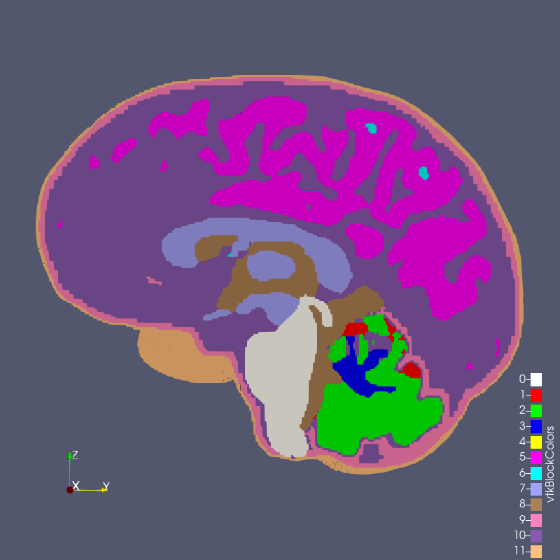

# Conforming versus Segmented Meshes

We define a **conforming mesh** as a traditional finite element mesh that
has nodal placement on the boundary of the geometry approximated by the mesh.
A conforming mesh has a piecewise approximation of the curvature on the boundary.

In contrast, a **segmented mesh** (also known as a **voxelized** or **"sugar-cube"** mesh) is composed of voxels that approximate
the boundary in a "stair-step" fashion, with nodal placement fixed on a regular, uniform grid
of cube-shaped elements.  A segmented mesh has a stair-step approximation
of the curvature on the boundary.

The meshes from the [Sphere with Shells](../sphere_with_shells/simulation.md) section illustrate these two mesh types:

conforming | segmented
:---: | :---:
 | 
 | 

Both the conforming and segmented meshes approximate the true geometry: a sphere with concentric shells.  Both approaches introduce error when used in finite element analysis in the calculation of quantities of interest, such as stress and strain.

We are interested in comparing the two methods, and quantifying what error the segmented approach introduces relative to the conforming approach.

For the *spheres with shells* example above, we were able to readily create two *de novo* meshes (the conforming mesh and the segmented mesh).  There are instances, however, where a traditional, conforming finite element mesh exists, but a segmented version of the same geometry does not exist.

To create a segmented version of a conforming mesh, we created the [`segment`](../../cli/segment.md) command.  Following are a examples using the `segment` functionality.

## Recovering the Segmented Sphere

We use the `conf_0.5cm.g` file as our start point.  See the [Mesh Creation and Visualization](../sphere_with_shells/conforming.md#mesh-creation-and-visualization) section for a download link.  Our objective it to recover the segmented version of the model, shown above, using the `segment` command.

```sh
# Clone the .g to .exo
cp conf_0.5cm.g conf_0.5cm.exo

# Use automesh to convert the .exo to a .npy
# automesh segment hex -i conf_0.5cm.exo -o conf_0.5cm.npy -g 1 -s 0.5 -r 0
# automesh segment hex -i conf_0.5cm.exo -o conf_0.5cm.npy -g 2 -s 0.5 -r 255
# automesh segment hex -i conf_0.5cm.exo -o conf_0.5cm.npy -g 3 -s 0.5 -r 255
# automesh segment hex -i conf_0.5cm.exo -o conf_0.5cm_vox_orig.exo -g 2 -s 0.5 -r 255
automesh segment hex -i conf_0.5cm.exo -o conf_0.5cm_vox_orig.exo -g 2 -s 0.5

# why no .inp output? available
automesh convert mesh hex -i conf_0.5cm_vox_orig.exo conf_0.5_vox_orig.inp
```

```sh
# Investigate the `.npy` using Python
# 
# ```python
# import numpy as np
# arr = np.load("conf_0.5cm.npy")
# values, counts = np.unique(arr, return_counts=True)
# 
# values
#   array([  1,   2,   3, 255], dtype=uint8)
# 
# counts
# #  array([ 31840,  11760,  10968, 207576])
# #  array([ 31960,  11760,  10968, 207576])
#   array([ 33072,  11648,  12800, 207576])
# print(counts)
# ```
# 
# Create a segmented mesh from the `.npy` file
# 
# ```sh
# automesh mesh hex -i conf_0.5cm.npy -o conf_0.5cm_vox.exo -r 255
# ```
```

## RMU Brain Model

The RMU brain model, `All_Hex_Dec`, is a model of a human head.

## Source Files

file | `md5` checksum | size
:---: | :---: | :---:
[`All_Hex_Dec.inp`](https://1drv.ms/u/c/3cc1bee5e2795295/EclQLxv89d9IkTv69BhiN3MBccPVhVq7VoT7TvHAiktbag?e=eDW8ii) | `4e376f7d551890b807cabc1d89630772` | 212 MB
[`All_Hex_Dec.exo`](https://1drv.ms/u/c/3cc1bee5e2795295/EaIAW30tkq9PqYWj28QHX9IBscQ9-U2RCtNwBWxELuDLMQ?e=Bx9jjr) | `5df6f584a30139cb89e6e6917f843f55` | 66 MB
[`test_1_1.exo`](https://1drv.ms/u/c/3cc1bee5e2795295/ERuNL-yuEv9CmYdQYdUQkhABn_1mcAQq-Ci_JAm1rsLY0A?e=EzbYmC) | `5c0f02a7960890ffbe536493c4993104` | 95 MB
[`test_1_2.exo`](https://1drv.ms/u/c/3cc1bee5e2795295/ERcVQwrJC85Ou2RXchhKIhQB55y1rUP4iT3uUnaDbocgfQ?e=RknQ0S) | `db674b42065cd9de9c8eb30ce2945c0f` | 13 MB
[`test_1_3.exo`](https://1drv.ms/u/c/3cc1bee5e2795295/EUsr5WUMGC5HpU5gbc6MIvYBikf3payAmtWGPtlZxjpEog?e=wBRYZv) | `50da29122a0435672e62156308120ea9` | 4 MB
[`test_2_1.exo`](https://1drv.ms/u/c/3cc1bee5e2795295/ETotW7_4XSxAtEPO0iZofI4BJ_n7H6MWsK0sgIKt2_J-RQ?e=eEF6Me) | `d108b4fe0aa524610fbe036e337fc6e1` | 105 MB
[`test_3_0p8.exo`](https://1drv.ms/u/c/3cc1bee5e2795295/Ec-kJ6y0TSJDoPicl9mxNpsB18imZdEslq0EEUPKcaTI-w?e=BY6PL2) | `60dddb70a9b018b4a25a35850c676eb6` | 205 MB

The model has 12 blocks composing the various anatomy of the head and brain, shown below.


**Figure: RMU brain model `All_Hex_Dec.exo`**

With this conforming mesh, we create segmented meshes with the `segment` command, for example,

```sh
automesh segment hex --input All_Hex_Dec.exo --output test_3_0p8.exo --grid 3 --size 0.8
```

The output files have the naming convention `test_x_y.exo` where 

* `x` is the grid number,
* `y` is the element length in mm,
* and `0p8` means `0.8 mm`.


**Figure: `test_1_1.exo` created with options `--grid 1 --size 1`**


**Figure: `test_1_2.exo` created with options `--grid 1 --size 2`**


**Figure: `test_1_3.exo` created with options `--grid 1 --size 3`**


**Figure: `test_2_1.exo` created with options `--grid 2 --size 1`**



**Figure: `test_3_0p8.exo` created with options `--grid 3 --size 0.8`**

## Comparison

`All_Hex_Dec.exo` | `test_3_0p8.exo`
:---: | :---:
 | 

## Convert to `.inp` and scale from mm to meters

```sh
# convert conforming inp to voxelized npy
automesh segment hex --input All_Hex_Dec.inp --output test_2_1.npy --grid 2 --size 1

# mesh and scale voxelized npy to voxelized inp
automesh mesh hex --input test_2_1.npy --output test_2_1e-3.inp --xscale 0.001 --yscale 0.001 --zscale 0.001
```

file | `md5` checksum | size | units
:---: | :---: | :---: | :---:
[`test_2_1e-3m.inp`]() | `` | xxx MB | m
