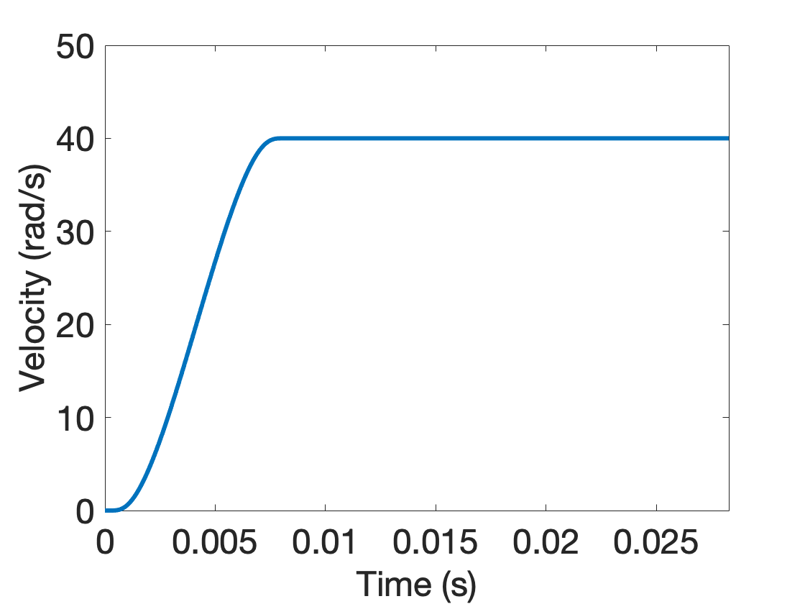

# Simulation

Work in progress.

## Boundary Conditions

We impose an angular acceleration pulse to the outermost shell.
The angular acceleration has the form

$$\alpha(t) := \alpha_{\max} \exp \left( 1 - \frac{1}{1 - \left(\frac{2t}{\Delta t} - 1 \right)^2}\right) \hspace{0.5cm} {\rm for} \hspace{0.5cm} 0 \leq t \leq \Delta t $$

and $\alpha(t) = 0$ is zero otherwise.  This pulse, referred to as the **bump function**, is continuously differentiable, with peak angular acceleration at $\Delta t / 2$.

With $\alpha_{\max} := $ 8.0 krad/s^2, and $\Delta t := 8.0$ ms, we can create the angular acceleration boundary condition (with corresponding angular velocity) [^Carlsen_2021] plots:

| Angular Acceleration | Angular Velocity |
| :---: | :---: |
|  |  |
> Figure: Angular acceleration and corresponding angular velocity time history.

* [Angular velocity tabulated data](https://1drv.ms/u/s!ApVSeeLlvsE8g_4yrDrMBjYM28vt6A?e=reeUyW):  The angular velocity curve has column data as (time, magnitude) in (sec, rad/s).
* [Angular acceleration tabulated data](https://1drv.ms/u/s!ApVSeeLlvsE8g_4xLyBDaZDDXvh7iw?e=iikM6v):  The standardized angular acceleration load curve has column data as (time, magnitude) in (sec, krad/s^2).  The function used to generated the curve, from Equation (1) of [^Carlsen_2021], is

The peak angular acceleration ocurrs at $t=\Delta t / 2$ (which occurs in the tabular data at data point 4144, values (0.00414310, 7.99999997)).

## Meshes

We consider three simulations using the following three meshes:

* `spheres_reolution_2.exo`
* `spheres_reolution_3.exo`
* `spheres_reolution_4.exo`

We do not use the `spheres_resolution_1.exo` because the outer shell layer is not closed.  We place these three meshes on the HPC in the shared folder called `~/autotwin/ssm/geometry/sphere/`.

```sh
# manual copy from local to HPC
# macOS local finder, command+K to launch "Connect to Server"
# smb://cee/chovey
# copy [local]~/autotwin/automesh/book/analysis/sphere_with_shells/*.exo
# to
# [HPC]~/autotwin/ssm/geometry/sphere/
```

### SSM input


## References

[^Carlsen_2021]: Carlsen RW, Fawzi AL, Wan Y, Kesari H, Franck C. A quantitative relationship between rotational head kinematics and brain tissue strain from a 2-D parametric finite element analysis. Brain Multiphysics. 2021 Jan 1;2:100024.  [paper](https://1drv.ms/b/s!ApVSeeLlvsE8g9tyGKINkyp_5cb1hA?e=G9XGIZ)
