# Hexahedral Metrics

```sh
automesh metrics hex --help
<!-- cmdrun automesh metrics hex --help -->
```

`automesh` implements the following **hexahedral** element quality metrics[^Knupp_2006]:

* Maximum edge ratio ${\rm ER}_{\max}$
* Minimum scaled Jacobian $\hat{J}_{\min}$
* Maximum skew
* Element volume

A brief description of each metric follows.

## Maximum Edge Ratio

* ${\rm ER}_{\max}$ measures the ratio of the longest edge to the shortest edge in a mesh element.
* A ratio of 1.0 indicates perfect element quality, whereas a very large ratio indicates bad element quality.
* Knupp *et al.*[^Knupp_2006] (page 87) indicate an acceptable range of `[1.0, 1.3]`.

## Minimum Scaled Jacobian

* $\hat{J}_{\min}$ evaluates the determinant of the Jacobian matrix at each of the corners nodes, normalized by the corresponding edge lengths, and returns the minimum value of those evaluations.
* Interpretation
  * **$\hat{J}_{\min} = 1.0$**: Perfect rectangular element
  * **$\hat{J}_{\min} > 0$**: Element is valid (positive Jacobian)
  * **$\hat{J}_{\min} = 0$**: Element zero volume
  * **$\hat{J}_{\min} < 0$**: Invalid element (inverted/negative Jacobian)

Typically, mesh quality requirements specify $\hat{J}_{\min} > 0.3$ for acceptable elements.

* Knupp *et al.*[^Knupp_2006] (page 92) indicate an acceptable range of `[0.5, 1.0]`, though in practice, minimum values as low as `0.2` and `0.3` are often used.

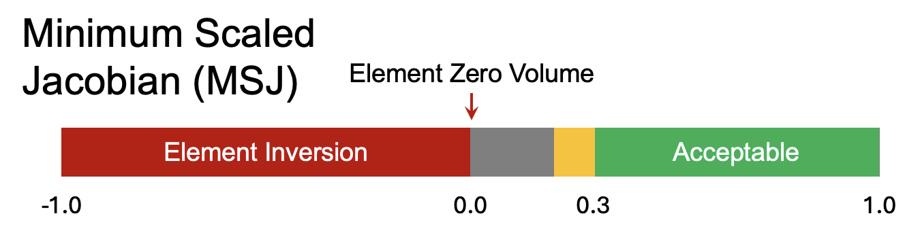

Figure. Illustration of minimum scaled Jacobian[^Hovey_2023] with acceptable range `[0.3, 1.0]`.

## Maximum Skew

* Skew measures how much an element deviates from being a regular shape (e.g., in 3D, a cube or regular tetrahedron; in 2D, a square or equilateral triangle). A skew value of 0 indicates a perfectly regular shape, while higher values indicate increasing levels of distortion.
* Knupp *et al.*[^Knupp_2006] (page 97) indicate an acceptable range of `[0.0, 0.5]`.

## Element Volume

* Measures the volume of the element.

## Unit Tests

Inspired by Figure 2 of Livesu *et al.*[^Livesu_2021] reproduced here below

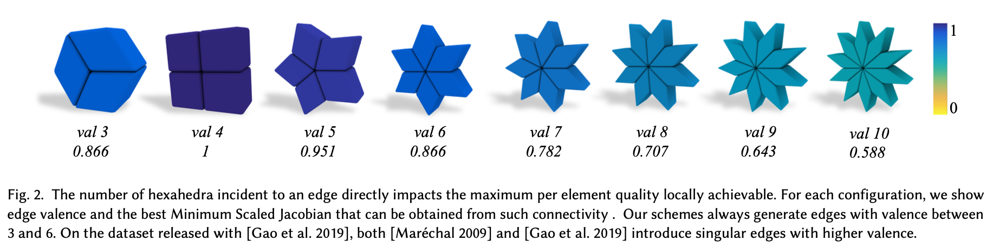

we examine several unit test singleton elements and their metrics.

valence | singleton | ${\rm ER}_{\max}$ | $\hat{J}_{\min}$ | ${\rm skew_{\max}}$ | volume
:---: | :---: | :---: | :---: | :---: | :---:
3           | 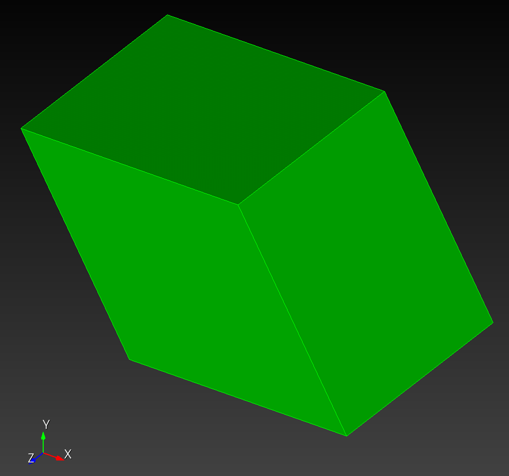        | 1.000000e0 (1.000)    | 8.660253e-1 (0.866)   | 5.000002e-1 (0.500)   | 8.660250e-1 (0.866)
3' (noised) | 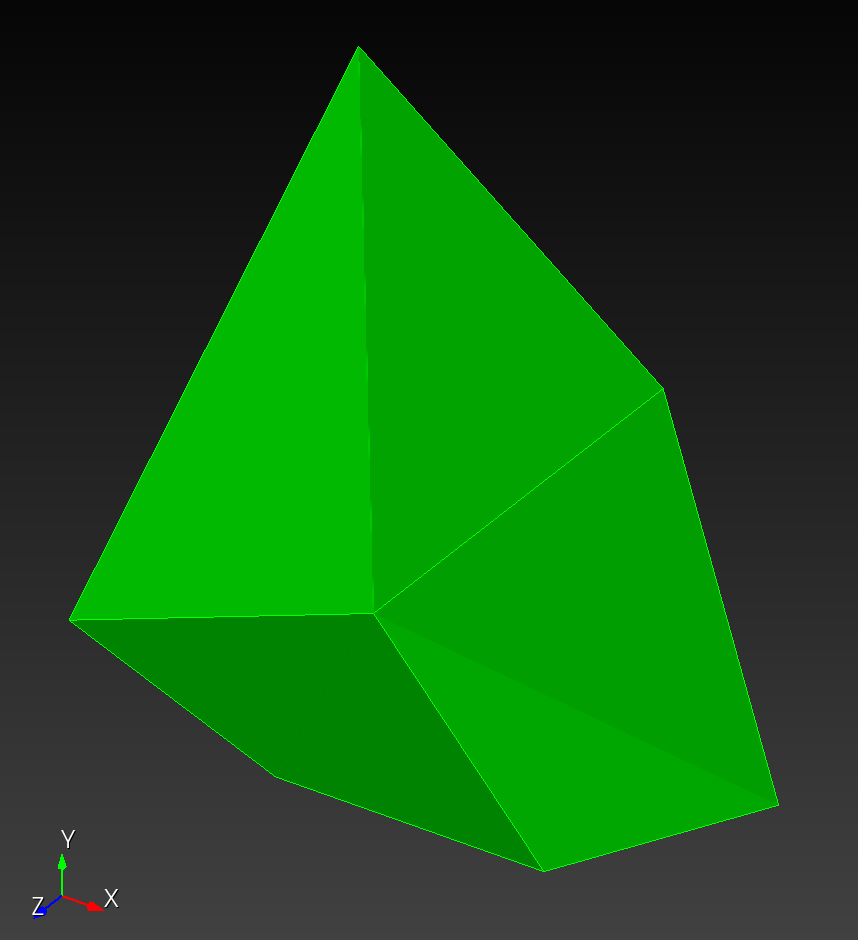 | 1.292260e0 (2.325) ** *Cubit (aspect ratio): 1.292* | 1.917367e-1 (0.192)   | 6.797483e-1 (0.680)   | 1.247800e0  (1.248)
4           | 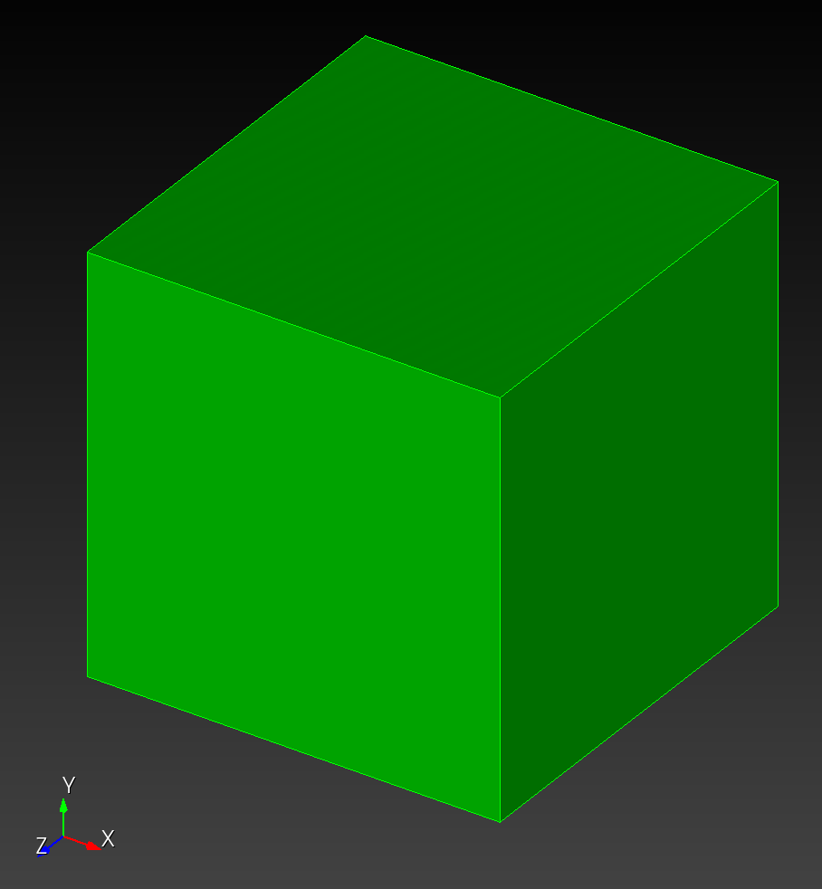        | 1.000000e0 (1.000)    | 1.000000e0  (1.000)   | 0.000000e0  (0.000)   | 1.000000e0  (1.000)
4' (noised) | 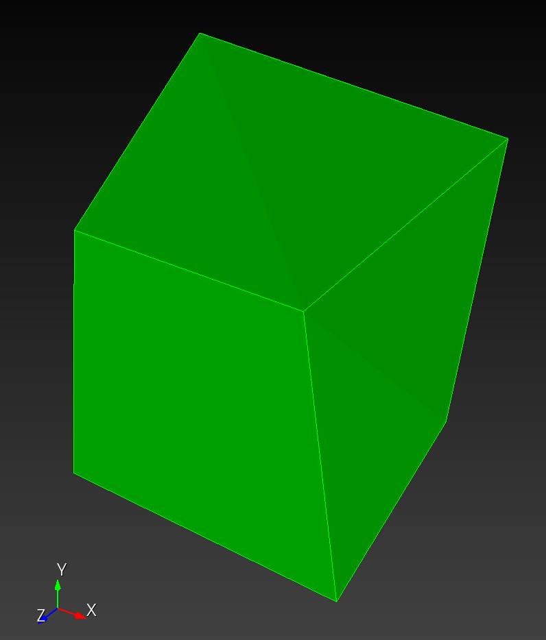 | 1.167884e0 (1.727) ** *Cubit (aspect ratio): 1.168* | 3.743932e-1 (0.374)   | 4.864936e-1 (0.486)   | 9.844008e-1 (0.984)
5           | 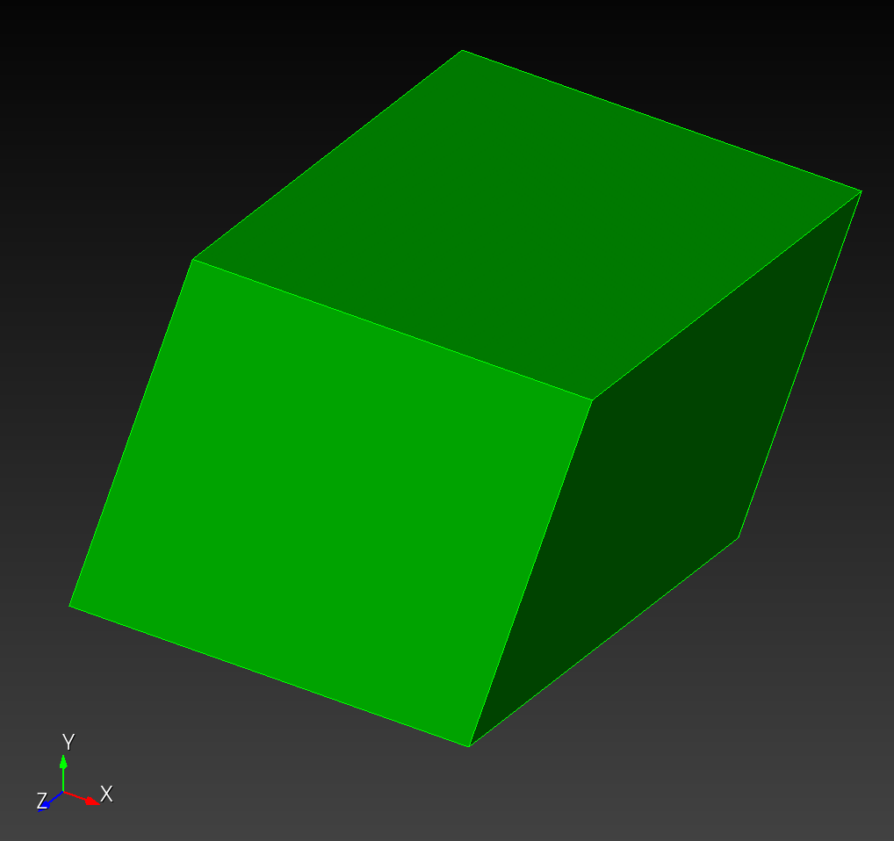        | 1.000000e0 (1.000)    | 9.510566e-1 (0.951)   | 3.090169e-1 (0.309)   | 9.510570e-1 (0.951)
6           | 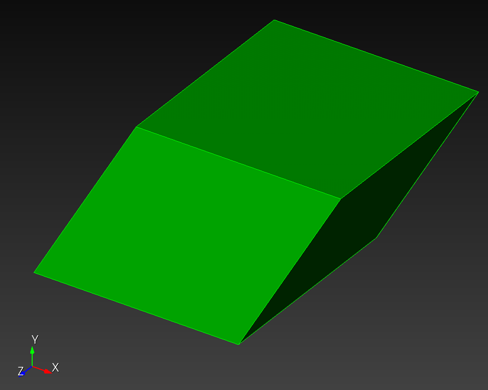        | 1.000000e0 (1.000)    | 8.660253e-1 (0.866)   | 5.000002e-1 (0.500)   | 8.660250e-1 (0.866)
...         | ...                                   | ...                   | ...                   | ...                   | ...
10          | 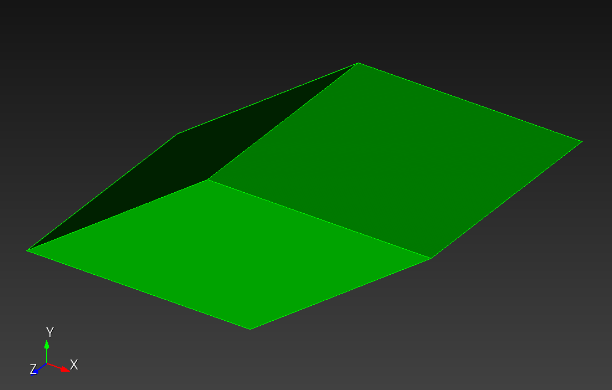        | 1.000000e0 (1.000)    | 5.877851e-1 (0.588)   | 8.090171e-1 (0.809)   |  5.877850e-1 (0.588)

Figure: Hexahedral metrics.  Leading values are from `automesh`.  Values in parenthesis are results from [HexaLab](https://www.hexalab.net).[^Hexalab_2023] Items with ** indicate where `automesh` and Cubit agree, but HexaLab disagrees.  Cubit uses the term *Aspect Ratio* for Edge Ratio for hexahedral elements.  All values were also verified with Cubit.

The connectivity for all elements:

```sh
1,    2,    4,    3,    5,    6,    8,    7
```

with prototype:

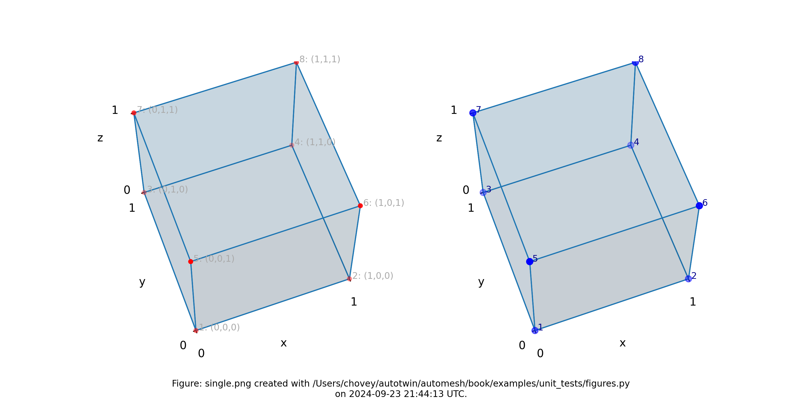

The element coordinates follow:

```sh
# 3
    1,      0.000000e0,      0.000000e0,      0.000000e0
    2,      1.000000e0,      0.000000e0,      0.000000e0
    3,     -0.500000e0,      0.866025e0,      0.000000e0
    4,      0.500000e0,      0.866025e0,      0.000000e0
    5,      0.000000e0,      0.000000e0,      1.000000e0
    6,      1.000000e0,      0.000000e0,      1.000000e0
    7,     -0.500000e0,      0.866025e0,      1.000000e0
    8,      0.500000e0,      0.866025e0,      1.000000e0

# 3'
    1,      0.110000e0,      0.120000e0,     -0.130000e0
    2,      1.200000e0,     -0.200000e0,      0.000000e0
    3,     -0.500000e0,      1.866025e0,     -0.200000e0
    4,      0.500000e0,      0.866025e0,     -0.400000e0
    5,      0.000000e0,      0.000000e0,      1.000000e0
    6,      1.000000e0,      0.000000e0,      1.000000e0
    7,     -0.500000e0,      0.600000e0,      1.400000e0
    8,      0.500000e0,      0.866025e0,      1.200000e0

# 4
    1,      0.000000e0,      0.000000e0,      0.000000e0
    2,      1.000000e0,      0.000000e0,      0.000000e0
    3,      0.000000e0,      1.000000e0,      0.000000e0
    4,      1.000000e0,      1.000000e0,      0.000000e0
    5,      0.000000e0,      0.000000e0,      1.000000e0
    6,      1.000000e0,      0.000000e0,      1.000000e0
    7,      0.000000e0,      1.000000e0,      1.000000e0
    8,      1.000000e0,      1.000000e0,      1.000000e0

# 4'
    1,      0.100000e0,      0.200000e0,      0.300000e0
    2,      1.200000e0,      0.300000e0,      0.400000e0
    3,     -0.200000e0,      1.200000e0,     -0.100000e0
    4,      1.030000e0,      1.102000e0,     -0.250000e0
    5,     -0.001000e0,     -0.021000e0,      1.002000e0
    6,      1.200000e0,     -0.100000e0,      1.100000e0
    7,      0.000000e0,      1.000000e0,      1.000000e0
    8,      1.010000e0,      1.020000e0,      1.030000e0

# 5
    1,      0.000000e0,      0.000000e0,      0.000000e0
    2,      1.000000e0,      0.000000e0,      0.000000e0
    3,      0.309017e0,      0.951057e0,      0.000000e0
    4,      1.309017e0,      0.951057e0,      0.000000e0
    5,      0.000000e0,      0.000000e0,      1.000000e0
    6,      1.000000e0,      0.000000e0,      1.000000e0
    7,      0.309017e0,      0.951057e0,      1.000000e0
    8,      1.309017e0,      0.951057e0,      1.000000e0

# 6
    1,      0.000000e0,      0.000000e0,      0.000000e0
    2,      1.000000e0,      0.000000e0,      0.000000e0
    3,      0.500000e0,      0.866025e0,      0.000000e0
    4,      1.500000e0,      0.866025e0,      0.000000e0
    5,      0.000000e0,      0.000000e0,      1.000000e0
    6,      1.000000e0,      0.000000e0,      1.000000e0
    7,      0.500000e0,      0.866025e0,      1.000000e0
    8,      1.500000e0,      0.866025e0,      1.000000e0

# 10
    1,      0.000000e0,      0.000000e0,      0.000000e0
    2,      1.000000e0,      0.000000e0,      0.000000e0
    3,      0.809017e0,      0.587785e0,      0.000000e0
    4,      1.809017e0,      0.587785e0,      0.000000e0
    5,      0.000000e0,      0.000000e0,      1.000000e0
    6,      1.000000e0,      0.000000e0,      1.000000e0
    7,      0.809017e0,      0.587785e0,      1.000000e0
    8,      1.809017e0,      0.587785e0,      1.000000e0
```

## Local Numbering Scheme

### Nodes

The local numbering scheme for nodes of a hexahedral element:

```sh
       7---------6
      /|        /|
     / |       / |
    4---------5  |
    |  3------|--2
    | /       | /
    |/        |/
    0---------1
```

node | connected nodes
:---: | :---:
0 | 1, 3, 4
1 | 0, 2, 5
2 | 1, 3, 6
3 | 0, 2, 7
4 | 0, 5, 7
5 | 1, 4, 6
6 | 2, 5, 7
7 | 3, 4, 6

### Faces

From the exterior of the element, view the (0, 1, 5, 4) face and unwarp the remaining faces; the six face normals now point out of the page.  The local numbering scheme for faces of a hexahedral element:

```sh
              7---------6
              |         |
              |    5    |
              |         |
    7---------4---------5---------6---------7
    |         |         |         |         |
    |    3    |    0    |    1    |    2    |
    |         |         |         |         |
    3---------0---------1---------2---------3
              |         |
              |    4    |
              |         |
              3---------2
```

face | nodes
:---: | :---:
0 | 0, 1, 5, 4
1 | 1, 2, 6, 5
2 | 2, 3, 7, 6
3 | 3, 0, 4, 7
4 | 3, 2, 1, 0
5 | 4, 5, 6, 7

## $\hat{J}_{\min}$ Formulation

For a hexahedral element with eight nodes, the scaled Jacobian at each node is computed as:

$$J_{\text{scaled}} := \hat{J} = \frac{\mathbf{n} \cdot \mathbf{w}}{\|\mathbf{u}\| \; \|\mathbf{v}\| \; \|\mathbf{w}\|}
$$

where:

* $\mathbf{u}$, $\mathbf{v}$, and $\mathbf{w}$ are edge vectors emanating from the node,
* $\mathbf{n} = \mathbf{u} \times \mathbf{v}$ is the cross product of the first two edge vectors, and
* $\|\cdot\|$ denotes the Euclidean norm.

The minimum scaled Jacobian for the element is:

$$
\hat{J}_{\text{min}} := \min \{\hat{J}^{(i)}\}_{i=0}^{7}
$$

### Node Numbering Convention

The hexahedral element uses the following local node numbering (standard convention):
       
```src
       7----------6
      /|         /|
     / |        / |
    4----------5  |
    |  |       |  |
    |  3-------|--2
    | /        | /
    |/         |/
    0----------1
```

### Edge Vectors at Each Node

For each node $i$, three edge vectors are defined that point to adjacent nodes. The connectivity follows this pattern:

| Node | $\mathbf{u}$ | $\mathbf{v}$ | $\mathbf{w}$ | Edge Vector Definitions |
|------|--------------|--------------|--------------|-------------------------|
| 0    | →  1     | →  3     | →  4     | $\mathbf{u} = \mathbf{x}_1 - \mathbf{x}_0$, $\mathbf{v} = \mathbf{x}_3 - \mathbf{x}_0$, $\mathbf{w} = \mathbf{x}_4 - \mathbf{x}_0$ |
| 1    | →  2     | →  0     | →  5     | $\mathbf{u} = \mathbf{x}_2 - \mathbf{x}_1$, $\mathbf{v} = \mathbf{x}_0 - \mathbf{x}_1$, $\mathbf{w} = \mathbf{x}_5 - \mathbf{x}_1$ |
| 2    | →  3     | →  1     | →  6     | $\mathbf{u} = \mathbf{x}_3 - \mathbf{x}_2$, $\mathbf{v} = \mathbf{x}_1 - \mathbf{x}_2$, $\mathbf{w} = \mathbf{x}_6 - \mathbf{x}_2$ |
| 3    | →  0     | →  2     | →  7     | $\mathbf{u} = \mathbf{x}_0 - \mathbf{x}_3$, $\mathbf{v} = \mathbf{x}_2 - \mathbf{x}_3$, $\mathbf{w} = \mathbf{x}_7 - \mathbf{x}_3$ |
| 4    | →  7     | →  5     | →  0     | $\mathbf{u} = \mathbf{x}_7 - \mathbf{x}_4$, $\mathbf{v} = \mathbf{x}_5 - \mathbf{x}_4$, $\mathbf{w} = \mathbf{x}_0 - \mathbf{x}_4$ |
| 5    | →  4     | →  6     | →  1     | $\mathbf{u} = \mathbf{x}_4 - \mathbf{x}_5$, $\mathbf{v} = \mathbf{x}_6 - \mathbf{x}_5$, $\mathbf{w} = \mathbf{x}_1 - \mathbf{x}_5$ |
| 6    | →  5     | →  7     | →  2     | $\mathbf{u} = \mathbf{x}_5 - \mathbf{x}_6$, $\mathbf{v} = \mathbf{x}_7 - \mathbf{x}_6$, $\mathbf{w} = \mathbf{x}_2 - \mathbf{x}_6$ |
| 7    | →  6     | →  4     | →  3     | $\mathbf{u} = \mathbf{x}_6 - \mathbf{x}_7$, $\mathbf{v} = \mathbf{x}_4 - \mathbf{x}_7$, $\mathbf{w} = \mathbf{x}_3 - \mathbf{x}_7$ |

where $\mathbf{x}_i$ is the position of node $i$.

### Algorithm

1. **For each element in the mesh:**

   a. Extract the 8 node indices from the connectivity array
   
   b. **For each node $i \in \{0, 1, \ldots, 7\}$:**
      
      - Compute edge vectors:
        $$\mathbf{u} = \mathbf{x}_j - \mathbf{x}_i$$
        $$\mathbf{v} = \mathbf{x}_k - \mathbf{x}_i$$
        $$\mathbf{w} = \mathbf{x}_\ell - \mathbf{x}_i$$
        where $j$, $k$, $\ell$ are adjacent nodes per the table above
      
      - Compute cross product: $\mathbf{n} = \mathbf{u} \times \mathbf{v}$
      
      - Compute scaled Jacobian:
        $$\hat{J}^{(i)} = \frac{\mathbf{n} \cdot \mathbf{w}}{\|\mathbf{u}\| \; \|\mathbf{v}\| \; \|\mathbf{w}\|}$$
   
   c. Take minimum over all 8 nodes:
      $$\hat{J}_{\min} = \min \{\hat{J}^{(i)}\}_{i=0}^{7}$$

2. **Return** the vector of minimum scaled Jacobians, one per element

### Implementation

This prototyptical Rust implementation calculates the MSJ by evaluating the Jacobian at each of the eight corners using the edges connected to that corner.

```rust
struct Vector3 {
    x: f64,
    y: f64,
    z: f64,
}

impl Vector3 {
    fn sub(a: &Vector3, b: &Vector3) -> Vector3 {
        Vector3 { x: a.x - b.x, y: a.y - b.y, z: a.z - b.z }
    }

    fn dot(a: &Vector3, b: &Vector3) -> f64 {
        a.x * b.x + a.y * b.y + a.z * b.z
    }

    fn cross(a: &Vector3, b: &Vector3) -> Vector3 {
        Vector3 {
            x: a.y * b.z - a.z * b.y,
            y: a.z * b.x - a.x * b.z,
            z: a.x * b.y - a.y * b.x,
        }
    }

    fn norm(&self) -> f64 {
        (self.x.powi(2) + self.y.powi(2) + self.z.powi(2)).sqrt()
    }
}

/// Calculates the Minimum Scaled Jacobian for a hexahedron.
/// nodes: An array of 8 points ordered by standard FEM convention.
pub fn min_scaled_jacobian(nodes: &[Vector3; 8]) -> f64 {
    // Define the three edges meeting at each of the 8 corners
    // Corners are ordered: 0-3 (bottom face), 4-7 (top face)
    // For each node index: (current_node, u_target, v_target, w_target)
    let corner_indices = [
        (0, 1, 3, 4), // Corner 0: edges to 1, 3, 4
        (1, 2, 0, 5), // Corner 1: edges to 2, 0, 5
        (2, 3, 1, 6), // Corner 2: edges to 3, 1, 6
        (3, 0, 2, 7), // Corner 3: edges to 0, 2, 7
        (4, 7, 5, 0), // Corner 4: edges to 7, 5, 0
        (5, 4, 6, 1), // Corner 5: edges to 4, 6, 1
        (6, 5, 7, 2), // Corner 6: edges to 5, 7, 2
        (7, 6, 4, 3), // Corner 7: edges to 6, 4, 3
    ];

    let mut min_sj = f64::MAX;
    const EPSILON: f64 = 1e-15; // Small threshold to avoid division by zero

    for &(curr, i, j, k) in &corner_indices {
        // Calculate edge vectors: u, v, w from current node
        let u = Vector3::sub(&nodes[i], &nodes[curr]);
        let v = Vector3::sub(&nodes[j], &nodes[curr]);
        let w = Vector3::sub(&nodes[k], &nodes[curr]);

        // Calculate n = u × v
        let n = Vector3::cross(&u, &v);

        // Calculate scaled Jacobian: (n · w) / (||u|| * ||v|| * ||w||)
        let det = Vector3::dot(&n, &w);
        let lengths = u.norm() * v.norm() * w.norm();

        // Avoid division by zero for degenerate elements
        let sj = if lengths > EPSILON {
            det / lengths
        } else {
            f64::NEG_INFINITY // Flag completely degenerate elements
        };

        if sj < min_sj {
            min_sj = sj;
        }
    }

    min_sj
}
```

### Implementation Notes

The implementation evaluates all 8 nodes of each element and returns the minimum value. This ensures that element distortion at any corner is captured, as poor quality at a single node can affect finite element solution accuracy.

## Node-based $\hat{J}_{\min}$ Refinement

Node-based $\hat{J}_{\min}$ refinement reframes the traditional
minimum scaled Jacobian formulation, which finds a **per element** minimum value,
as a **per node** *weighted* value calculation.

* This calculation produces the
incremental movement of the subject node that would improve the scaled Jacobian for the element at that node.
* The development follows an incremental update of nodal position, similar
to the update formulation of Laplace and Taubin [smoothing](./../smoothing.md).)

### Node and Element Valence

We define **nodal valence** as the number of nodes connected via an element edge to the subject node.  For a hexahedral mesh, the minimum nodal valence is three (for a node at an external corner of an element); the maximum nodal valence eight (for a node on the internal portion of the mesh).

We define **element valence** as the number of elements connected via an element connectivity to the subject node.   For a hexahedral mesh, the minimum element valence is one (for a node at an external corner of an element); the maximum nodal valence is eight (for a node on the internal portion of the mesh).  Let $n_{\text{ev}} \subset [1, 8]$ denote the element valence for a particular node.

For a given subject node with position $\mathbf{e}$ connected to one-to-eight elements, for the $\ell^{\text{th}}$ element, $\ell=0 \ldots n_{\text{ev}}-1$, find the three edge-connected element nodes, located at position $\mathbf{a}, \mathbf{b}$, and $\mathbf{c}$.  We assume the [node numbering convention](#node-numbering-convention) given above, with

$$\mathbf{u} := \mathbf{a} - \mathbf{e}$$
$$\mathbf{v} := \mathbf{b} - \mathbf{e}$$
$$\mathbf{w} := \mathbf{c} - \mathbf{e}$$

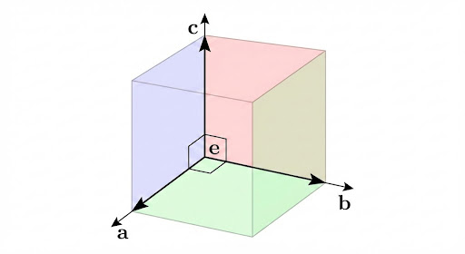

The current scaled Jacobian $\hat{J}^{(k)}$ is defined by the current location of $\mathbf{e}^{(k)}$, holding positions of $\mathbf{a}, \mathbf{b}$, $\mathbf{c}$ constant:

$$
\hat{J}^{(k)} := \frac{\left[ (\mathbf{a} - \mathbf{e}^{(k)}) \times (\mathbf{b} - \mathbf{e}^{(k)}) \right] \cdot (\mathbf{c} - \mathbf{e}^{(k)})}{\|\mathbf{a} - \mathbf{e}^{(k)}\| \; \|\mathbf{b} - \mathbf{e}^{(k)}\| \; \|\mathbf{c} - \mathbf{e}^{(k)}\|}
$$

From this definition, we define an **ideal** nodal position $\mathbf{e}^{*}$ that exactly produces a scaled Jacobian of one:

$$
\hat{J}^{*} := \frac{\left[ (\mathbf{a} - \mathbf{e}^{*}) \times (\mathbf{b} - \mathbf{e}^{*}) \right] \cdot (\mathbf{c} - \mathbf{e}^{*})}{\|\mathbf{a} - \mathbf{e}^{*}\| \; \|\mathbf{b} - \mathbf{e}^{*}\| \; \|\mathbf{c} - \mathbf{e}^{*}\|} \; \overset{\text{set}}{=} \; 1.0
$$

The ideal position $\mathbf{e}^{*}$ is a point such that the vectors $(\mathbf{a} - \mathbf{e}^{*})$, $(\mathbf{b} - \mathbf{e}^{*})$, and $(\mathbf{c} - \mathbf{e}^{*})$ are mutually orthogonal.  <!--Geometrically, if these vectors are orthogonal, then $\mathbf{e}^{*}$ must project directly onto the orthocenter $\mathbf{h}$ of the triangle $abc$.-->
How can we solve for $\mathbf{e}^{*}$ in terms of $\mathbf{a}$, $\mathbf{b}$, and $\mathbf{c}$?

We solve for $\mathbf{e}^{*}$ by assuring that the three right triangles formed by
$\mathbf{e}^{*}$ and combinations of $\mathbf{a}$, $\mathbf{b}$, and $\mathbf{c}$ satisfy
Pythagorean's theorem.  Let 

$$ u^* = \|\mathbf{u}^*\| = \|\mathbf{a} - \mathbf{e}^*\|$$
$$ v^* = \|\mathbf{v}^*\| = \|\mathbf{b} - \mathbf{e}^*\|$$
$$ w^* = \|\mathbf{w}^*\| = \|\mathbf{c} - \mathbf{e}^*\|$$

Then

$$(u^*)^2 + (v^*)^2 = (\mathbf{b} - \mathbf{a}) \cdot (\mathbf{b} - \mathbf{a})$$
$$(v^*)^2 + (w^*)^2 = (\mathbf{c} - \mathbf{b}) \cdot (\mathbf{c} - \mathbf{b})$$
$$(w^*)^2 + (u^*)^2 = (\mathbf{a} - \mathbf{c}) \cdot (\mathbf{a} - \mathbf{c})$$

This represents a system of three independent equations and three unknowns $u$, $v$, and $w$.

Solving,

$$2 (u^*)^2 = (\mathbf{b} - \mathbf{a}) \cdot (\mathbf{b} - \mathbf{a}) - (\mathbf{c} - \mathbf{b})\cdot (\mathbf{c} - \mathbf{b}) + (\mathbf{a} - \mathbf{c}) \cdot (\mathbf{a} - \mathbf{c})$$

Before proceeding, we can further simplify the expressions of these equations by defining
edge vectors that connect each of the points $\mathbf{a}$, $\mathbf{b}$, and $\mathbf{c}$.  Let

$$\mathbf{r} := \mathbf{b} - \mathbf{a} \quad \implies \quad r^2 = (\mathbf{b} - \mathbf{a}) \cdot (\mathbf{b} - \mathbf{a}) = \|\mathbf{r}\|^2$$
$$\mathbf{s} := \mathbf{c} - \mathbf{b} \quad \implies \quad s^2 = (\mathbf{c} - \mathbf{b}) \cdot (\mathbf{c} - \mathbf{b}) = \|\mathbf{s}\|^2$$
$$\mathbf{t} := \mathbf{a} - \mathbf{c} \quad \implies \quad t^2 = (\mathbf{a} - \mathbf{a}) \cdot (\mathbf{a} - \mathbf{c}) = \|\mathbf{t}\|^2$$

Note that the square values of each of the three hypotenuses is $r^2$, $s^2$, and $t^2$, respectively.  Then

$$(u^*)^2 + (v^*)^2 = r^2$$
$$(v^*)^2 + (w^*)^2 = s^2$$
$$(w^*)^2 + (u^*)^2 = t^2$$

Solving,

$$2 (u^*)^2 = r^2 - s^2 + t^2$$
$$2 (v^*)^2 = s^2 - t^2 + r^2$$
$$2 (w^*)^2 = t^2 - r^2 + s^2$$

The lengths $u^*$, $v^*$, and $w^*$ are now known.  It is also known that in the local
$x$, $y$, $z$ coordinate system spanned by the right-handed, orthonormal triad $\hat{\mathbf{u}}^*$, $\hat{\mathbf{v}}^*$, $\hat{\mathbf{w}}^*$ at point $\mathbf{e}^*$, the lengths $u^*$, $v^*$, $w^*$, with their corresponding components of $\mathbf{a}$, $\mathbf{b}$, $\mathbf{c}$ define the three components of $\mathbf{e}^*$, that is,

$$\mathbf{e}^* = 
\begin{Bmatrix}
e_x^* \\
e_y^* \\
e_z^*
\end{Bmatrix}
= 
\begin{Bmatrix}
a_x - u^* \\
b_y - v^* \\
c_z - w^*
\end{Bmatrix}
$$

#### Voting (aka Weighting)

Any scheme for weighting of the connected elements can be adopted.  Perhaps elements that lie on the surface should be given greater weighting than elements that lie on the interior.  The effect would be to create higher quality element near the surface, and relatively lower quality element would be pushed into the interior of the volume.
For a given element $\ell$ in the element valence of node $\mathbf{e}$, $\ell=0 \ldots n_{\text{ev}}-1$,

$$\mathbf{e}^* = \sum_{\ell=0}^{n_{\text{ev}}-1} w_{\ell} \mathbf{e}^*_{\ell} \bigg/ \sum_{\ell=0}^{n_{\text{ev}}-1} w_{\ell}$$

For now, however, let's just explore the equal weighting scheme:

$$\mathbf{e}^* = \sum_{\ell=0}^{n_{\text{ev}}-1} \mathbf{e}^*_{\ell} \bigg/ n_{\text{ev}}$$

#### Iteration

We define a gap vector $\Delta \mathbf{e}$ as originating at the current position $\mathbf{e}^{(k)}$ and terminating at the ideal nodal position $\mathbf{e}^{*}$:

$$
\Delta \mathbf{e}^{(k)} := \mathbf{e}^{*} - \mathbf{e}^{(k)}
$$

## Deprecated and likely deleted soon

#### Orthocenter

We introduce the concept of orthocenter first for a triangle, and then for a tetrahedron.

An altitude of a triangle is a line from a vertex perpendicular to the opposite edge.  A triangle has three vertices, three edges, and thus three altitude.

An altitude of a tetrahedron is a line from a vertex perpendicular to the opposite face. A tetrahedron has four vertices, four faces, and thus four altitudes. 

* For a **general tetrahedron**, the four altitude typically do **not** all meet at a single point.  In this case, there is no orthocenter.
* For an **orthocentric tetrahedron**, the four altitudes meet at a single, unique point called the orthocenter.   The orthocentric tetrahedron has one and only one orthocenter.

The orthocenter is typically denoted as point $H$ located by vector $h$.

"The **orthocenter** of a triangle $H$ is the point where the three (possibly extended) altitudes intersect.  The orthocenter lies inside the triangle if and only if the triangle is acute.  For a right triangle, the orthocenter coincides with the vertex at the right angle.  For an equilateral triangle, the orthocenter coincides with the centroid."

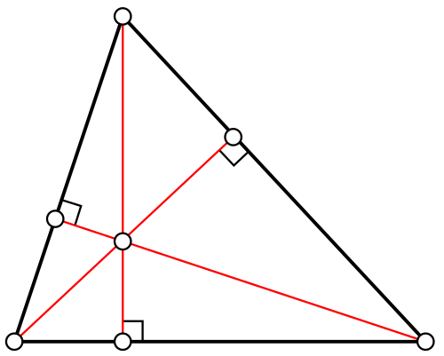

"An **orthocentric tetrahedron** is a tetrahedron where all pairs of opposite edges are perpendicular.  In an orthocentric tetrahedron the four altitudes are concurrent.  This common point is called the **tetrahedron orthocenter**."

The orthocenter of a tetrahedron is a point where all four altitudes meet.  

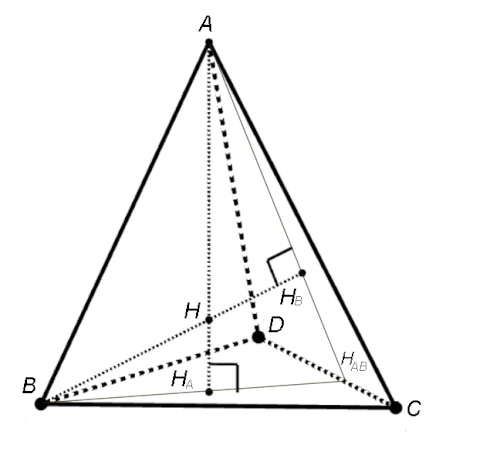

#### Notes

We define the **orthocenter** $\mathbf{h}$ as the point on the face of the triangle with vertices $\mathbf{a}$, $\mathbf{b}$, and $\mathbf{c}$ where the three altitudes meet.  An altitude is perpendicular to the opposite side.  So the altitude from vertex $\mathbf{a}$ is perpendicular to the opposite side $\mathbf{b} \mathbf{c}$,

$$(\mathbf{h} - \mathbf{a}) \cdot (\mathbf{c} - \mathbf{b}) = 0$$

Similarly, the altitude from vertex $\mathbf{b}$ is perpendicular to the opposite side $\mathbf{c} \mathbf{a}$,

$$(\mathbf{h} - \mathbf{b}) \cdot (\mathbf{a} - \mathbf{c}) = 0$$

Finally, the altitude from vertex $\mathbf{c}$ is perpendicular to the opposite side $\mathbf{a} \mathbf{b}$,

$$(\mathbf{h} - \mathbf{c}) \cdot (\mathbf{b} - \mathbf{a}) = 0$$

For the three foregoing equations, only two are linearly independent (the third follows from the other two).  So, to solve for $\mathbf{h}$ in terms of $\mathbf{a}$, $\mathbf{b}$, and $\mathbf{c}$, we typically parameterize the position of $\mathbf{h}$ as

$$\mathbf{h} = \mathbf{a} + s (\mathbf{b} - \mathbf{a}) + t (\mathbf{c} - \mathbf{a})$$

To find the orthocenter $\mathbf{h}$ and the ideal node position $\mathbf{e}$, we treat the triangle formed by a, b, and c as the base of a tetrahedron where e is the apex.

1. Solving for the Orthocenter parameters $s$ and $t$

We use the parametrization $h=a+s(b−a)+t(c−a)$ and substitute it into the orthogonality conditions. Let $u=b−a$ and $v=c−a$.

The conditions given are:

$$(h−b)⋅(a−c)=0$$

$$(h−c)⋅(b−a)=0$$

By substituting the parametrization into these equations, we get a system of two linear equations:

$$[su+(t−1)v]⋅u=0⟹s(u⋅u)+t(u⋅v)=u⋅v$$

$$[(s−1)u+tv]⋅v=0⟹s(u⋅v)+t(v⋅v)=u⋅v$$

Solving this system for $s$ and $t$:

$$s= 
(u⋅u)(v⋅v)−(u⋅v) 
2
 
(v⋅v−u⋅v)(u⋅v)$$
​	
 
$$t= 
(u⋅u)(v⋅v)−(u⋅v) 
2
 
(u⋅u−u⋅v)(u⋅v)
​$$
 
2. Finding $e$ from $h$

The ideal node $e$ is the point such that the vectors $(a−e)$, $(b−e)$, and $(c−e)$ are mutually orthogonal. Geometrically, if these three vectors are orthogonal, then $e$ must project directly onto the orthocenter $h$ of the opposite face △$abc$.

The vector $(e ∗ −h)$ is perpendicular to the plane $abc$. Therefore:

Direction: $e$ lies on a line passing through $h$ with a direction vector $n=(b−a)×(c−a)$.

Distance: The distance $L$ from $h$ to e ∗ is determined by the requirement that the interior angles at $e$ are $90^{\circ}$.

Using the Pythagorean theorem and the properties of orthogonal coordinates, the distance $L$ from $h$ to $e$ g ∗ is found by:

$$ L= −(h−a)⋅(h−b)$$
 
(Note: This dot product is negative because the vectors point away from the orthocenter toward the vertices in an acute triangle.)

Finally, the ideal position is:

$$e =h±L ∥n∥$$
 
(We choose the sign that places e on the correct side of the element face to maintain a positive Jacobian).

## References

[^Knupp_2006]: Knupp PM, Ernst CD, Thompson DC, Stimpson CJ, Pebay PP. The verdict geometric quality library. SAND2007-1751. Sandia National Laboratories (SNL), Albuquerque, NM, and Livermore, CA (United States); 2006 Mar 1. [link](https://www.osti.gov/servlets/purl/901967)

[^Hovey_2023]: Hovey CB. Naval Force Health Protection Program Review 2023 Presentation Slides. SAND2023-05198PE. Sandia National Lab.(SNL-NM), Albuquerque, NM (United States); 2023 Jun 26.  [link](https://1drv.ms/p/s!ApVSeeLlvsE8g9UPEHLqBCVxT2jfCQ?e=iEAcgr)

[^Livesu_2021]: Livesu M, Pitzalis L, Cherchi G. Optimal dual schemes for adaptive grid based hexmeshing. ACM Transactions on Graphics (TOG). 2021 Dec 6;41(2):1-4. [link](https://dl.acm.org/doi/pdf/10.1145/3494456)

[^Hexalab_2023]: Bracci M, Tarini M, Pietroni N, Livesu M, Cignoni P. HexaLab.net: An online viewer for hexahedral meshes. Computer-Aided Design. 2019 May 1;110:24-36. [link](https://doi.org/10.1016/j.cad.2018.12.003)
