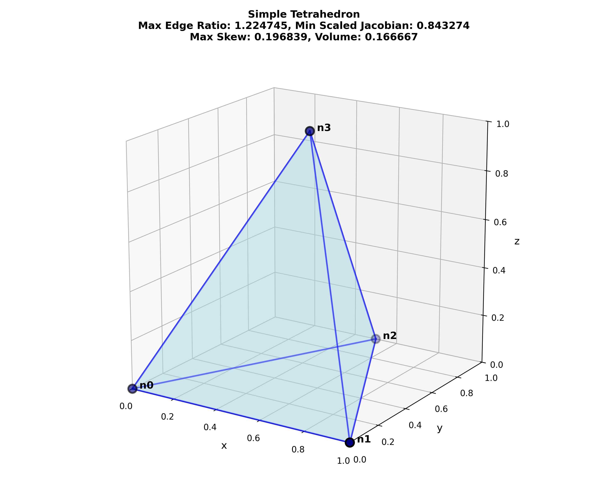
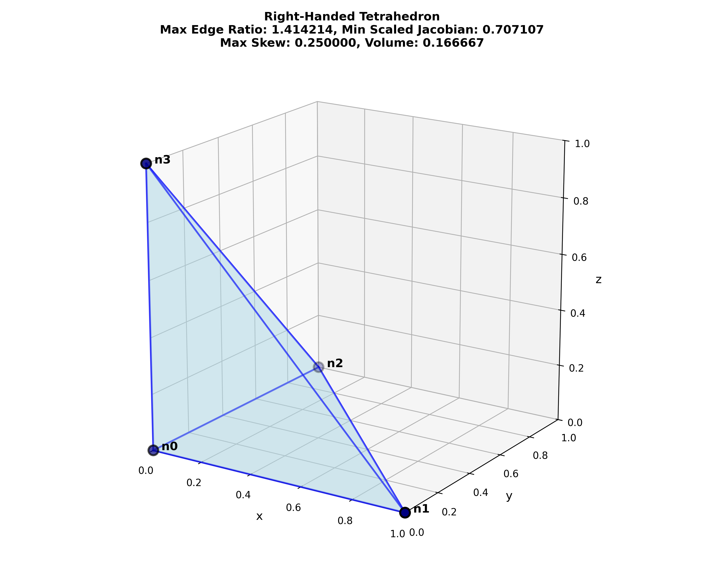
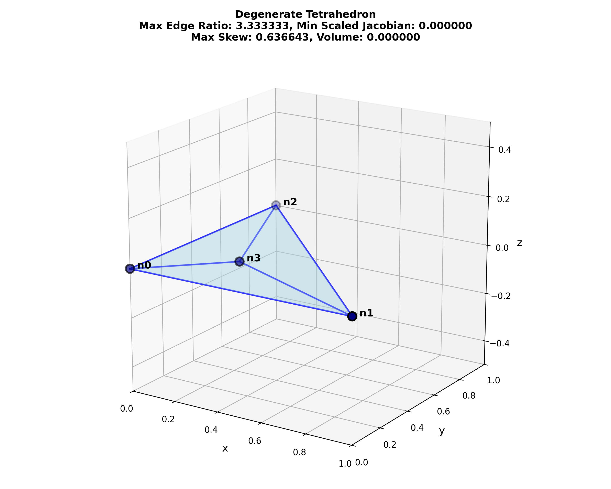
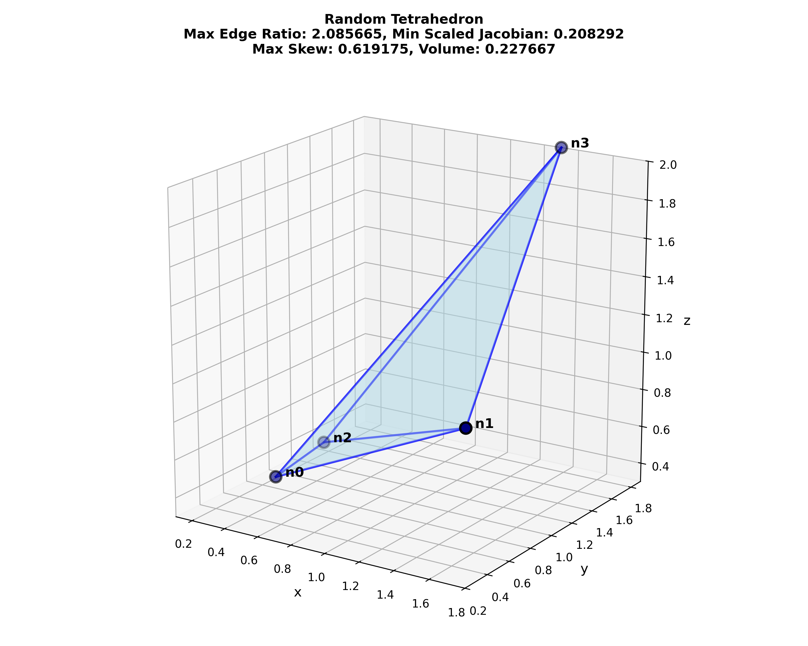
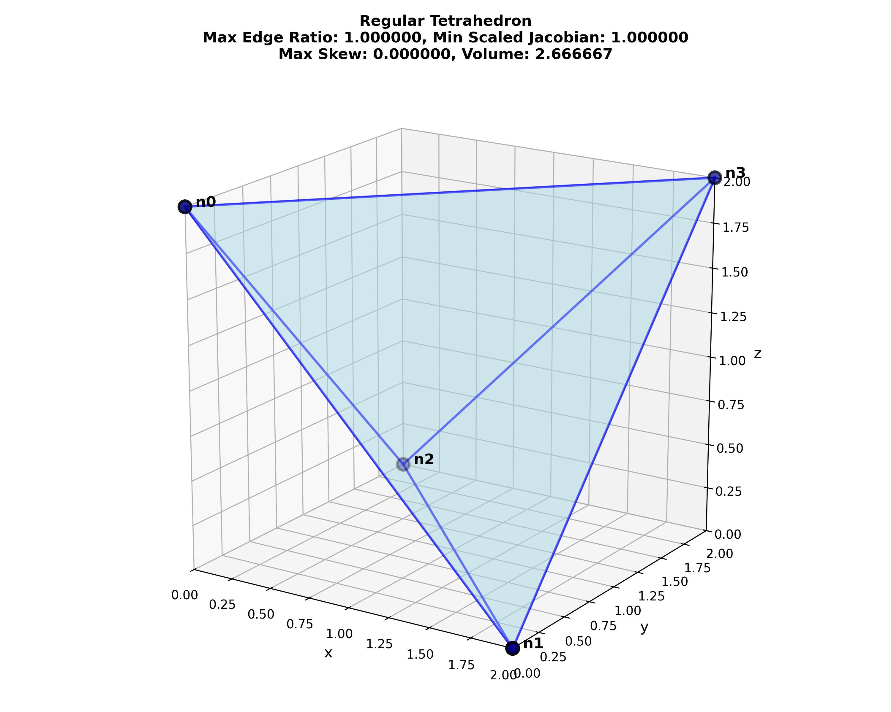

# Tetrahedral Metrics

```sh
automesh metrics tet --help
<!-- cmdrun automesh metrics tet --help -->
```

`automesh` implements the following **tetrahedral** element quality metrics[^Knupp_2006]:

* Maximum edge ratio ${\rm ER}_{\max}$
* Minimum scaled Jacobian ${\rm SJ}_{\min}$
* Maximum skew
* Element volume

A brief description of each metric follows.

## Maximum Edge Ratio

* ${\rm ER}_{\max}$ measures the ratio of the longest edge to the shortest edge in a mesh element.
* A ratio of 1.0 indicates perfect element quality, whereas a very large ratio indicates bad element quality.
* Knupp *et al.*[^Knupp_2006] (page 63) indicate an acceptable range of `[1.0, 3.0]`.

## Minimum Scaled Jacobian

* ${\rm SJ}_{\min}$ evaluates the determinant of the Jacobian matrix at each of the corners nodes (and the Jacobian itself[^Knupp_2006] page 71), normalized by the corresponding edge lengths, and returns the minimum value of those evaluations.
* Knupp *et al.*[^Knupp_2006] (page 75) indicate an acceptable range of `[0.5, sqrt(2)/2]` $\approx$ `[0.5, 0.707]`.
* A scaled Jacobian close to `0` indicates that the tetrahedra is poorly shaped (e.g., very thin or degenerate), which can lead to numerical instability.
* A scaled Jacobian of `1` indicates that the tetrahedra is equilateral, which is the ideal shape for numerical methods.

## Maximum Skew

* Skew measures how much an element deviates from being a regular shape (e.g., in 3D a cube or a regular tetrahedron; in 2D a square or equilateral triangle). A skew value of 0 indicates a perfectly regular shape, while higher values indicate increasing levels of distortion.
* Knupp *et al.*[^Knupp_2006] does not give a definition of skew for tetrahedra, so we provide our definition below.
For any triangle composing the four faces of a tetrahedron, where $\theta_{\min}$ is the smallest angle of the triangle,

$$
{\rm skew_{\max}} = \frac{60^{\circ} - \theta_{\min}}{60^{\circ}}
$$

* The maximum skew of a tetrahedron is the maximum skew of all of the four triangular faces (see [Triangular Metrics, Maximum Skew](./metrics_triangular.md#maximum-skew)).
* For an equilateral (regular) tetrahedron, $\theta_{\min} = 60^{\circ}$ and ${\rm skew_{\max}} = 0$.
* In the limit as $\theta_{\min} \rightarrow 0^{\circ}$ ${\rm skew_{\max}} \rightarrow 1$.

## Element Volume

* Measures the volume of the element (see Knupp *et al.*[^Knupp_2006], page 61).

## Unit Tests

We verify the following element qualities:

tetrahedron | ${\rm ER}_{\max}$ | ${\rm SJ}_{\min}$ | ${\rm skew_{\max}}$  | volume
:---: | :---: | :---: | :---: | :---:
simple   | 1.225 | 0.843 [0.843] | 0.197 | 0.167 [0.167]

right-handed   | 1.414 [] | 0.707 [] | 0.250 [] | 0.167 []

left-handed   | 1.414 [] | -0.707 [] | 0.250 [] | -0.167 []

degenerate | 3.33 [] | 0.000 [] | 0.637 [] | 0.000 []

random | 2.086 [] | 0.208292 [] | 0.619 [] | 0.228 []

regular | 1.000 [] | 1.000 [] | 0.000 [] | 2.667 []

Figure: Tetrahedral metrics.  Leading values are from `automesh`.  All values agree with an independent Python calculation, (see [`metrics_tetrahedral.py`](#metrics_tetrahedralpy)) in double precision with a tolerance of less than `1.00e-14`.  Values in [brackets], minimum scaled Jacobian and volume, also agree with Cubit.  Cubit does not compute edge ratio and skew for tetrahedral elements.  Cubit uses the term *Aspect Ratio*; it is **not the same** as Edge Ratio.

[simple_tetrahedron](./simple_tetrahedron.png) | [right-handed_tetrahedron](./right-handed_tetrahedron.png) | [left-handed_tetrahedron](./left-handed_tetrahedron.png)
:---: | :---: | :---:
[](./simple_tetrahedron.png) | [](./right-handed_tetrahedron.png) | [](./left-handed_tetrahedron.png)

[degenerate_tetrahedron](./degenerate_tetrahedron.png) | [random_tetrahedron](./random_tetrahedron.png) | [regular_tetrahedron](./regular_tetrahedron.png)
:---: | :---: | :---:
[](./degenerate_tetrahedron.png) | [](./random_tetrahedron.png) | [](./regular_tetrahedron.png)

Figure: Python visualization of the tetrahedron test cases, created with [`metrics_tetrahedral.py`](./metrics_tetrahedral.py).

## Local Numbering Scheme

### Nodes

The local numbering scheme for nodes of a tetrahedral element:

```sh
        3
       /|\
 L3   / | \  L5
     /  |  \
    0---|---2  (horizontal line is L2)
     \  |  /
  L0  \ | / L1
       \|/
        1 

        (vertical line is L4)

where

    L0 = p1 - p0        L3 = p3 - p0
    L1 = p2 - p1        L4 = p3 - p1
    L3 = p0 - p2        L5 = p3 - p2
```

node | connected nodes
:---: | :---:
0 | 1, 2, 3
1 | 0, 2, 3
2 | 0, 1, 3
3 | 0, 1, 2

### Faces

A tetrahedron has four triangular faces.  The faces are typically numbered opposite
to the node they do not contain (e.g., face 0 is opposite to node 0).

From the exterior of the element, view the (0, 1, 3) face and upwarp the remaining faces; the four face normals now point out out of the page.  The local numbering scheme for faces of a tetrahedral element:

```sh
    2-------3-------2
     \  1  / \  0  /
      \   /   \   /
       \ /  2  \ /
        0-------1
         \  3  /
          \   /
           \ /
            2
```

face | nodes
:---: | :---:
0 | 1, 2, 3
1 | 0, 2, 3
2 | 0, 1, 3
3 | 0, 1, 2

## Source

### `metrics_tetrahedral.py`

```python
<!-- cmdrun cat metrics_tetrahedral.py -->
```

## References

[^Knupp_2006]: Knupp PM, Ernst CD, Thompson DC, Stimpson CJ, Pebay PP. The verdict geometric quality library. SAND2007-1751. Sandia National Laboratories (SNL), Albuquerque, NM, and Livermore, CA (United States); 2006 Mar 1. [link](https://www.osti.gov/servlets/purl/901967)
