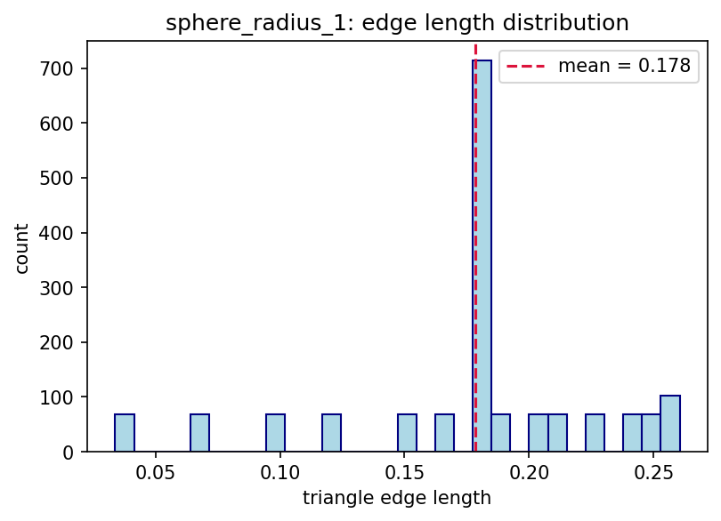
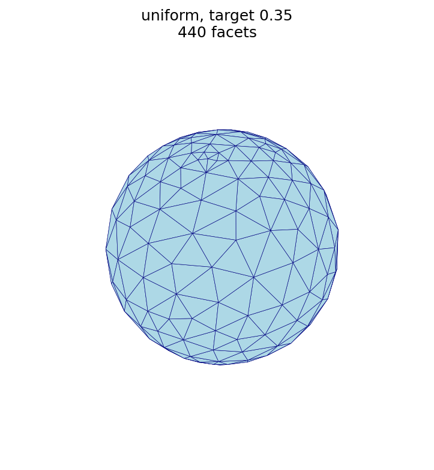
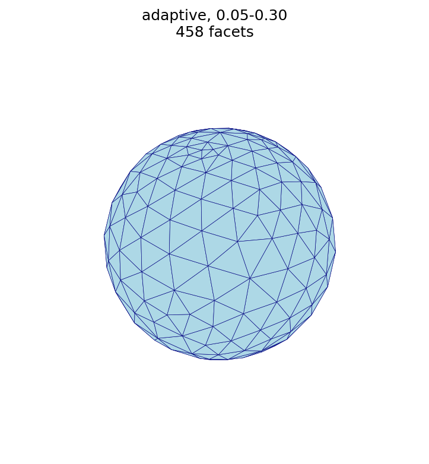

# Remesh

The `remesh` command applies *isotropic surface remeshing* to an existing
triangular surface mesh.  Starting from the input triangulation, `automesh`
iteratively splits, collapses, flips, and smooths edges to drive every edge
toward a target edge length.  The result is a surface mesh with more uniform,
better-quality triangles, either coarsened or refined relative to the input.

```sh
automesh remesh --help
<!-- cmdrun automesh remesh --help -->
```

Remeshing reads and writes surface (triangular) mesh formats; see the `--input`
and `--output` formats listed in the help above.  STL files **must be binary
STL** for both input and output — ASCII STL is not accepted.  If you have an
ASCII STL, convert it to binary first; see
[Converting ASCII STL to binary STL](#converting-ascii-stl-to-binary-stl) at the
end of this page for a short script.

## Example model

The examples below use a unit sphere (radius ≈ 1).

[⬇ Download the example mesh: `sphere_radius_1.stl`](sphere_radius_1.stl)


### Statistics

| quantity | symbol | value |
| :--- | :---: | ---: |
| facets (triangles) | $f$ | 1,088 |
| points (vertices) | $v$ | 546 |
| edges | $e$ | 1,632 |
| mean triangle edge length | | 0.178 |

Most edges cluster tightly around the mean, as the edge-length histogram shows:



### Relationship to triangular subdivision

The [Subdivision](../isosurface/subdivision.md) section gives the recursive
relationships for one $1\!\to\!4$ refinement of a closed triangular mesh:

$$ f_{i+1} = 4 f_i, \qquad e_{i+1} = 2 e_i + 3 f_i, \qquad v_{i+1} = v_i + e_i . $$

These relationships preserve two invariants of any *closed* triangular surface,
both of which the example sphere satisfies:

- **Edge–face relationship**, $e = \tfrac{3}{2} f$: every triangle has three
  edges and every edge is shared by two triangles, so
  $\tfrac{3}{2} \times 1{,}088 = 1{,}632 = e$. ✓
- **Euler characteristic**, $v - e + f = 2$ for a genus-0 (sphere-like)
  surface: $546 - 1{,}632 + 1{,}088 = 2$. ✓

Applying one subdivision step to the example sphere's counts confirms the
invariants carry forward:

$$ f_{i+1} = 4(1088) = 4352, \qquad e_{i+1} = 2(1632) + 3(1088) = 6528, \qquad v_{i+1} = 546 + 1632 = 2178, $$

for which $e = \tfrac{3}{2} f$ still holds ($\tfrac{3}{2} \times 4352 = 6528$)
and $v - e + f = 2178 - 6528 + 4352 = 2$.

The statistics and histogram above are produced by the
[figure script](#figure-script) at the end of this page.

## Choosing a mode

- **`uniform`** — a single target edge length is applied over the whole mesh.
  Use this to coarsen or refine a surface to a chosen resolution.
- **`adaptive`** — the target edge length varies with local surface curvature,
  between a `--minimum` and `--maximum`, so curved regions are refined and flat
  regions are coarsened.

If no mode is given, `uniform` is used with the mean edge length of the input
mesh as the target.

## Remesh Uniform

```sh
automesh remesh uniform --help
<!-- cmdrun automesh remesh uniform --help -->
```

- `--iterations <NUM>` — number of remeshing passes (default: 5).  More passes
  bring the mesh closer to the target edge length.
- `--size <SIZE>` — the target edge length.  When omitted, the mean edge length
  of the input mesh is used, which regularizes the mesh without significantly
  changing its resolution.

### Uniform example: coarse vs. fine

```sh
automesh remesh -i sphere_radius_1.stl -o sphere_uniform_coarse.stl uniform -s 0.35
automesh remesh -i sphere_radius_1.stl -o sphere_uniform_fine.stl   uniform -s 0.08
```

A larger target edge length produces fewer, larger triangles; a smaller target
edge length produces many more, smaller triangles.

| base (1,088 facets) | coarse, `-s 0.35` (440 facets) | fine, `-s 0.08` (4,744 facets) |
| :---: | :---: | :---: |
|  |  |  |

## Remesh Adaptive

```sh
automesh remesh adaptive --help
<!-- cmdrun automesh remesh adaptive --help -->
```

- `--iterations <NUM>` — number of remeshing passes (default: 5).
- `--minimum <MIN>` — minimum edge length, used in high-curvature regions
  (required).
- `--maximum <MAX>` — maximum edge length, used in flat regions (required).
- `--tolerance <TOL>` — curvature tolerance controlling how strongly curvature
  drives the local edge length (default: 0.1).
- `--gradation <GRAD>` — size gradation factor controlling how smoothly the edge
  length transitions between the minimum and maximum (default: 0.5).

### Adaptive example: uniform vs. adaptive

```sh
automesh remesh -i sphere_radius_1.stl -o sphere_uniform.stl  uniform  -s 0.18
automesh remesh -i sphere_radius_1.stl -o sphere_adaptive.stl adaptive --minimum 0.05 --maximum 0.30
```

| uniform, `-s 0.18` (910 facets) | adaptive, `0.05–0.30` (458 facets) |
| :---: | :---: |
|  |  |

> **Note.** A sphere has (nearly) constant curvature, so curvature-adaptive
> sizing produces an almost uniform result here — the two meshes above look
> similar.  On a model with varying curvature (sharp features together with flat
> regions), adaptive sizing refines the high-curvature regions and coarsens the
> flat ones, which uniform sizing cannot do.

## Figure script

The figures on this page are produced by the following script, which reads each
STL surface and renders it with a matched camera.

```python
<!-- cmdrun cat remesh_figures.py -->
```

## Converting ASCII STL to binary STL

`remesh` requires binary STL for both input and output.  If your surface is an
ASCII STL, the following script converts it to binary STL:

```python
<!-- cmdrun cat ascii_to_binary_stl.py -->
```

Run it as:

```sh
python ascii_to_binary_stl.py input_ascii.stl output_binary.stl
```
