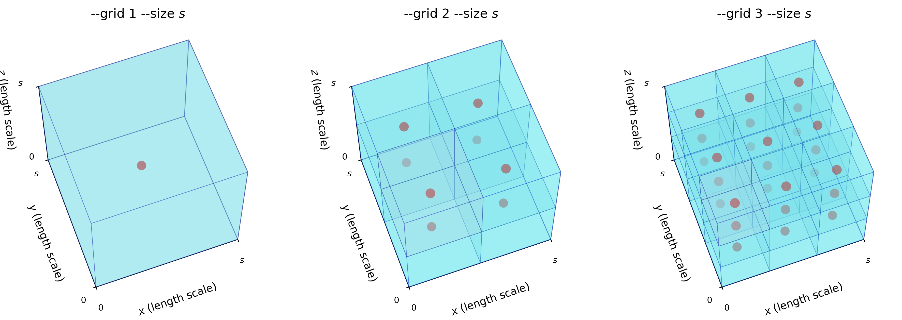

# Segment

```sh
automesh segment --help
<!-- cmdrun automesh segment --help -->
```

## Segment Hex

```sh
automesh segment hex --help
<!-- cmdrun automesh segment hex --help -->
```

## Segment Tet

```sh
automesh segment tet --help
<!-- cmdrun automesh segment tet --help -->
```

## Segment Tri

```sh
automesh segment tri --help
<!-- cmdrun automesh segment tri --help -->
```

## Sample Points

The input mesh is queried for its material composition for

* `--grid 1`: at a single discrete sample point located at the center of a voxel,
* `--grid 2`: at eight discrete sample points located in a `2x2x2` arrangement within subdivided cells of the voxel,
* `--grid 3`: at 27 discrete sample points located within a `3x3x3` arrangement within subdivided cells of the voxel, 
* and so on.

The `--grid` and `--size` options are illustrated below for three successive `grid` sizes:


