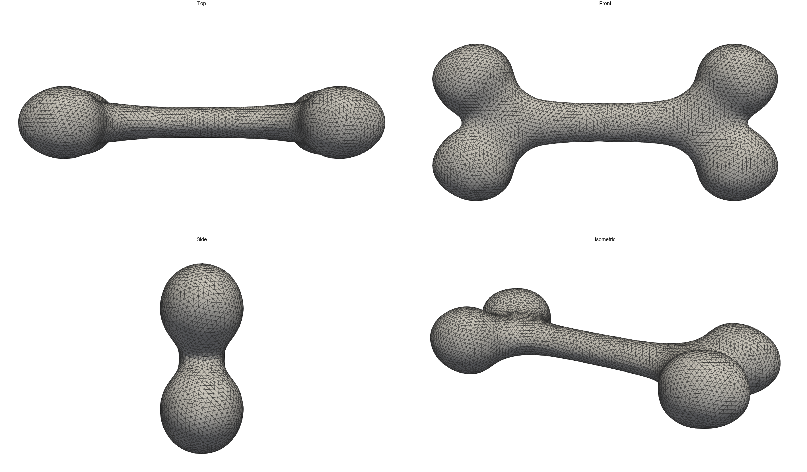
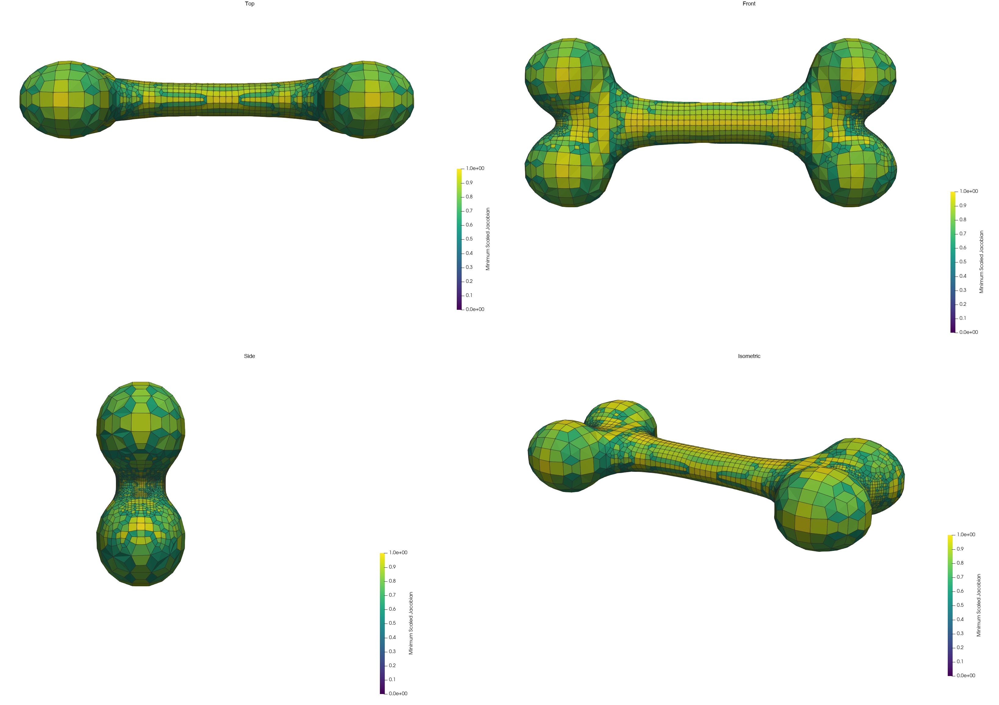
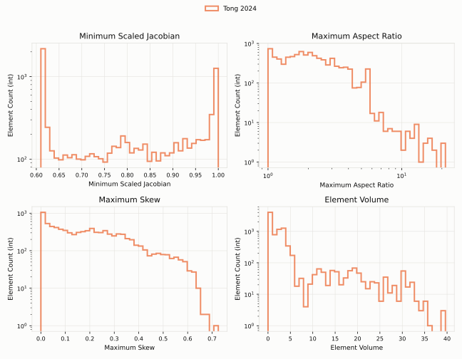
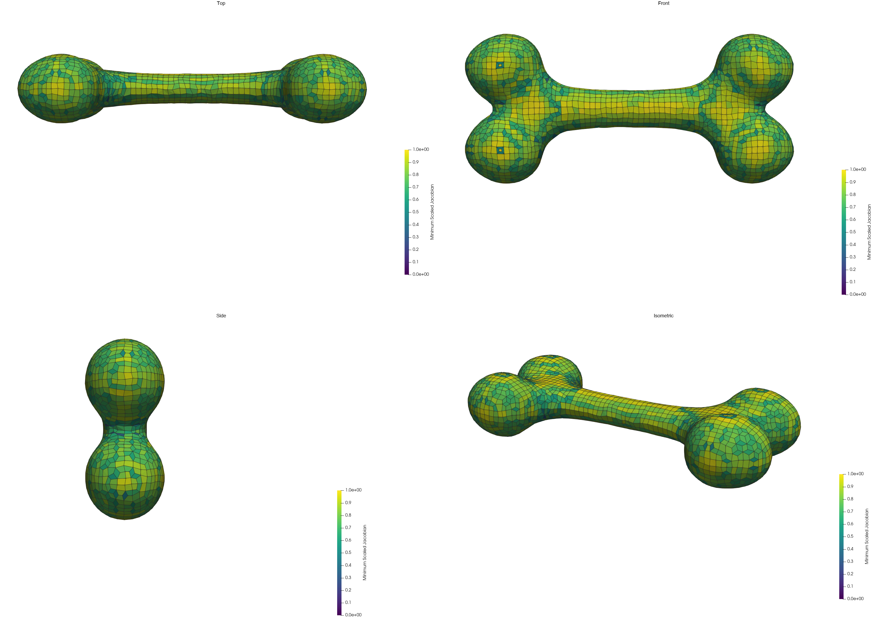
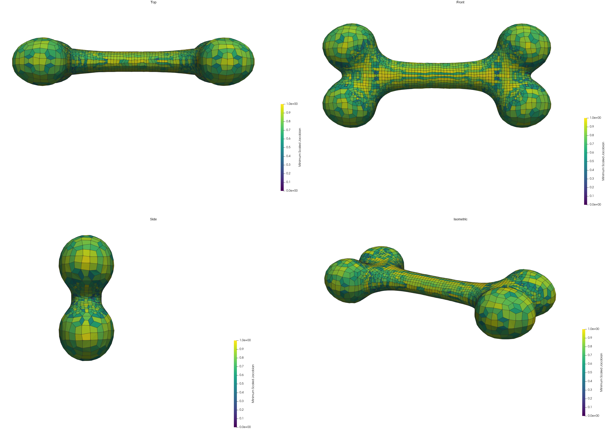
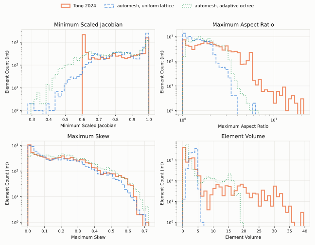
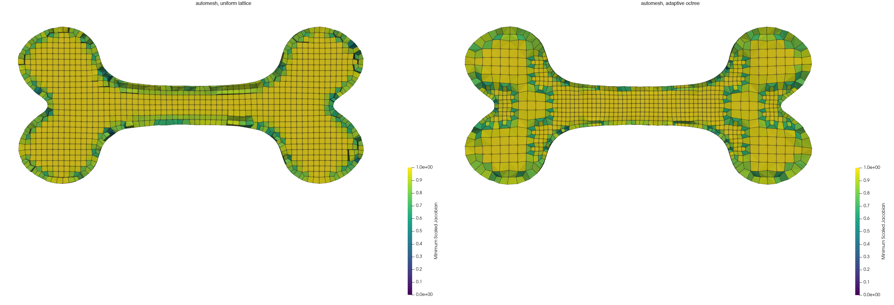

# Bone

The bone is a closed surface of 12,088 triangles.  A long, slender shaft
joins a pair of rounded lobes at each end.  The model comes from the
hybrid-octree meshing work of Tong, Halilaj, and Zhang
[[1]](#reference), which meshes it with all-hexahedral elements.



Figure: The bone surface, 12,088 triangles, in the top, front, side, and
isometric views.  The triangles are close to uniform.  The longest edge is
about twice the shortest.  ParaView 5.10.1 makes the renders from
`bone_tri_cleaned.stl` (see [Downloads](#downloads)).  They come from
[`bone_render.py`](bone_render.py), and
[`bone_render_quad.py`](bone_render_quad.py) composes them.

The Tong 2024 is the baseline in this book.  This page records the baseline: the settings that
produced it, its size, and its element quality.  Then it meshes the same
surface with `automesh` and compares the two.  The
[Tong 2024 review](../../../reviews/tong_2024.md) describes the method.

The method refines an octree by surface curvature and by wall thickness.  It
turns the octree into hexahedra, then projects the boundary onto the surface.
The code rescales each model so that its longest side spans 100 units.  All
lengths and volumes below use that scale.

## The Baseline Settings

The code, `HybridOctree_Hex` v1.0 [[1]](#reference), ships with the settings
below.  Four are constants in `Initialization.h`: `C_THRES`, `H_THRES`,
`CELL_DETECT`, and `VOXEL_SIZE`.  The curvature formula and the level of the
deepest rung are fixed inside `HexGen.cpp`.  The published mesh comes from these
settings, as
[Reproducing the Baseline](#reproducing-the-baseline) shows.

| setting | value | what it sets |
| --- | --- | --- |
| curvature formula | $(\theta - \pi)^2$, summed over the edges at a vertex; fixed in the code | how sharply the surface bends at a vertex |
| `C_THRES` | {0.15, 0.3, 0.6, 1.2, 2.4} | the curvature ladder |
| `H_THRES` | {16, 8, 4, 2, 1} | the thickness ladder |
| `CELL_DETECT` | 1 | which cells a vertex or triangle can split |
| `VOXEL_SIZE` | 9 | the depth budget of the octree |
| `LADDER_TOP` | 8 | the octree level of the deepest rung; fixed in the code |

**Curvature.**  At each surface vertex, the code looks at every edge that
meets the vertex.  Two triangles share each edge.  The angle $\theta$ between
them equals $\pi$ on a flat surface.  The code squares the deviation
$(\theta - \pi)$ and sums it over the edges.  The sum has units of radians
squared, and nothing normalizes it.  A vertex with many small triangles
around it therefore gathers more terms than one with a few large triangles.

**`C_THRES`.**  This is the curvature ladder.  It has five rungs in ascending
order.  Each rung guards one octree level.  A cell at that level splits when a
vertex inside it carries a curvature above the rung.

**`H_THRES`.**  This is the thickness ladder, over the same five levels.  Its
rungs descend.  The code measures the thickness at each triangle.  It casts a
ray from the triangle's centroid along its normal, and takes the distance to
the opposite surface.  A cell splits when a triangle inside it is thinner than
the rung.  A cell splits when either ladder says so.

**`CELL_DETECT`.**  This is a search half-width, measured in cell widths from
each cell's center.  The value 1 tests a box twice the linear extent of the
cell.  A vertex or triangle up to half a cell outside the cell still splits
it.  A larger value refines more.

**`VOXEL_SIZE` and `LADDER_TOP`.**  `VOXEL_SIZE` is the base-2 logarithm of the
octree's depth budget.  The value 9 allows a $512^3$ grid, whose finest cells
are $100 / 512 \approx 0.195$ wide.  `LADDER_TOP` is our name for the level of the
deepest rung.  The code does not name it.  It fixes the value in a test,
`level == 8`, inside `ComputeCellValue`.  The value 8 puts the five rungs on
levels 4 through 8.  The deepest rung
guards the step from level 8 to level 9, which is the last the budget allows.
Every level-3 cell that meets the surface splits, with no rung at all.

## The Reference Mesh

| quantity | value |
| --- | ---: |
| nodes | 10,356 |
| elements (all hexahedra) | 8,619 |
| minimum scaled Jacobian | 0.6100001 |
| total volume | 28,395.1 |

The paper publishes the mesh as `bone.vtk`.  The file `bone.inp` holds the same
mesh in Abaqus format, as `C3D8` elements.  The nodes and elements have the
same coordinates, connectivity, and order in both files.  `automesh` reads the
`.inp` file, so it computes the metrics from that one.  See
[Downloads](#downloads) for both files.

## Reproducing the Baseline

We ran the code ourselves, and did not rely on the published mesh alone.  The
run used `HybridOctree_Hex` v1.0.  In the repository, that is commit `00e0e82`
of 2024-01-16.  The commit renames the folder `HybridOctree_Hex_v1.0` to
`HybridOctree_Hex`, and its settings match the table above.  Later commits
change them.  The current `main` is a later version, with a `VOXEL_SIZE` of 10
and a different `C_THRES`.

```sh
git clone https://github.com/CMU-CBML/HybridOctree_Hex.git
cd HybridOctree_Hex
git checkout 00e0e82
cd HybridOctree_Hex
c++ -std=c++17 -O2 -o HexGen Main.cpp HexGen.cpp Mesh.cpp
mkdir bone
cp "../input boundaries/bone_tri.raw" bone/model.raw
cd bone
../HexGen
```

The program reads `model.raw` from the current directory.  The build prints
warnings and no errors.  We ran it on macOS, on an Apple M1 Pro, with Apple
clang 21.0.0.

The first stages took about 52 seconds: 35 seconds for the octree, 5 for the
dual mesh, and 12 for the interior mesh.  Then the projection step began.  It
moves the boundary nodes onto the surface, and it guards the quality of the
elements as it goes.  It starts with a quality bar of 0.53.  Each time the mesh
meets the bar, it writes `finalMesh.vtk` and raises the bar by 0.01.  In our
run the bar rose ten times.  The mesh written at the tenth step, after 293
iterations and about three minutes, met the bar of 0.61.  The program then
searched for a mesh that meets 0.62, and did not find one.  It does not stop on
its own here.  We stopped it after nine minutes, and `finalMesh.vtk` had not
changed for the last six.

The script [`bone_baseline_compare.py`](bone_baseline_compare.py) compares that
file with the published mesh.

| | reproduced | published |
| --- | ---: | ---: |
| nodes | 10,356 | 10,356 |
| elements | 8,619 | 8,619 |
| same elements, in the same order | yes | |
| minimum scaled Jacobian | 0.610002 | 0.6100001 |
| 5th percentile | 0.6102 | 0.6103 |
| median | 0.7909 | 0.7910 |
| maximum aspect ratio | 23.04 | 21.25 |
| elements above ratio 10 | 40 | 34 |
| maximum skew | 0.7211 | 0.7252 |
| maximum element volume | 39.65 | 39.64 |

The two meshes have the same nodes and the same elements, with the same
connectivity, in the same order.  The octree and the dual mesh reproduce
exactly.  Other settings would give a different octree, and so different
connectivity.  The floor of 0.61 reproduces, and the median and the 5th
percentile agree to three digits.

The node positions do not match exactly.  None of the 3,202 boundary nodes
matches to six digits.  They differ by 0.031 on average, and by 0.92 at most,
in the units of the 100-unit cube.  Of the 7,154 interior nodes, 1,563 match to
six digits, and the largest difference is 1.21.  The aspect ratio has a few
more outliers than the published mesh.

We think the reason is the random step in the projection.  The code calls
`rand()` and never seeds it.  The generator differs between platforms.  For
example, `RAND_MAX` is 2,147,483,647 on macOS, and the compiler warns about it.
We did not test this.  We reproduced the octree, the connectivity, the quality
floor, and the shape of the quality distribution.  We did not reproduce the
exact position of every node.

## Minimum Scaled Jacobian

`automesh` computes the quality of every element:

```sh
automesh metrics -i bone.inp -o bone_reference_metrics.csv
```

The CSV has one row per element, in the order of the mesh.  ParaView paints the
elements by the Minimum Scaled Jacobian column.



Figure: The reference bone mesh from the Tong 2024 baseline, painted by Minimum
Scaled Jacobian on a fixed 0 to 1 scale.  The four panels show the top, front,
side, and isometric views.  The mesh's own values run from 0.61 to 1.0, so no
element reaches the dark end of the scale.  The elements are smallest on the
shaft and at the necks where the shaft meets each lobe.  The lobes stay coarse.
ParaView 5.10.1 makes the renders.  They come from
[`bone_render.py`](bone_render.py), and
[`bone_render_quad.py`](bone_render_quad.py) composes them.

## Quality Metrics

`automesh` computes four measures for each element: Minimum Scaled Jacobian,
Maximum Aspect Ratio, Maximum Skew, and Element Volume [[3]](#reference).



Figure: Element quality for the reference bone mesh, all 8,619 elements.
Minimum Scaled Jacobian is at top left, Maximum Aspect Ratio at top right,
Maximum Skew at bottom left, and Element Volume at bottom right.  Counts use a
log scale, and the aspect ratio uses a log axis as well.  The figure comes from
[`bone_quality_histograms.py`](bone_quality_histograms.py), which follows the
style of the [RVE](rve.md) histograms.

| measure | extreme | value |
| --- | --- | ---: |
| Minimum Scaled Jacobian | minimum | 0.6100001 |
| Maximum Aspect Ratio | maximum | 21.25 |
| Maximum Aspect Ratio | elements above 10 | 34 |
| Maximum Skew | maximum | 0.7252 |
| Element Volume | maximum | 39.64 |

The paper's title promises Jacobian control, and the mesh shows it.  No
element falls below a scaled Jacobian of 0.61.  The values pile up at that
floor, where 2,196 elements (about a quarter) sit at or below 0.62.  They pile
up again at 1.0, where 1,277 elements sit at or above 0.99.  The median is
0.791.

The aspect ratio has a long tail.  The median is 1.95, and 431 elements exceed
5.  Only 34 exceed 10, and the worst reaches 21.25.  The skew has a median of
0.178, and its 95th percentile is 0.497.

The element volumes span more than three orders of magnitude, from 0.0070 to
39.64, with a median of 1.48.  The octree refines toward the shaft and the
necks.

## Meshing with `automesh`

`automesh` meshes the same surface, `bone_tri_cleaned.stl`, with two commands.
The first builds a uniform lattice.  The second builds an adaptive octree.
Both put the mesh in the frame of the reference, so that lengths and volumes
compare directly.  The scale and translate options do this.  The scale is
$100 / 0.947288 = 105.5645168$, where 0.947288 is the longest side of the
bone in the units of the STL.  The translation centers the bone in the
100-unit cube.  The uniform spacing is in the units of the STL, and
$0.01563025 \times 105.5645168 = 1.65$.

```sh
automesh mesh hex -i bone_tri_cleaned.stl -o bone_uniform.vtu \
    --uniform 0.01563025 \
    --xscale 105.5645168 --yscale 105.5645168 --zscale 105.5645168 \
    --xtranslate -3.0485977 --ytranslate -2.8101274 --ztranslate -2.7887506 \
    --metrics bone_uniform_metrics.csv

automesh mesh hex -i bone_tri_cleaned.stl -o bone_octree.vtu --scale 7 \
    --xscale 105.5645168 --yscale 105.5645168 --zscale 105.5645168 \
    --xtranslate -3.0485977 --ytranslate -2.8101274 --ztranslate -2.7887506 \
    --metrics bone_octree_metrics.csv
```

The lattice gives 8,379 elements and 10,271 nodes in about 2 seconds.  The
octree gives 9,267 elements and 11,381 nodes in about 1.5 seconds.  Both are
close to the size of the reference.  The `--metrics` option writes the
quality of every element, in the same four measures as before.  These
numbers come from `automesh` 0.4.7.

### Comparison

| | Tong 2024 | `automesh` uniform lattice | `automesh` adaptive octree |
| --- | ---: | ---: | ---: |
| nodes | 10,356 | 10,271 | 11,381 |
| elements | 8,619 | 8,379 | 9,267 |
| **minimum scaled Jacobian** | **0.610** | **0.275** | **0.304** |
| 5th percentile | 0.610 | 0.644 | 0.531 |
| median | 0.791 | 0.884 | 0.809 |
| elements below 0.6 | 0 | 191 (2.3%) | 1,117 (12.1%) |
| maximum aspect ratio | 21.25 | 6.08 | 6.46 |
| elements above ratio 10 | 34 | 0 | 0 |
| maximum skew | 0.725 | 0.694 | 0.717 |
| maximum element volume | 39.64 | 6.64 | 18.96 |
| total volume | 28,395 | 29,236 | 29,235 |

The `automesh` meshes are valid.  No element is inverted.  The bulk of each
distribution is as good as the reference, or better.  The median is higher.
The aspect ratio is far lower, with no element above 10.  The skew is close.

The worst case is the difference.  The reference has no element below 0.61.
The lattice has a worst element at 0.275, and the octree at 0.304.  The
lattice has 191 elements below 0.6, and the octree has 1,117.

The reference is also graded, where the lattice is not.  Its element volumes
reach 39.64, while the lattice tops out at 6.64.  The
octree grades, and reaches 18.96.



Figure: The `automesh` uniform-lattice mesh, painted by Minimum Scaled Jacobian
on the same 0 to 1 scale and in the same four views as the reference.  The
elements are close to one size over the whole bone.  A few dark elements, with
values as low as 0.28, sit scattered over the surface.  The figure comes
from [`bone_render.py`](bone_render.py), and
[`bone_render_quad.py`](bone_render_quad.py) composes it.



Figure: The `automesh` adaptive-octree mesh, painted by Minimum Scaled Jacobian
on the same scale and in the same four views.  Unlike the lattice, the octree
grades.  The elements are fine on the shaft and at the necks, and coarse on the
lobes, as in the reference.  Several dark elements sit at the necks, where the
element size changes.  The view shows only the boundary.  Of the 1,117
elements below 0.6, 606 are interior, and they do not appear here.  The cut
view in the next section shows them.  The figure comes from the same two
scripts.



Figure: Element quality for the reference (solid, orange), the `automesh`
uniform lattice (dashed, blue), and the `automesh` adaptive octree (dotted,
green).  The panels match the earlier figure.  The reference has a hard floor
at 0.61 in Minimum Scaled Jacobian, and the `automesh` curves have a tail
toward 0.3.  The lattice's tail is thin, and the octree's is fatter.  The
`automesh` aspect ratios stay below about 6.5, where the reference reaches 21.
The figure comes from
[`bone_quality_histograms.py`](bone_quality_histograms.py).

### Where the Low Elements Are

A hex face that only one element uses lies on the boundary.  The script
[`bone_tail.py`](bone_tail.py) splits the elements of each mesh into those
that touch the boundary and those that do not.  In all three meshes, every
element that touches the boundary has exactly one boundary face.

| | boundary elements | interior median | interior worst | boundary median | boundary worst |
| --- | ---: | ---: | ---: | ---: | ---: |
| Tong 2024 | 37.1% | 0.809 | 0.610 | 0.773 | 0.610 |
| `automesh` uniform lattice | 41.6% | 0.983 | 0.575 | 0.795 | 0.275 |
| `automesh` adaptive octree | 42.5% | 0.858 | 0.388 | 0.768 | 0.304 |

On the lattice, the interior is nearly ideal, with a median of 0.983.  Of the
191 elements below 0.6, 185 (97%) touch the boundary.  All 34 elements below
0.5 do.  The low elements are a boundary-fit problem.

On the octree, the tail has a second source.  Of the 1,117 elements below 0.6,
511 touch the boundary, and 606 are interior.  The transition elements in the
interior add poor elements of their own.



Figure: A cut through the middle of the bone, at $y \approx 50$, for the
`automesh` uniform lattice (left) and adaptive octree (right).  Both use the
same 0 to 1 scale.  An element that crosses the plane stays whole, so the cut
edge is ragged.  On the lattice, the interior is a regular grid of elements
near 1.0.  The low values form a thin ring at the boundary, with a few dark
elements in it.  On the octree, the interior grades from coarse elements in the
lobes to fine elements in the shaft.  The transitions at the necks hold teal
and green elements, and the boundary has a ring of low values as well.  The
figure comes from [`bone_render.py`](bone_render.py) with `--cut`, and
[`bone_render_quad.py`](bone_render_quad.py) composes it.

A typical boundary element is fine.  The boundary median is about the same as
the reference's.  Only the worst boundary elements are poor.  The reference
holds its floor of 0.61 in both the boundary and the interior.  That is
consistent with a fit that guards the quality of each element.  We have not
confirmed this in the code of the paper.

### What Did Not Help

The script [`bone_sweep.py`](bone_sweep.py) runs 56 configurations of
`automesh mesh hex` on the bone.  All 56 runs finished, and none failed.  The
whole sweep took under two minutes, about 1 minute and 48 seconds, with four
runs in parallel.  No configuration without smoothing raises the worst element
above 0.31.

| lever | runs | result |
| --- | ---: | --- |
| octree scale, 4 to 10 | 6 | worst element 0.19 to 0.30, with 10% to 13% of elements below 0.6 |
| weak or strong balancing, soft or snapped fit | 4 | worst element 0.298 to 0.305 |
| curvature tolerance | 15 | 4,413 to 181,175 elements, and the worst element still 0.19 to 0.30 |
| uniform spacing, 1.2 to 2.2 | 11 | worst element 0.16 to 0.29, with 1.5% to 5.2% of elements below 0.6 |
| smoothing, lattice case | 10 | worst element up to 0.36, but 3.8% to 12.7% of elements fall below 0.6, and the volume changes by 1% to 49% |
| smoothing, octree case | 10 | worst element falls to 0.14 or below, five runs invert an element, and the volume changes by 1% to 54% |

The worst element rests on a handful of boundary elements, so it is noisy.  On
the lattice it moves between 0.16 and 0.29 as the spacing changes.  The count
below 0.6 is steadier.

Smoothing does not close the gap.  It moves boundary nodes off the surface,
which is why the volume shrinks.  On the lattice, a few iterations lift the
worst element, but they raise the number of elements below 0.6.

<details>
<summary>The commands for all 56 runs</summary>

Run them from a directory that holds `bone_tri_cleaned.stl`.  The frame options
are the same for every run, so they sit in an array.  The array works in bash
and in zsh.  The distances `--uniform` and `--tolerance` are in the units of
the STL, which are 105.5645168 times smaller than the frame of the reference.
`bone_sweep.py` converts them from the frame.

```sh
FRAME=(--xscale 105.5645168 --yscale 105.5645168 --zscale 105.5645168
       --xtranslate -3.0485977 --ytranslate -2.8101274 --ztranslate -2.7887506)

#  1. octree: scale 4
automesh mesh hex -i bone_tri_cleaned.stl -o run01.vtu --scale 4 "${FRAME[@]}" --metrics run01.csv
#  2. octree: scale 5
automesh mesh hex -i bone_tri_cleaned.stl -o run02.vtu --scale 5 "${FRAME[@]}" --metrics run02.csv
#  3. octree: scale 6
automesh mesh hex -i bone_tri_cleaned.stl -o run03.vtu --scale 6 "${FRAME[@]}" --metrics run03.csv
#  4. octree: scale 7
automesh mesh hex -i bone_tri_cleaned.stl -o run04.vtu --scale 7 "${FRAME[@]}" --metrics run04.csv
#  5. octree: scale 8
automesh mesh hex -i bone_tri_cleaned.stl -o run05.vtu --scale 8 "${FRAME[@]}" --metrics run05.csv
#  6. octree: scale 10
automesh mesh hex -i bone_tri_cleaned.stl -o run06.vtu --scale 10 "${FRAME[@]}" --metrics run06.csv
#  7. balance: scale 7, soft, weak
automesh mesh hex -i bone_tri_cleaned.stl -o run07.vtu --scale 7 "${FRAME[@]}" --metrics run07.csv
#  8. balance: scale 7, soft, strong
automesh mesh hex -i bone_tri_cleaned.stl -o run08.vtu --scale 7 --strong "${FRAME[@]}" --metrics run08.csv
#  9. balance: scale 7, snap, weak
automesh mesh hex -i bone_tri_cleaned.stl -o run09.vtu --scale 7 --snap "${FRAME[@]}" --metrics run09.csv
# 10. balance: scale 7, snap, strong
automesh mesh hex -i bone_tri_cleaned.stl -o run10.vtu --scale 7 --snap --strong "${FRAME[@]}" --metrics run10.csv
# 11. tolerance: scale 5, tolerance 1
automesh mesh hex -i bone_tri_cleaned.stl -o run11.vtu --scale 5 --tolerance 0.00947288 "${FRAME[@]}" --metrics run11.csv
# 12. tolerance: scale 5, tolerance 0.3
automesh mesh hex -i bone_tri_cleaned.stl -o run12.vtu --scale 5 --tolerance 0.00284186 "${FRAME[@]}" --metrics run12.csv
# 13. tolerance: scale 5, tolerance 0.1
automesh mesh hex -i bone_tri_cleaned.stl -o run13.vtu --scale 5 --tolerance 0.00094729 "${FRAME[@]}" --metrics run13.csv
# 14. tolerance: scale 5, tolerance 0.03
automesh mesh hex -i bone_tri_cleaned.stl -o run14.vtu --scale 5 --tolerance 0.00028419 "${FRAME[@]}" --metrics run14.csv
# 15. tolerance: scale 5, tolerance 0.01
automesh mesh hex -i bone_tri_cleaned.stl -o run15.vtu --scale 5 --tolerance 0.00009473 "${FRAME[@]}" --metrics run15.csv
# 16. tolerance: scale 6, tolerance 1
automesh mesh hex -i bone_tri_cleaned.stl -o run16.vtu --scale 6 --tolerance 0.00947288 "${FRAME[@]}" --metrics run16.csv
# 17. tolerance: scale 6, tolerance 0.3
automesh mesh hex -i bone_tri_cleaned.stl -o run17.vtu --scale 6 --tolerance 0.00284186 "${FRAME[@]}" --metrics run17.csv
# 18. tolerance: scale 6, tolerance 0.1
automesh mesh hex -i bone_tri_cleaned.stl -o run18.vtu --scale 6 --tolerance 0.00094729 "${FRAME[@]}" --metrics run18.csv
# 19. tolerance: scale 6, tolerance 0.03
automesh mesh hex -i bone_tri_cleaned.stl -o run19.vtu --scale 6 --tolerance 0.00028419 "${FRAME[@]}" --metrics run19.csv
# 20. tolerance: scale 6, tolerance 0.01
automesh mesh hex -i bone_tri_cleaned.stl -o run20.vtu --scale 6 --tolerance 0.00009473 "${FRAME[@]}" --metrics run20.csv
# 21. tolerance: scale 7, tolerance 1
automesh mesh hex -i bone_tri_cleaned.stl -o run21.vtu --scale 7 --tolerance 0.00947288 "${FRAME[@]}" --metrics run21.csv
# 22. tolerance: scale 7, tolerance 0.3
automesh mesh hex -i bone_tri_cleaned.stl -o run22.vtu --scale 7 --tolerance 0.00284186 "${FRAME[@]}" --metrics run22.csv
# 23. tolerance: scale 7, tolerance 0.1
automesh mesh hex -i bone_tri_cleaned.stl -o run23.vtu --scale 7 --tolerance 0.00094729 "${FRAME[@]}" --metrics run23.csv
# 24. tolerance: scale 7, tolerance 0.03
automesh mesh hex -i bone_tri_cleaned.stl -o run24.vtu --scale 7 --tolerance 0.00028419 "${FRAME[@]}" --metrics run24.csv
# 25. tolerance: scale 7, tolerance 0.01
automesh mesh hex -i bone_tri_cleaned.stl -o run25.vtu --scale 7 --tolerance 0.00009473 "${FRAME[@]}" --metrics run25.csv
# 26. uniform: spacing 1.2
automesh mesh hex -i bone_tri_cleaned.stl -o run26.vtu --uniform 0.01136746 "${FRAME[@]}" --metrics run26.csv
# 27. uniform: spacing 1.3
automesh mesh hex -i bone_tri_cleaned.stl -o run27.vtu --uniform 0.01231474 "${FRAME[@]}" --metrics run27.csv
# 28. uniform: spacing 1.4
automesh mesh hex -i bone_tri_cleaned.stl -o run28.vtu --uniform 0.01326203 "${FRAME[@]}" --metrics run28.csv
# 29. uniform: spacing 1.5
automesh mesh hex -i bone_tri_cleaned.stl -o run29.vtu --uniform 0.01420932 "${FRAME[@]}" --metrics run29.csv
# 30. uniform: spacing 1.6
automesh mesh hex -i bone_tri_cleaned.stl -o run30.vtu --uniform 0.01515661 "${FRAME[@]}" --metrics run30.csv
# 31. uniform: spacing 1.65
automesh mesh hex -i bone_tri_cleaned.stl -o run31.vtu --uniform 0.01563025 "${FRAME[@]}" --metrics run31.csv
# 32. uniform: spacing 1.7
automesh mesh hex -i bone_tri_cleaned.stl -o run32.vtu --uniform 0.01610390 "${FRAME[@]}" --metrics run32.csv
# 33. uniform: spacing 1.8
automesh mesh hex -i bone_tri_cleaned.stl -o run33.vtu --uniform 0.01705118 "${FRAME[@]}" --metrics run33.csv
# 34. uniform: spacing 1.9
automesh mesh hex -i bone_tri_cleaned.stl -o run34.vtu --uniform 0.01799847 "${FRAME[@]}" --metrics run34.csv
# 35. uniform: spacing 2.0
automesh mesh hex -i bone_tri_cleaned.stl -o run35.vtu --uniform 0.01894576 "${FRAME[@]}" --metrics run35.csv
# 36. uniform: spacing 2.2
automesh mesh hex -i bone_tri_cleaned.stl -o run36.vtu --uniform 0.02084034 "${FRAME[@]}" --metrics run36.csv
# 37. smooth: uniform 1.65, Taubin 5
automesh mesh hex -i bone_tri_cleaned.stl -o run37.vtu --uniform 0.01563025 "${FRAME[@]}" --metrics run37.csv smooth -m Taubin -n 5
# 38. smooth: uniform 1.65, Taubin 5, hierarchical
automesh mesh hex -i bone_tri_cleaned.stl -o run38.vtu --uniform 0.01563025 "${FRAME[@]}" --metrics run38.csv smooth -m Taubin -n 5 --hierarchical
# 39. smooth: uniform 1.65, Taubin 20
automesh mesh hex -i bone_tri_cleaned.stl -o run39.vtu --uniform 0.01563025 "${FRAME[@]}" --metrics run39.csv smooth -m Taubin -n 20
# 40. smooth: uniform 1.65, Taubin 20, hierarchical
automesh mesh hex -i bone_tri_cleaned.stl -o run40.vtu --uniform 0.01563025 "${FRAME[@]}" --metrics run40.csv smooth -m Taubin -n 20 --hierarchical
# 41. smooth: uniform 1.65, Taubin 50
automesh mesh hex -i bone_tri_cleaned.stl -o run41.vtu --uniform 0.01563025 "${FRAME[@]}" --metrics run41.csv smooth -m Taubin -n 50
# 42. smooth: uniform 1.65, Taubin 50, hierarchical
automesh mesh hex -i bone_tri_cleaned.stl -o run42.vtu --uniform 0.01563025 "${FRAME[@]}" --metrics run42.csv smooth -m Taubin -n 50 --hierarchical
# 43. smooth: uniform 1.65, Taubin 100
automesh mesh hex -i bone_tri_cleaned.stl -o run43.vtu --uniform 0.01563025 "${FRAME[@]}" --metrics run43.csv smooth -m Taubin -n 100
# 44. smooth: uniform 1.65, Taubin 100, hierarchical
automesh mesh hex -i bone_tri_cleaned.stl -o run44.vtu --uniform 0.01563025 "${FRAME[@]}" --metrics run44.csv smooth -m Taubin -n 100 --hierarchical
# 45. smooth: uniform 1.65, Laplace 5
automesh mesh hex -i bone_tri_cleaned.stl -o run45.vtu --uniform 0.01563025 "${FRAME[@]}" --metrics run45.csv smooth -m Laplace -n 5
# 46. smooth: uniform 1.65, Laplace 20
automesh mesh hex -i bone_tri_cleaned.stl -o run46.vtu --uniform 0.01563025 "${FRAME[@]}" --metrics run46.csv smooth -m Laplace -n 20
# 47. smooth: scale 7, Taubin 5
automesh mesh hex -i bone_tri_cleaned.stl -o run47.vtu --scale 7 "${FRAME[@]}" --metrics run47.csv smooth -m Taubin -n 5
# 48. smooth: scale 7, Taubin 5, hierarchical
automesh mesh hex -i bone_tri_cleaned.stl -o run48.vtu --scale 7 "${FRAME[@]}" --metrics run48.csv smooth -m Taubin -n 5 --hierarchical
# 49. smooth: scale 7, Taubin 20
automesh mesh hex -i bone_tri_cleaned.stl -o run49.vtu --scale 7 "${FRAME[@]}" --metrics run49.csv smooth -m Taubin -n 20
# 50. smooth: scale 7, Taubin 20, hierarchical
automesh mesh hex -i bone_tri_cleaned.stl -o run50.vtu --scale 7 "${FRAME[@]}" --metrics run50.csv smooth -m Taubin -n 20 --hierarchical
# 51. smooth: scale 7, Taubin 50
automesh mesh hex -i bone_tri_cleaned.stl -o run51.vtu --scale 7 "${FRAME[@]}" --metrics run51.csv smooth -m Taubin -n 50
# 52. smooth: scale 7, Taubin 50, hierarchical
automesh mesh hex -i bone_tri_cleaned.stl -o run52.vtu --scale 7 "${FRAME[@]}" --metrics run52.csv smooth -m Taubin -n 50 --hierarchical
# 53. smooth: scale 7, Taubin 100
automesh mesh hex -i bone_tri_cleaned.stl -o run53.vtu --scale 7 "${FRAME[@]}" --metrics run53.csv smooth -m Taubin -n 100
# 54. smooth: scale 7, Taubin 100, hierarchical
automesh mesh hex -i bone_tri_cleaned.stl -o run54.vtu --scale 7 "${FRAME[@]}" --metrics run54.csv smooth -m Taubin -n 100 --hierarchical
# 55. smooth: scale 7, Laplace 5
automesh mesh hex -i bone_tri_cleaned.stl -o run55.vtu --scale 7 "${FRAME[@]}" --metrics run55.csv smooth -m Laplace -n 5
# 56. smooth: scale 7, Laplace 20
automesh mesh hex -i bone_tri_cleaned.stl -o run56.vtu --scale 7 "${FRAME[@]}" --metrics run56.csv smooth -m Laplace -n 20
```

</details>

### What This Means

`automesh` matches the bulk of the reference and beats it on aspect ratio.  It
does not match the worst case.  The minimum scaled Jacobian is near 0.3, where
the reference holds 0.61.  The gap sits in the elements on the boundary.

Three directions could close it.  A fit that guards element quality would move
boundary nodes toward the surface, and reject a move that drops an element
below a bar.  Smoothing that keeps boundary nodes on the surface would help
the interior without the shrinkage.  Better transition elements would help the
adaptive octree.  The issue
[autotwin/automesh#768](https://github.com/autotwin/automesh/issues/768)
tracks this, with the bone as the benchmark.

## Reproduce

The inputs are not committed.  See [Downloads](#downloads) to get them.  From
this directory:

```sh
PVPYTHON=/Applications/ParaView-5.10.1.app/Contents/bin/pvpython

# the surface figure
for view in top front side iso; do
    $PVPYTHON --force-offscreen-rendering bone_render.py \
        bone_tri_cleaned.stl bone_surface_$view.png --view $view
done
uv run --with pillow bone_render_quad.py bone_surface_top.png \
    bone_surface_front.png bone_surface_side.png bone_surface_iso.png \
    bone_surface.png

# the Minimum Scaled Jacobian figure
automesh metrics -i bone.inp -o bone_reference_metrics.csv
for view in top front side iso; do
    $PVPYTHON --force-offscreen-rendering bone_render.py \
        bone.vtk bone_msj_$view.png --view $view \
        --metrics bone_reference_metrics.csv
done
uv run --with pillow bone_render_quad.py bone_msj_top.png bone_msj_front.png \
    bone_msj_side.png bone_msj_iso.png bone_reference_msj.png

# the histograms of the reference
uv run --with numpy --with matplotlib bone_quality_histograms.py \
    bone_quality_histograms.svg --mesh bone_reference_metrics.csv "Tong 2024"

# the two automesh meshes: the commands in the section above, then
for view in top front side iso; do
    $PVPYTHON --force-offscreen-rendering bone_render.py \
        bone_uniform.vtu bone_uniform_$view.png --view $view \
        --metrics bone_uniform_metrics.csv
done
uv run --with pillow bone_render_quad.py bone_uniform_top.png \
    bone_uniform_front.png bone_uniform_side.png bone_uniform_iso.png \
    bone_automesh_msj.png

for view in top front side iso; do
    $PVPYTHON --force-offscreen-rendering bone_render.py \
        bone_octree.vtu bone_octree_$view.png --view $view \
        --metrics bone_octree_metrics.csv
done
uv run --with pillow bone_render_quad.py bone_octree_top.png \
    bone_octree_front.png bone_octree_side.png bone_octree_iso.png \
    bone_octree_msj.png

# a cut through both meshes, side by side
for mesh in uniform octree; do
    $PVPYTHON --force-offscreen-rendering bone_render.py \
        bone_$mesh.vtu bone_cut_$mesh.png --view front --cut \
        --metrics bone_${mesh}_metrics.csv
done
uv run --with pillow bone_render_quad.py bone_cut_uniform.png \
    bone_cut_octree.png bone_cut_msj.png --columns 2 \
    --label "automesh, uniform lattice" --label "automesh, adaptive octree"

# the overlay histograms
uv run --with numpy --with matplotlib bone_quality_histograms.py \
    bone_quality_comparison.svg \
    --mesh bone_reference_metrics.csv "Tong 2024" \
    --mesh bone_uniform_metrics.csv "automesh, uniform lattice" \
    --mesh bone_octree_metrics.csv "automesh, adaptive octree"

# where the low elements are
python3 bone_tail.py bone.inp bone_reference_metrics.csv
python3 bone_tail.py bone_uniform.vtu bone_uniform_metrics.csv
python3 bone_tail.py bone_octree.vtu bone_octree_metrics.csv

# the sweep of 56 runs, about two minutes
python3 bone_sweep.py bone_sweep.tsv

# compare the reproduced baseline with the published mesh, after the run in
# the section Reproducing the Baseline; copy its finalMesh.vtk here first
cp path/to/bone/finalMesh.vtk reproduced_bone.vtk
python3 bone_baseline_compare.py reproduced_bone.vtk bone.vtk
```

The histogram commands print the extremes in the tables above.

## Reference

1. Hua Tong, Eni Halilaj, and Yongjie Jessica Zhang.  "HybridOctree_Hex:
   Hybrid octree-based adaptive all-hexahedral mesh generation with Jacobian
   control."  *Journal of Computational Science* 78 (2024) 102278.
   <https://doi.org/10.1016/j.jocs.2024.102278>.  The code is at
   <https://github.com/CMU-CBML/HybridOctree_Hex>.  The run on this page used
   commit `00e0e82`.
2. Utkarsh Ayachit.  *The ParaView Guide: A Parallel Visualization
   Application.*  Kitware, 2015.  <https://www.paraview.org>.
3. Patrick M. Knupp, C. D. Ernst, D. C. Thompson, C. J. Stimpson, and
   P. P. Pebay.  *The Verdict Geometric Quality Library.*  SAND2007-1751,
   Sandia National Laboratories, 2006.
   <https://www.osti.gov/servlets/purl/901967>.

## Downloads

The files below are served from the
[`hovey/HybridOctree_Hex`](https://github.com/hovey/HybridOctree_Hex)
repository.  Each checksum shows the first 12 hex characters of the sha256.

| file | description | size | sha256 |
| :--- | :--- | ---: | :--- |
| [`bone.vtk`](https://github.com/hovey/HybridOctree_Hex/raw/main/our%20results/bone.vtk) | the reference mesh, as published with the paper | 690 kB | `88dd3cb24fcb...` |
| [`bone.inp`](https://github.com/hovey/HybridOctree_Hex/raw/main/our%20results/bone.inp) | the same mesh in Abaqus format; input to `automesh metrics` | 840 kB | `c34d184981f8...` |
| [`bone_tri.raw`](https://github.com/hovey/HybridOctree_Hex/raw/main/input%20boundaries/bone_tri.raw) | the surface the code meshes, in its `.raw` format | 338 kB | `c37284adbab5...` |
| [`bone_tri_cleaned.stl`](https://github.com/hovey/HybridOctree_Hex/raw/main/input%20boundaries/bone_tri_cleaned.stl) | the same 12,088 triangles as an STL; the surface in the top figure, and the file `automesh` reads | 604 kB | `9871e33c65c6...` |

The `.raw` file lists one point that no triangle uses.  The cleaned files drop
that point and leave the surface unchanged.  The repository also holds them as
`bone_tri_cleaned.raw`, `bone_tri_cleaned.off`, and `bone_tri_cleaned.obj`.
