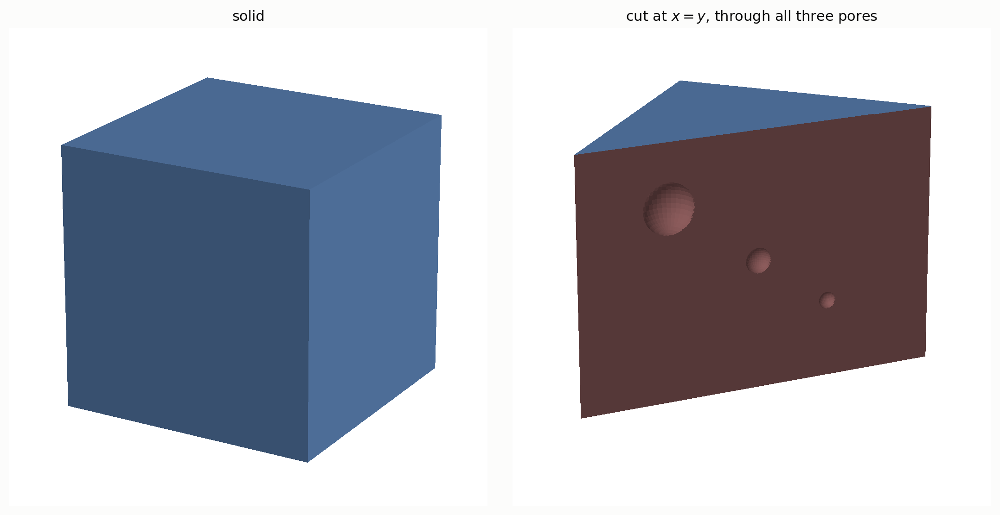
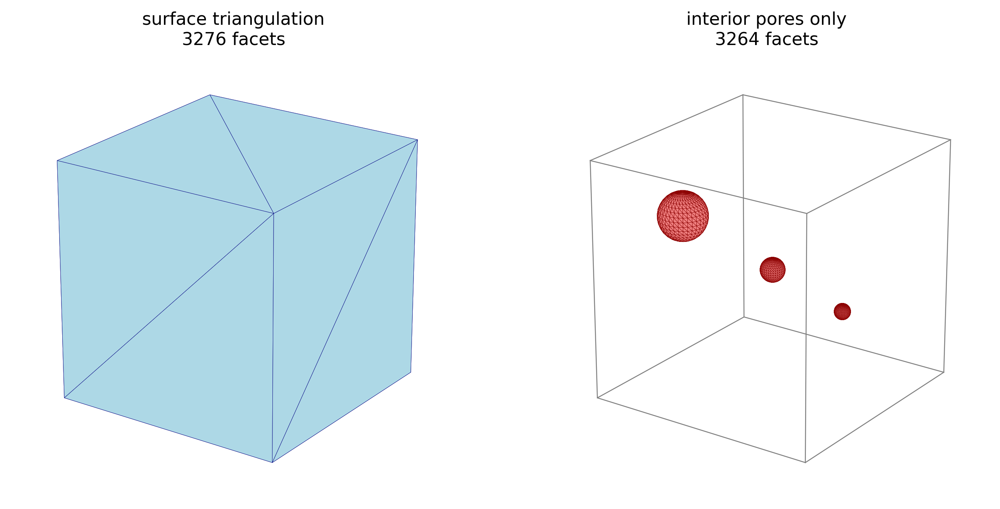
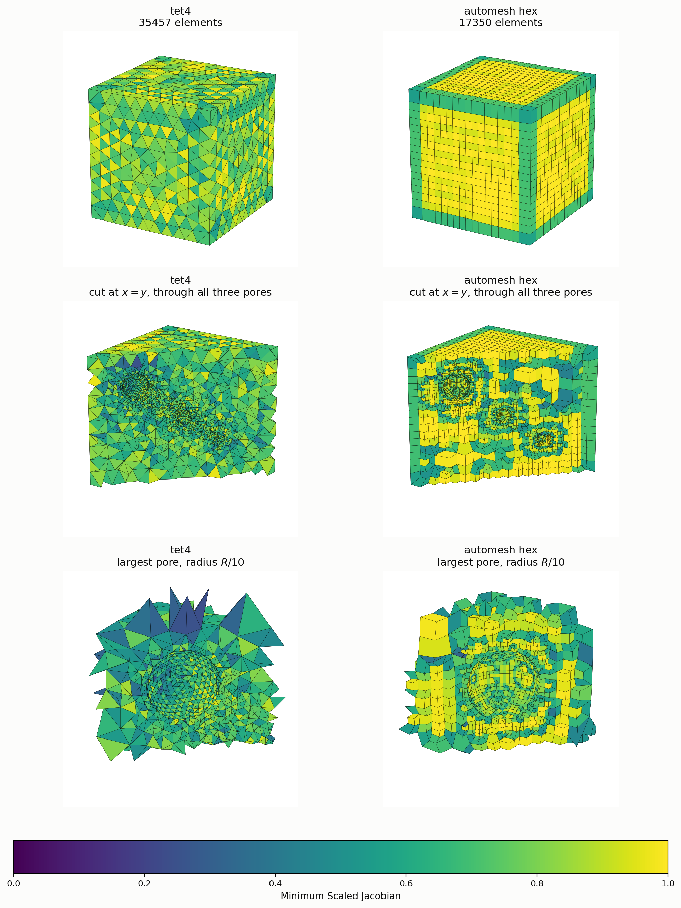
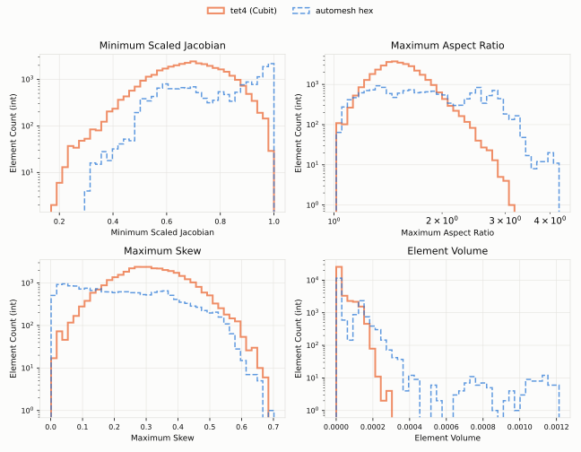

# Representative Volume Element (RVE)

A heterogeneous material varies in its composition from point to point.
A Representative Volume Element (RVE) is the smallest sample volume that still
captures the bulk behavior.  It reproduces the average physical and mechanical
properties of the whole material.

This example uses a unit cube of bulk material.  Three spherical pores sit in
the interior. [Cubit](https://cubit.sandia.gov) creates the geometry and the
tetrahedral comparison meshes; see [Reference](#reference) for the journal file
and [Downloads](#downloads) for the files themselves.



Figure: The RVE geometry.  Left: the solid unit cube.  Right: the same model
cut at the plane $x = y$, which exposes all three pores.  The pores have radii
`R/10`, `R/20`, and `R/30`, and only the middle one sits at the origin.  Their
centers are collinear and all lie on the cut plane, so each pore is sliced
through its center and appears as an exact circle.  The figure is produced by
[`rve_geometry_figure.py`](rve_geometry_figure.py).

Cubit creates the tessellated surface `comparison.stl`, illustrated below.



Figure: The `comparison.stl` surface, as exported by Cubit.  Left: the full
surface triangulation.  Right: the interior pore surfaces on their own, drawn
inside a wireframe of the cube.  The journal exports the STL before meshing, so
this is the geometry faceting rather than a mesh.  The six planar cube faces
need only two triangles each, which puts 3,264 of the total 3,276 facets on
the three pores.  The figure is produced by [`rve_figures.py`](rve_figures.py).

## Motivation

The existing approach meshes the RVE with tet4 or tet10 elements.  The tet4 mesh
appears in the [Metrics](#metrics-figure) figure below.  The tet10 mesh is not
shown separately: its corner nodes reproduce the tet4 mesh exactly, so the two
are indistinguishable in a surface view.

The two tetrahedral meshes share the same 35,457 elements.  The tet10 mesh adds
a midside node on every edge, which raises the node count without changing the
topology.

We would like to replace the incumbent tet4/tet10 approach with an adaptive,
all-hexahedral mesh from `automesh`.  The `automesh` hex mesh needs about half
as many elements as the tet4 mesh.  Its node count falls between the two
tetrahedral meshes.

| model | tet4 | tet10 | hex |
| --- | ---: | ---: | ---: |
| #nodes | 6,681 | 50,217 | 19,056 |
| #elements | 35,457 | 35,457 | 17,350 |

## `automesh` Solution

1. Create an all-hexahedral volume mesh from the STL surface.

```sh
automesh mesh hex --input comparison.stl \
--output hexahedra.exo \
--scale 10 --tolerance 1e-3
```

This meshes adaptively, then buffers the hexahedra onto the geometry, yielding
17,350 elements and 19,056 nodes in about 3 seconds.

The [Metrics](#metrics-figure) figure below shows this mesh, both whole and
cut through the pore centers, so the interior adaptivity is visible.

2. Metrics

<a id="metrics-figure"></a>



Figure: The tet4 and `automesh` hex meshes, painted by Minimum Scaled Jacobian
on a fixed 0 to 1 scale, so the two are comparable by color.  Top row: each
mesh whole, seen from outside.  Middle row: each mesh cut at the plane
$x = y$.  The three pore centers are collinear and all lie on that plane, so
one cut passes through every pore.  Bottom row: that same cut, zoomed on the
largest pore, radius `R/10`.  The middle and bottom rows share a camera facing
the cut plane.
Elements are kept or dropped whole, by centroid, which is what leaves the
ragged fringe around the zoomed panels.  The hex mesh refines toward the pores
and holds near 1.0 through the bulk.  The figure is produced by
[`rve_mesh_figure.py`](rve_mesh_figure.py), following the style of the
[autotwin/quality](https://github.com/autotwin/quality) mesh renders.

`automesh` computes the same four quality measures for both meshes:

```sh
automesh metrics -i tetrahedra_4.exo -o tet4_metrics.csv
automesh metrics -i hexahedra.exo -o hex_metrics.csv
```



Figure: Element quality for the tet4 mesh (solid) and the `automesh` hex mesh
(dashed).  Minimum Scaled Jacobian top left, Maximum Aspect Ratio top right,
Maximum Skew bottom left, Element Volume bottom right.  Counts use a log scale.
The figure is produced by
[`rve_quality_histograms.py`](rve_quality_histograms.py), which follows the
style of the [autotwin/quality](https://github.com/autotwin/quality)
histograms.

The hex mesh concentrates near the ideal on two of the four measures.  Its
scaled Jacobian piles up at 1.0, and its skew piles up at 0.0, whereas the
tet4 mesh peaks near 0.45 and 0.30, respectively.  The tet4 mesh holds the
tighter aspect ratio, topping out near 3 while the hex mesh reaches about 4.5.
Element volume separates the two most clearly.  The hex mesh carries a long
tail of larger elements, which is the adaptive coarsening away from the pores.

# Reference

## Cubit

[Cubit](https://cubit.sandia.gov) builds the geometry and both tetrahedral
meshes.  The journal below reproduces `comparison.stl`, `tetrahedra_4.exo`, and
`tetrahedra_10.exo` offered in [Downloads](#downloads).

```sh
#!cubit
reset

#{ R = 1 }
#{ R1 = R / 10 }
#{ R2 = R / 20 }
#{ R3 = R / 30 }
#{ THICKNESS = 10 }

create brick x 1 y 1 z 1
create sphere radius { R1 }
move volume 2 location {-1/4} {-1/4} {1/4}
create sphere radius {R2}
create sphere radius {R3}
move volume 4 location {1/5} {1/5} {-1/5}
subtract volume 2 from volume 1
subtract volume 3 from volume 5
subtract volume 4 from volume 6
export stl "comparison.stl" fast overwrite

block 1 add volume all
volume all scheme tetmesh
surface 1 2 3 4 5 6 size { 1 / THICKNESS }
surface 10 11 12 size { R / 60 }
mesh volume all
export mesh "tetrahedra_4.exo" overwrite
block 1 element type tetra10
export mesh "tetrahedra_10.exo" overwrite
```

## Downloads

The files below are served from `OneDrive/automesh/data/RVE`.  The first three
come from Cubit and are the inputs to this example.  The last three are
produced by `automesh` from those inputs, using the commands on this page, and
are offered so a reader can skip straight to the results.  Each checksum
below shows the first 12 hex characters of the sha256.

| file | description | size | sha256 |
| :--- | :--- | ---: | :--- |
| [`comparison.stl`](https://1drv.ms/u/c/3cc1bee5e2795295/IQAIqFwRR8DfS4539VngTJH6Af_pFEb6uGY6xXeGwQ2JOAs?e=HeVC66&download=1) | the RVE surface, exported from Cubit; input to `automesh` | 813 kB | `8c1861b52db7...` |
| [`tetrahedra_4.exo`](https://1drv.ms/u/c/3cc1bee5e2795295/IQBsMf_66nmrTazlARQekqNhAaavU7JW-GiKCTxycGVPLUU?e=PMUDyR&download=1) | the tet4 comparison mesh | 1.0 MB | `b2a27385c1e8...` |
| [`tetrahedra_10.exo`](https://1drv.ms/u/c/3cc1bee5e2795295/IQCmru1rLdVWSJHAsCKX0Cv_AU-cmc831rRYnO5LQI-Jr34?e=rdiKr8&download=1) | the tet10 comparison mesh | 3.0 MB | `f468182d956c...` |
| [`hexahedra.exo`](https://1drv.ms/u/c/3cc1bee5e2795295/IQCB1WCIufj-S5jK7lTl2QIIAfBU1ApIcXIkfVTMHjRZxxU?e=RPZE17&download=1) | the `automesh` all-hexahedral mesh | 565 kB | `feeefefbebc7...` |
| [`tet4_metrics.csv`](https://1drv.ms/x/c/3cc1bee5e2795295/IQDRdY20_qxxQqXMbJ19UdWVARzwPMd58u2so_FyiuXkjlY?e=tkZ6QR&download=1) | tet4 element quality, one row per element | 1.6 MB | `00854a8a695d...` |
| [`hex_metrics.csv`](https://1drv.ms/x/c/3cc1bee5e2795295/IQB6mpAxbFZnRYrGkK4anuHbAVpWjdG1AFS3WuUVCEJcuOY?e=JZr4V4&download=1) | hex element quality, one row per element | 796 kB | `ef4f509b64f1...` |
