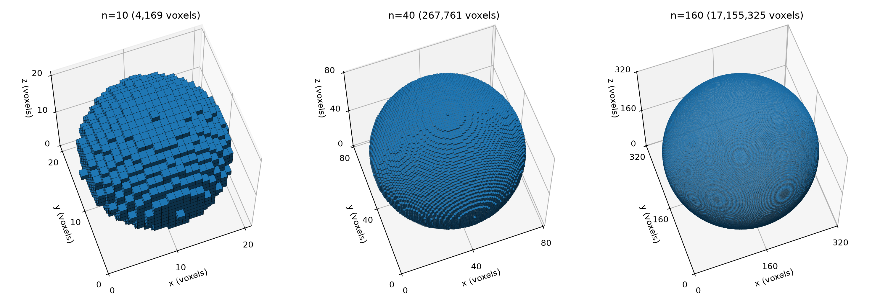
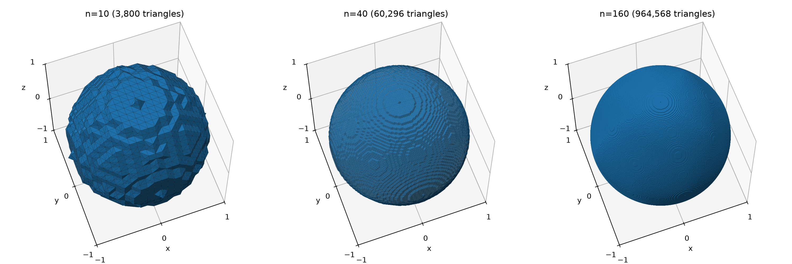
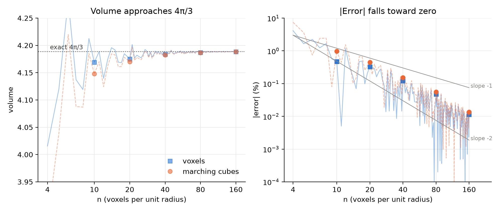
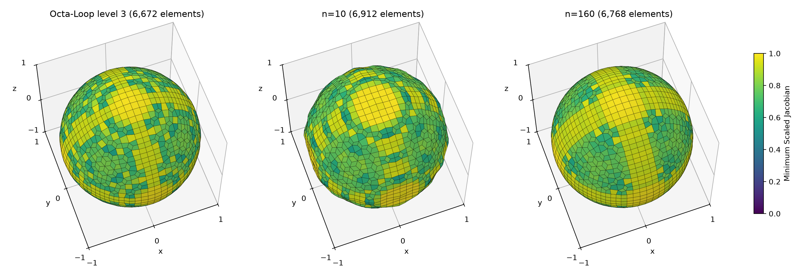
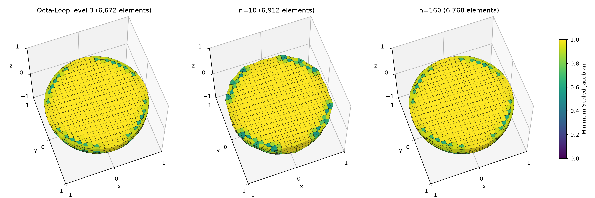
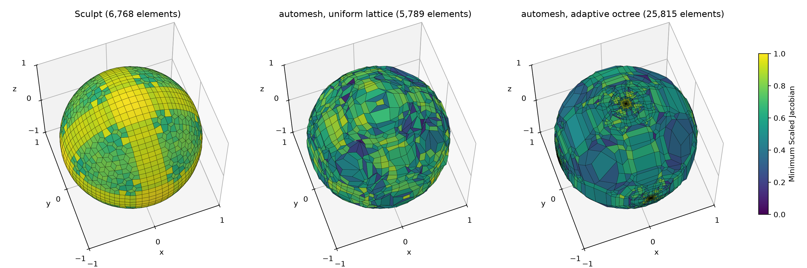
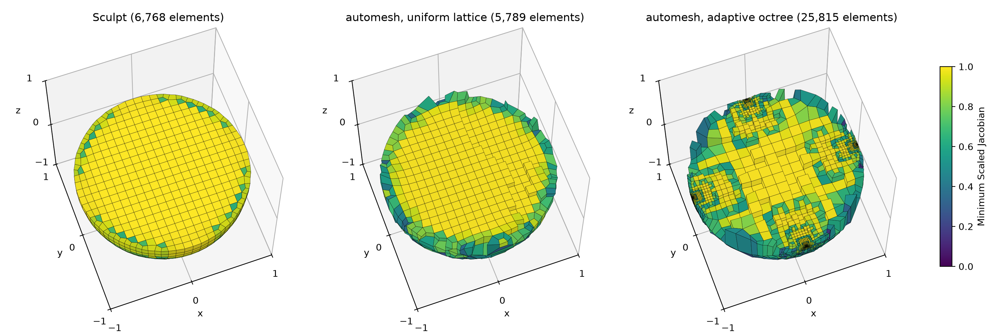
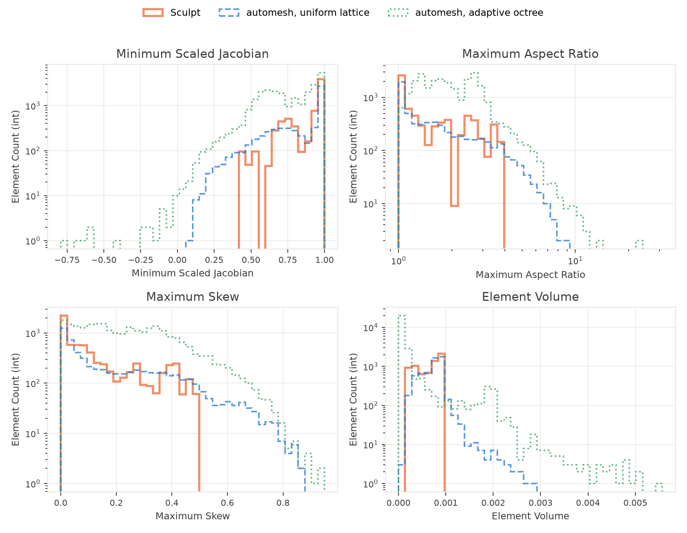

# Unit Sphere

A sphere is a useful first model because, given its radius, the surface area and
volume are known quantities.  The error of any surface that approximates
the analytical surface of the sphere can be easily quantified.

This page builds a unit sphere from a segmentation of voxels.  Marching cubes
turns the segmentation into a triangulated surface.  We then measure that
surface against the exact sphere.

## Related Studies

Two other pages of this book build unit spheres by other methods.

* [Octa-Loop](../../../theory/subdivision.md#octa-loop), on the Subdivision
  page, refines a unit octahedron into a sphere by Loop subdivision.
* [Remesh: Unit Sphere](../../remesh/sphere.md) remeshes a unit sphere of
  1,088 facets.

## Segmentation

The script [`unit_sphere_segmentation.py`](#unit_sphere_segmentationpy) builds
a sphere of radius $n$ voxels.  The sphere sits at the center of a cube of
$2n+1$ voxels per side.  A voxel is inside when its center satisfies
$x^2 + y^2 + z^2 \le n^2$.  An inside voxel has value 1, and every other voxel
has value 0.  The array axes are $(x, y, z)$, the order `automesh` reads from
a `.npy` file.

```sh
uv run --with numpy unit_sphere_segmentation.py
```

The script writes five segmentations, for $n$ = 10, 20, 40, 80, and 160.  Each
voxel has side $1/n$ once the sphere is scaled to radius 1.  The volume column
counts the inside voxels and multiplies by $1/n^3$.  The error,
$(\text{volume} - 4\pi/3) / (4\pi/3)$, compares that volume with the exact
volume $4\pi/3 \approx 4.1888$.

| $n$ | grid | total voxels | inside voxels | volume | error |
| ---: | :---: | ---: | ---: | ---: | ---: |
| 10 | 21×21×21 | 9,261 | 4,169 | 4.1690 | −0.47% |
| 20 | 41×41×41 | 68,921 | 33,401 | 4.1751 | −0.33% |
| 40 | 81×81×81 | 531,441 | 267,761 | 4.1838 | −0.12% |
| 80 | 161×161×161 | 4,173,281 | 2,143,641 | 4.1868 | −0.05% |
| 160 | 321×321×321 | 33,076,161 | 17,155,325 | 4.1883 | −0.01% |

The voxel volume falls short at every $n$ in the table, and the shortfall
shrinks as $n$ grows.  Neither pattern holds at every $n$.  The
[Convergence](#convergence) section follows every $n$ from 4 to 160.



Figure: The segmentations for $n = 10$ (left), $n = 40$ (middle), and
$n = 160$ (right), in voxel units.  Only the outer faces of the inside voxels
are drawn.  Each fourfold increase in $n$ shrinks the voxel steps fourfold,
and at $n = 160$ they are barely visible.  The figure is produced by
[`unit_sphere_figures.py`](#unit_sphere_figurespy).

## Isosurface

Marching cubes turns a grid of values into a triangulated surface at one
level of those values.  The script
[`unit_sphere_isosurface.py`](#unit_sphere_isosurfacepy) wraps the
implementation in [scikit-image](https://scikit-image.org),
`skimage.measure.marching_cubes`, with the method of Lewiner
*et al.*[^Lewiner2003]  For each segmentation, the script

1. pads the segmentation by one voxel of zeros, so the surface closes,
2. runs marching cubes at level 0.5, halfway between outside (0) and
   inside (1),
3. reverses each face, so every triangle winds outward (see
   [Pitfalls](#pitfalls)),
4. translates and scales the vertices to a unit sphere (see
   [Transform](#transform)), and
5. writes a binary STL.

```sh
uv run --with numpy --with scikit-image unit_sphere_isosurface.py
```

It then checks each surface.  $v$, $e$, and $f$ count the vertices, edges,
and faces.  The volume is the signed volume that the faces enclose.  The
error compares that volume with the exact volume $4\pi/3 \approx 4.1888$.

| $n$ | $v$ | $e$ | $f$ | volume | error |
| ---: | ---: | ---: | ---: | ---: | ---: |
| 10 | 1,902 | 5,700 | 3,800 | 4.1478 | −0.98% |
| 20 | 7,542 | 22,620 | 15,080 | 4.1699 | −0.45% |
| 40 | 30,150 | 90,444 | 60,296 | 4.1825 | −0.15% |
| 80 | 120,486 | 361,452 | 240,968 | 4.1865 | −0.06% |
| 160 | 482,286 | 1,446,852 | 964,568 | 4.1882 | −0.01% |

The volume falls short of $4\pi/3$ at every $n$ in the table.  The surface
also encloses less volume than the voxels it came from.  That second pattern
holds at every $n$ from 4 to 160.  Marching cubes cuts each corner of the
voxel staircase with a flat triangle, and every cut removes a little
volume.

The script also runs five checks on each surface.  All five surfaces give
the same result on every check.

* **Closed.**  No edge is open.  An open edge belongs to one face only.
* **Manifold.**  No edge is pinched.  A pinched edge belongs to more than two
  faces.
* **Oriented.**  No two faces traverse the same edge in the same direction.
* **Connected.**  The surface is one piece.
* **Euler characteristic.**  $\chi = v - e + f = 2$.

For a closed, connected, orientable surface, $\chi = 2 - 2g$, where $g$ is
the genus, the number of handles.  Here $\chi = 2$, so $g = 0$, and each
surface is topologically a sphere.



Figure: The marching-cubes surfaces for $n = 10$ (left), $n = 40$ (middle),
and $n = 160$ (right), scaled to the unit sphere.  The terraces are the voxel
staircase of the segmentation.  A binary mask places every vertex at the
midpoint of a cube edge, so the surface cannot round off the steps.  The
steps shrink as $n$ grows, but the rings around each pole remain visible
even at $n = 160$.  The figure is produced by
[`unit_sphere_figures.py`](#unit_sphere_figurespy).

### Convergence

The two tables sample five values of $n$, each double the last.  The script
[`unit_sphere_figures.py`](#unit_sphere_figurespy) also computes both
volumes at every $n$ from 4 to 160, 157 values in all.



Figure: The volume (left) and the magnitude of its error (right) against
$n$, for the voxels and for the marching-cubes surface.  Thin lines connect
every $n$ from 4 to 160.  Markers show the five values of $n$ in the tables.
On the left, the dotted line marks the exact volume $4\pi/3$, and a few
values at $n \le 7$ fall off the scale.  On the right, the gray guides have
slopes of −1 and −2.

Both volumes settle onto $4\pi/3$, but neither settles smoothly.  The voxel
error changes sign 46 times, and 25 of the 157 voxel volumes exceed
$4\pi/3$.  The marching-cubes error changes sign 24 times, and 12 of its
volumes exceed $4\pi/3$.  The five values in the tables all happen to fall
short.

Under the oscillation, both errors fall toward zero.  A least-squares fit of
$\log|\text{error}|$ against $\log n$ gives a slope of −1.71 for the voxels
and −1.76 for marching cubes.  Both lie between the two guides.  The
marching-cubes volume stays below the voxel volume at all 157 values.

### Why Lewiner?

Lorensen and Cline introduced marching cubes in 1987.[^Lorensen1987]  Their
method visits each cube of eight neighboring samples.  It classifies each
corner as inside or outside, which gives 256 cases.  Symmetry reduces those
to 15 base cases, and each base case has one fixed triangulation.

Some cases are ambiguous.  On a face with two inside corners on one
diagonal and two outside corners on the other, the corners alone cannot say
whether the inside corners connect across the face.  An interior ambiguity
arises the same way inside a cube.  A fixed table picks one answer without
looking at the data.  Neighboring cubes can then disagree, and the surface
can take the wrong topology.

Chernyaev extended the table to 33 cases.[^Chernyaev1995]  His table
resolves each ambiguity with the trilinear interpolant of the eight corner
values, the smooth function the samples define inside the cube.  Lewiner
*et al.* gave an efficient and complete implementation of that
table.[^Lewiner2003]
[scikit-image](https://scikit-image.org/docs/stable/api/skimage.measure.html#skimage.measure.marching_cubes)
uses the Lewiner method by default.[^skimage]

The list below separates what the Lewiner method adds from what the
scikit-image implementation gives either method.  Each item says where the
evidence comes from.

**What the Lewiner method adds**

1. **Topology that matches the data.**  The 33-case table resolves face and
   interior ambiguities with the trilinear interpolant.  The surface then
   has the topology of the interpolant's level set, so neighboring cubes
   always agree.  *From the paper.*[^Lewiner2003]

**What the scikit-image implementation gives either method**

2. **Watertight.**  No edge is open, at any $n$.  The one-voxel pad keeps
   the surface closed where the sphere touches the edge of the grid.
   *Measured here.*
3. **Manifold.**  Every edge belongs to exactly two faces, at any $n$.
   *Measured here.*
4. **Consistently oriented.**  No two faces traverse an edge in the same
   direction, and the signed volume is positive once the faces are reversed.
   *Measured here.*
5. **An indexed mesh.**  The output is an array of vertices and an array of
   faces that index into it.  Neighboring triangles share vertices, so the
   mesh needs no welding.  *From the API.*
6. **Normals and values.**  The call also returns a normal at each vertex,
   from the gradient of the data, and the data value there.  *From the API.*

For the unit sphere the two methods agree.  At every $n$ they return the
same triangles, and they take the same time.  The time below is the fastest
of five runs, on the machine that built this page.

| $n$ | Lewiner (ms) | Lorensen (ms) | same triangles |
| ---: | ---: | ---: | :---: |
| 10 | 0.49 | 0.49 | yes |
| 20 | 1.99 | 2.03 | yes |
| 40 | 9.19 | 9.41 | yes |
| 80 | 48.10 | 49.52 | yes |
| 160 | 285.98 | 296.59 | yes |

The sphere reaches no ambiguous case, so the Lewiner method has nothing to
resolve.  On data that do reach such cases, the two methods can return
surfaces of different topology.  Newman and Yi illustrate each ambiguous
case and survey the methods that resolve them.[^Newman2006]

### Pitfalls

1. **Winding.**  scikit-image returns vertices in array-axis order.  The
   segmentation has axes $(x, y, z)$, so the vertices come back as
   $(x, y, z)$ too.  With the default `gradient_direction="descent"`, the
   returned normals point outward, but every triangle winds inward.  The
   signed volume is then negative.  The script reverses each face, which
   makes the winding agree with the normals.
2. **Exact ties on a binary mask.**  On a mask of 0 and 1, level 0.5 is
   exactly the saddle value of an ambiguous face.  The Lewiner method can
   then pinch an edge between four faces.  A level slightly off 0.5, such
   as 0.49, avoids the tie.  The unit sphere has no pinched edge at any
   $n$, so this page keeps level 0.5.

## Transform

Marching cubes returns vertices in voxel units.  After the one-voxel pad, the
sphere center sits at $(n+1, n+1, n+1)$.  Two operations map the surface to a
unit sphere at the origin.

1. **Translate** by $-(n+1)$.  The shift is a whole number of voxels, so it
   is exact.
2. **Scale** by $1/n$.

`automesh` applies the same two operations in the other order.  Its
`--xscale` and `--xtranslate` options scale first and translate second.  The
same map in the `automesh` order scales by $1/n$ and then translates by
$-(n+1)/n$.  Both orders give the same coordinates.

The vertex radii show how close the surface comes to the unit sphere.  The
coefficient of variation, CoV $= \text{std} / \text{mean}$, measures how
much the radii spread.  A perfect sphere has CoV $= 0$.

| $n$ | $r$ min | $r$ max | $r$ mean | $r$ CoV |
| ---: | ---: | ---: | ---: | ---: |
| 10 | 0.9552 | 1.0500 | 0.9993 | 2.15% |
| 20 | 0.9763 | 1.0250 | 0.9991 | 1.01% |
| 40 | 0.9878 | 1.0125 | 0.9996 | 0.51% |
| 80 | 0.9938 | 1.0063 | 0.9999 | 0.26% |
| 160 | 0.9969 | 1.0031 | 1.0000 | 0.13% |

The mean radius stays within 0.1% of 1 at every $n$, so a scale of $1/n$
leaves no bias.  The largest radius is always $1 + 0.5/n$, at the six poles.
There a vertex sits halfway between the last inside voxel, at radius $n$, and
the first outside voxel, at radius $n + 1$.

The CoV halves each time $n$ doubles, so the spread of the radii falls as
$1/n$.  That is first order, slower than the volume error in
[Convergence](#convergence).  The volume averages over the whole surface, and
the staircase steps partly cancel in that average.  The radius spread sees
every step.

## Comparison

### Hausdorff Distance

The [Hausdorff distance](https://mathworld.wolfram.com/HausdorffDistance.html)
between two surfaces is the farthest that any point
of either one lies from the other.  For a surface $M$ and the unit sphere
$S$,

$$
d_H(M, S) = \max \left\{ \sup_{p \in M} d(p, S), \; \sup_{q \in S} d(q, M) \right\}.
$$

The script [`unit_sphere_comparison.py`](#unit_sphere_comparisonpy) computes the
first term exactly.  A point $p$ lies $d(p, S) = \big| |p| - 1 \big|$ from
the unit sphere.  Over a triangle, $|p|$ is convex.  Its largest value sits at
a vertex, and its smallest sits at the point of the triangle closest to the
origin.[^Ericson2005]  The largest $|p| - 1$ over all triangles gives the
outward distance.  The largest $1 - |p|$ gives the inward distance.

The second term needs no computation.  Each surface is closed and encloses
the origin.  The ray from the origin through a sphere point $q$ therefore
crosses $M$ at some point $p$.  Then
$d(q, M) \le |q - p| = \big| |p| - 1 \big| \le \sup_{p \in M} d(p, S)$.
The second term never exceeds the first, so the Hausdorff distance is the
larger of the outward and inward distances.

```sh
uv run --with numpy unit_sphere_comparison.py
```

| $n$ | $f$ | outward | inward | $d_H$ | $n \, d_H$ |
| ---: | ---: | ---: | ---: | ---: | ---: |
| 10 | 3,800 | 0.05000 | 0.04737 | 0.05000 | 0.500 |
| 20 | 15,080 | 0.02500 | 0.02436 | 0.02500 | 0.500 |
| 40 | 60,296 | 0.01250 | 0.01234 | 0.01250 | 0.500 |
| 80 | 240,968 | 0.00625 | 0.00621 | 0.00625 | 0.500 |
| 160 | 964,568 | 0.00312 | 0.00312 | 0.00312 | 0.500 |

The Hausdorff distance is exactly $0.5/n$ at every $n$, half a voxel.  The
outward distance sets it, at the six poles (see [Transform](#transform)).
The inward distance approaches it from below.  The Hausdorff distance falls
as $1/n$, first order, like the radius CoV.  The triangle count $f$ grows as
$n^2$, so in terms of triangles the distance falls only as $f^{-1/2}$.

### Area and Volume

The volume converges.  Its error falls toward zero at a log-log slope of
about −1.7, as the [Convergence](#convergence) section shows.

The area does not converge.  The script
[`unit_sphere_comparison.py`](#unit_sphere_comparisonpy) also adds up the
areas of the marching-cubes triangles.  The error compares that area with the
exact area $4\pi \approx 12.5664$.

| $n$ | area | error |
| ---: | ---: | ---: |
| 10 | 13.7204 | +9.18% |
| 20 | 13.6324 | +8.48% |
| 40 | 13.6566 | +8.68% |
| 80 | 13.6608 | +8.71% |
| 160 | 13.6673 | +8.76% |

The voxel staircase itself would overstate the area by 50% at any $n$.
Marching cubes cuts its corners, which removes most of that excess.  The area
still settles near 8.8% too large.  Smaller voxels make smaller steps, but
the triangles keep the same few orientations relative to the true surface.
So the Hausdorff distance falls to zero while the area error does not.  A
surface can come arbitrarily close to the sphere and still have the wrong
area.

### Triangle Quality

The script [`unit_sphere_comparison.py`](#unit_sphere_comparisonpy) also runs
`automesh metrics` on each surface.  The
[Triangular Metrics](../../../theory/metrics_triangular.md) page defines its
measures.

A binary mask puts every vertex at the midpoint of a cube edge.  So marching
cubes can make only a few triangle shapes.  Grouped by maximum edge ratio and
minimum scaled Jacobian, the surfaces contain exactly five.  The table gives
the fraction of triangles of each shape.

| shape | angles | edge ratio | scaled Jacobian | $n = 10$ | $n = 20$ | $n = 40$ | $n = 80$ | $n = 160$ |
| :--- | :---: | ---: | ---: | ---: | ---: | ---: | ---: | ---: |
| equilateral | 60°, 60°, 60° | 1.000 | 1.000 | 14.74% | 14.80% | 14.30% | 13.99% | 13.98% |
| right isosceles | 45°, 45°, 90° | 1.414 | 0.816 | 24.63% | 25.15% | 25.04% | 24.92% | 24.85% |
| right | 35.26°, 54.74°, 90° | 1.732 | 0.667 | 31.58% | 30.56% | 32.08% | 33.13% | 33.20% |
| obtuse isosceles | 30°, 30°, 120° | 1.732 | 0.577 | 14.53% | 14.75% | 14.29% | 13.98% | 13.98% |
| 30-60-90 | 30°, 60°, 90° | 2.000 | 0.577 | 14.53% | 14.75% | 14.29% | 13.98% | 13.98% |

**Refinement does not change the quality.**  The same five shapes appear at every
$n$, in nearly the same proportions.  More than a quarter of the triangles
have the worst scaled Jacobian, $1/\sqrt{3} \approx 0.577$, with a smallest
angle of 30°.  No triangle is worse.  Smaller voxels shrink the triangles but
never reshape them.  A histogram of any measure would show only these five
spikes, so the table stands in for one.

## Mesh

This section meshes the marching-cubes surfaces with hexahedra.  Sculpt, the
mesher the Subdivision page uses, serves as the baseline, and `automesh`
meshes the same surfaces at the same cell size for comparison.

### Sculpt

The Subdivision page meshes its Octa-Loop spheres with
[Sculpt](../../../theory/subdivision.md#sculpt-baseline).  At levels 3 to 7,
it reports a grid of 26×26×26 cells, 7,731 nodes, and 6,672 elements.  Here
Sculpt meshes the marching-cubes surfaces on the same grid instead.

The baseline runs Sculpt through Cubit's `sculpt parallel` command, which
chooses the grid itself.  For Octa-Loop level 3, Cubit places 26 cells in each
direction across a box of $\pm 1.240409$, a cell size of about 0.0954.
Standalone Sculpt with those options reproduces the baseline exactly, at 7,731
nodes and 6,672 elements.  The same options mesh each marching-cubes surface.

```sh
B=1.240409
GRID="-x 26 -y 26 -z 26 -t -$B -u -$B -v -$B -q $B -r $B -s $B -SS 2"
# octa_loop03.stl downloads from the Refinement table of the Subdivision page
sculpt -j 1 -stl octa_loop03.stl $GRID -e unit_sphere_sculpt_octa03
for n in 010 020 040 080 160; do
  sculpt -j 1 -stl unit_sphere_mc_n$n.stl $GRID -e unit_sphere_sculpt_n$n
done
```

The quality is the minimum scaled Jacobian, as Sculpt reports it.

| input | nodes | elements | minimum quality | mean quality |
| :--- | ---: | ---: | ---: | ---: |
| [Octa-Loop level 3](../../../theory/subdivision.md#refinement) (baseline) | 7,731 | 6,672 | 0.343 | 0.888 |
| marching cubes, $n = 10$ | 8,007 | 6,912 | 0.388 | 0.885 |
| marching cubes, $n = 20$ | 7,827 | 6,768 | 0.404 | 0.900 |
| marching cubes, $n = 40$ | 7,827 | 6,768 | 0.420 | 0.902 |
| marching cubes, $n = 80$ | 7,827 | 6,768 | 0.401 | 0.901 |
| marching cubes, $n = 160$ | 7,827 | 6,768 | 0.427 | 0.901 |

From $n = 20$ on, every surface gives the same 7,827 nodes and 6,768
elements, 96 more of each than the baseline, or about 1.4%.  The worst
element is better than the baseline's at every $n$.



Figure: The Sculpt meshes of Octa-Loop level 3 (left), the marching-cubes
surface for $n = 10$ (middle), and for $n = 160$ (right), on the same grid.
Each element is painted by its Minimum Scaled Jacobian, on a fixed scale from
0 to 1.  In all three, the best elements form bands of regular hexes, and the
worst sit where those bands meet.  The figure is produced by
[`unit_sphere_figures.py`](#unit_sphere_figurespy).

The difference between the middle and right panels comes from the size of a
voxel step against the size of a Sculpt cell, about 0.095.

* At $n = 10$, a voxel is 0.1 wide, so each voxel step is about as large as a
  Sculpt cell.  The mesh boundary follows the steps, and the sphere looks
  lumpy.
* At $n = 160$, a voxel is 0.00625 wide, so a Sculpt cell spans about 15
  voxels.  The steps are far smaller than the elements, and the mesh looks
  like the baseline.
* From $n = 20$ on, where a cell spans about two voxels or more, the mesh
  stops changing: 7,827 nodes and 6,768 elements at every $n$.
* Even at $n = 10$, the steps do not lower the quality.  The worst element,
  at 0.388, is better than the baseline's 0.343.



Figure: A cut through the middle of the same three meshes, at $z = 0$, on
the same 0 to 1 scale.  Only the elements whose centers lie below the plane
are drawn.  The Sculpt grid has a cell boundary at $z = 0$, so the interior
of the cut is flat.  Near the surface, smoothing moves some nodes off the
plane, and a few elements cross it: 72, 60, and 48 from left to right.  The
interior is a regular grid of elements near 1.0.  The low values form a ring
one element deep at the boundary.  The figure is produced by
[`unit_sphere_figures.py`](#unit_sphere_figurespy).

Left to choose its own grid, Cubit sizes the cells to the small
marching-cubes facets.  For $n = 40$ it picks 73×73×73 cells and makes
180,201 elements.  Fixing the grid keeps the meshes comparable with the
baseline.

The run used Sculpt 16.08, from Cubit 16.08.  For the baseline mesh,
`automesh metrics` gives the same minimum (0.343) and mean (0.888) as Sculpt.
`automesh` 0.4.7 cannot yet read Sculpt's Exodus files.  Its Exodus reader
rejects the NUL-terminated element type that Sculpt writes, a bug that is
fixed upstream but not yet released.[^conspire178]  So the script
[`unit_sphere_mesh.py`](#unit_sphere_meshpy) first rewrites each Sculpt mesh
as an Abaqus `.inp` file, which `automesh` reads.  Exodus and Abaqus number
the eight nodes of a hex the same way, so the rewrite keeps every element
intact.

### `automesh`

The script [`unit_sphere_mesh.py`](#unit_sphere_meshpy) meshes each
marching-cubes surface with `automesh mesh hex` in two ways.  The uniform
lattice uses the Sculpt cell size, $2 \times 1.240409 / 26 \approx 0.095416$.
The adaptive octree uses the default scale (`-s 5`).  The script then runs
`automesh metrics` on every mesh, Sculpt's included.

```sh
uv run --with numpy --with scipy unit_sphere_mesh.py
```

For one surface, the two `automesh` commands are

```sh
automesh mesh hex -i unit_sphere_mc_n160.stl -o unit_sphere_uniform_n160.inp \
  -u 0.095416 --metrics unit_sphere_uniform_n160.csv
automesh mesh hex -i unit_sphere_mc_n160.stl -o unit_sphere_octree_n160.inp \
  --metrics unit_sphere_octree_n160.csv
```

The table gives the element count and the worst and mean Minimum Scaled
Jacobian (MSJ) of each mesh.

| $n$ | Sculpt elements | Sculpt MSJ min / mean | uniform elements | uniform MSJ min / mean | octree elements | octree MSJ min / mean |
| ---: | ---: | :---: | ---: | :---: | ---: | :---: |
| 10 | 6,912 | 0.388 / 0.885 | 6,024 | 0.154 / 0.830 | 8,243 | 0.088 / 0.695 |
| 20 | 6,768 | 0.404 / 0.900 | 5,984 | 0.097 / 0.838 | 9,983 | 0.102 / 0.711 |
| 40 | 6,768 | 0.420 / 0.902 | 5,840 | 0.119 / 0.838 | 14,767 | 0.032 / 0.742 |
| 80 | 6,768 | 0.401 / 0.901 | 5,825 | 0.126 / 0.827 | 15,223 | 0.010 / 0.754 |
| 160 | 6,768 | 0.427 / 0.901 | 5,789 | 0.102 / 0.825 | 25,815 | −0.792 / 0.755 |



Figure: The three meshes of the $n = 160$ surface: Sculpt (left), the
`automesh` uniform lattice (middle), and the `automesh` adaptive octree
(right).  Each element is painted by its Minimum Scaled Jacobian, on the same
0 to 1 scale as the Sculpt figures.  Sculpt's boundary elements form regular
bands.  The lattice's boundary elements are irregular, with dark patches of
low quality.  The octree's boundary elements are large and coarse, except in
dense clusters of small elements.  The figure is produced by
[`unit_sphere_figures.py`](#unit_sphere_figurespy).



Figure: A cut through the middle of the same three meshes, at $z = 0$.  Only
the elements whose centers lie below the plane are drawn.  All three have an
interior of elements near 1.0.  Sculpt's low values form a thin ring one
element deep.  The lattice's ring is thicker and more ragged, with the darkest
elements at the boundary.  The octree grades from large interior cells to
small ones, and it refines most where the sphere meets the coordinate axes.
The figure is produced by [`unit_sphere_figures.py`](#unit_sphere_figurespy).



Figure: Element quality of the three meshes of the $n = 160$ surface: Sculpt
(solid, orange), the `automesh` uniform lattice (dashed, blue), and the
`automesh` adaptive octree (dotted, green).  Each panel is a histogram with a
log scale on the count.  The octree's tail below zero holds its 23 inverted
elements.  The figure is produced by
[`unit_sphere_figures.py`](#unit_sphere_figurespy).

Sculpt makes the better mesh at every $n$.  Its worst element stays between
0.39 and 0.43, and its mean is 0.90.  The uniform lattice, at the same cell
size, makes 12% to 15% fewer elements.  Its mean is 0.83, and a thin tail
reaches down to 0.10.  Its aspect ratio reaches 9 to 13, where Sculpt stays
below 5.

The adaptive octree does worse than the lattice.  It refines toward the small
marching-cubes facets, so its element count grows with $n$, from 8,243 to
25,815.  Its mean stays between 0.70 and 0.76, below the lattice's.  Its
worst element drops sharply from $n = 40$ on, to 0.032 and then 0.010.  At
$n = 160$, 23 elements are inverted, and the worst has a Minimum Scaled
Jacobian of −0.792.  None are inverted at $n = 10$ to 80.

## Reproduce

The commands below regenerate every table and figure on this page.  They run
from the page's own directory, in order, because each step reads the files
the step before it writes.

The steps need three tools and one input file.

* [`uv`](https://docs.astral.sh/uv/) runs each script with its Python
  packages.
* `automesh` 0.4.7 must be on the `PATH`.  The comparison and mesh scripts
  call it.
* Sculpt, from Cubit 16.08, must be on the `PATH` for the Sculpt meshes.
* The input `octa_loop03.stl` must sit in this directory.  It downloads from
  the [Refinement](../../../theory/subdivision.md#refinement) table of the
  Subdivision page.

```sh
cd ~/autotwin/automesh/book/examples/gallery/academic

# segmentations, marching-cubes surfaces, and the comparison tables
uv run --with numpy unit_sphere_segmentation.py
uv run --with numpy --with scikit-image unit_sphere_isosurface.py
uv run --with numpy unit_sphere_comparison.py

# Sculpt meshes on the baseline grid
B=1.240409
GRID="-x 26 -y 26 -z 26 -t -$B -u -$B -v -$B -q $B -r $B -s $B -SS 2"
sculpt -j 1 -stl octa_loop03.stl $GRID -e unit_sphere_sculpt_octa03
for n in 010 020 040 080 160; do
  sculpt -j 1 -stl unit_sphere_mc_n$n.stl $GRID -e unit_sphere_sculpt_n$n
done

# automesh meshes, and metrics for every mesh
uv run --with numpy --with scipy unit_sphere_mesh.py

# figures
uv run --with numpy --with scipy --with scikit-image --with matplotlib \
  unit_sphere_figures.py
```

On the machine that built this page, the whole sequence takes about three
minutes from an empty directory.  The `automesh` meshes take about two of
those minutes, most of it in the adaptive octree.  The timing table in
[Why Lewiner?](#why-lewiner) depends on the machine.  Every other number on
the page comes out the same on each run.

The generated meshes, segmentations, and metrics are not stored with the
book.  Only the figures are.

## Source

### `unit_sphere_segmentation.py`

```python
<!-- cmdrun cat unit_sphere_segmentation.py -->
```

### `unit_sphere_isosurface.py`

```python
<!-- cmdrun cat unit_sphere_isosurface.py -->
```

### `unit_sphere_comparison.py`

```python
<!-- cmdrun cat unit_sphere_comparison.py -->
```

### `unit_sphere_mesh.py`

```python
<!-- cmdrun cat unit_sphere_mesh.py -->
```

### `unit_sphere_figures.py`

```python
<!-- cmdrun cat unit_sphere_figures.py -->
```

## Reference

[^Lewiner2003]: Thomas Lewiner, Hélio Lopes, Antônio Wilson Vieira, and
    Geovan Tavares.  "Efficient implementation of Marching Cubes' cases with
    topological guarantees."  *Journal of Graphics Tools* 8(2) (2003) 1–15.
    <https://doi.org/10.1080/10867651.2003.10487582>

[^Lorensen1987]: William E. Lorensen and Harvey E. Cline.  "Marching cubes: A
    high resolution 3D surface construction algorithm."  *ACM SIGGRAPH
    Computer Graphics* 21(4) (1987) 163–169.
    <https://doi.org/10.1145/37402.37422>

[^skimage]: scikit-image developers.  "`skimage.measure.marching_cubes`."
    *scikit-image API reference*, version 0.26.0.
    <https://scikit-image.org/docs/stable/api/skimage.measure.html#skimage.measure.marching_cubes>.
    The signature sets `method='lewiner'` as the default.

[^Newman2006]: Timothy S. Newman and Hong Yi.  "A survey of the marching
    cubes algorithm."  *Computers & Graphics* 30(5) (2006) 854–879.
    <https://doi.org/10.1016/j.cag.2006.07.021>

[^Ericson2005]: Christer Ericson.  *Real-Time Collision Detection.*  Morgan
    Kaufmann, 2005.  Section 5.1.5, the closest point on a triangle to a
    point.

[^conspire178]: conspire issue #178, "Exodus reader rejects Cubit-written
    meshes: elem_type is NUL-terminated."
    <https://github.com/mrbuche/conspire.rs/issues/178>

[^Chernyaev1995]: Evgeni V. Chernyaev.  *Marching Cubes 33: Construction of
    topologically correct isosurfaces.*  Technical Report CN/95-17, CERN,
    1995.
