# Unit Sphere

A sphere is a useful model because, given its radius, the surface area and
volume are known quantities.  The error of any surface that approximates
the analytical surface of the sphere can be easily quantified.

This page builds a unit sphere from a voxel segmentation.  Voxels inside the
sphere have value `1`.  Voxels outside have value `0`.  Marching cubes turns
the segmentation into a triangulated surface.  That surface approximates the
[isosurface](../../../theory/isosurface.md) of the segmentation at the value
0.5, halfway between `0` and `1`.  We measure the triangulated surface against
the exact sphere.

## Related Studies

Two other sections build unit spheres by other methods.

* [Octa-Loop](../../../theory/subdivision.md#octa-loop), on the Subdivision
  page, refines a unit octahedron into a sphere by Loop subdivision.
* [Remesh: Unit Sphere](../../remesh/sphere.md) remeshes a unit sphere of
  1,088 facets.

## Segmentation

The script [`unit_sphere_segmentation.py`](#unit_sphere_segmentationpy) builds
a sphere of radius $n$ voxels.  The sphere sits at the center of a cube of
$2n+1$ voxels per side.  A voxel is inside when its center satisfies
$x^2 + y^2 + z^2 \le n^2$.  An inside voxel has value `1`, and every other
voxel has value `0`.  The array axes are $(x, y, z)$, the order `automesh`
reads from a `.npy` file.

```sh
uv run --with numpy unit_sphere_segmentation.py
```

The script writes five segmentations of increasing resolution: $n$ = 10, 20,
40, 80, and 160.  Each voxel has side length $1/n$ once the sphere is scaled
to radius 1.  The volume column counts the inside voxels and multiplies by
$1/n^3$.  The error,
$(\text{volume} - 4\pi/3) / (4\pi/3)$, compares that volume with the exact
volume $4\pi/3 \approx 4.1888$.

| $n$ | grid | total voxels | inside voxels | volume | error |
| ---: | :---: | ---: | ---: | ---: | ---: |
| 10 | 21×21×21 | 9,261 | 4,169 | 4.1690 | −0.47% |
| 20 | 41×41×41 | 68,921 | 33,401 | 4.1751 | −0.33% |
| 40 | 81×81×81 | 531,441 | 267,761 | 4.1838 | −0.12% |
| 80 | 161×161×161 | 4,173,281 | 2,143,641 | 4.1868 | −0.05% |
| 160 | 321×321×321 | 33,076,161 | 17,155,325 | 4.1883 | −0.01% |

The voxel volume falls short at every $n$ in the table, and the shortfall
shrinks as $n$ grows.

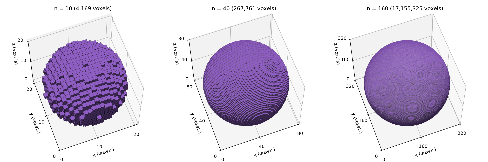

Figure: The segmentations for $n = 10$ (left), $n = 40$ (middle), and
$n = 160$ (right), in voxel units.  The figure is produced by
[`unit_sphere_figures.py`](#unit_sphere_figurespy).

## Marching Cubes

Marching cubes turns a grid of values into a triangulated surface at one
level of those values.  The script
[`unit_sphere_marching_cubes.py`](#unit_sphere_marching_cubespy) wraps the
implementation in [scikit-image](https://scikit-image.org),
`skimage.measure.marching_cubes`, with the method of Lewiner
*et al.*[^Lewiner2003]  For each segmentation, the script

1. pads the segmentation by one voxel of zeros, so the surface closes,
2. runs marching cubes at level `0.5`, halfway between outside (`0`) and
   inside (`1`),
3. reverses each face, so every triangle winds outward (see
   [Pitfalls](#pitfalls)),
4. translates and scales the vertices to a unit sphere (see
   [Transform](#transform)), and
5. writes a binary STL.

```sh
uv run --with numpy --with scikit-image unit_sphere_marching_cubes.py
```

It then checks each surface.  $v$, $e$, and $f$ count the vertices, edges,
and faces.  The volume is the signed volume that the faces enclose.  The
error compares that volume with the exact volume $4\pi/3 \approx 4.1888$.

| $n$ | $v$ | $e$ | $f$ | volume | error |
| ---: | ---: | ---: | ---: | ---: | ---: |
| 10 | 1,902 | 5,700 | 3,800 | 4.1478 | −0.98% |
| 20 | 7,542 | 22,620 | 15,080 | 4.1699 | −0.45% |
| 40 | 30,150 | 90,444 | 60,296 | 4.1825 | −0.15% |
| 80 | 120,486 | 361,452 | 240,968 | 4.1865 | −0.06% |
| 160 | 482,286 | 1,446,852 | 964,568 | 4.1882 | −0.01% |

The volume created from marching cubes
underestimates the true $4\pi/3$ value at every $n$ in the table.  The surface
also encloses less volume than the voxels it came from.  This pattern
holds at every $n$ from 4 to 160.  Marching cubes cuts each corner of the
voxel staircase with a flat triangle, and every cut removes a small
volume.

The script also runs five surface integrity checks.  All five surfaces give
the same result on every check.

* **Closed.**  No edge is open.  An open edge belongs to one face only.
* **Manifold.**  No edge is pinched.  A pinched edge belongs to more than two
  faces.
* **Oriented.**  No two faces traverse the same edge in the same direction.
* **Connected.**  The surface is one piece.
* **Euler characteristic.**  $\chi = v - e + f = 2$.

For a closed, connected, orientable surface, $\chi = 2 - 2g$, where $g$ is
the genus, the number of handles.  Here $\chi = 2$, so $g = 0$, and each
surface is topologically a sphere.

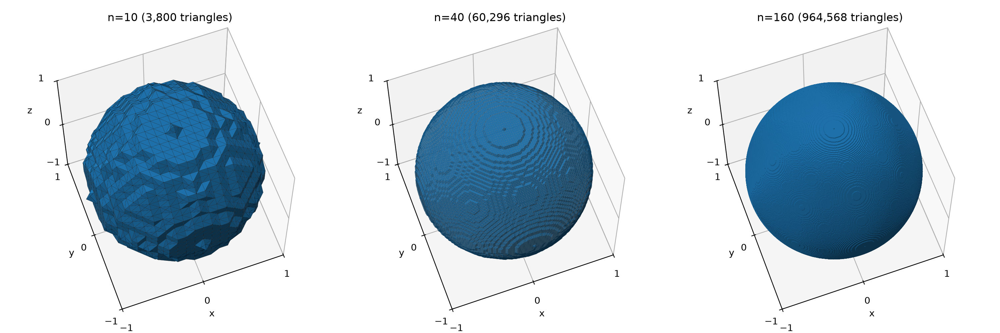

Figure: The marching cubes surfaces for $n = 10$ (left), $n = 40$ (middle),
and $n = 160$ (right), scaled to the unit sphere.  
A binary mask places every vertex at the
midpoint of a cube edge, so the surface cannot round off the steps.  The
steps shrink as $n$ grows, but the rings around each pole remain visible
even at $n = 160$.  The figure is produced by
[`unit_sphere_figures.py`](#unit_sphere_figurespy).

### Convergence


The script
[`unit_sphere_figures.py`](#unit_sphere_figurespy) also computes both
volumes at every $n$ from 4 to 160, 157 values in all.

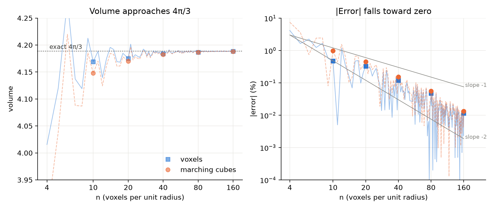

Figure: The volume (left) and the magnitude of its error (right) against
$n$, for the voxels and for the marching cubes surface.  Thin lines connect
every $n$ from 4 to 160.  Markers show the five values of $n$ in the tables.
On the left, the dotted line marks the exact volume $4\pi/3$, and a few
values at $n \le 7$ fall off the scale.  On the right, the gray guides have
slopes of −1 and −2.

Both volumes settle onto $4\pi/3$, but neither settles smoothly.  The **voxel
error** changes sign 46 times, and 25 of the 157 voxel volumes exceed
$4\pi/3$.  The **marching cubes error** changes sign 24 times, and 12 of its
volumes exceed $4\pi/3$.  The five values in the tables just happened to fall
short.

Under the oscillation, both errors fall toward zero.  A least-squares fit of
$\log|\text{error}|$ against $\log n$ gives a slope of −1.71 for the voxels
and −1.76 for marching cubes.  Both lie between the two guides.  The
marching cubes volume stays below the voxel volume at all 157 values.

### Why Lewiner?

Lorensen and Cline introduced marching cubes in 1987.[^Lorensen1987]  Their
method visits each cube of eight neighboring samples.  It classifies each
corner as inside or outside, which gives 256 cases.  Symmetry reduces those
to 15 base cases, and each base case has one fixed triangulation.

Some cases are ambiguous.  On a face with two inside corners on one
diagonal and two outside corners on the other, the corners alone cannot say
whether the inside corners connect across the face.  An interior ambiguity
arises the same way inside a cube.  A fixed table picks one answer without
looking at the data.  Neighboring cubes can then disagree, and the surface
can take the wrong topology.

Chernyaev extended the table to 33 cases.[^Chernyaev1995]  His table
resolves each ambiguity with the trilinear interpolant of the eight corner
values, the smooth function the samples define inside the cube.  Lewiner
*et al.* gave an efficient and complete implementation of that
table.[^Lewiner2003]
[scikit-image](https://scikit-image.org/docs/stable/api/skimage.measure.html#skimage.measure.marching_cubes)
uses the Lewiner method by default.[^skimage]

The list below separates what the Lewiner method adds from what the
scikit-image implementation gives either method.  Each item says where the
evidence comes from.

**What the Lewiner method adds**

1. **Topology that matches the data.**  The 33-case table resolves face and
   interior ambiguities with the trilinear interpolant.  The surface then
   has the topology of the interpolant's level set, so neighboring cubes
   always agree.  *From the paper.*[^Lewiner2003]

**What the scikit-image implementation gives either method**

2. **Watertight.**  No edge is open, at any $n$.  The one-voxel pad keeps
   the surface closed where the sphere touches the edge of the grid.
   *Measured here.*
3. **Manifold.**  Every edge belongs to exactly two faces, at any $n$.
   *Measured here.*
4. **Consistently oriented.**  No two faces traverse an edge in the same
   direction, and the signed volume is positive once the faces are reversed.
   *Measured here.*
5. **An indexed mesh.**  The output is an array of vertices and an array of
   faces that index into it.  Neighboring triangles share vertices, so the
   mesh needs no welding.  *From the API.*
6. **Normals and values.**  The call also returns a normal at each vertex,
   from the gradient of the data, and the data value there.  *From the API.*

For the unit sphere the two methods agree.  At every $n$ they return the
same triangles, and they take the same time.  The time below is the fastest
of five runs, on the machine that built this page.

| $n$ | Lewiner (ms) | Lorensen (ms) | same triangles |
| ---: | ---: | ---: | :---: |
| 10 | 0.49 | 0.49 | yes |
| 20 | 1.99 | 2.03 | yes |
| 40 | 9.19 | 9.41 | yes |
| 80 | 48.10 | 49.52 | yes |
| 160 | 285.98 | 296.59 | yes |

The sphere reaches no ambiguous case, so the Lewiner method has nothing to
resolve.  On data that do reach such cases, the two methods can return
surfaces of different topology.  Newman and Yi illustrate each ambiguous
case and survey the methods that resolve them.[^Newman2006]

### Pitfalls

1. **Winding.**  scikit-image returns vertices in array-axis order.  The
   segmentation has axes $(x, y, z)$, so the vertices come back as
   $(x, y, z)$ too.  With the default `gradient_direction="descent"`, the
   returned normals point outward, but every triangle winds inward.  The
   signed volume is then negative.  The script reverses each face, which
   makes the winding agree with the normals.
2. **Exact ties on a binary mask.**  On a mask of 0 and 1, level 0.5 is
   exactly the saddle value of an ambiguous face.  The Lewiner method can
   then pinch an edge between four faces.  A level slightly off 0.5, such
   as 0.49, avoids the tie.  The unit sphere has no pinched edge at any
   $n$, so this page keeps level 0.5.

## Transform

Marching cubes returns vertices in voxel units.  After the one-voxel pad, the
sphere center sits at $(n+1, n+1, n+1)$.  Two operations map the surface to a
unit sphere at the origin.

1. **Translate** by $-(n+1)$.  The shift is a whole number of voxels, so it
   is exact.
2. **Scale** by $1/n$.

`automesh` applies the same two operations in the other order.  Its
`--xscale` and `--xtranslate` options scale first and translate second.  The
same map in the `automesh` order scales by $1/n$ and then translates by
$-(n+1)/n$.  Both orders give the same coordinates.

The vertex radii show how close the surface comes to the unit sphere.  The
coefficient of variation, CoV $= \text{std} / \text{mean}$, measures how
much the radii spread.  A perfect sphere has CoV $= 0$.

| $n$ | $r$ min | $r$ max | $r$ mean | $r$ CoV |
| ---: | ---: | ---: | ---: | ---: |
| 10 | 0.9552 | 1.0500 | 0.9993 | 2.15% |
| 20 | 0.9763 | 1.0250 | 0.9991 | 1.01% |
| 40 | 0.9878 | 1.0125 | 0.9996 | 0.51% |
| 80 | 0.9938 | 1.0063 | 0.9999 | 0.26% |
| 160 | 0.9969 | 1.0031 | 1.0000 | 0.13% |

The mean radius stays within 0.1% of 1 at every $n$, so a scale of $1/n$
leaves no bias.  The largest radius is always $1 + 0.5/n$, at the six poles.
There a vertex sits halfway between the last inside voxel, at radius $n$, and
the first outside voxel, at radius $n + 1$.

The CoV halves each time $n$ doubles, so the spread of the radii falls as
$1/n$.  That is first order, slower than the volume error in
[Convergence](#convergence).  The volume averages over the whole surface, and
the staircase steps partly cancel in that average.  The radius spread sees
every step.

## Surface Comparison

### Hausdorff Distance

The [Hausdorff distance](https://mathworld.wolfram.com/HausdorffDistance.html)
between two surfaces is the farthest that any point
of either one lies from the other.  For a surface $M$ and the unit sphere
$S$,

$$
d_H(M, S) = \max \left\{ \sup_{p \in M} d(p, S), \; \sup_{q \in S} d(q, M) \right\}.
$$

The script [`unit_sphere_comparison.py`](#unit_sphere_comparisonpy) computes the
first term exactly.  A point $p$ lies $d(p, S) = \big| |p| - 1 \big|$ from
the unit sphere.  Over a triangle, $|p|$ is convex.  Its largest value sits at
a vertex, and its smallest sits at the point of the triangle closest to the
origin.[^Ericson2005]  The largest $|p| - 1$ over all triangles gives the
outward distance.  The largest $1 - |p|$ gives the inward distance.

The second term needs no computation.  Each surface is closed and encloses
the origin.  The ray from the origin through a sphere point $q$ therefore
crosses $M$ at some point $p$.  Then
$d(q, M) \le |q - p| = \big| |p| - 1 \big| \le \sup_{p \in M} d(p, S)$.
The second term never exceeds the first, so the Hausdorff distance is the
larger of the outward and inward distances.

```sh
uv run --with numpy unit_sphere_comparison.py
```

| $n$ | $f$ | outward | inward | $d_H$ | $n \, d_H$ |
| ---: | ---: | ---: | ---: | ---: | ---: |
| 10 | 3,800 | 0.05000 | 0.04737 | 0.05000 | 0.500 |
| 20 | 15,080 | 0.02500 | 0.02436 | 0.02500 | 0.500 |
| 40 | 60,296 | 0.01250 | 0.01234 | 0.01250 | 0.500 |
| 80 | 240,968 | 0.00625 | 0.00621 | 0.00625 | 0.500 |
| 160 | 964,568 | 0.00312 | 0.00312 | 0.00312 | 0.500 |

The Hausdorff distance is exactly $0.5/n$ at every $n$, half a voxel.  The
outward distance sets it, at the six poles (see [Transform](#transform)).
The inward distance approaches it from below.  The Hausdorff distance falls
as $1/n$, first order, like the radius CoV.  The triangle count $f$ grows as
$n^2$, so in terms of triangles the distance falls only as $f^{-1/2}$.

### Surface Area

The volume converges, as the [Convergence](#convergence) section shows.  The
surface area does not converge.  The script
[`unit_sphere_comparison.py`](#unit_sphere_comparisonpy) adds up the areas of
the marching cubes triangles.  The error compares that area with the exact
area $4\pi \approx 12.5664$.

| $n$ | area | error |
| ---: | ---: | ---: |
| 10 | 13.7204 | +9.18% |
| 20 | 13.6324 | +8.48% |
| 40 | 13.6566 | +8.68% |
| 80 | 13.6608 | +8.71% |
| 160 | 13.6673 | +8.76% |

The voxel staircase itself would overstate the area by 50% at any $n$.
Marching cubes cuts the voxel staircase corners, which removes most of that excess.
Howver, the surface area
still settles near 8.8% too large.

Smaller voxels make smaller steps, but
the triangles keep the same few orientations relative to the true surface.
So the Hausdorff distance falls to zero while the area error does not.  A
surface can come arbitrarily close to the sphere and still have the wrong
area.

### Triangle Quality

The script [`unit_sphere_comparison.py`](#unit_sphere_comparisonpy) also runs
`automesh metrics` on each surface.  The
[Triangular Metrics](../../../theory/metrics_triangular.md) page defines its
measures.

A binary mask puts every vertex at the midpoint of a cube edge.  So marching
cubes can make only a few triangle shapes.  Grouped by maximum edge ratio and
minimum scaled Jacobian, the triangular surfaces created by marching cubes
produce exactly **five shapes**.  The table gives the fraction of triangles
of each shape.

| shape | angles | edge ratio | scaled Jacobian | $n = 10$ | $n = 20$ | $n = 40$ | $n = 80$ | $n = 160$ |
| :--- | :---: | ---: | ---: | ---: | ---: | ---: | ---: | ---: |
| equilateral | 60°, 60°, 60° | 1.000 | 1.000 | 14.74% | 14.80% | 14.30% | 13.99% | 13.98% |
| right isosceles | 45°, 45°, 90° | 1.414 | 0.816 | 24.63% | 25.15% | 25.04% | 24.92% | 24.85% |
| right | 35.26°, 54.74°, 90° | 1.732 | 0.667 | 31.58% | 30.56% | 32.08% | 33.13% | 33.20% |
| obtuse isosceles | 30°, 30°, 120° | 1.732 | 0.577 | 14.53% | 14.75% | 14.29% | 13.98% | 13.98% |
| 30-60-90 | 30°, 60°, 90° | 2.000 | 0.577 | 14.53% | 14.75% | 14.29% | 13.98% | 13.98% |

**Refinement does not change the quality.**  The same five shapes appear at every
$n$, in nearly the same proportions.  More than a quarter of the triangles
have the worst scaled Jacobian, $1/\sqrt{3} \approx 0.577$, with a smallest
angle of 30°.  No triangle is worse.

**Smaller voxels shrink the triangles but
never reshape them.**  A histogram of any measure would show only these five
spikes, so the table is shown instead of a histogram.

## Mesh

This section meshes the marching cubes surfaces with hexahedra.  Sculpt, the
mesher the Subdivision page uses, serves as the baseline, and `automesh`
meshes the same surfaces at the same cell size for comparison.

### Sculpt

The Subdivision page meshes its Octa-Loop spheres with
[Sculpt](../../../theory/subdivision.md#sculpt-baseline).  At levels 3 to 7,
it reports a grid of 26×26×26 cells, 7,731 nodes, and 6,672 elements.  Here
Sculpt meshes the marching cubes surfaces on the same grid instead.

The baseline runs Sculpt through Cubit's `sculpt parallel` command, which
chooses the grid itself.  For Octa-Loop level 3, Cubit places 26 cells in each
direction across a box of $\pm 1.240409$, a cell size of about 0.0954.
Standalone Sculpt with those options reproduces the baseline exactly, at 7,731
nodes and 6,672 elements.  The same options mesh each marching cubes surface.

```sh
B=1.240409
GRID="-x 26 -y 26 -z 26 -t -$B -u -$B -v -$B -q $B -r $B -s $B -SS 2"
# octa_loop03.stl downloads from the Refinement table of the Subdivision page
sculpt -j 1 -stl octa_loop03.stl $GRID -e unit_sphere_sculpt_octa03
for n in 010 020 040 080 160; do
  sculpt -j 1 -stl unit_sphere_mc_n$n.stl $GRID -e unit_sphere_sculpt_n$n
done
```

The quality is the minimum scaled Jacobian, as Sculpt reports it.

| input | nodes | elements | minimum quality | mean quality |
| :--- | ---: | ---: | ---: | ---: |
| [Octa-Loop level 3](../../../theory/subdivision.md#refinement) (baseline) | 7,731 | 6,672 | 0.343 | 0.888 |
| marching cubes, $n = 10$ | 8,007 | 6,912 | 0.388 | 0.885 |
| marching cubes, $n = 20$ | 7,827 | 6,768 | 0.404 | 0.900 |
| marching cubes, $n = 40$ | 7,827 | 6,768 | 0.420 | 0.902 |
| marching cubes, $n = 80$ | 7,827 | 6,768 | 0.401 | 0.901 |
| marching cubes, $n = 160$ | 7,827 | 6,768 | 0.427 | 0.901 |

From $n = 20$ on, every surface gives the same 7,827 nodes and 6,768
elements, 96 more of each than the baseline, or about 1.4%.  The worst
element is better than the baseline's at every $n$.

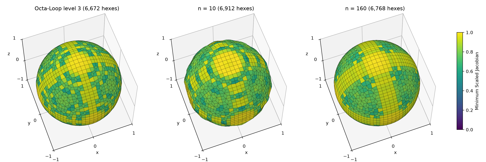

Figure: The Sculpt meshes of Octa-Loop level 3 (left), the marching cubes
surface for $n = 10$ (middle), and for $n = 160$ (right), on the same grid.
Each element is painted by its Minimum Scaled Jacobian, on a fixed scale from
0 to 1.  In all three, the best elements form bands of regular hexes, and the
worst sit where those bands meet.  The figure is produced by
[`unit_sphere_figures.py`](#unit_sphere_figurespy).

The difference between the middle and right panels comes from the size of a
voxel step against the size of a Sculpt cell, about 0.095.

* At $n = 10$, a voxel is 0.1 wide, so each voxel step is about as large as a
  Sculpt cell.  The mesh boundary follows the steps, and the sphere looks
  lumpy.
* At $n = 160$, a voxel is 0.00625 wide, so a Sculpt cell spans about 15
  voxels.  The steps are far smaller than the elements, and the mesh looks
  like the baseline.
* From $n = 20$ on, where a cell spans about two voxels or more, the mesh
  stops changing: 7,827 nodes and 6,768 elements at every $n$.
* Even at $n = 10$, the steps do not lower the quality.  The worst element,
  at 0.388, is better than the baseline's 0.343.

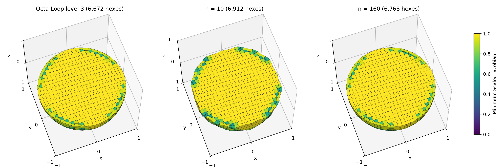

Figure: A cut through the middle of the same three meshes, at $z = 0$, on
the same 0 to 1 scale.  Only the elements whose centers lie below the plane
are drawn.  The Sculpt grid has a cell boundary at $z = 0$, so the interior
of the cut is flat.  Near the surface, smoothing moves some nodes off the
plane, and a few elements cross it: 72, 60, and 48 from left to right.  The
interior is a regular grid of elements near 1.0.  The low values form a ring
one element deep at the boundary.  The figure is produced by
[`unit_sphere_figures.py`](#unit_sphere_figurespy).

Left to choose its own grid, Cubit sizes the cells to the small
marching cubes facets.  For $n = 40$ it picks 73×73×73 cells and makes
180,201 elements.  Fixing the grid keeps the meshes comparable with the
baseline.

The run used Sculpt 16.08, from Cubit 16.08.  For the baseline mesh,
`automesh metrics` gives the same minimum (0.343) and mean (0.888) as Sculpt.
`automesh` 0.4.7 cannot yet read Sculpt's Exodus files.  Its Exodus reader
rejects the NUL-terminated element type that Sculpt writes, a bug that is
fixed upstream but not yet released.[^conspire178]  So the script
[`unit_sphere_mesh.py`](#unit_sphere_meshpy) first rewrites each Sculpt mesh
as an Abaqus `.inp` file, which `automesh` reads.  Exodus and Abaqus number
the eight nodes of a hex the same way, so the rewrite keeps every element
intact.

### `automesh`

The script [`unit_sphere_mesh.py`](#unit_sphere_meshpy) meshes each
marching cubes surface with `automesh mesh hex` in two ways.  The uniform
lattice uses the Sculpt cell size, $2 \times 1.240409 / 26 \approx 0.095416$.
The adaptive octree uses the default scale (`-s 5`).  The script then runs
`automesh metrics` on every mesh, Sculpt's included.

```sh
uv run --with numpy --with scipy unit_sphere_mesh.py
```

For one surface, the two `automesh` commands are

```sh
automesh mesh hex -i unit_sphere_mc_n160.stl -o unit_sphere_uniform_n160.inp \
  -u 0.095416 --metrics unit_sphere_uniform_n160.csv
automesh mesh hex -i unit_sphere_mc_n160.stl -o unit_sphere_octree_n160.inp \
  --metrics unit_sphere_octree_n160.csv
```

The table gives the element count and the worst and mean Minimum Scaled
Jacobian (MSJ) of each mesh.  The section shows the `automesh` meshes twice.
The first set comes from `conspire` 0.7.7.  The second set comes from
`conspire` with the tie fix of
[#222](https://github.com/mrbuche/conspire.rs/pull/222).  The shape diameter
fix ([#221](https://github.com/mrbuche/conspire.rs/pull/221)) and the mirror
symmetry fix ([#225](https://github.com/mrbuche/conspire.rs/pull/225)) change
none of these meshes.

**Before the fix (`conspire` 0.7.7).**

<table>
<thead>
<tr><th rowspan="2" style="text-align:right">$n$</th>
<th colspan="2" style="text-align:center">Sculpt</th>
<th colspan="2" style="text-align:center">automesh uniform</th>
<th colspan="2" style="text-align:center">automesh octree</th></tr>
<tr><th style="text-align:right">elements</th><th style="text-align:center">MSJ min / mean</th><th style="text-align:right">elements</th><th style="text-align:center">MSJ min / mean</th><th style="text-align:right">elements</th><th style="text-align:center">MSJ min / mean</th></tr>
</thead>
<tbody>
<tr><td style="text-align:right">10</td><td style="text-align:right">6,912</td><td style="text-align:center">0.388 / 0.885</td><td style="text-align:right">6,024</td><td style="text-align:center">0.154 / 0.830</td><td style="text-align:right">8,243</td><td style="text-align:center">0.088 / 0.695</td></tr>
<tr><td style="text-align:right">20</td><td style="text-align:right">6,768</td><td style="text-align:center">0.404 / 0.900</td><td style="text-align:right">5,984</td><td style="text-align:center">0.097 / 0.838</td><td style="text-align:right">9,983</td><td style="text-align:center">0.102 / 0.711</td></tr>
<tr><td style="text-align:right">40</td><td style="text-align:right">6,768</td><td style="text-align:center">0.420 / 0.902</td><td style="text-align:right">5,840</td><td style="text-align:center">0.119 / 0.838</td><td style="text-align:right">14,767</td><td style="text-align:center">0.032 / 0.742</td></tr>
<tr><td style="text-align:right">80</td><td style="text-align:right">6,768</td><td style="text-align:center">0.401 / 0.901</td><td style="text-align:right">5,825</td><td style="text-align:center">0.126 / 0.827</td><td style="text-align:right">15,223</td><td style="text-align:center">0.010 / 0.754</td></tr>
<tr><td style="text-align:right">160</td><td style="text-align:right">6,768</td><td style="text-align:center">0.427 / 0.901</td><td style="text-align:right">5,789</td><td style="text-align:center">0.102 / 0.825</td><td style="text-align:right">25,815</td><td style="text-align:center">−0.792 / 0.755</td></tr>
</tbody>
</table>

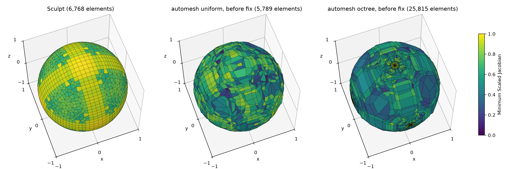

Figure: The three meshes of the $n = 160$ surface, before the fix: Sculpt
(left), the `automesh` uniform lattice (middle), and the `automesh` adaptive
octree (right).  Each element is painted by its Minimum Scaled Jacobian, on
the same 0 to 1 scale as the Sculpt figures.  Sculpt's boundary elements form
regular bands.  The lattice's boundary elements are irregular, with dark
patches of low quality.  The octree's boundary elements are large and coarse,
except in dense clusters of small elements.  The figure is produced by
[`unit_sphere_figures.py`](#unit_sphere_figurespy).

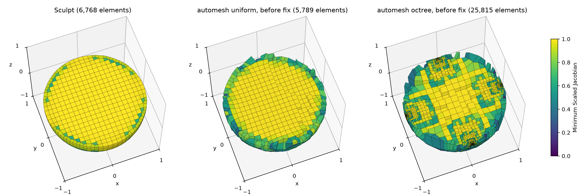

Figure: A cut through the middle of the same three meshes, at $z = 0$.  Only
the elements whose centers lie below the plane are drawn.  All three have an
interior of elements near 1.0.  Sculpt's low values form a thin ring one
element deep.  The lattice's ring is thicker and more ragged, with the darkest
elements at the boundary.  The octree grades from large interior cells to
small ones, and it refines most where the sphere meets the coordinate axes.
The figure is produced by [`unit_sphere_figures.py`](#unit_sphere_figurespy).

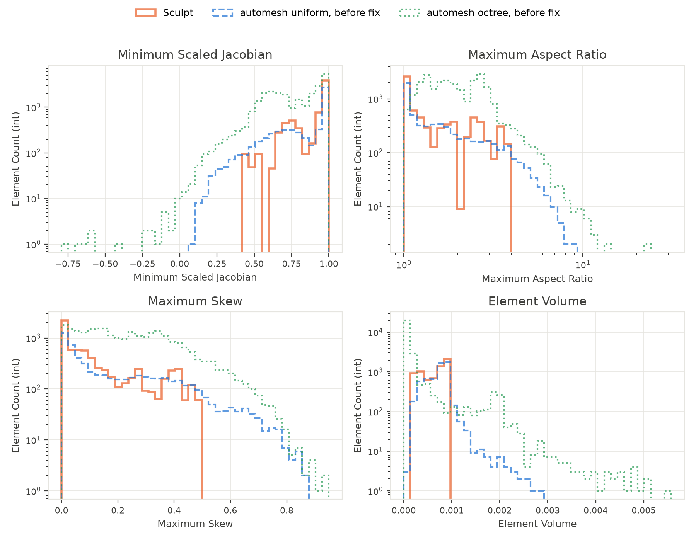

Figure: Element quality of the three meshes of the $n = 160$ surface, before
the fix: Sculpt (solid, orange), the `automesh` uniform lattice (dashed,
blue), and the `automesh` adaptive octree (dotted, green).  Each panel is a
histogram with a log scale on the count.  The octree's tail below zero holds
its 23 inverted elements.  The figure is produced by
[`unit_sphere_figures.py`](#unit_sphere_figurespy).

Sculpt makes the better mesh at every $n$.  Its worst element stays between
0.39 and 0.43, and its mean is 0.90.  The uniform lattice, at the same cell
size, makes 12% to 15% fewer elements.  Its mean is 0.83, and a thin tail
reaches down to 0.10.  Its aspect ratio reaches 9 to 13, where Sculpt stays
below 5.

The adaptive octree does worse than the lattice.  It refines toward the small
marching cubes facets, so its element count grows with $n$, from 8,243 to
25,815.  Its mean stays between 0.70 and 0.76, below the lattice's.  Its
worst element drops sharply from $n = 40$ on, to 0.032 and then 0.010.  At
$n = 160$, 23 elements are inverted, and the worst has a Minimum Scaled
Jacobian of −0.792.  None are inverted at $n = 10$ to 80.

**After the fix.**

The after-fix meshes use `conspire` with the tie fix of
[#222](https://github.com/mrbuche/conspire.rs/pull/222).  They have the same
element counts as the before-fix meshes, because the fix does not touch the
background meshes.  It changes how the fit pulls the new boundary layer onto
the surface.

<table>
<thead>
<tr><th rowspan="2" style="text-align:right">$n$</th>
<th colspan="2" style="text-align:center">Sculpt</th>
<th colspan="2" style="text-align:center">automesh uniform</th>
<th colspan="2" style="text-align:center">automesh octree</th></tr>
<tr><th style="text-align:right">elements</th><th style="text-align:center">MSJ min / mean</th><th style="text-align:right">elements</th><th style="text-align:center">MSJ min / mean</th><th style="text-align:right">elements</th><th style="text-align:center">MSJ min / mean</th></tr>
</thead>
<tbody>
<tr><td style="text-align:right">10</td><td style="text-align:right">6,912</td><td style="text-align:center">0.388 / 0.885</td><td style="text-align:right">6,024</td><td style="text-align:center">0.161 / 0.827</td><td style="text-align:right">8,243</td><td style="text-align:center">0.114 / 0.693</td></tr>
<tr><td style="text-align:right">20</td><td style="text-align:right">6,768</td><td style="text-align:center">0.404 / 0.900</td><td style="text-align:right">5,984</td><td style="text-align:center">0.123 / 0.840</td><td style="text-align:right">9,983</td><td style="text-align:center">0.027 / 0.708</td></tr>
<tr><td style="text-align:right">40</td><td style="text-align:right">6,768</td><td style="text-align:center">0.420 / 0.902</td><td style="text-align:right">5,840</td><td style="text-align:center">0.130 / 0.836</td><td style="text-align:right">14,767</td><td style="text-align:center">0.039 / 0.740</td></tr>
<tr><td style="text-align:right">80</td><td style="text-align:right">6,768</td><td style="text-align:center">0.401 / 0.901</td><td style="text-align:right">5,825</td><td style="text-align:center">0.126 / 0.824</td><td style="text-align:right">15,223</td><td style="text-align:center">0.007 / 0.754</td></tr>
<tr><td style="text-align:right">160</td><td style="text-align:right">6,768</td><td style="text-align:center">0.427 / 0.901</td><td style="text-align:right">5,789</td><td style="text-align:center">0.100 / 0.819</td><td style="text-align:right">25,815</td><td style="text-align:center">−0.959 / 0.760</td></tr>
</tbody>
</table>

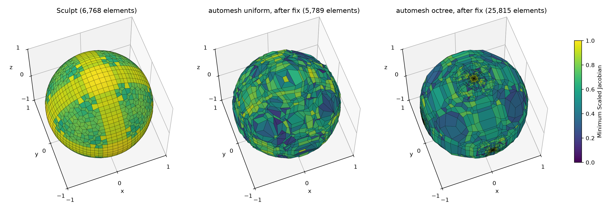

Figure: The same three meshes after the fix.  Sculpt (left) is unchanged.  The
`automesh` uniform lattice (middle) and adaptive octree (right) look much as
before.  The lattice's boundary elements are still irregular, with dark
patches of low quality.  The octree's boundary elements are still large and
coarse, except in the same dense clusters of small elements.  The differences
are in the numbers of the table.  The figure is produced by
[`unit_sphere_figures.py`](#unit_sphere_figurespy).

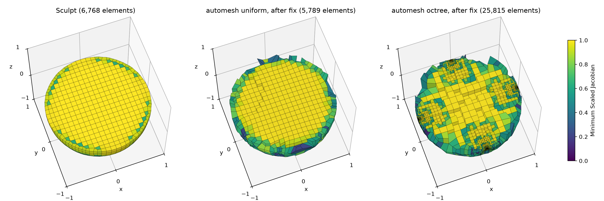

Figure: A cut through the middle of the same three meshes after the fix, at $z
= 0$, on the same scale as the before-fix cut.  The figure is produced by
[`unit_sphere_figures.py`](#unit_sphere_figurespy).

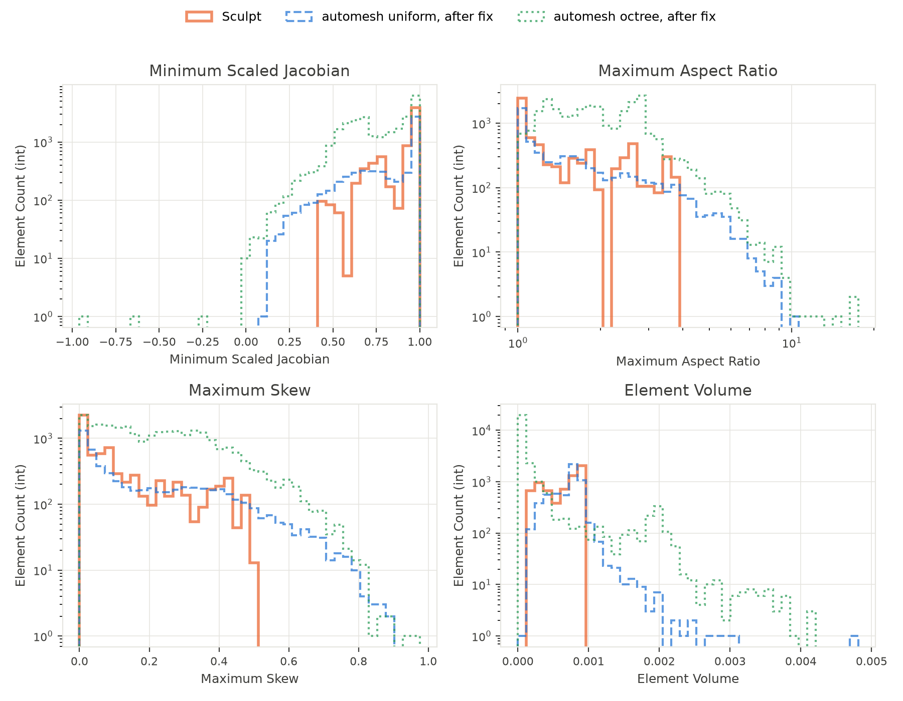

Figure: Element quality of the same three meshes after the fix, in the same
styles and scales as the before-fix figure.  The octree's tail below zero now
holds 6 inverted elements, where it held 23.  The figure is produced by
[`unit_sphere_figures.py`](#unit_sphere_figurespy).

The ranking does not change.  Sculpt still makes the better mesh at every $n$,
and the octree still does worse than the lattice.  The fix does not make the
`automesh` meshes better as a group.  It moves the worst elements around.

The lattice keeps its element counts, 6,024 to 5,789.  Its worst element goes
from 0.154, 0.097, 0.119, 0.126, and 0.102 to 0.161, 0.123, 0.130, 0.126, and
0.100.  That is higher at $n = 10$ to 40, equal at $n = 80$, and lower by
0.002 at $n = 160$.  Its mean stays within 0.006 of the before-fix mean.  Its
aspect ratio reaches 9.8 to 11.8, against 9.3 to 13.1 before.

The octree keeps its element counts, 8,243 to 25,815.  Its worst element goes
from 0.088, 0.102, 0.032, 0.010, and −0.792 to 0.114, 0.027, 0.039, 0.007, and
−0.959.  That is higher at $n = 10$ and 40, and lower at $n = 20$, 80, and
160.  At $n = 160$, 6 elements are inverted, against 23 before, and the worst
has a Minimum Scaled Jacobian of −0.959.  None are inverted at $n = 10$ to 80.
Its mean stays between 0.69 and 0.76, within 0.005 of the before-fix mean.
Its largest aspect ratio rises from 14.0 to 44.0 at $n = 80$ and falls from
31.1 to 17.5 at $n = 160$.

The tie fix changes the targets that pull the boundary layer onto the surface.
A marching cubes surface has many closest points on shared edges and vertices,
so its targets change, and the optimizer takes a different path.  A different
path gives a different worst element, in either direction.  The element counts
do not change, because the octree does not.

**Before and after.**

| $n$ | mesher | elements | MSJ min | MSJ mean | inverted | max edge ratio |
| ---: | :--- | ---: | ---: | ---: | ---: | ---: |
| 10 | uniform | 6,024 | 0.154 → 0.161 | 0.830 → 0.827 | 0 → 0 | 12.70 → 11.80 |
| 20 | uniform | 5,984 | 0.097 → 0.123 | 0.838 → 0.840 | 0 → 0 | 13.06 → 9.75 |
| 40 | uniform | 5,840 | 0.119 → 0.130 | 0.838 → 0.836 | 0 → 0 | 9.89 → 9.83 |
| 80 | uniform | 5,825 | 0.126 → 0.126 | 0.827 → 0.824 | 0 → 0 | 9.46 → 10.78 |
| 160 | uniform | 5,789 | 0.102 → 0.100 | 0.825 → 0.819 | 0 → 0 | 9.32 → 9.93 |
| 10 | octree | 8,243 | 0.088 → 0.114 | 0.695 → 0.693 | 0 → 0 | 17.75 → 12.76 |
| 20 | octree | 9,983 | 0.102 → 0.027 | 0.711 → 0.708 | 0 → 0 | 12.71 → 11.69 |
| 40 | octree | 14,767 | 0.032 → 0.039 | 0.742 → 0.740 | 0 → 0 | 11.11 → 8.67 |
| 80 | octree | 15,223 | 0.010 → 0.007 | 0.754 → 0.754 | 0 → 0 | 13.97 → 43.95 |
| 160 | octree | 25,815 | −0.792 → −0.959 | 0.755 → 0.760 | 23 → 6 | 31.11 → 17.49 |

### Control Study

Does the octree's poor quality come from `automesh` reading the
marching cubes staircase as full of sharp features, and over-refining toward
them?

`automesh mesh hex`'s adaptive octree combines two refinement signals:

1. **curvature-driven sizing**, gated by a chord-error tolerance
   (`--tolerance`, disabled by default), and
2. **local-thickness sizing**, from the shape diameter function of
   Shapira, Shamir, and Cohen-Or.[^Shapira2008]

Neither [`unit_sphere_mesh.py`](#unit_sphere_meshpy) nor the Sculpt
comparison passes `--tolerance`, so curvature-driven sizing never activates
on this page.  **Local thickness alone** (not curvature) sets the octree's
refinement target.

The shape diameter function estimates local thickness by casting a cone of
rays inward from each face and measuring the distance to the far side of the
surface.  On a smooth convex shape that distance stays close to the diameter
everywhere.  On a voxel staircase, a ray from one step's riser can reach the
next step over instead of crossing the sphere, *so the function can report a
**locally small thicknes** right at the steps* — the same steps where the
octree refines most (see [`automesh`](#automesh) above).

The control study tests that.  The mesh a smooth surface with the same octree (default
scale, no tolerance), and see whether it needs the same refinement, or
inverts any element.  The script
[`unit_sphere_mesh.py`](#unit_sphere_meshpy) meshes two Octa-Loop surfaces
from the [Subdivision](../../../theory/subdivision.md#refinement) page:
level 3, the 512-facet surface already used for the Sculpt baseline, and
level 7, the finest available, at 131,072 facets — close to the facet size
of the $n = 160$ marching cubes surface, so the comparison is not simply
coarse against fine.

```sh
automesh mesh hex -i octa_loop03.stl -o unit_sphere_control_loop03.inp \
  --metrics unit_sphere_control_loop03.csv
automesh mesh hex -i octa_loop07.stl -o unit_sphere_control_loop07.inp \
  --metrics unit_sphere_control_loop07.csv
```

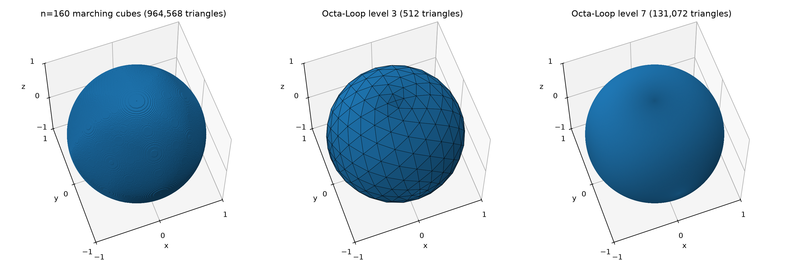

Figure: The three input surfaces of the control study: the $n = 160$
marching cubes surface (left, 964,568 triangles), Octa-Loop level 3 (center,
512 triangles), and Octa-Loop level 7 (right, 131,072 triangles).  The
marching cubes triangles are too small to resolve at this size.  The voxel
staircase shows as concentric terrace rings around the top pole.  Octa-Loop
level 3 shows its 512 flat facets.  Octa-Loop level 7 looks smooth.  The
figure is produced by [`unit_sphere_figures.py`](#unit_sphere_figurespy).

| surface | `conspire` | facets | facet edge (mean) | elements | MSJ min | MSJ mean |
| :--- | :--- | ---: | ---: | ---: | ---: | ---: |
| marching cubes, $n = 160$ | 0.7.7 | 964,568 | 0.00616 | 25,815 | −0.792 | 0.755 |
| Octa-Loop level 3, before fix | 0.7.7 | 512 | 0.23492 | 111 | 0.384 | 0.749 |
| Octa-Loop level 3, after fix | fix | 512 | 0.23492 | 111 | 0.534 | 0.767 |
| Octa-Loop level 7, before fix | 0.7.7 | 131,072 | 0.01473 | 1,415 | 0.439 | 0.816 |
| Octa-Loop level 7, after fix | fix | 131,072 | 0.01473 | 111 | 0.548 | 0.774 |

The before-fix rows and figures come from `conspire` 0.7.7.  The after-fix
rows and figures come from a build of `conspire` with the fixes of
[Update 2](#update-2-2026-09-30) and [Update 4](#update-4-2026-09-30), which
are not yet released.  The marching cubes mesh comes from 0.7.7 in both sets.
See [Update 3](#update-3-2026-09-30).  Level 7 changes again in Update 4, from
1,415 elements to 111.

**Before the fix (`conspire` 0.7.7).**

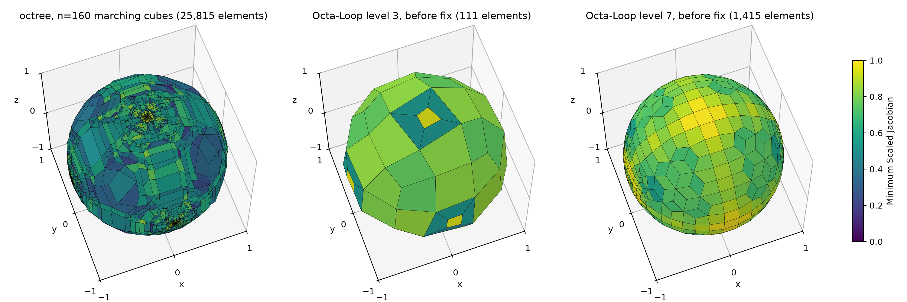

Figure: The three `automesh` octree meshes shown with the element minimum
scaled Jacobian, before the fix.  The $n = 160$ marching cubes surface (left),
Octa-Loop level 3 (center), and Octa-Loop level 7 (right).  The marching cubes
mesh has several small dark clusters of poor elements; neither control does.
The Octa-Loop level 3 mesh is not symmetric across the coordinate planes.  The
figure is produced by [`unit_sphere_figures.py`](#unit_sphere_figurespy).

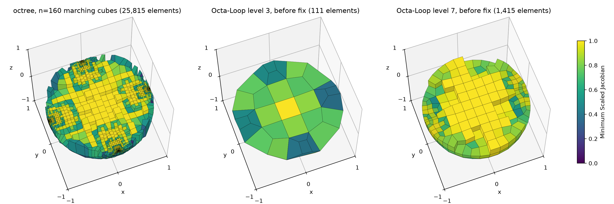

Figure: A cut through the middle of the same three meshes, at $z = 0$, on
the same scale, before the fix.  Only the elements whose centers lie below the
plane are drawn.  The clusters from the full view sit at the boundary, dense
knots of small elements; both controls stay coarse and regular throughout.
The figure is produced by [`unit_sphere_figures.py`](#unit_sphere_figurespy).

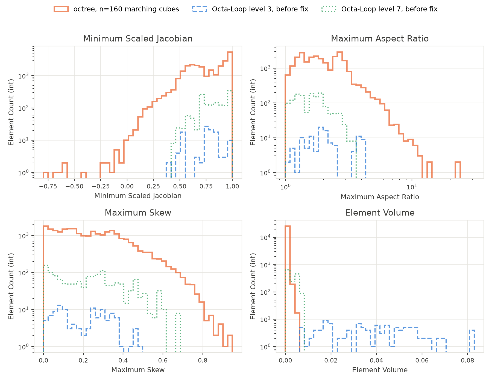

Figure: Element quality of the octree meshing three surfaces, before the fix:
the $n = 160$ marching cubes surface (solid, orange), Octa-Loop level 3
(dashed, blue), and Octa-Loop level 7 (dotted, green).  Each panel is a
histogram with a log scale on the count.  Only the marching cubes curve
reaches below zero.  The figure is produced by
[`unit_sphere_figures.py`](#unit_sphere_figurespy).

**After the fix.**


Figure: The same three meshes after the fix.  The marching cubes mesh on the
left is unchanged, from `conspire` 0.7.7.  The Octa-Loop level 3 mesh (center)
is now symmetric across the coordinate planes, and its minimum scaled
Jacobian rises from 0.384 to 0.534.  Level 7 (right) is also symmetric, and
its octree is coarser: 111 elements where it had 1,415 (see
[Update 4](#update-4-2026-09-30)).  The figure is produced by
[`unit_sphere_figures.py`](#unit_sphere_figurespy).

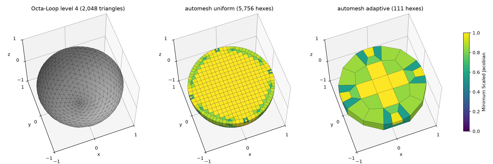

Figure: A cut through the middle of the same three meshes after the fix, at
$z = 0$, on the same scale as the before-fix cut.  The marching cubes mesh is
unchanged.  The figure is produced by
[`unit_sphere_figures.py`](#unit_sphere_figurespy).

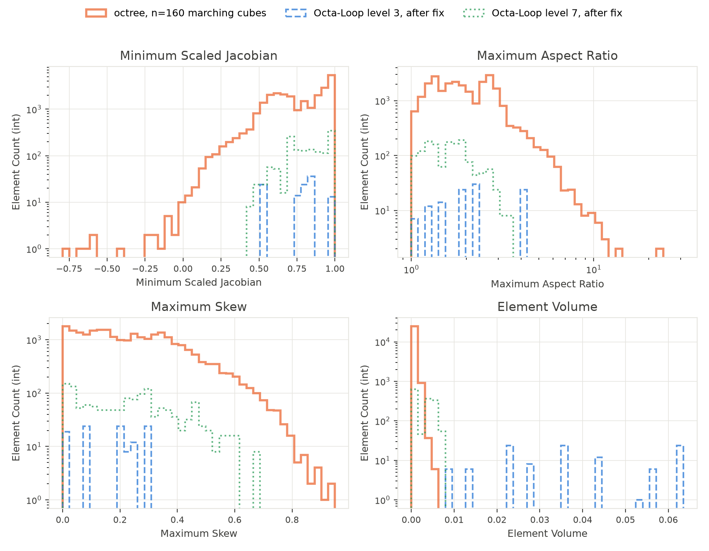

Figure: Element quality of the same three meshes after the fix, in the same
styles and scales as the before-fix figure.  The Octa-Loop level 3 elements
now come in symmetric groups of equal quality, so that curve has fewer and
taller bars.  The figure is produced by
[`unit_sphere_figures.py`](#unit_sphere_figurespy).

Neither control mesh inverts an element.  Both stay at or above Sculpt's own
baseline (0.343 minimum), even level 7, whose facets are only 2.4 times
larger than the marching cubes surface that produces −0.792.  Level 7's
octree also makes far fewer elements than the marching cubes $n = 160$
octree, 1,415 against 25,815, on comparably sized facets.  So the octree is
not simply reacting to facet size: a smooth surface with similar facets
does not provoke the same refinement.

This bears on the octree only.  `--uniform` builds its mesh directly from a
fixed-size lattice and never calls the octree or the shape diameter
function, so it says nothing about why the uniform lattice's own quality
also lags Sculpt's.

| surface | `conspire` | elements | MSJ min | MSJ mean |
| :--- | :--- | ---: | ---: | ---: |
| marching cubes, $n = 160$ | 0.7.7 | 25,815 | −0.792 | 0.755 |
| Octa-Loop level 3, before fix | 0.7.7 | 111 | 0.384 | 0.749 |
| Octa-Loop level 3, after fix | fix | 111 | 0.534 | 0.767 |
| Octa-Loop level 7, before fix | 0.7.7 | 1,415 | 0.439 | 0.816 |
| Octa-Loop level 7, after fix | fix | 111 | 0.548 | 0.774 |

**Octa-Loop level 3:**

**Correction, 2026-09-30.**  Text struck through below states a cause that
later experiments refuted.  It stays visible for the record.  The
[Update](#update-2026-09-30) after the Observations gives the evidence.
[Update 2](#update-2-2026-09-30) corrects two conclusions of that update.
Everything in the two Octa-Loop lists and the Observations describes
`conspire` 0.7.7 and the before-fix figures.  The table and the figures above
also show the fix, from [Update 3](#update-3-2026-09-30) and
[Update 4](#update-4-2026-09-30).

1. The Octa-Loop level 3 mesh (center panel) is visibly not symmetric across
   the $xy$, $yz$, and $zx$ planes, unlike the other meshes on this page.
2. The input STL itself, `octa_loop03.stl`, is perfectly symmetric.
   Reflecting every vertex
   across each axis finds an exact match on the surface, at every axis.
   *The asymmetry comes from the meshing process, not the geometry.*
3. ~~The octree's local-thickness sizing is the source.~~  `conspire`'s shape
   diameter function estimates thickness at each facet by casting a cone
   of rays inward.  The cone is oriented by a tangent frame built from the
   facet's normal.
4. That tangent frame comes from an orthonormal-basis construction.  It
   builds the frame with Gram-Schmidt, seeded from the fixed global axes
   $x$, $y$, and $z$, in that order.  The construction has nothing to do
   with the local surface.
5. ~~This construction is not equivariant under reflection.  A facet normal
   and its exact mirror image do not receive mirrored tangent frames.~~
6. ~~The ray samples are discrete, only 3 rings and 10 azimuthal directions
   per facet.  A mirror-symmetric pair of facets can then sample different
   points on the surface, and measure different local thickness.~~
7. ~~Different thickness estimates drive different octree refinement
   decisions on each side.  That breaks a symmetry the input geometry
   actually has.~~
8. The effect shrinks fast with resolution.  The same reflection test on
   the level 7 control gives a maximum mismatch of 0.0143, down from 0.235
   to 0.273 at level 3.  Only 1% of its nodes are affected, against 96% to
   100% at level 3.
9. ~~One detail points straight at the mechanism.~~  At level 3, the
   $z$-reflection mismatch (0.273) is larger than the $x$ or $y$ mismatch
   (0.235).  ~~The Gram-Schmidt seed order tries $x$ and $y$ first and $z$
   last, so $z$ is the axis most likely to be singled out.~~
10. A fix belongs in `conspire`, not `automesh`.  `automesh`'s CLI has no
    option that reaches this code path.
11. ~~Two changes would help.~~
    <ol type="a">
    <li><del>Seed the tangent frame from something tied to the local mesh,
    instead of the global axes.</del></li>
    <li><del>Raise the ring and azimuthal sample counts, fixed today at 3 and
    10, so the discrete sampling better approximates the continuous,
    symmetric integral.</del></li>
    </ol>
12. ~~No fix can make every normal's tangent frame equivariant at once.  The
    hairy ball theorem rules that out, for any continuous tangent field on
    a sphere of directions.  But the current choice ties that one
    unavoidable discontinuity to the world axes.  That is exactly what
    biases this octahedron-derived surface, since its own symmetry axes
    happen to line up with the world axes.~~

**Octa-Loop level 7:**

1. `octa_loop07.stl` is also exactly symmetric.  The same reflection test
   finds a maximum mismatch of $10^{-7}$, floating-point noise, at every
   axis.  So the level 7 control's own small remaining asymmetry (Octa-Loop
   level 3, item 8, a maximum mismatch of 0.0143) also comes from the
   meshing process, not the input.
2. ~~The same mechanism applies here as at level 3 (item 4).  The octree's
   local-thickness sizing depends on a per-facet tangent frame that is
   not equivariant under reflection.  A finer surface approximates the
   underlying continuous, symmetric integral more closely, which is why
   the effect is far weaker here than at level 3, but it does not
   vanish.~~

**Observations:**

* ~~The asymmetry is real, not numerical noise.~~  A perfectly symmetric input
  produces a mesh that is not.
* It is a resolution effect, not a fixed error.  The maximum reflection
  mismatch falls from 0.235–0.273 at level 3 to 0.0143 at level 7, a
  17 to 19 times reduction.
* ~~It has one identifiable cause: `orthonormal_basis`'s Gram-Schmidt
  seeding from the fixed global axes, not from the local surface.  The
  fixed seed order also explains why $z$ is singled out at level 3.~~
* The fix belongs in `conspire`.  `automesh`'s CLI has no option that
  reaches the shape diameter function's sampling, so nothing on the
  `automesh` side can correct it today.

#### Update, 2026-09-30

Later experiments refute the cause stated above.  This update records the
measurements.  The original text stays in place, struck through.

A probe build of `conspire` 0.7.7, the version this book builds against,
ran the stages of `automesh mesh hex` one at a time.  The probe used the
defaults: scale 5, weak balancing at 1, and regular pairing.  After each
stage, it reflected every node across each axis and measured the distance
to the nearest node.  The probe build is a scratch copy and is not
committed.  The measurement reproduces the numbers above: 0.2348, 0.2348,
and 0.2725 at level 3, and 0.0143 at level 7.

1. **The shape diameter function is symmetric.**  On `octa_loop03.stl`, the
   values at mirror vertices differ by at most $4 \times 10^{-10}$, the size
   of the vertex noise.  Sampling 6 rings by 20 azimuthal directions, in
   place of 3 by 10, gives $4.5 \times 10^{-10}$.  On a copy of the
   STL snapped to exactly symmetric coordinates, the difference is
   $7 \times 10^{-16}$.  A hand derivation agrees.  The Gram-Schmidt frames
   of two mirror facets differ only by sign, and each sign change maps the
   ten azimuthal samples onto themselves.
2. **The octree is symmetric.**  At level 3, `from_features`,
   `equilibrate`, `dualize`, and `trim` give a mirror mismatch of exactly
   0.  The mesh has 343 elements after `dualize` and 33 after `trim`.
   Level 7 also gives exactly 0 at the same stages, with 3,411 and 777
   elements.
3. **The asymmetry enters in `buffer`.**  `buffer` removes elements, adds
   one layer of hexahedra, and runs an optimizer called `fit`.  The mesh
   stays exactly symmetric through the removal and the layer, at 168 nodes
   for level 3.  After the first iteration of `fit`, the mismatch is
   $5.8 \times 10^{-3}$.  After the first sweep, it is 0.145.  After the
   last sweep, it is 0.2348 and 0.2725.  At level 7, `buffer` takes the
   mismatch from 0 to 0.0143.
4. **Mechanism 1: ties in the surface target.**  `fit` pulls each new
   boundary node toward the closest surface point to the centroid of its
   boundary quad.  It uses the normal of the triangle that holds that
   point.  A centroid on a symmetry plane sits the same distance from two
   mirror-image triangles.  The search returns one of them.  At level 3,
   54 of 624 closest-point queries (78 quads times 8 sweeps) have two or
   more equidistant, distinct closest points.  Mirror targets then differ
   by up to 0.050 in position and 0.159 in normal.  At the start of `fit`,
   the gradient of the surface-fit term differs from its mirror image by
   10.4% of its largest value, $1.68 \times 10^{4}$.  The hex-quality term
   is equivariant to $7 \times 10^{-16}$.  Averaging the tied points and
   normals removes the mismatch.  The target mismatch drops to
   $4 \times 10^{-11}$, and the gradient mismatch drops to
   $2 \times 10^{-8}$.  After the first iteration, the mesh mismatch
   falls from $5.8 \times 10^{-3}$ to $1.1 \times 10^{-9}$.
5. **Mechanism 2: amplification of rounding noise.**  ~~Averaging the ties
   does not produce a symmetric mesh.~~  On the snapped STL with averaged
   ties, the gradient is equivariant to $4 \times 10^{-16}$, and the mesh
   starts exactly symmetric, with a mismatch of $1.1 \times 10^{-16}$
   after the first iteration.  The first sweep ends at
   $9.5 \times 10^{-8}$.  The second ends at $7.3 \times 10^{-2}$.  The
   final mesh has a mismatch of 0.21 to 0.27, the same size as without the
   fix.  Rounding noise grows by about $10^{9}$ in one sweep.  ~~The
   symmetric configuration behaves like an unstable point of the `fit`
   objective.~~
6. **The octree depth is fragile at level 7.**  Snapping the level 7 STL
   moves each vertex by at most $5 \times 10^{-7}$.  That changes the
   smallest positive shape diameter from 0.471 to 1.655, the octree from
   5 levels to 3, and the mesh from 1,776 nodes to 264.  The octree depth
   comes from the single smallest positive nodal value, so a few vertices
   set it.  The cause at those vertices is not yet known.

Items 1, 2, 4, 8, and 10 of the level 3 list stand, with one correction.
The fix belongs in `conspire`, in `fit` within `buffer`, and not in the
shape diameter function.  ~~Two questions remain open.  Does a symmetric
minimum of the `fit` objective exist, and how does its quality compare
with the 0.384 minimum scaled Jacobian of the asymmetric level 3 mesh?~~
Does `automesh mesh hex --snap` change the result?

#### Update 2, 2026-09-30

Update 1 ended at a fix that did not work.  Further work on a branch of
`conspire` corrects two of its conclusions and gives a fix that does.
The struck-through sentences in item 5 and in the last paragraph of
Update 1 state the conclusions that this update replaces.

1. **Averaging the ties was enough for Octa-Loop.**  The probe behind
   Update 1 averaged a tie only when the two closest points were
   distinct.  It left one case alone.  The closest point can lie on an
   edge shared by two mirror-image triangles.  Both triangles give the
   same point and mirror-image normals, and `fit` used one of the two.
   Late in the fit, the boundary nodes sit on the surface, so this case
   is common.  The full fix treats every triangle within a tolerance of
   the nearest as tied.  The tolerance is $10^{-6}$ times the mean
   distance from the face centroid to its nodes.  It averages the closest
   points and sums the normals of the tied triangles.  With this change
   alone, the mirror mismatch of the level 3 mesh falls from 0.2725 to
   $1.3 \times 10^{-7}$, the size of the STL's coordinate noise.  The
   minimum scaled Jacobian rises from 0.3836 to 0.5345, and the mean
   rises from 0.7487 to 0.7674.  At level 7, on `conspire` `main`, the
   mismatch falls from 0.0143 to $1.8 \times 10^{-7}$, and the minimum
   rises from 0.4374 to 0.4411.
2. **Correct targets do not keep every mesh symmetric.**  A subdivided
   octahedron of 32 facets at octree scale 8 still ends with a mismatch
   of 0.18 after the tie fix.  Its initial gradient is equivariant to
   $2 \times 10^{-16}$.  The mismatch grows from $7 \times 10^{-7}$ after
   sweep 0 to $8 \times 10^{-6}$ after sweep 1, and to $3.6 \times 10^{-2}$
   after sweep 2, when the regularization reaches $10^{-12}$.  A symmetric
   solution exists.  Its minimum scaled Jacobian is 0.1724, against 0.1092
   for the asymmetric one.  Its `fit` objective is higher, 7,636 against
   6,772.  The optimizer leaves the symmetric state because its own
   objective is lower elsewhere.
3. **The fix has two parts.**  Both sit on a local branch of `conspire`,
   in two commits, and neither is released.  The first part is the tie
   average.  The second part finds the mirror planes through the center
   of the mesh's bounding box, and keeps the optimizer on them.  A plane
   counts only if it maps both the background mesh and the target
   surface onto themselves.  A mesh with no such plane fits as before.
4. **Results.**  On 14 symmetric inputs, the mirror mismatch is exactly
   0, against 0.07 to 0.61 before, and 0.0143 for level 7.  The inputs
   are Octa-Loop levels 3 and 7, and subdivided octahedra of 32 to 2,048
   facets at octree scales 3, 5, and 8.  The minimum scaled Jacobian is
   at or above its old value in all 14, and the mean is at or above it
   in 13.  Octa-Loop level 3 ends exactly symmetric, with a minimum of
   0.5345 and a mean of 0.7674.  On marching cubes surfaces of 3,800 to
   964,568 triangles, the element counts do not change and the mean
   changes by at most 0.004.  ~~The second closest-point query adds 0% to
   11% to the meshing time in single runs.~~  A later change walks the
   search tree once instead of twice.  A tie query then costs 1.08 to 1.15
   times a nearest-point query, against 1.46 to 1.84 times for two walks.
   End-to-end times vary from $-3$% to $+12$% in single runs, because the
   optimizer takes a different path once the targets change.
5. **Status and limits.**  `automesh` still pins `conspire` 0.7.7.  ~~So the
   tables on this page keep their 0.7.7 values until the fix ships.  Then
   the scripts must run again.~~  [Update 3](#update-3-2026-09-30) reruns
   the two Octa-Loop rows with the fix.  The constraint covers mirror planes
   perpendicular to the coordinate axes.  It does not cover rotational
   symmetry.  The second `fit` of `--snap` runs unconstrained, and the
   effect of `--snap` has not been measured.

#### Update 3, 2026-09-30

This update reruns the two Octa-Loop meshes with the fix of Update 2.  It
adds the after-fix rows to the table and the three after-fix figures.  The
before-fix rows and figures stay beside them for comparison.

`automesh` 0.4.7 pins `conspire` 0.7.7.  So the rerun used a scratch copy of
`automesh` built against the `conspire` branch of Update 2.  The branch moved
`Dualization` from `ntree` to `mesh`, and `automesh` needed that two-line
import change to compile.  The repository source did not change.
The copy meshed both surfaces through `hex_write` in
[`unit_sphere_mesh.py`](#unit_sphere_meshpy), with default options.  Before
the rerun, the installed `automesh` reproduced the old rows exactly: 111
elements with 0.384 and 0.749 at level 3, and 1,415 with 0.439 and 0.816 at
level 7.

In this update, "fit fix" means the fix of Update 2.  Update 4 adds a second
fix.

| mesh | `conspire` | elements | MSJ min | MSJ mean | max edge ratio | max skew | mirror mismatch |
| :--- | :--- | ---: | ---: | ---: | ---: | ---: | :--- |
| Octa-Loop level 3 | 0.7.7 | 111 | 0.384 | 0.749 | 4.22 | 0.481 | 0.2348, 0.2348, 0.2725 |
| Octa-Loop level 3 | fit fix | 111 | **0.534** | **0.767** | 4.15 | 0.300 | **0, 0, 0** |
| Octa-Loop level 7 | 0.7.7 | 1,415 | 0.439 | 0.816 | 3.61 | 0.679 | 0.0143, 0.0143, 0.0143 |
| Octa-Loop level 7 | fit fix | 1,415 | 0.441 | 0.816 | 3.60 | 0.678 | **0, 0, 0** |

The mirror mismatch is the largest distance from a reflected node to the
nearest node, for the $x$, $y$, and $z$ reflections, measured on the nodes
that `automesh` wrote.

1. **Level 3 improves in symmetry and in quality.**  The mesh is now
   exactly symmetric.  The minimum scaled Jacobian rises by 0.150, the mean
   by 0.018, and the largest skew falls from 0.481 to 0.300.  The element
   count does not change.  The center panel of the first after-fix figure
   shows the symmetric mesh.
2. ~~**Level 7 changes in symmetry only.**  The mismatch falls from 0.0143 to
   exactly 0.  The quality changes by 0.002 in the minimum and not at all in
   the mean.~~  The mismatch does fall from 0.0143 to exactly 0, and the
   quality changes by 0.002 in the minimum with the fit fix alone.  A second
   defect, in [Update 4](#update-4-2026-09-30), changes level 7 much more.
3. **Level 3 gets less accurate in volume.**  The input surface encloses
   4.0926, which is 2.30% below the exact $4\pi/3 \approx 4.1888$.  The old
   mesh encloses 4.1909, which is 2.40% above the surface and 0.05% above the
   sphere.  The two errors nearly cancelled.  The new mesh encloses 4.2187,
   which is 3.08% above the surface and 0.71% above the sphere.  At level 7,
   the volume goes from 4.2036 to 4.2039, which is 0.37% above the surface.
   The cause at level 3 is not isolated.
4. **The table now mixes two `conspire` builds.**  The marching cubes row,
   and the marching cubes curve of the quality histogram, still come from
   `conspire` 0.7.7.  Rerunning them with the fix would change every
   marching cubes result on this page, so this update leaves them alone.
   The smoothing section and its figures are unchanged.
5. **The before-fix figures are reproducible.**  `unit_sphere_figures.py`
   draws both sets.  It reads the saved before-fix meshes,
   `unit_sphere_control_loopNN_pre_fix.inp` and `.csv`.  With the original
   panel titles, it reproduced the three before-fix figures that were
   committed to this repository, byte for byte.  The titles of both sets now
   say "before fix" or "after fix."

#### Update 4, 2026-09-30

A reader noticed that the Octa-Loop level 7 mesh refines more near one pair of
opposite poles than near the other two.  The surface is symmetric under every
swap of the axes, so all six poles should match.  They did not, before the fit
fix and after it.  A second defect in `conspire` causes this.  The released
0.7.8 has it too.

1. **The pattern.**  Within 25° of each pole, the before-fix mesh has 231
   elements at $+x$ and at $-x$.  It has 39, 39, 39, and 40 at $+y$, $-y$, $+z$,
   and $-z$.  The smallest element volume near $\pm x$ is 0.00022, against
   0.0032 near the other poles.  The fit fix leaves this pattern: 231, 231, 39,
   39, 40, and 39.  The input is not the cause.  Swapping any two axes maps its
   vertices onto vertices within $10^{-7}$, and the four facets at each pole
   have the same area, $2.771 \times 10^{-6}$.  By the node coordinates, the
   refined pair is $\pm x$.
2. **The cause: rays lost in the shape diameter function.**  The function casts
   31 rays from the centroid of each facet and drops any hit on the facet
   itself.  The search returns only the nearest hit.  A facet that stands nearly
   perpendicular to a coordinate axis accepts its own plane at
   $t \approx 4 \times 10^{-17}$, because the ray test scales its tolerance with
   the facet's extent along that axis.  That hit is the nearest, so the filter
   drops the ray and the real hit, 2.0 away, is never reported.  At the four
   facets of each $\pm x$ pole, all 31 rays are lost.  At each facet of the
   other poles, 30 of 31 are lost and 1 survives.  A facet with no rays gets
   thickness 0.
3. **The effect on the octree.**  The shape diameter at the $\pm x$ pole
   vertices is 0.0000, and it is 0.4713 on the next ring.  The valid value is
   1.8953, and the other poles reach 1.4136 at the lowest.  The octree takes its
   depth from the smallest positive value.  So it gets 5 levels where 3 suffice,
   and it refines most around $\pm x$.
4. **The fix.**  A new search returns the nearest hit on any facet but one, and
   the shape diameter function uses it, so the facet that casts the ray is never
   a candidate.  The shape diameter is then 1.8953 to 1.8954 at all six poles.
   The largest difference between a vertex and its axis-swapped partner falls
   from 1.4136 to 0.0000.

| level 7 mesh | elements | MSJ min | MSJ mean | max edge ratio | max skew | volume | elements within 25° of $+x$, $-x$, $+y$, $-y$, $+z$, $-z$ | axis-swap mismatch |
| :--- | ---: | ---: | ---: | ---: | ---: | ---: | :--- | ---: |
| before fix, `conspire` 0.7.7 | 1,415 | 0.439 | 0.816 | 3.61 | 0.679 | 4.2036 | 231, 231, 39, 39, 39, 40 | 0.132 |
| fit fix only | 1,415 | 0.441 | 0.816 | 3.60 | 0.678 | 4.2039 | 231, 231, 39, 39, 40, 39 | 0.134 |
| both fixes | 111 | 0.548 | 0.774 | 3.75 | 0.375 | 4.3067 | 7, 7, 7, 7, 7, 8 | 0.000 |

The axis-swap mismatch is the largest distance from an element center to the
nearest element center after swapping two axes.  The 8 at $-z$ is one element
center on the 25° boundary, and the 0.000 shows that the element set is the same
under every swap.

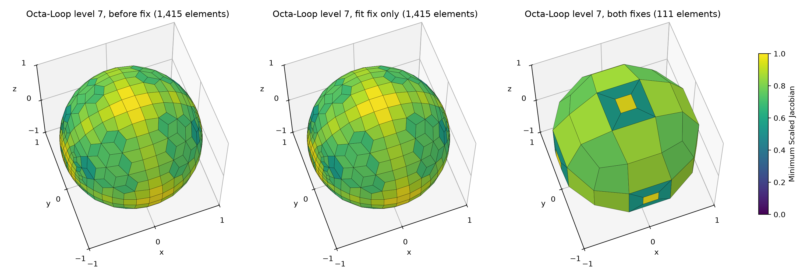

Figure: The three Octa-Loop level 7 meshes, painted by the minimum scaled
Jacobian, in the same view as the figures above.  Left: before the fix.  Center:
the fit fix only.  The small elements crowd the limbs, where the $\pm x$ poles
sit.  Right: both fixes.  The figure is produced by
[`unit_sphere_figures.py`](#unit_sphere_figurespy).

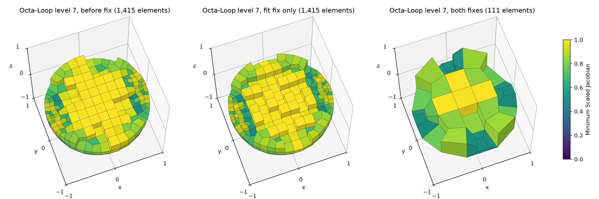

Figure: A cut through the middle of the same three meshes, at $z = 0$.  The
figure is produced by [`unit_sphere_figures.py`](#unit_sphere_figurespy).

5. **A cost.**  The level 7 mesh now has 111 elements, the same count as the
   level 3 mesh.  Its volume is 4.3067, which is 2.8% above the exact
   $4\pi/3 \approx 4.1888$.  Before, it was 4.2036, which is 0.36% above.  The
   extra refinement had improved the volume by accident.  The level 3 mesh is
   0.71% above.
6. **What does not change.**  The Octa-Loop level 3 mesh is the same, with 111
   elements and the same quality.  The shape diameter fix does not change the
   marching cubes $n = 160$ mesh either.  With that fix alone, the mesh has the
   same 25,815 elements, quality, and mirror mismatch as with the released
   `conspire`.  The marching cubes results on this page stand.
7. **Status.**  The fix is a separate change on a local branch of `conspire`, and
   it is not released.  The after-fix rows of the table and the after-fix
   figures above use both fixes.

## Marching Cubes Surface Smoothing

Sculpt returns one mesh for every marching cubes surface from $n = 20$ on.
Its first stage converts the surface to a volume fraction in each cell of its
grid.  That conversion washes over detail smaller than a cell.[^Sculpt]  The
octree has no such conversion.  It measures thickness on the surface itself,
one facet at a time.  The voxel steps of the marching cubes surface can
corrupt that measurement (see [Control Study](#control-study)).

This section smooths the marching cubes surface before meshing.  If the voxel
steps cause the octree's failures, smoothing should remove the steps and the
failures with them.  Each surface goes through `automesh smooth`, then
through the same octree command as the [`automesh`](#automesh) section.

```sh
automesh smooth -i unit_sphere_mc_n160.stl -o unit_sphere_smooth_n160.stl \
  --iterations 50
automesh mesh hex -i unit_sphere_smooth_n160.stl -o unit_sphere_smooth_n160.inp \
  --metrics unit_sphere_smooth_n160.csv
```

`automesh smooth` uses Taubin smoothing by default.  Each iteration makes two
moves.  The first move pulls every vertex toward the average of its
neighbors.  It removes high-frequency detail such as the voxel steps.  The
second move pushes each vertex back out by a smaller amount.  It counters the
shrinkage of the first move.  The script
[`unit_sphere_smooth.py`](#unit_sphere_smoothpy) keeps the defaults
(`-k 0.1`, `-s 0.6307`) and varies only the iteration count, over 0, 5, 10,
20, 50, 100, and 200.  Zero is the unsmoothed baseline.  Each later count is
2 to 2.5 times the one before, to find where more iterations stop helping.
The top of 200 is arbitrary.

The script also measures the mean and standard deviation of each smoothed
surface's vertex distance from the origin.  On the unit sphere, the mean is 1
and the standard deviation is 0.  The mean shows whether smoothing shrinks or
inflates the sphere.  The standard deviation shows how far the surface
strays from a sphere.

**$n = 10$**

| iterations | radius mean | radius std | elements | MSJ min | MSJ mean | inverted |
| ---: | ---: | ---: | ---: | ---: | ---: | ---: |
| 0 | 0.99935 | 0.02149 | 8,243 | 0.088 | 0.695 | 0 |
| 5 | 0.99679 | 0.00977 | 207 | 0.355 | 0.740 | 0 |
| 10 | 0.99997 | 0.01041 | 207 | 0.292 | 0.749 | 0 |
| 20 | 1.00076 | 0.00850 | 183 | 0.409 | 0.660 | 0 |
| 50 | 1.00321 | 0.00705 | 111 | 0.235 | 0.692 | 0 |
| 100 | 1.00736 | 0.00696 | 111 | 0.291 | 0.718 | 0 |
| 200 | 1.01577 | 0.00777 | 111 | 0.331 | 0.729 | 0 |

**$n = 20$**

| iterations | radius mean | radius std | elements | MSJ min | MSJ mean | inverted |
| ---: | ---: | ---: | ---: | ---: | ---: | ---: |
| 0 | 0.99910 | 0.01014 | 9,983 | 0.102 | 0.711 | 0 |
| 5 | 0.99846 | 0.00537 | 207 | 0.309 | 0.747 | 0 |
| 10 | 0.99928 | 0.00576 | 207 | 0.250 | 0.765 | 0 |
| 20 | 0.99949 | 0.00503 | 207 | 0.481 | 0.783 | 0 |
| 50 | 1.00015 | 0.00432 | 183 | 0.454 | 0.702 | 0 |
| 100 | 1.00126 | 0.00390 | 111 | 0.312 | 0.755 | 0 |
| 200 | 1.00349 | 0.00367 | 111 | 0.512 | 0.761 | 0 |

**$n = 40$**

| iterations | radius mean | radius std | elements | MSJ min | MSJ mean | inverted |
| ---: | ---: | ---: | ---: | ---: | ---: | ---: |
| 0 | 0.99964 | 0.00509 | 14,767 | 0.032 | 0.742 | 0 |
| 5 | 0.99948 | 0.00268 | 1,165 | 0.200 | 0.726 | 0 |
| 10 | 0.99969 | 0.00288 | 473 | 0.185 | 0.730 | 0 |
| 20 | 0.99974 | 0.00247 | 207 | 0.441 | 0.785 | 0 |
| 50 | 0.99991 | 0.00208 | 183 | 0.522 | 0.735 | 0 |
| 100 | 1.00019 | 0.00189 | 111 | 0.262 | 0.743 | 0 |
| 200 | 1.00075 | 0.00177 | 111 | 0.582 | 0.776 | 0 |

**$n = 80$**

| iterations | radius mean | radius std | elements | MSJ min | MSJ mean | inverted |
| ---: | ---: | ---: | ---: | ---: | ---: | ---: |
| 0 | 0.99986 | 0.00255 | 15,223 | 0.010 | 0.754 | 0 |
| 5 | 0.99982 | 0.00134 | 957 | 0.234 | 0.650 | 0 |
| 10 | 0.99987 | 0.00145 | 1,157 | 0.219 | 0.719 | 0 |
| 20 | 0.99988 | 0.00123 | 1,415 | 0.307 | 0.757 | 0 |
| 50 | 0.99993 | 0.00103 | 551 | 0.275 | 0.818 | 0 |
| 100 | 1.00000 | 0.00093 | 207 | 0.644 | 0.819 | 0 |
| 200 | 1.00014 | 0.00088 | 207 | 0.626 | 0.822 | 0 |

**$n = 160$**

| iterations | radius mean | radius std | elements | MSJ min | MSJ mean | inverted |
| ---: | ---: | ---: | ---: | ---: | ---: | ---: |
| 0 | 0.99997 | 0.00128 | 25,815 | −0.792 | 0.755 | 23 |
| 5 | 0.99996 | 0.00067 | 1,165 | 0.171 | 0.729 | 0 |
| 10 | 0.99997 | 0.00072 | 1,157 | 0.176 | 0.719 | 0 |
| 20 | 0.99997 | 0.00061 | 2,123 | 0.179 | 0.724 | 0 |
| 50 | 0.99998 | 0.00050 | 1,157 | 0.400 | 0.776 | 0 |
| 100 | 1.00000 | 0.00045 | 957 | 0.337 | 0.706 | 0 |
| 200 | 1.00003 | 0.00041 | 551 | 0.419 | 0.830 | 0 |

The rows with 0 iterations repeat the octree column of the
[`automesh`](#automesh) table.  The five tables give five results.

1. **Smoothing removes the inversions.**  The unsmoothed $n = 160$ mesh has 23
   inverted elements.  All 30 smoothed meshes have none, including the
   5-iteration meshes.
2. **The element count falls by 11 to 133 times.**  The unsmoothed octree
   makes 8,243 to 25,815 elements.  The smoothed octree makes 111 to 2,123.
   At $n = 160$, 5 iterations cut 25,815 elements to 1,165.  The smoothed
   octree refines far less.
3. **The surface gets closer to a sphere, and the gain slows.**  At
   $n = 160$, the radius standard deviation falls from 0.00128 to 0.00067
   after 5 iterations and to 0.00041 after 200, a factor of 3.1.  At
   $n = 10$, it falls from 0.02149 to 0.00696 after 100 iterations and rises
   to 0.00777 after 200.
4. **Smoothing inflates the coarse surfaces.**  At $n = 160$, the radius mean
   stays within 0.00004 of 1 through 200 iterations.  At $n = 10$, it rises
   to 1.00736 after 100 iterations and 1.01577 after 200.  At $n = 20$, it
   reaches 1.00349 after 200.
5. **The worst element's MSJ does not rise steadily with iterations.**  At
   $n = 80$, the minimum MSJ is 0.234 after 5 iterations, 0.275 after 50, and
   0.644 after 100.  At $n = 160$, it is 0.171 after 5 and 0.419 after 200.
   Each cell of the table is one octree run.  The trend across iterations is
   noisy, and this page does not test why.

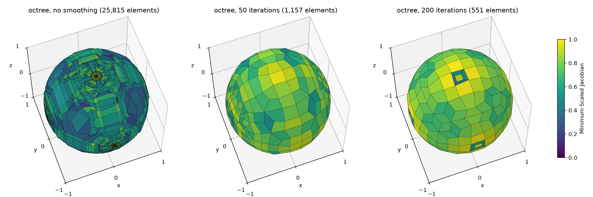

Figure: Octree meshes of the $n = 160$ marching cubes surface: unsmoothed
(left, 25,815 elements), Taubin-smoothed for 50 iterations (middle, 1,157
elements), and for 200 iterations (right, 551 elements).
The figure is
produced by [`unit_sphere_figures.py`](#unit_sphere_figurespy).

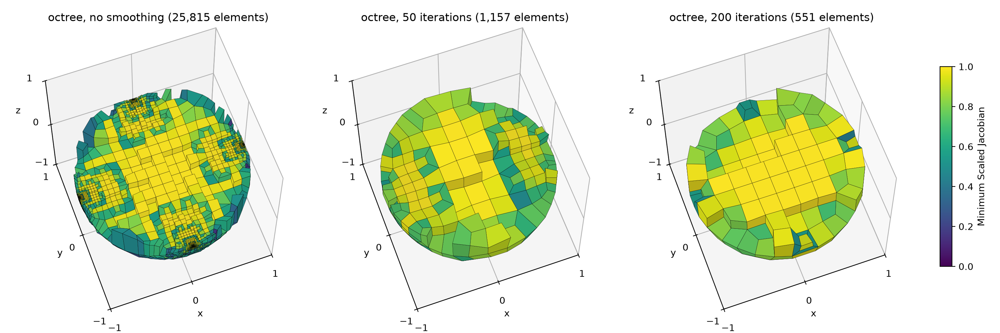

Figure: A cut through the middle of the same three meshes, at $z = 0$, on the
same scale.  Only the elements whose centers lie below the plane are drawn.
All three have an interior of elements near 1.0.  In the unsmoothed mesh,
small elements cluster at four places on the rim, where the sphere meets the
coordinate axes.  The smoothed meshes have no clusters.  Each has one ring of
green boundary elements, with a few teal, around a coarse interior.  The
figure is produced by [`unit_sphere_figures.py`](#unit_sphere_figurespy).

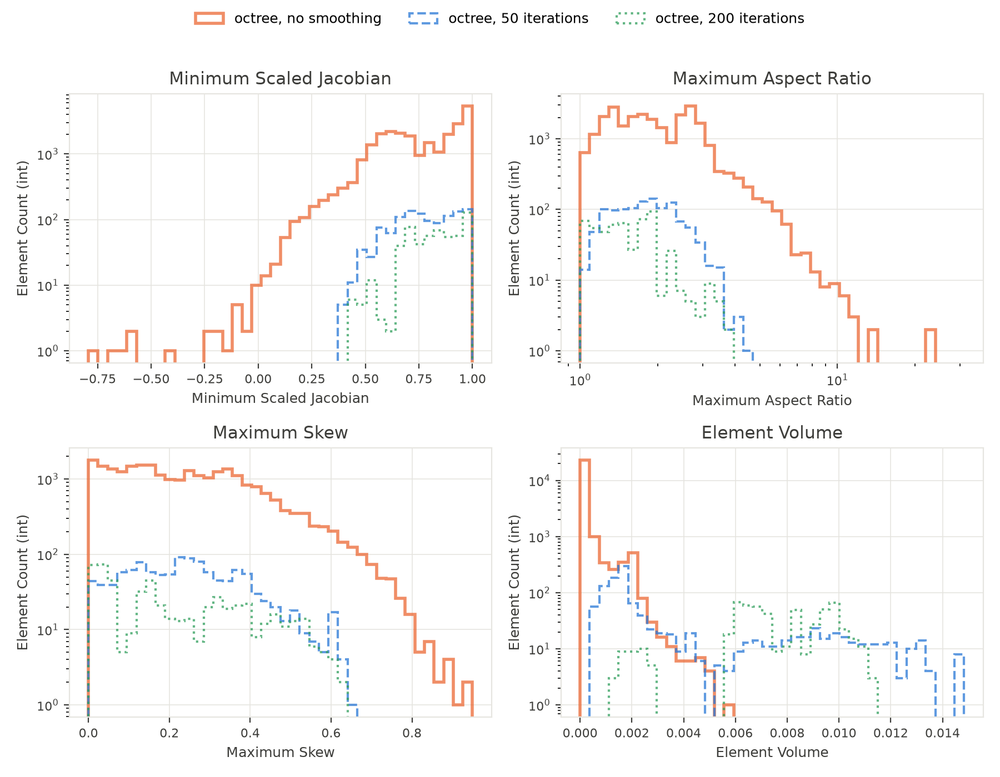

Figure: Element quality of the same three octree meshes: unsmoothed (solid,
orange), 50 iterations (dashed, blue), and 200 iterations (dotted, green).
Each panel is a histogram with a log scale on the count.  Only the unsmoothed
curve reaches below zero in Minimum Scaled Jacobian, down to −0.792.  Its
maximum aspect ratio is 31.11 and its maximum skew is 0.950.  Those fall to
4.33 and 0.642 at 50 iterations, and to 3.71 and 0.625 at 200.  The smallest
unsmoothed element has a volume of $6.7 \times 10^{-11}$.  The smallest
smoothed elements have $3.9 \times 10^{-4}$ at 50 iterations and
$1.4 \times 10^{-3}$ at 200.  The figure is produced by
[`unit_sphere_figures.py`](#unit_sphere_figurespy).

Sculpt's minimum MSJ is 0.388, 0.404, 0.420, 0.401, and 0.427 at
$n = 10, 20, 40, 80, 160$.  Of the 30 smoothed octree meshes, 9 match or
beat Sculpt's minimum at their $n$.  They come at 20 iterations for $n = 10$;
at 20, 50, and 200 for $n = 20$ and $40$; and at 100 and 200 for $n = 80$.
None does at $n = 160$, where 200 iterations give 0.419 against Sculpt's
0.427.  No smoothed mesh reaches Sculpt's mean of 0.885 to 0.902.  The best
mean is 0.830, at $n = 160$ and 200 iterations.

The comparison with Sculpt has a limit.  Sculpt makes 6,768 to 6,912
elements.  The smoothed octree makes 111 to 2,123, which is 3 to 62 times
fewer.  A minimum MSJ above Sculpt's comes from a coarser mesh, not only a
better one.  For $n \leq 40$ at 100 iterations or more, the octree makes 111
elements, the same count as the Octa-Loop level 3 control.  At $n = 80$ it
makes 207.

The test shows that smoothing removes the failure.  It does not show that the
shape diameter function was the only cause.  A direct test would keep the
voxel steps and change only how the octree measures thickness.

## Reproducibility

The commands below regenerate every table and figure on this page.  They run
from the page's own directory, in order, because each step reads the files
the step before it writes.

The steps need three tools and one input file.

* [`uv`](https://docs.astral.sh/uv/) runs each script with its Python
  packages.
* `automesh` 0.4.7 must be on the `PATH`.  The comparison and mesh scripts
  call it.
* Sculpt, from Cubit 16.08, must be on the `PATH` for the Sculpt meshes.
* The inputs `octa_loop03.stl` and `octa_loop07.stl` must sit in this
  directory.  Both download from the
  [Refinement](../../../theory/subdivision.md#refinement) table of the
  Subdivision page.

```sh
cd ~/autotwin/automesh/book/examples/gallery/academic

# segmentations, marching cubes surfaces, and the comparison tables
uv run --with numpy unit_sphere_segmentation.py
uv run --with numpy --with scikit-image unit_sphere_marching_cubes.py
uv run --with numpy unit_sphere_comparison.py

# Sculpt meshes on the baseline grid
B=1.240409
GRID="-x 26 -y 26 -z 26 -t -$B -u -$B -v -$B -q $B -r $B -s $B -SS 2"
sculpt -j 1 -stl octa_loop03.stl $GRID -e unit_sphere_sculpt_octa03
for n in 010 020 040 080 160; do
  sculpt -j 1 -stl unit_sphere_mc_n$n.stl $GRID -e unit_sphere_sculpt_n$n
done

# automesh meshes, and metrics for every mesh
uv run --with numpy --with scipy unit_sphere_mesh.py

# Taubin smoothing, then the octree
uv run --with numpy unit_sphere_smooth.py

# figures
uv run --with numpy --with scipy --with scikit-image --with matplotlib \
  unit_sphere_figures.py
```

On the machine that built this page, the sequence without the smoothing
script takes about three minutes from an empty directory.  The `automesh`
meshes take about two of those minutes, most of it in the adaptive octree.
`unit_sphere_smooth.py` adds 4 minutes 20 seconds, for its 35 octree meshes.  The timing table in
[Why Lewiner?](#why-lewiner) depends on the machine.  Every other number on
the page comes out the same on each run.

The Control Study also draws the Octa-Loop meshes from before the fix.  Those
meshes come from `automesh` built on `conspire` 0.7.7, which is the released
build.  Make them with the released `automesh`.

```sh
for L in 03 07; do
  automesh mesh hex -i octa_loop$L.stl -o unit_sphere_control_loop${L}_pre_fix.inp \
    --metrics unit_sphere_control_loop${L}_pre_fix.csv -q
done
```

The after-fix meshes need `automesh` built on `conspire` with the fixes of
[Update 2](#update-2-2026-09-30) and [Update 4](#update-4-2026-09-30), which
are not yet released.  With the released `automesh`, `unit_sphere_mesh.py`
writes the unsuffixed Octa-Loop meshes with the before-fix result.  The level 7
figure of Update 4 also reads `unit_sphere_control_loop07_fit_fix.inp` and
`.csv`.  The commands below make them.  See
[Update 3](#update-3-2026-09-30).

The fit-fix mesh comes from `automesh` built on the `fit-mirror-symmetry`
branch of `conspire`, which holds the fixes of
[#222](https://github.com/mrbuche/conspire.rs/pull/222) and
[#225](https://github.com/mrbuche/conspire.rs/pull/225).  The released
`automesh` pins `conspire` 0.7.7, so the build uses a patch and one import
change.  `conspire` moved `Dualization` from `ntree` to `mesh`.

```sh
git clone https://github.com/mrbuche/conspire.rs ~/conspire-fit-fix
git -C ~/conspire-fit-fix checkout fit-mirror-symmetry

mkdir ~/automesh-fit-fix
cp -R ~/autotwin/automesh/{Cargo.toml,Cargo.lock,build.rs,src} ~/automesh-fit-fix/
cd ~/automesh-fit-fix
printf '\n[patch.crates-io]\nconspire = { path = "../conspire-fit-fix" }\n' >> Cargo.toml
perl -pi -e 's/mesh::\{Class, Fitting, Mesh, Tessellation\}/mesh::{Class, Dualization, Fitting, Mesh, Tessellation}/; s/CurvatureSizing, Dualization, Octree/CurvatureSizing, Octree/' src/mesh/mod.rs
cargo update -p conspire
cargo build --release

cd ~/autotwin/automesh/book/examples/gallery/academic
~/automesh-fit-fix/target/release/automesh mesh hex -i octa_loop07.stl \
  -o unit_sphere_control_loop07_fit_fix.inp \
  --metrics unit_sphere_control_loop07_fit_fix.csv -q
```

Only level 7 needs a fit-fix file.  The shape diameter fix does not change level
3, so the unsuffixed level 3 mesh is also its fit-fix mesh.  The commands
reproduce the `_fit_fix` files of this page byte for byte, with 1,415 elements
and a minimum scaled Jacobian of 0.441.

The same build makes the after-fix marching cubes meshes of the Mesh section.
Run this in the book's directory, with the `automesh` of the commands above.

```sh
CELL=0.095416
for n in 010 020 040 080 160; do
  ~/automesh-fit-fix/target/release/automesh mesh hex -i unit_sphere_mc_n$n.stl \
    -o unit_sphere_uniform_n${n}_fix.inp -u $CELL \
    --metrics unit_sphere_uniform_n${n}_fix.csv -q
  ~/automesh-fit-fix/target/release/automesh mesh hex -i unit_sphere_mc_n$n.stl \
    -o unit_sphere_octree_n${n}_fix.inp \
    --metrics unit_sphere_octree_n${n}_fix.csv -q
done
```

The tie fix of [#222](https://github.com/mrbuche/conspire.rs/pull/222) alone
makes these meshes.  All 20 files are byte for byte the same as the ones from
a build with all three changes.  The before-fix meshes of the Mesh section are
the unsuffixed `unit_sphere_uniform_nNNN` and `unit_sphere_octree_nNNN` files,
which `unit_sphere_mesh.py` writes with the released `automesh`.

The unsuffixed after-fix meshes need all three changes together:
[#221](https://github.com/mrbuche/conspire.rs/pull/221), #222, and #225.  No
branch on the remote holds them together yet.  Both #221 and #222 add code at
the same place in `bvh/base/mod.rs`, so combining them takes a manual merge.

The generated meshes, segmentations, and metrics are not stored with the
book.  Only the figures are.

## Source

### `unit_sphere_segmentation.py`

<details>
<summary>Show source</summary>

```python
<!-- cmdrun cat unit_sphere_segmentation.py -->
```

</details>

### `unit_sphere_marching_cubes.py`

<details>
<summary>Show source</summary>

```python
<!-- cmdrun cat unit_sphere_marching_cubes.py -->
```

</details>

### `unit_sphere_comparison.py`

<details>
<summary>Show source</summary>

```python
<!-- cmdrun cat unit_sphere_comparison.py -->
```

</details>

### `unit_sphere_mesh.py`

<details>
<summary>Show source</summary>

```python
<!-- cmdrun cat unit_sphere_mesh.py -->
```

</details>

### `unit_sphere_smooth.py`

<details>
<summary>Show source</summary>

```python
<!-- cmdrun cat unit_sphere_smooth.py -->
```

</details>

### `unit_sphere_figures.py`

<details>
<summary>Show source</summary>

```python
<!-- cmdrun cat unit_sphere_figures.py -->
```

</details>

## References

[^Lewiner2003]: Thomas Lewiner, Hélio Lopes, Antônio Wilson Vieira, and
    Geovan Tavares.  "Efficient implementation of Marching Cubes' cases with
    topological guarantees."  *Journal of Graphics Tools* 8(2) (2003) 1–15.
    <https://doi.org/10.1080/10867651.2003.10487582>

[^Lorensen1987]: William E. Lorensen and Harvey E. Cline.  "Marching cubes: A
    high resolution 3D surface construction algorithm."  *ACM SIGGRAPH
    Computer Graphics* 21(4) (1987) 163–169.
    <https://doi.org/10.1145/37402.37422>

[^skimage]: scikit-image developers.  "`skimage.measure.marching_cubes`."
    *scikit-image API reference*, version 0.26.0.
    <https://scikit-image.org/docs/stable/api/skimage.measure.html#skimage.measure.marching_cubes>.
    The signature sets `method='lewiner'` as the default.

[^Newman2006]: Timothy S. Newman and Hong Yi.  "A survey of the marching
    cubes algorithm."  *Computers & Graphics* 30(5) (2006) 854–879.
    <https://doi.org/10.1016/j.cag.2006.07.021>

[^Ericson2005]: Christer Ericson.  *Real-Time Collision Detection.*  Morgan
    Kaufmann, 2005.  Section 5.1.5, the closest point on a triangle to a
    point.

[^conspire178]: conspire issue #178, "Exodus reader rejects Cubit-written
    meshes: elem_type is NUL-terminated."
    <https://github.com/mrbuche/conspire.rs/issues/178>

[^Chernyaev1995]: Evgeni V. Chernyaev.  *Marching Cubes 33: Construction of
    topologically correct isosurfaces.*  Technical Report CN/95-17, CERN,
    1995.

[^Sculpt]: Sandia National Laboratories.  "Sculpt Tech Brief."  *Cubit 15.8
    Help Manual*.
    <https://cubit.sandia.gov/files/cubit/15.8/help_manual/WebHelp/mesh_generation/meshing_schemes/parallel/sculpt_tech.htm>.
    Sculpt extracts the surface from volume fractions on an overlay grid, and
    the result "tends to wash over small features and inaccuracies."

[^Shapira2008]: Lior Shapira, Ariel Shamir, and Daniel Cohen-Or.  "Consistent
    mesh partitioning and skeletonisation using the shape diameter
    function."  *The Visual Computer* 24 (2008) 249–259.
    <https://doi.org/10.1007/s00371-007-0197-5>
