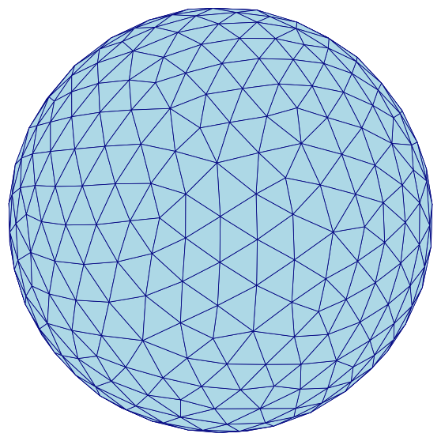
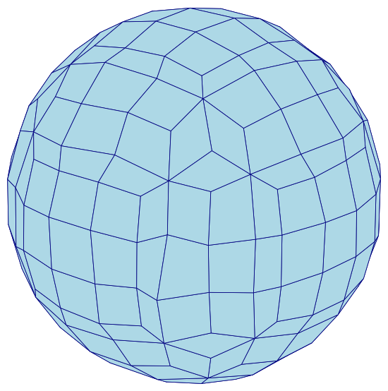

# Mesh example: Remeshed Unit Sphere

The [Torus](torus.md) example builds an all-hexahedral mesh *directly* from a
segmentation, one hexahedron per voxel.  Here we take the other route into
`mesh hex`: its **tessellation** input.  Given a triangular surface mesh,
`mesh hex` fills the enclosed volume with hexahedra by octree dualization.

The surface we start from is the remeshed unit sphere from the
[Remesh: Unit Sphere](../remesh/sphere.md) example — specifically its `-n 10`
output, a clean, near-uniform triangulation of 856 facets.  This example
turns that triangular **surface** into a solid all-hexahedral **volume**.

## Downloadable Files

| file | description |
| :--- | :--- |
| [sphere_n10.stl](sphere_n10.stl) | The remeshed triangular sphere surface (856 facets), the input to dualization (see [Preparing the Surface](#preparing-the-surface)). |
| [sphere_hex.inp](sphere_hex.inp) | The all-hexahedral mesh produced from it (see [Dualizing to Hexahedra](#dualizing-to-hexahedra)). |

## Preparing the Surface

`sphere_n10.stl` is reproduced here by running the `-n 10` uniform remesh
from the [Remesh: Unit Sphere](../remesh/sphere.md) example on its
`sphere_radius_1.stl` input:

```sh
automesh remesh -i sphere_radius_1.stl -o sphere_n10.stl uniform -n 10
```
<!-- cmdrun automesh remesh -i ../remesh/sphere_radius_1.stl -o sphere_n10.stl uniform -n 10 > /dev/null -->

## Dualizing to Hexahedra

`mesh hex` on a tessellation converts the surface into a solid hexahedral
mesh.  The `--scale` option sets the octree refinement depth — how finely
the bounding box is subdivided before the surface is captured:

```sh
automesh mesh hex -i sphere_n10.stl -o sphere_hex.inp --scale 8
<!-- cmdrun automesh mesh hex -i sphere_n10.stl -o sphere_hex.inp --scale 8 | ansifilter -->
```

triangular surface (856 facets) | all-hexahedral (393 elements)
:---: | :---:
 | 

Figure: The remeshed triangular **surface** (left) and the solid
all-hexahedral **volume** dualized from it (right).  The surface only bounds
the sphere; the hex mesh fills its interior.

## Choosing `--scale`

Unlike the segmentation route, the tessellation route does not have a
natural element size baked into the input, so `--scale` matters — and its
effect on element quality is **not monotonic**.  Sweeping it, and checking
the minimum scaled Jacobian with [metrics](../../cli/metrics.md), gives:

| `--scale` | elements | min scaled Jacobian | mean scaled Jacobian |
| :---: | ---: | ---: | ---: |
| 3 (default) | 7 | — | — |
| 6 | 183 | `0.058` | `0.633` |
| 7 | 235 | `0.058` | `0.728` |
| **8** | **393** | **`0.280`** | **`0.766`** |
| 9 | 551 | `0.009` | `0.783` |
| 10 | 804 | `-0.165` | `0.772` |

At the default `--scale 3`, the octree barely subdivides this small
(radius ≈ 1) bounding box, giving just 7 elements — far too coarse for a
sphere.  Increasing `--scale` refines the mesh, but pushing it too far is
counterproductive: at `--scale 9` the worst element drops back toward zero,
and at `--scale 10` the mesh contains **inverted** elements (negative scaled
Jacobian), where the octree grid meets the curved surface at an
irrecoverable angle.

`--scale 8` is the sweet spot for this sphere: 393 well-formed elements with
a minimum scaled Jacobian of `0.280` and no inverted elements.  The right
value is geometry-dependent, so sweep it and check `metrics`, rather than
simply raising it until the mesh looks fine.

## Element Quality

The `--scale 8` mesh, evaluated with [metrics](../../cli/metrics.md):

| metric | min | mean | max |
| :--- | :---: | :---: | :---: |
| minimum scaled Jacobian | `0.280` | `0.766` | `1.000` |
| maximum skew | `0.000` | `0.202` | `0.680` |
| maximum edge ratio | `1.000` | `1.745` | `3.306` |

Unlike the [Torus](torus.md)'s raw voxel mesh — where every element starts as
a perfect unit cube — a dualized mesh never has trivially perfect elements:
the octree cells must deform to conform to the curved surface.  The worst
element here (scaled Jacobian `0.280`) sits where a coarse octree cell meets
the sphere; it is still an acceptable element, but it is the reason the
`--scale` sweep above is worth doing.

## Source

The figures on this page are produced by the following script, which reads
the triangular surface (`sphere_n10.stl`) and the hexahedral mesh
(`sphere_hex.inp`, extracting its exterior quad faces) and renders both with
a matched camera:

```python
<!-- cmdrun cat sphere_hex_figures.py -->
```
