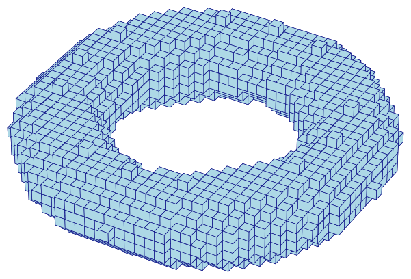
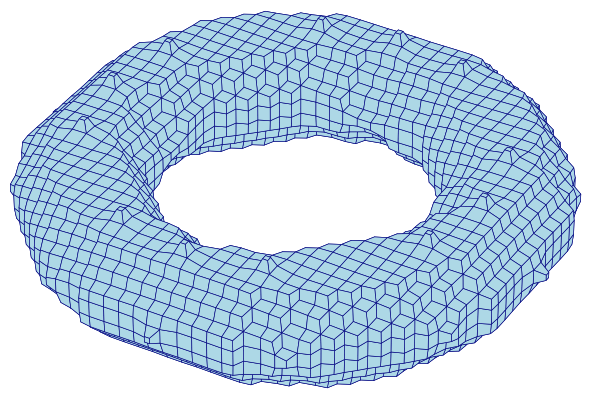

# Mesh example: Torus

The [Stanford bunny](../remesh/bunny.md) and [Unit sphere](../remesh/sphere.md)
pages both focus on `remesh`, which only produces valid output for
triangular surface meshes (see [Mesh](../../cli/mesh.md)).  Here we look at
the other side of `mesh`'s command chaining: `mesh hex smooth`, which
generates an all-hexahedral **volumetric** mesh directly from a segmentation
and smooths it in one command.  The shape is a torus — a genus-1, fully
closed solid, distinct from the bunny's open, boundary-having scan and the
sphere's genus-0 shell.

## Downloadable Files

Every file on this page is small and reproducible; each is also available
for direct download:

| file | description |
| :--- | :--- |
| [torus.npy](torus.npy) | The torus segmentation (see [Generating the Torus](#generating-the-torus)). |
| [torus_raw.inp](torus_raw.inp) | The raw (unsmoothed) all-hexahedral mesh (see [Chained: `mesh hex smooth`](#chained-mesh-hex-smooth)). |
| [torus_smooth.inp](torus_smooth.inp) | The same mesh after Taubin smoothing, produced by the single chained command below. |

## Generating the Torus

The torus is defined implicitly: a voxel at `(x, y, z)` is filled when
`(sqrt(x² + y²) − R)² + z² ≤ r²`, for major radius `R` and minor (tube)
radius `r`.  The torus lies flat in the `x`-`y` plane, so the segmentation
array needs a much larger extent in `x`/`y` (to span the outer diameter)
than in `z` (to span the tube only).

Voxelizing that implicit inequality directly leaves single-voxel "horns":
spurs that touch the torus body only edge- or corner-adjacent, an
aliasing artifact of the discretization rather than a feature of the torus
itself.  Two passes of morphological opening (erosion then dilation, with a
6-connected structuring element) remove them while leaving the ring's
connectivity and overall shape unchanged:

```python
<!-- cmdrun cat torus.py -->
```

```sh
<!-- cmdrun python torus.py > /dev/null -->
```

## Chained: `mesh hex smooth`

Without chaining, generating and smoothing a hex mesh takes two commands and
an intermediate file. With chaining, it's one command and no intermediate
file — `smooth` runs immediately on the mesh `mesh hex` just built, in
memory:

```sh
automesh mesh hex -r 0 -i torus.npy -o torus_smooth.inp smooth
<!-- cmdrun automesh mesh hex -r 0 -i torus.npy -o torus_smooth.inp smooth | ansifilter -->
```

> **Remark:** `-r 0` (removing void) must come *before* `-i`/`-o` here, not
> after.  `-r` accepts a variable number of IDs, so if it were the last flag
> before the `smooth` subcommand, it would try to consume `smooth` itself as
> another ID and fail to parse.  Placing a single-value flag like `-i` right
> after `-r` closes off its argument list unambiguously.

For comparison, the unsmoothed mesh:

```sh
automesh mesh hex -r 0 -i torus.npy -o torus_raw.inp
<!-- cmdrun automesh mesh hex -r 0 -i torus.npy -o torus_raw.inp | ansifilter -->
```

raw (3,552 elements) | smoothed (3,552 elements)
:---: | :---:
 | 

Figure: The same 3,552-element hexahedral mesh before (left) and after
(right) 20 iterations of Taubin smoothing, chained directly onto meshing.
Smoothing does not change the element or node count — it only relocates
nodes — so the voxel "staircasing" on the left becomes a smoothed
torus on the right.

## Smoothing's Effect on Element Quality

Smoothing improves the *visual* surface, but it is not free: moving nodes
off the regular voxel grid distorts elements that were, before smoothing,
perfect unit cubes.  [Metrics](../../cli/metrics.md) quantifies this
trade-off:

| metric | raw | smoothed (min) | smoothed (mean) | smoothed (max) |
| :--- | :---: | :---: | :---: | :---: |
| minimum scaled Jacobian | `1.000` | `0.500` | `0.933` | `1.000` |
| maximum skew | `0.000` | `0.000` | `0.090` | `0.337` |
| maximum edge ratio | `1.000` | `1.002` | `1.193` | `2.901` |

Every raw element is an identical unit cube, so its metrics are trivially
perfect.  After smoothing, most elements stay close to that ideal (mean
scaled Jacobian `0.933`), but the worst element — likely near the torus's
tight inner radius, where curvature is highest — drops to `0.500`.  For this
example that's still a well-shaped element, but it illustrates why
`automesh smooth`'s output is worth checking with `metrics` before it's
used, not just visually inspected.

## Chaining `remesh` After `mesh hex smooth` Fails

`mesh hex smooth` also accepts a further `remesh` subcommand at the command
line, but running it always fails on this torus, exactly as documented in
[Mesh](../../cli/mesh.md#mesh-hex-smooth) — `remesh` requires triangular
connectivity, and a hex mesh has none:

```sh
automesh mesh hex -r 0 -i torus.npy -o torus_bad.inp smooth remesh
```

```sh
Error: connectivity contains a non-triangular block.
```

Remeshing after smoothing is only meaningful for `mesh tri` (a triangular
isosurface, not a hex volume) — see the [Stanford bunny](../remesh/bunny.md)
and [Unit sphere](../remesh/sphere.md) pages for that case worked in full.

## Source

The figures on this page are produced by the following script, which reads
the segmentation directly (for the raw voxel view) and the smoothed `.inp`
mesh (extracting its exterior quad faces for the smoothed view):

```python
<!-- cmdrun cat torus_figures.py -->
```
