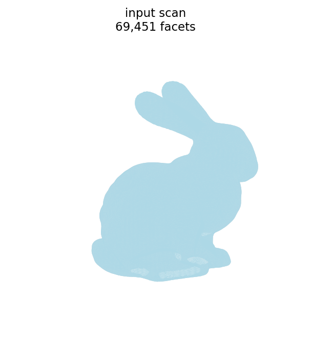
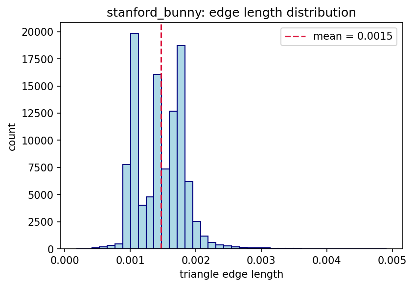
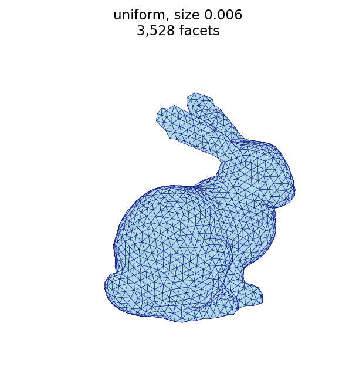
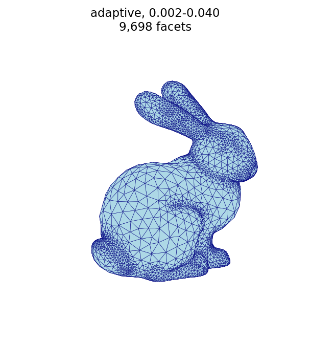
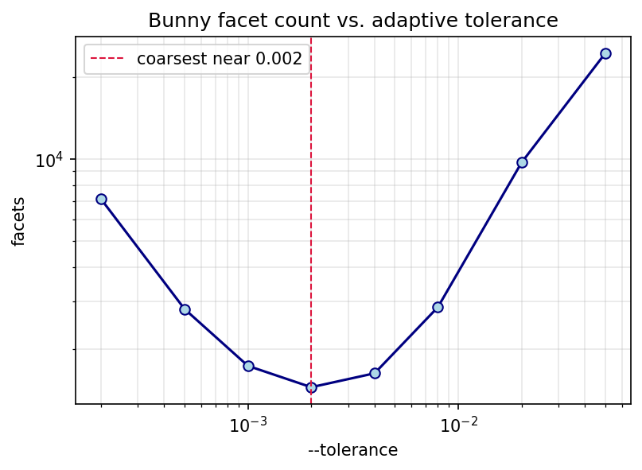
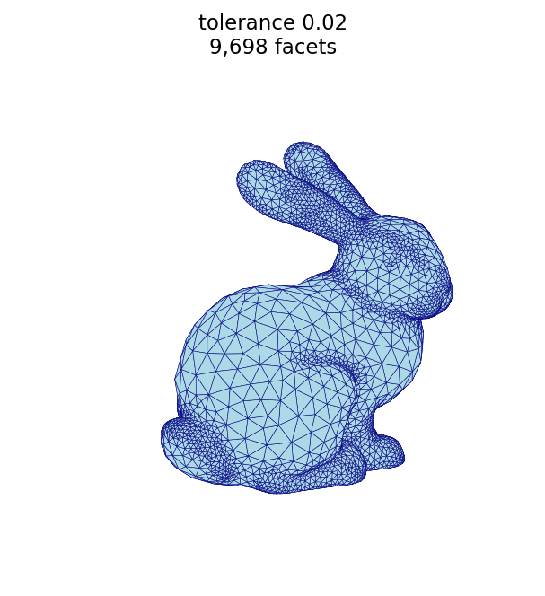
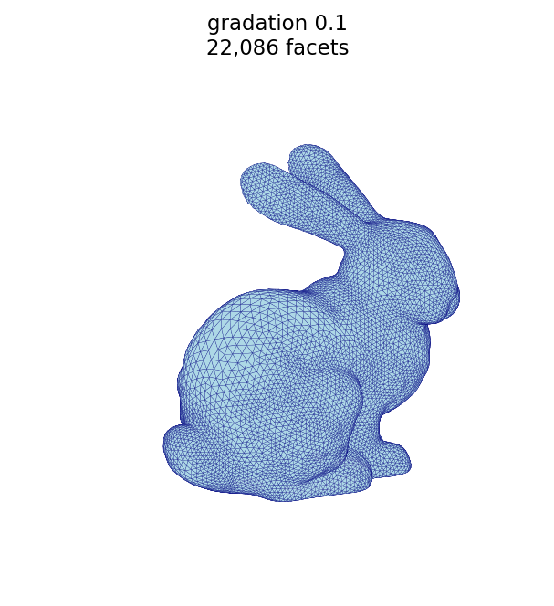
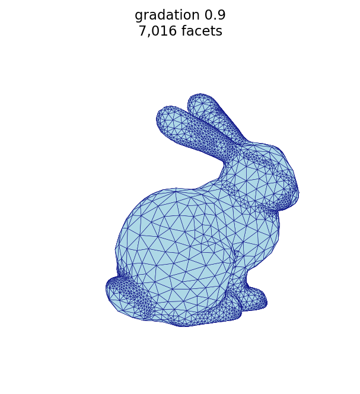

# Remesh example: Stanford bunny

The [Unit sphere](sphere.md) page uses an analytic sphere, whose constant
curvature makes uniform and adaptive sizing behave almost identically.  Here, we
work a second, more realistic example: the **Stanford bunny**, a scanned surface
with sharply varying curvature (ears, folds, paws) and, like most raw scans, a
few holes.  It shows how every `remesh` parameter behaves on a real mesh.

The Stanford bunny is a
[classic computer-graphics test model](https://en.wikipedia.org/wiki/Stanford_bunny),
originally scanned by Greg Turk and Marc Levoy at Stanford University in 1994.

## Download

The mesh used here is the cleaned bunny from Alec Jacobson's community
`common-3d-test-models` repository:

- [⬇ `stanford-bunny.obj` from Alec Jacobson's repository](https://github.com/alecjacobson/common-3d-test-models/blob/master/data/stanford-bunny.obj)
  (OBJ, 69,451 triangles)

`remesh` reads **binary STL**, not OBJ, so convert the downloaded file once with
the [`obj_to_binary_stl.py` helper](#helper-obj-to-binary-stl) (shown at the end
of this page), producing `stanford_bunny.stl`.  All commands on this page use that
converted file.

```sh
python obj_to_binary_stl.py stanford-bunny.obj stanford_bunny.stl
```

## The input mesh



| quantity | symbol | value |
| :--- | :---: | ---: |
| facets (triangles) | $f$ | 69,451 |
| points (vertices) | $v$ | 34,834 |
| edges | $e$ | 104,288 |
| boundary loops (holes) | | 5 |

The triangle edge lengths of the scan cluster near a mean of ≈ 0.0015:



Unlike the sphere, the bunny is **not watertight**.  It is a single connected,
manifold, genus-0 surface, but it is *open*: the base has five boundary loops
(holes) left by the scanner.  Consequently the closed-surface identities from the
[sphere example](sphere.md#relationship-to-triangular-subdivision) do **not**
hold here:

- $f = 69{,}451$ is **odd**, whereas a closed triangular mesh requires $3f = 2e$
  and therefore an even facet count.
- The Euler characteristic is $v - e + f = 34{,}834 - 104{,}288 + 69{,}451 = -3$
  (equivalently $2 - 2g - b$ with genus $g = 0$ and $b = 5$ holes), rather than
  the $2$ of a closed sphere.

Remeshing handles the open surface without trouble; the boundary loops are
preserved through remeshing.

## Uniform sizing (`--size`)

The target edge length sets the triangle size.  A smaller `--size` produces more,
smaller triangles; a larger `--size` produces fewer, larger triangles.

```sh
automesh remesh -i stanford_bunny.stl -o bunny_uniform_fine.stl   uniform -s 0.004 -n 20
automesh remesh -i stanford_bunny.stl -o bunny_uniform_coarse.stl uniform -s 0.006 -n 20
```

| fine, `-s 0.004` (7,715 facets) | coarse, `-s 0.006` (3,528 facets) |
| :---: | :---: |
|  |  |

## Iterations and coarsening (`--iterations`)

The bunny highlights an effect the sphere did not: **coarsening a fine mesh to a
large target edge length is iteration-limited.**  Each pass can only collapse
edges so much, so reaching a coarse target from a dense input takes several
passes.  At the same target `-s 0.006`, five iterations barely coarsen the
69,451-triangle input, while twenty iterations reach the target:

```sh
automesh remesh -i stanford_bunny.stl -o bunny_iter_n5.stl        uniform -s 0.006 -n 5
automesh remesh -i stanford_bunny.stl -o bunny_uniform_coarse.stl uniform -s 0.006 -n 20
```

| `-n 5` (29,826 facets) | `-n 20` (3,528 facets) |
| :---: | :---: |
|  |  |

This is the opposite regime from the sphere, where the input was already near the
target and five iterations sufficed.  When coarsening a dense scan, increase
`--iterations`.

## Uniform vs. adaptive

This is where the bunny differs most from the sphere.  Because the bunny's
curvature varies, *curvature-adaptive* sizing produces a visibly different mesh
from *uniform* sizing at the same triangle budget: adaptive keeps small triangles
on high-curvature features (ears, head, paws) and enlarges them on the smooth
flanks.

A wide edge-length spread (`--minimum 0.002 --maximum 0.040`) with a low
`--tolerance` accentuates this: only the highest-curvature regions are refined to
the minimum, while everything smooth relaxes toward the maximum.

```sh
automesh remesh -i stanford_bunny.stl -o bunny_compare_uniform.stl uniform  -s 0.0036 -n 20
automesh remesh -i stanford_bunny.stl -o bunny_adaptive.stl        adaptive --minimum 0.002 --maximum 0.040 -n 25 -t 0.02
```

| uniform (9,541 facets) | adaptive (9,698 facets) |
| :---: | :---: |
|  |  |

Both meshes use a similar number of facets, but adaptive spends them where the
surface bends most: the ears, head, and paws are finely triangulated while the
smooth flanks and haunches are left coarse.

## Adaptive curvature tolerance (`--tolerance`)

The tolerance sets the target edge length through the
[Dunyach sizing formula](https://diglib.eg.org/items/bd0987f0-b1d0-45cc-bde4-2a99ebf51946)[^Dunyach_2013],
as implemented in the [`conspire`](https://github.com/mrbuche/conspire.rs) Rust
library[^conspire] on which [`automesh`](https://github.com/autotwin/automesh) is
built:

$$ L = \sqrt{\frac{6\,\varepsilon}{\kappa} - 3\,\varepsilon^{2}}, \qquad \text{clamped to } [\text{minimum},\ \text{maximum}], $$

where $\varepsilon$ is the tolerance and $\kappa$ is the local surface curvature
(flat regions, $\kappa \to 0$, take the maximum edge length).

Its effect on the facet count is **not monotonic** — and this is the part that is
easy to get backwards.  Sweeping the tolerance at fixed
`--minimum 0.002 --maximum 0.040 -n 25` gives a U-shaped curve:

```sh
automesh remesh -i stanford_bunny.stl -o bunny_tol_tight.stl adaptive --minimum 0.002 --maximum 0.040 -n 25 -t 0.0002
automesh remesh -i stanford_bunny.stl -o bunny_tol_mid.stl   adaptive --minimum 0.002 --maximum 0.040 -n 25 -t 0.002
automesh remesh -i stanford_bunny.stl -o bunny_tol_loose.stl adaptive --minimum 0.002 --maximum 0.040 -n 25 -t 0.02
```



Both very small and very large tolerances refine the mesh; the *coarsest* result
is in between (near $\varepsilon \approx 0.002$ here):

| tight, `-t 0.0002` (7,133 facets) | moderate, `-t 0.002` (1,452 facets) | loose, `-t 0.02` (9,698 facets) |
| :---: | :---: | :---: |
|  |  |  |

Why the U shape?  The tolerance acts as a curvature cutoff $\kappa^{*} = 2/\varepsilon$:
regions sharper than $\kappa^{*}$ clamp to the minimum edge length, while flatter
regions follow the formula above.

- **Small $\varepsilon$** (large cutoff): few regions reach the cutoff, but the
  formula itself returns short edges wherever curvature is nonzero, so the mesh is
  fine.
- **Large $\varepsilon$** (small cutoff): the $-3\,\varepsilon^{2}$ term drives the
  argument negative over more of the surface, so more regions clamp to the
  minimum — the mesh is fine again.
- **In between**, most of the surface sits in the formula regime at moderate edge
  lengths, giving the coarsest mesh.

In practice, sweep the tolerance for your surface (as above), pick a value near
the coarse minimum, and set `--minimum`/`--maximum` for the resolution you want.
The sweep is produced by the
[`remesh_bunny_tolerance.py` script](#tolerance-study-script).

## Adaptive size gradation (`--gradation`)

The gradation limits how quickly the target edge length may change between
neighboring triangles.  A small gradation forces a slow, smooth transition, so
the fine triangles near features spread outward across the surface (many more
facets); a large gradation allows a rapid transition, keeping the refinement
localized to the features (fewer facets).  Using the same baseline as above
(`--minimum 0.002 --maximum 0.040 -n 25 -t 0.02`):

```sh
automesh remesh -i stanford_bunny.stl -o bunny_adapt_grad_lo.stl adaptive --minimum 0.002 --maximum 0.040 -n 25 -t 0.02 -g 0.1
automesh remesh -i stanford_bunny.stl -o bunny_adapt_grad_hi.stl adaptive --minimum 0.002 --maximum 0.040 -n 25 -t 0.02 -g 0.9
```

| `-g 0.1` — gradual (22,086 facets) | `-g 0.9` — sharp (7,016 facets) |
| :---: | :---: |
|  |  |

## Parameters at a glance

| parameter | mode | effect |
| :--- | :--- | :--- |
| `--size` | uniform | target edge length; smaller → more, smaller triangles |
| `--iterations` | both | number of passes; more passes are needed to reach a coarse target from a dense input |
| `--minimum` / `--maximum` | adaptive | bounds on edge length across the surface |
| `--tolerance` | adaptive | curvature cutoff in the Dunyach formula; facet count is non-monotonic (coarsest at a mid-range value) |
| `--gradation` | adaptive | rate the edge length may change between neighbors; smaller → more gradual (more facets), larger → sharper (fewer facets) |

## Figure script

The figures on this page are produced by the following script, which reads each
STL surface and renders it with a matched camera (remapping the bunny's `+y`
up-axis so it stands upright).

```python
<!-- cmdrun cat remesh_bunny_figures.py -->
```

## Tolerance study script

The [tolerance sweep](#adaptive-curvature-tolerance---tolerance) plot is produced
by the following script, which remeshes the bunny at several `--tolerance` values
and records the facet count:

```python
<!-- cmdrun cat remesh_bunny_tolerance.py -->
```

## Helper: OBJ to binary STL

The Stanford bunny is distributed as an OBJ, but `remesh` reads binary STL.  This
helper converts the downloaded OBJ to the `stanford_bunny.stl` used above:

```python
<!-- cmdrun cat obj_to_binary_stl.py -->
```

## References

[^Dunyach_2013]: Dunyach M, Vanderhaeghe D, Barthe L, Botsch M. Adaptive remeshing for real-time mesh deformation. In *Eurographics 2013 Short Papers*. 2013. [paper](https://diglib.eg.org/items/bd0987f0-b1d0-45cc-bde4-2a99ebf51946) · [DOI](https://doi.org/10.2312/conf/EG2013/short/029-032)

[^conspire]: Buché MR. *conspire* — a Rust library for computational continuum mechanics, version 0.7.1. [repository](https://github.com/mrbuche/conspire.rs) · [crate](https://docs.rs/crate/conspire)
