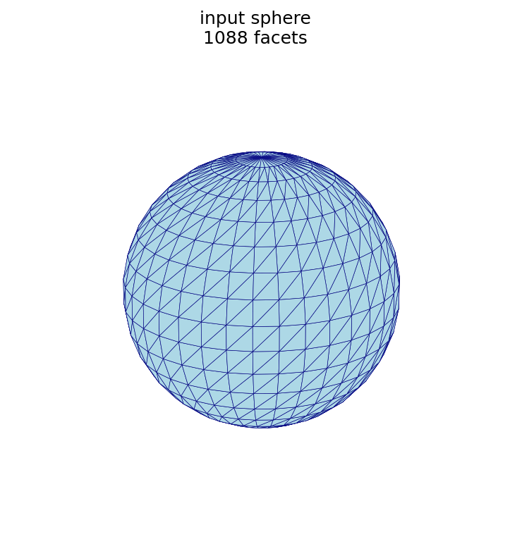
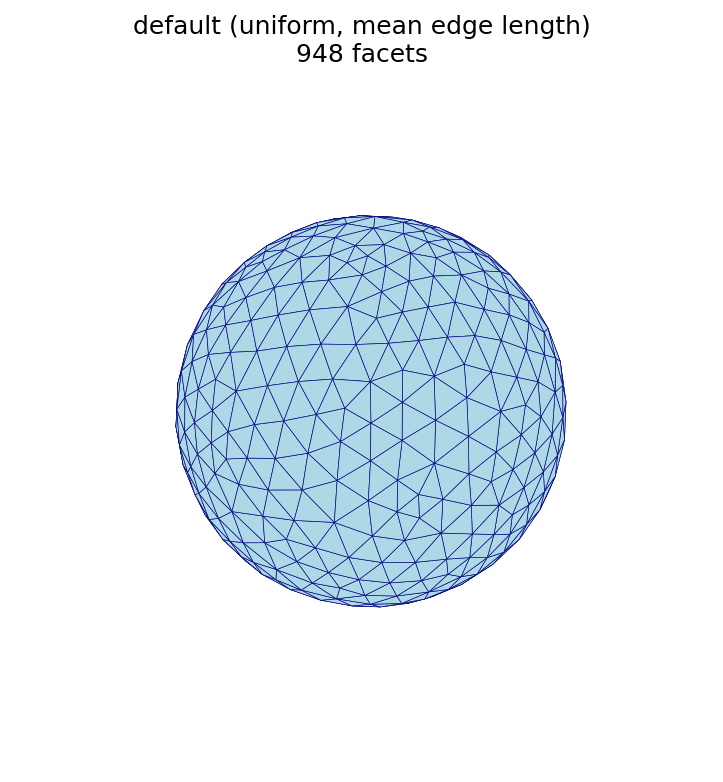
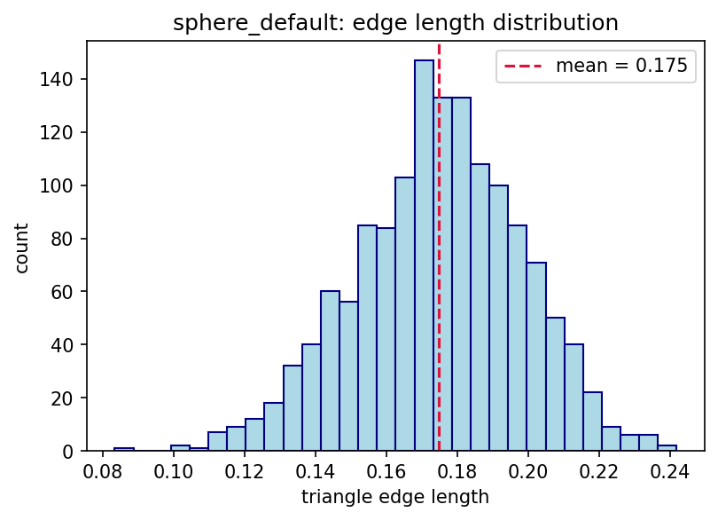
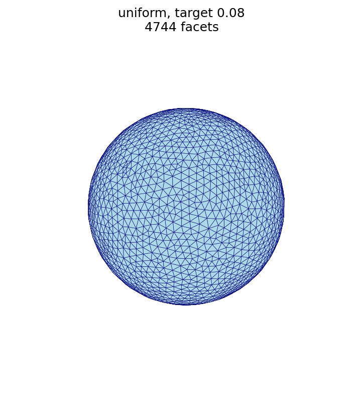
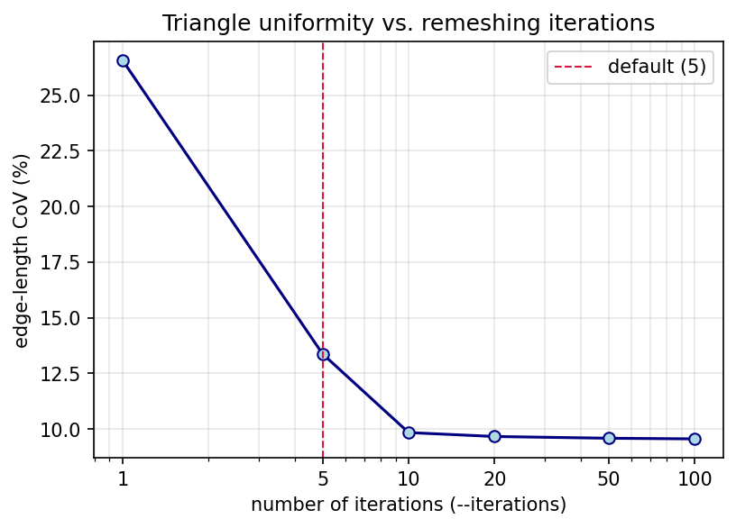
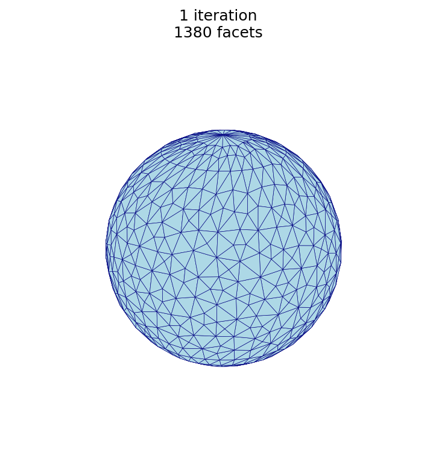
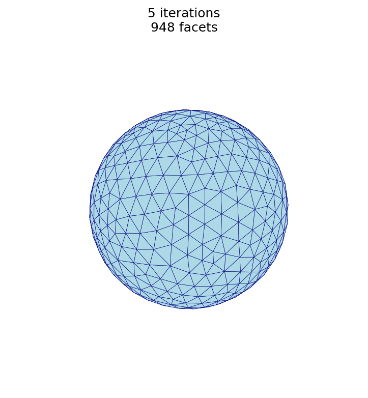
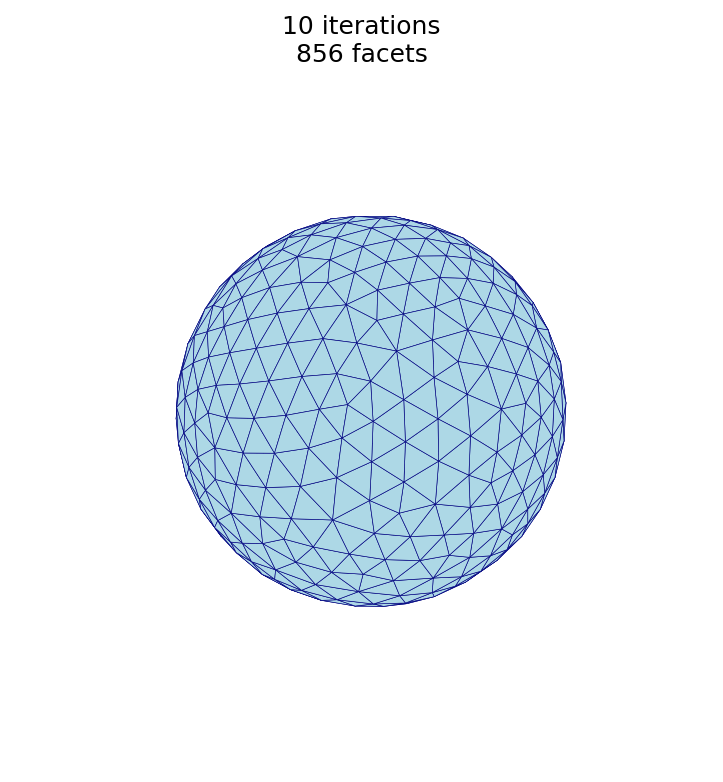
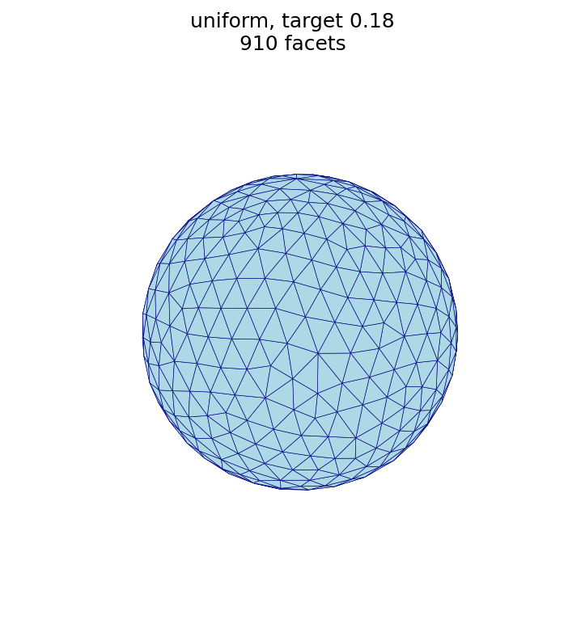

# Remesh example: unit sphere

This worked example applies [`remesh`](../../cli/remesh.md) to an analytic unit sphere
(radius ≈ 1).  Because a sphere has nearly constant curvature, uniform and
adaptive sizing produce almost the same result here — a useful baseline before
the [Stanford bunny](bunny.md), where they differ.

## The input mesh

[⬇ Download the example mesh: `sphere_radius_1.stl`](sphere_radius_1.stl)
(binary format, 54 kB)



### Statistics

| quantity | symbol | value |
| :--- | :---: | ---: |
| facets (triangles) | $f$ | 1,088 |
| points (vertices) | $v$ | 546 |
| edges | $e$ | 1,632 |

The mean triangle edge length is 0.178, and most edges cluster near it (see the
[edge-length histogram](#default-remesh) in the next section).

### Relationship to triangular subdivision

The [Subdivision](../../theory/subdivision.md) section gives the recursive
relationships for one $1\!\to\!4$ refinement of a closed triangular mesh:

$$ f_{i+1} = 4 f_i, \qquad e_{i+1} = 2 e_i + 3 f_i, \qquad v_{i+1} = v_i + e_i . $$

These relationships preserve two invariants of any *closed* triangular surface,
both of which the example sphere satisfies:

- **Edge–face relationship**, $e = \tfrac{3}{2} f$: every triangle has three
  edges and every edge is shared by two triangles, so
  $\tfrac{3}{2} \times 1{,}088 = 1{,}632 = e$. ✓
- **Euler characteristic**, $v - e + f = 2$ for a genus-0 (sphere-like)
  surface: $546 - 1{,}632 + 1{,}088 = 2$. ✓

These statistics, and the histograms below, are produced by the
[figure script](#figure-script) at the end of this page.

## Default remesh

Running `remesh` with no mode or size uses `uniform` sizing at the mean edge
length of the input, which regularizes the surface at its existing resolution:
the triangles become more uniform in size and shape while the facet count stays
close to the input.

```sh
automesh remesh -i sphere_radius_1.stl -o sphere_default.stl
```

| base (1,088 facets) | default (948 facets) |
| :---: | :---: |
|  |  |
|  |  |

The histograms show the effect of remeshing on triangle edge lengths: the base
mesh has an irregular, spiky distribution, while the default remesh produces a
tighter, bell-shaped distribution centered near the mean edge length.

## Uniform sizing: coarse vs. fine

A larger target edge length produces fewer, larger triangles; a smaller target
edge length produces many more, smaller triangles.

```sh
automesh remesh -i sphere_radius_1.stl -o sphere_uniform_coarse.stl uniform -s 0.35
automesh remesh -i sphere_radius_1.stl -o sphere_uniform_fine.stl   uniform -s 0.08
```

| base (1,088 facets) | coarse, `-s 0.35` (440 facets) | fine, `-s 0.08` (4,744 facets) |
| :---: | :---: | :---: |
|  |  |  |

## Effect of the number of iterations

More iterations make the triangles more uniform, but with strongly diminishing
returns.  The sphere is remeshed at the default target edge length for a range of
`--iterations` values, one output per value:

```sh
automesh remesh -i sphere_radius_1.stl -o sphere_n1.stl   uniform -n 1
automesh remesh -i sphere_radius_1.stl -o sphere_n5.stl   uniform -n 5
automesh remesh -i sphere_radius_1.stl -o sphere_n10.stl  uniform -n 10
automesh remesh -i sphere_radius_1.stl -o sphere_n20.stl  uniform -n 20
automesh remesh -i sphere_radius_1.stl -o sphere_n50.stl  uniform -n 50
automesh remesh -i sphere_radius_1.stl -o sphere_n100.stl uniform -n 100
```

Measuring the edge-length *coefficient of variation* of each result
(CoV $= \text{std} / \text{mean}$, smaller is more uniform) gives:

| iterations `-n` | facets | mean edge | CoV |
| ---: | ---: | ---: | ---: |
| 1 | 1,380 | 0.154 | 26.6% |
| 5 *(default)* | 948 | 0.175 | 13.4% |
| 10 | 856 | 0.183 | 9.8% |
| 20 | 846 | 0.184 | 9.7% |
| 50 | 838 | 0.185 | 9.6% |
| 100 | 830 | 0.186 | 9.6% |



Most of the improvement happens within the first ~10 passes; beyond that the CoV
plateaus at an irreducible floor (≈ 9.6% here — a sphere cannot be tiled with
perfectly equal edges), so additional iterations cost time without making the
triangles measurably more uniform.  For this mesh, `-n 10` to `-n 20` is a
practical sweet spot.

The same trend is visible in the meshes themselves — the triangulation grows more
regular from 1 to 10 iterations:

| `-n 1` (1,380 facets) | `-n 5` (948 facets) | `-n 10` (856 facets) |
| :---: | :---: | :---: |
|  |  |  |

This study is produced by the
[`remesh_iterations.py` script](#iteration-study-script) shown at the end of the
page.

## Uniform vs. adaptive

```sh
automesh remesh -i sphere_radius_1.stl -o sphere_uniform.stl  uniform  -s 0.18
automesh remesh -i sphere_radius_1.stl -o sphere_adaptive.stl adaptive --minimum 0.05 --maximum 0.30
```

| uniform, `-s 0.18` (910 facets) | adaptive, `0.05–0.30` (458 facets) |
| :---: | :---: |
|  |  |

> **Note.** A sphere has (nearly) constant curvature, so curvature-adaptive
> sizing produces an almost uniform result here — the two meshes above look
> similar.  On a model with varying curvature (sharp features together with flat
> regions), adaptive sizing refines the high-curvature regions and coarsens the
> flat ones, which uniform sizing cannot do.  See the
> [Stanford bunny example](bunny.md) for a mesh where uniform and adaptive
> sizing differ visibly.

## Figure script

The figures on this page are produced by the following script, which reads each
STL surface and renders it with a matched camera.

```python
<!-- cmdrun cat remesh_figures.py -->
```

## Iteration study script

The [effect-of-iterations](#effect-of-the-number-of-iterations) table and plot
are produced by the following script, which remeshes the sphere at several
`--iterations` values and measures the edge-length coefficient of variation:

```python
<!-- cmdrun cat remesh_iterations.py -->
```

## Converting ASCII STL to binary STL

`remesh` requires binary STL for both input and output.  If your surface is an
ASCII STL, the following script converts it to binary STL:

```python
<!-- cmdrun cat ascii_to_binary_stl.py -->
```

Run it as:

```sh
python ascii_to_binary_stl.py input_ascii.stl output_binary.stl
```
