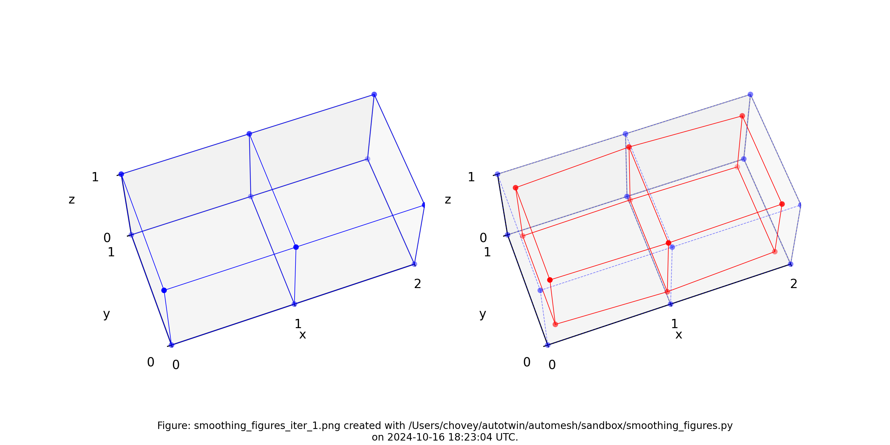
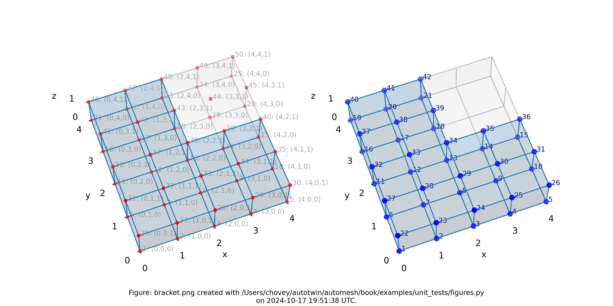

# Smoothing

## Double X

We examine the most basic type of smoothing, Laplace smoothing
without hierarchical control, with the [Double X](../unit_tests/README.md#double-x) example.


Figure: The **Double X** two-element example.

Table. The *neighborhoods table*. A node, with its neighbors, is considered a single neighborhood.  The table has twelve neighborhoods.

node | node neighbors
:---: | :---:
1  | 2, 4, 7
2  | 1, 3, 5, 8
3  | 2, 6, 9
4  | 1, 5, 10
5  | 2, 4, 6, 11
6  | 3, 5, 12
7  | 1, 8, 10
8  | 2, 7, 9, 11
9  | 3, 8, 12
10 | 4, 7, 11
11 | 5, 8, 10, 12
12 | 6, 9, 11

### Hierarchy

Following is a test where all nodes are `BOUNDARY` from the [`Hierarchy`](../../theory/smoothing.md#the-hierarchy-enum) enum.

```python
node_smoothing_categories: Hierarchy = (
    1,
    1,
    1,
    1,
    1,
    1,
    1,
    1,
    1,
    1,
    1,
    1,
)
```

> Since there are no `INTERIOR` nodes nor `PRESCRIBED` nodes, the effect of hiearchical smoothing is nill, and the same effect would be observed were all nodes categorized as `INTERIOR` nodes.


#### Iteration `1`

Table: The smoothed configuration `(x, y, z)` after one iteration of Laplace smoothing.

node | `x` | `y` | `z`
:---: | :--- | :--- | :---
1 | 0.1 | 0.1 |0.1
2 | 1.0 | 0.075 | 0.075
3 | 1.9 | 0.1 |0.1
4 | 0.1 | 0.9 | 0.1
5 | 1.0 | 0.925 | 0.075
6 | 1.9 | 0.9 | 0.1
7 | 0.1 | 0.1 |0.9
8 | 1.0 | 0.075 | 0.925
9 | 1.9 | 0.1 | 0.9
10 | 0.1 | 0.9 | 0.9
11 | 1.0 | 0.925 | 0.925
12 | 1.9 | 0.9 | 0.9



Figure: Two element test problem (left) original configuration, (right) subject to two iterations of Laplace smoothing.

#### Iteration `2`

node | `x` | `y` | `z`
:---: | :--- | :--- | :---
1  | 0.19 | 0.1775 | 0.1775
2  | 1.0  | 0.1425 | 0.1425
3  | 1.81 | 0.1775 | 0.1775
4  | 0.19 | 0.8225 | 0.1775
5  | 1.0  | 0.8575 | 0.1425
6  | 1.81 | 0.8225 | 0.1775
7  | 0.19 | 0.1775 | 0.8225
8  | 1.0  | 0.1425 | 0.8575
9  | 1.81 | 0.1775 | 0.8225
10 | 0.19 | 0.8225 | 0.8225
11 | 1.0  | 0.8575 | 0.8575
12 | 1.81 | 0.8225 | 0.8225


Figure: Two element test problem (left) original configuration, (right) subject to two iterations of Laplace smoothing.

#### Iteration `100`

A known drawback of Laplace smoothing is that it can fail to preserve volumes.  In the limit, volumes get reduced to a point, as illustrated in the figure below.


Figure: Two element test problem (left) original configuration, (right) subject to `[1, 2, 3, 4, 5, 10, 20, 30, 100` iterations of Laplace smoothing.  Animation created with [Ezgif](https://ezgif.com/).

## Bracket

To begin to examine hiearchical control, we consider the [Bracket](../unit_tests/README.md#bracket) example.



Figure: The **Bracket** example.

The goal of this example is to demonstrate `PRESCRIBED` hierarchical smoothing.

```python
node_smoothing_categories: Hierarchy = (
    # hierarchy enum, node number, prescribed (x, y, z)
    2, #  1 -> (0, 0, 0)
    2, #  2 -> (1, 0, 0)
    2, #  3 -> (2, 0, 0)
    2, #  4 -> (3, 0, 0)
    2, #  5 -> (4, 0, 0)
    2, #  6 -> (0, 1, 0)
    1, #  7
    1, #  8
    1, #  9
    2, # 10 -> (4*cos(22.5 deg), 4*sin(22.5 deg), 0)
    2, # 11 -> *(0, 2, 0)
    1, # 12
    1, # 13
    1, # 14
    2, # 15 -> (4*cos(45 deg), 4*sin(45 deg), 0)
    2, # 16 -> (0, 3, 0)
    1, # 17
    1, # 18
    2, # 19 -> (0, 4, 0)
    2, # 20 -> (4*cos(67.5 deg), 4*sin(67.5 deg), 0)
    2, # 21 -> (4*cos(45 deg), 4*sin(45 deg), 0)
    # similarly repeated for the z=1 layer, nodes 22 to 42
)
```
