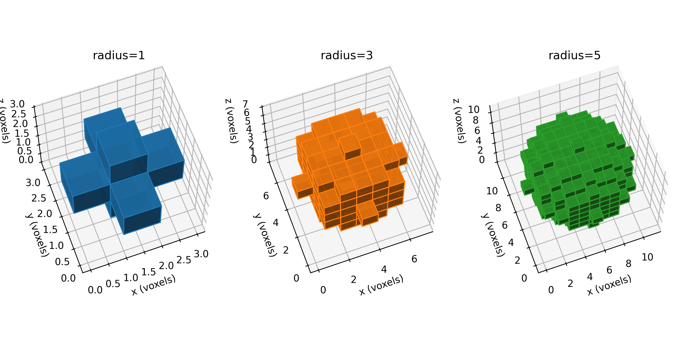

# Spheres

We segment a sphere into coarse voxel meshes.

## Segmentation

Using [spheres.py](spheres.py),

```python
<!-- cmdrun cat spheres.py -->
```

create very coarse spheres of varying
resolution (`radius=1`, `radius=3`, and `radius=5`), as shown below:



Figure: Sphere segmentations at selected resolutions, shown in the voxel domain.

For the `radius=1` case, the underyling data structure appears as:

```python
spheres["radius_1"]

array([[[0, 0, 0],
        [0, 1, 0],
        [0, 0, 0]],

       [[0, 1, 0],
        [1, 1, 1],
        [0, 1, 0]],

       [[0, 0, 0],
        [0, 1, 0],
        [0, 0, 0]]], dtype=uint8)
```

For the `radius=3` case, the underyling data structure appears as:

```python
spheres["sradius_3"]

array([[[0, 0, 0, 0, 0, 0, 0],
        [0, 0, 0, 0, 0, 0, 0],
        [0, 0, 0, 0, 0, 0, 0],
        [0, 0, 0, 1, 0, 0, 0],
        [0, 0, 0, 0, 0, 0, 0],
        [0, 0, 0, 0, 0, 0, 0],
        [0, 0, 0, 0, 0, 0, 0]],

       [[0, 0, 0, 0, 0, 0, 0],
        [0, 0, 1, 1, 1, 0, 0],
        [0, 1, 1, 1, 1, 1, 0],
        [0, 1, 1, 1, 1, 1, 0],
        [0, 1, 1, 1, 1, 1, 0],
        [0, 0, 1, 1, 1, 0, 0],
        [0, 0, 0, 0, 0, 0, 0]],

       [[0, 0, 0, 0, 0, 0, 0],
        [0, 1, 1, 1, 1, 1, 0],
        [0, 1, 1, 1, 1, 1, 0],
        [0, 1, 1, 1, 1, 1, 0],
        [0, 1, 1, 1, 1, 1, 0],
        [0, 1, 1, 1, 1, 1, 0],
        [0, 0, 0, 0, 0, 0, 0]],

       [[0, 0, 0, 1, 0, 0, 0],
        [0, 1, 1, 1, 1, 1, 0],
        [0, 1, 1, 1, 1, 1, 0],
        [1, 1, 1, 1, 1, 1, 1],
        [0, 1, 1, 1, 1, 1, 0],
        [0, 1, 1, 1, 1, 1, 0],
        [0, 0, 0, 1, 0, 0, 0]],

       [[0, 0, 0, 0, 0, 0, 0],
        [0, 1, 1, 1, 1, 1, 0],
        [0, 1, 1, 1, 1, 1, 0],
        [0, 1, 1, 1, 1, 1, 0],
        [0, 1, 1, 1, 1, 1, 0],
        [0, 1, 1, 1, 1, 1, 0],
        [0, 0, 0, 0, 0, 0, 0]],

       [[0, 0, 0, 0, 0, 0, 0],
        [0, 0, 1, 1, 1, 0, 0],
        [0, 1, 1, 1, 1, 1, 0],
        [0, 1, 1, 1, 1, 1, 0],
        [0, 1, 1, 1, 1, 1, 0],
        [0, 0, 1, 1, 1, 0, 0],
        [0, 0, 0, 0, 0, 0, 0]],

       [[0, 0, 0, 0, 0, 0, 0],
        [0, 0, 0, 0, 0, 0, 0],
        [0, 0, 0, 0, 0, 0, 0],
        [0, 0, 0, 1, 0, 0, 0],
        [0, 0, 0, 0, 0, 0, 0],
        [0, 0, 0, 0, 0, 0, 0],
        [0, 0, 0, 0, 0, 0, 0]]], dtype=uint8)
```

Because of its large size, the data structure for `sphere_5` is not shown here.

These segmentations are saved to

* [spheres_radius_1.npy](spheres_radius_1.npy)
* [spheres_radius_3.npy](spheres_radius_3.npy)
* [spheres_radius_5.npy](spheres_radius_5.npy)

## Autotwin

`Autotwin` is used to convert the `.npy` segmentations into `.inp` meshes.

```sh
automesh -i spheres_radius_1.npy -o spheres_radius_1.inp -x 3 -y 3 -z 3
```

```sh
automesh -i spheres_radius_3.npy -o spheres_radius_3.inp -x 7 -y 7 -z 7
```

```sh
automesh -i spheres_radius_5.npy -o spheres_radius_5_.inp -x 11 -y 11 -z 11
```

## Mesh

The `spheres_radius_1.inp` file:

```sh
<!-- cmdrun cat spheres_radius_1.inp -->
```

The `spheres_radius_3.inp` file:

```sh
<!-- cmdrun cat spheres_radius_3.inp -->
```

Because of its large size, the mesh structure for `sphere_5` is not shown here.
