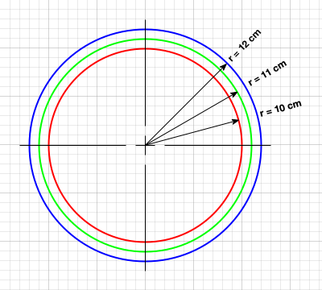
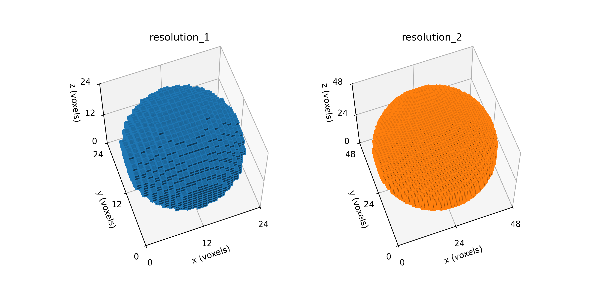

# Spheres - Continued

Use the fundamentals learned in the [previous example](../spheres/README.md) to create a more sophisticated example:  Concentric, high-resolution spheres consisting of three materials.

## Problem Statement

### Given

Given three concentric spheres of radius 10, 11, and 12 cm, as shown in the figure below,



Figure: Schematic cross-section of three concentric spheres of radius 10, 11, and 12 cm.  Grid spacing is 1 cm.

### Find

Use the following segmentation resolutions,

resolution (vox/cm) | element side length (cm) | `nelx` | # voxels
---: | :---: | ---: | ---:
1 | 1.0 | 24 | 13,824
2 | 0.5 | 48 | 110,592
4 | 025 | 96 | 884,736
10 | 0.1 | 240 | 13,824,000

with a cubic domain (`nelx = nely = nelz`),
to create finite element meshes.

## Solution

### Python Segmentation

Use [spheres_cont.py](spheres_cont.py) to create segmentations,

```python
<!-- cmdrun cat spheres_cont.py -->
```



Figure: Sphere segmentations at selected resolutions, shown in the voxel domain.

### Autotwin

Use `Autotwin` to convert the segmentations into finite element meshes.

```sh
automesh -i spheres_resolution_1.npy -o spheres_resolution_1.inp -x 24 -y 24 -z 24 -xtranslate -12 -ytranslate -12 -ztranslate -12
# didn't work

automesh -i spheres_resolution_1.npy -o spheres_resolution_1.inp -x 24 -y 24 -z 24 --xtranslate 24 --ytranslate 24 --ztranslate 24
# works
```

But translating in a negative direction seems to be error prone:

```sh
automesh -i spheres_resolution_1.npy -o spheres_resolution_1.inp -x 24 -y 24 -z 24 --xtranslate -24 --ytranslate 24 --ztranslate 24
# didn't work

error: unexpected argument '-2' found
```

### Meshes
