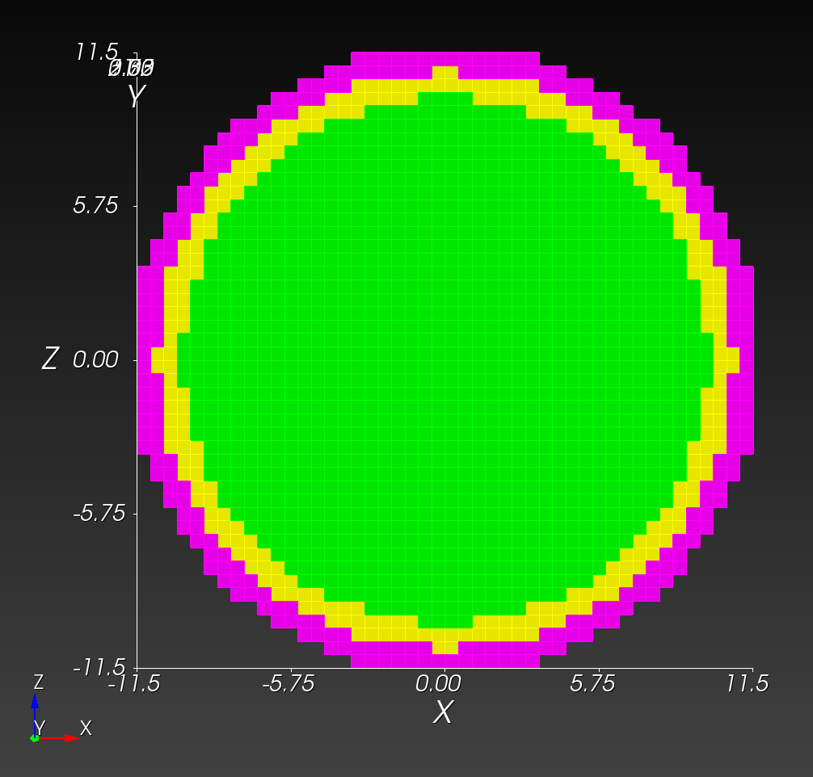
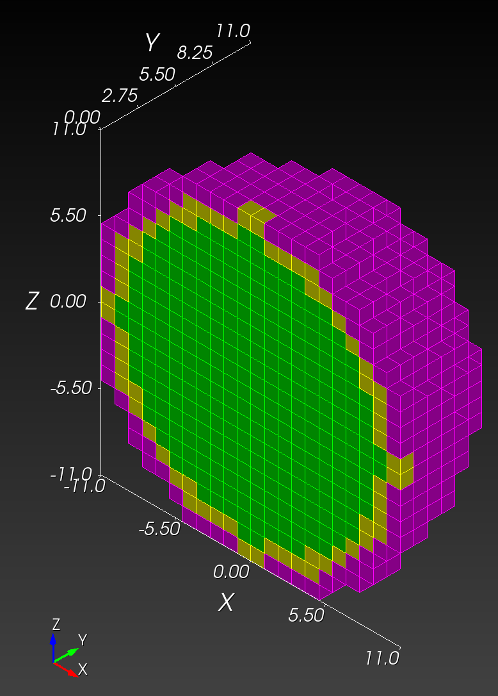

# Spheres - Continued

Use the fundamentals learned in the [previous example](../spheres/README.md) to create a more sophisticated example:  Concentric, high-resolution spheres consisting of three materials.

## Problem Statement

### Given

Given three concentric spheres of radius 10, 11, and 12 cm, as shown in the figure below,


Figure: Schematic cross-section of three concentric spheres of radius 10, 11, and 12 cm.  Grid spacing is 1 cm.

### Find

Use the following segmentation resolutions,

resolution (vox/cm) | element side length (cm) | `nelx` | # voxels
---: | :---: | ---: | ---:
1 | 1.0 | 24 | 13,824
2 | 0.5 | 48 | 110,592
4 | 0.25 | 96 | 884,736
10 | 0.1 | 240 | 13,824,000

with a cubic domain (`nelx = nely = nelz`),
to create finite element meshes.

## Solution

### Python Segmentation

Use [spheres_cont.py](spheres_cont.py) to create segmentations,

```python
<!-- cmdrun cat spheres_cont.py -->
```


Figure: Sphere segmentations at selected resolutions, shown in the voxel domain.
Because plotting large domains with [*Matplotlib*](https://matplotlib.org)
is slow, only the first two resolutions are shown.

### automesh

Use `automesh` to convert the segmentations into finite element meshes.

```sh
cd ~/autotwin/automesh/book/examples/spheres_cont/

automesh -i spheres_resolution_1.npy -o spheres_resolution_1.inp \
-x 24 -y 24 -z 24 \
--xtranslate -12 --ytranslate -12 --ztranslate -12

automesh -i spheres_resolution_2.npy -o spheres_resolution_2.inp \
-x 48 -y 48 -z 48 \
--xscale 0.5 --yscale 0.5 --yzscale 0.5 \
--xtranslate -12 --ytranslate -12 --ztranslate -12

automesh -i spheres_resolution_3.npy -o spheres_resolution_3.inp \
-x 96 -y 96 -z 96 \
--xscale 0.25 --yscale 0.25 --zscale 0.25 \
--xtranslate -12 --ytranslate -12 --ztranslate -12

automesh -i spheres_resolution_4.npy -o spheres_resolution_4.inp \
-x 240 -y 240 -z 240 \
--xtranslate -12 --ytranslate -12 --ztranslate -12

```

resolution | 1 vox/cm | 2 vox/cm | 4 vox/cm | 10 vox/cm
---------- | -------- | -------- | -------- | ---------
midline   |  |  |  |
isometric  |  |  |  |

Figure: Finite element meshes at various resolutions, shown with half-symmetric cut plane, in front view and isometric view.

Table: Summary of vital results with `automesh` version `0.1.7`.

resolution (vox/cm) | processing time | `.npy` file size | `.inp` file size (MB) | `.g` file size (MB)
---: | ---:     | ---:    | ---:  | ---:
1    | 3.24 sec | 14 kB   | 0.962 | 0.557
2    | 15.2 sec | 111 kB  |   8.5 |   4.5
4    | 13.5 min | 885 kB  |  73.6 |  36.8
10   | xxx      | 13.8 MB |  xxxx | xxxxx

#TODO: Comparison with Sculpt on a single processor, for timing and file size.

Cubit is used for the visualizations with the following recipe:

```sh
reset
import abaqus  "/Users/chovey/autotwin/automesh/book/examples/spheres_cont/spheres_resolution_1.inp" 

set exodus netcdf4 off
set large exodus file on
export mesh "/Users/chovey/autotwin/automesh/book/examples/spheres_cont/spheres_resolution_1.g"  overwrite 

reset
import mesh "/Users/chovey/autotwin/automesh/book/examples/spheres_cont/spheres_resolution_1.g" lite

graphics scale off
graphics scale on

graphics clip off
view iso
graphics clip on plane location 0 -1.0 0 direction 0 1 0
view up 0 0 1
view from 100 -100 100

graphics clip manipulation off

view bottom
```

## Comparison

Set up reference to the Sculpt binary,

```sh
alias sculpt='/Applications/Cubit-16.14/Cubit.app/Contents/MacOS/sculpt'
```

Convert `.npy` files to `.spn` files (see temporary development, https://github.com/hovey/rustschool/tree/main/npy2spn, to be migrated to `automesh` soon as part of the `clap` extension feature, https://github.com/autotwin/automesh/issues/117)

```sh
alias npy2spn='/Users/chovey/rustschool/npy2spn/target/release/npy2spn'
```

Run Sculpt

```sh
cd ~/autotwin/automesh/book/examples/spheres_cont/

sculpt --num_procs 1 --input_spn
```

### Using `sculpt_stl_to_inp`

We compare results above to a similar problem meshed with Sculpt.
Using [three_material_vox_m.yml](https://github.com/autotwin/basis/blob/main/data/three_material/three_material_vox_m.yml), then

```sh
cd ~/autotwin/mesh/
source .venv/bin/activate.fish

arch -x86_64 python3.11 ~/autotwin/mesh/src/atmesh/sculpt_stl_to_inp.py ~/autotwin/basis/data/three_material/three_material_vox_m.yml

```
