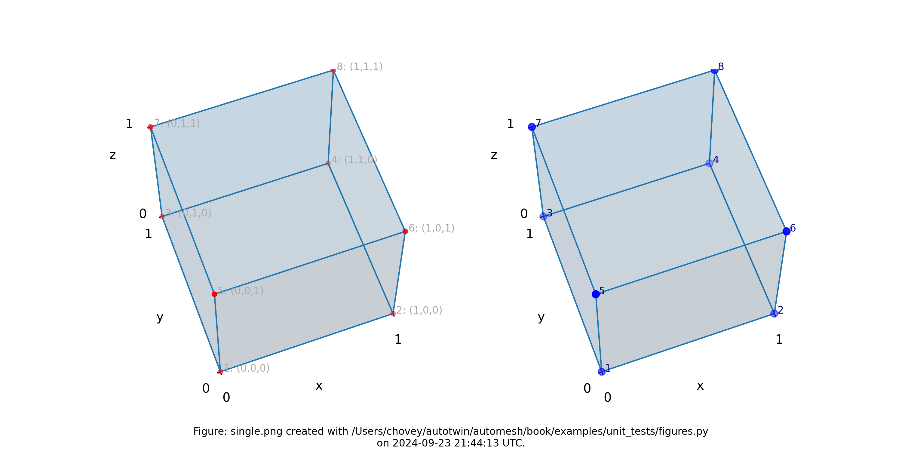
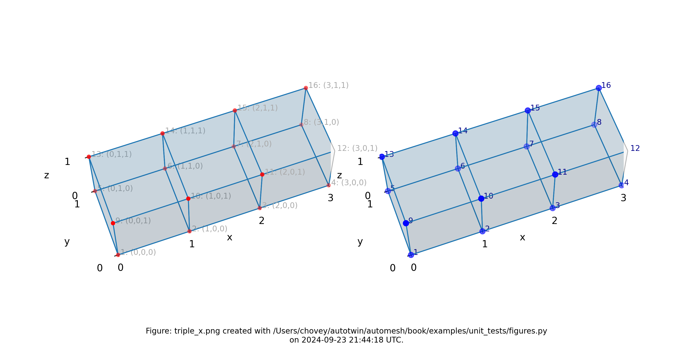
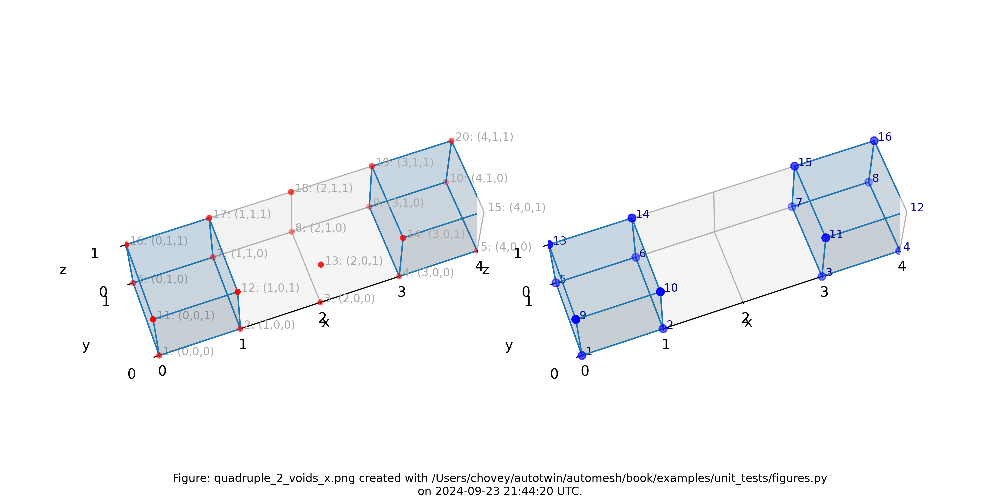
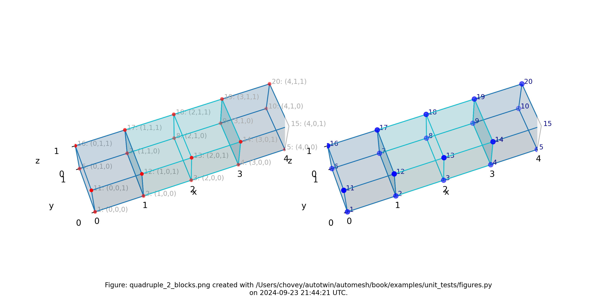
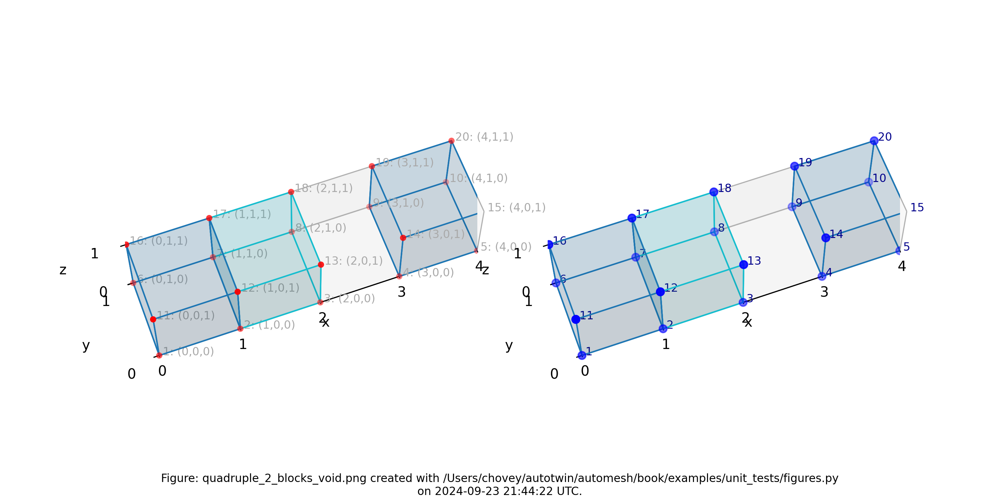
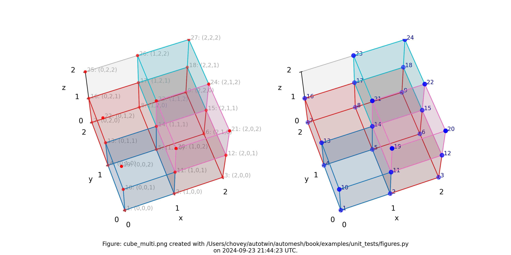
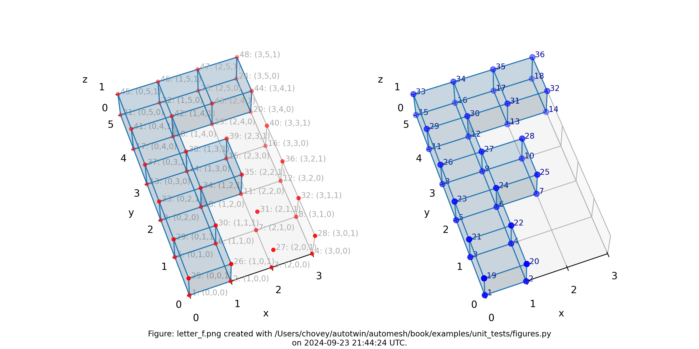
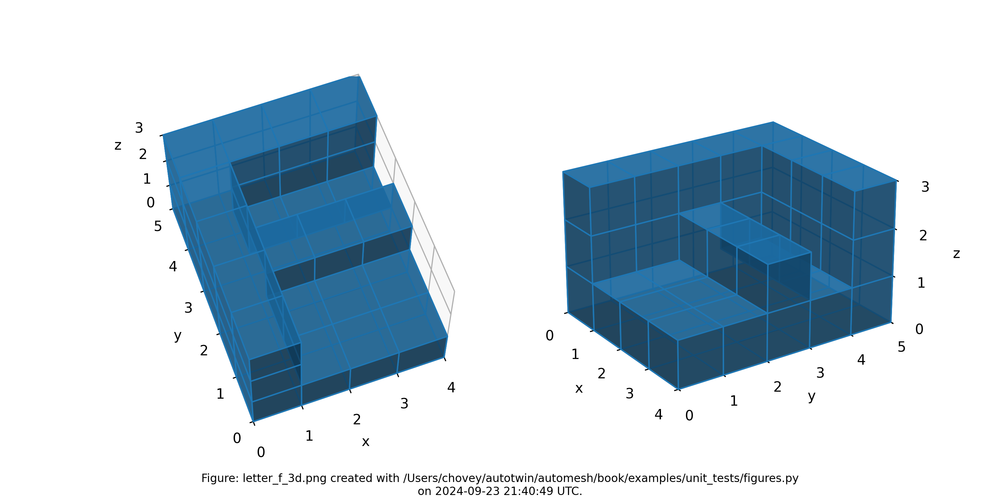

# Tests

Following is documentation for unit tests used to validate code implementation.
The Python script used to generate the figures is included [below](#source).

**Remark:** We use the convention `np` when importing `numpy` as follows:

```python
import numpy as np
```

### Single

The minimum working example (MWE) is a single voxel, used to create a single
mesh consisting of one block consisting of a single element.  The NumPy input
[single.npy](https://github.com/autotwin/automesh/raw/main/tests/input/single.npy)
contains the following segmentation:

```python
segmentation = np.array(
    [
        [
            [
                11,
            ],
        ],
    ],
    dtype=np.uint8,
)
```

where the segmentation `11` denotes block `11` in the finite element mesh.

**Remark:** Serialization (write and read)

| Write | Read |
|----------|----------|
| Use the [np.save](https://numpy.org/doc/stable/reference/generated/numpy.save.html) command to serialize the segmentation a `.npy` file  | Use the [np.load](https://numpy.org/doc/stable/reference/generated/numpy.load.html) command to deserialize the segmentation from a `.npy` file  |
*Example: Write the data in `segmentation` to a file called `seg.npy`*</br></br>`np.save("seg.npy", segmentation)` | *Example: Read the data from the file `seg.npy` to a variable called `loaded_array`*</br></br>`loaded_array = np.load("seg.npy")`

Equivalently, the [single.spn](https://raw.githubusercontent.com/autotwin/automesh/main/tests/input/single.spn) contains a
single integer:

```bash
11
```

The resulting finite element mesh is visualized is shown in the following
figure:



Figure: The `single.png` visualization, (left) lattice node numbers, (right)
mesh node numbers.  Lattice node numbers appear in gray, with `(x, y, z)`
indices in parenthesis.  The right-hand rule is used.  Lattice coordinates
start at `(0, 0, 0)`, and proceed along the `x-axis`, then
the `y-axis`, and then the `z-axis`.

The finite element mesh local node numbering map to the following global node
numbers:

```bash
[1, 2, 4, 3, 5, 6, 8, 7] -> [1, 2, 5, 3, 5, 6, 8, 7]
```

which is a special case not typically observed, as shown in more complex
examples below.

## Double

The next level of complexity example is a two-voxel domain, used to create
a single block composed of two finite elements.  We test propagation in
both the `x` and `y` directions.  The figures below show these two
meshes.

### Double X

```python
segmentation = np.array(
    [
        [
            [
                11, 11
            ],
        ],
    ],
    dtype=np.uint8,
)
```

where the segmentation `11` denotes block `11` in the finite element mesh.


Figure: Mesh composed of a single block with two elements, propagating along
the `x-axis`, (left) lattice node numbers, (right) mesh node numbers.

### Double Y

```python
segmentation = np.array(
    [
        [
            [
                11,
            ],
            [
                11,
            ],
        ],
    ],
    dtype=np.uint8,
)
```

where the segmentation `11` denotes block `11` in the finite element mesh.


Figure: Mesh composed of a single block with two elements, propagating along
the `y-axis`, (left) lattice node numbers, (right) mesh node numbers.

## Triple

```python
segmentation = np.array(
    [
        [
            [
                11,
                11,
                11,
            ],
        ],
    ],
    dtype=np.uint8,
)
```

where the segmentation `11` denotes block `11` in the finite element mesh.



Figure: Mesh composed of a single block with three elements, propagating along
the `x-axis`, (left) lattice node numbers, (right) mesh node numbers.

## Quadruple

```python
segmentation = np.array(
    [
        [
            [
                11,
                11,
                11,
                11,
            ],
        ],
    ],
    dtype=np.uint8,
)
```

where the segmentation `11` denotes block `11` in the finite element mesh.


Figure: Mesh composed of a single block with four elements, propagating along
the `x-axis`, (left) lattice node numbers, (right) mesh node numbers.

## Quadruple with Voids

```python
egmentation = np.array(
    [
        [
            [
                99,
                0,
                0,
                99,
            ],
        ],
    ],
    dtype=np.uint8,
)
```

where the segmentation `99` denotes block `99` in the finite element mesh, and segmentation `0` is excluded from the mesh.



Figure: Mesh composed of a single block with two elements, propagating along
the `x-axis` and two voids, (left) lattice node numbers, (right) mesh node
numbers.

## Quadruple with Two Blocks

```python
segmentation = np.array(
    [
        [
            [
                100,
                101,
                101,
                100,
            ],
        ],
    ],
    dtype=np.uint8,
)
```

where the segmentation `100` and `101` denotes block `100` and `101`,
respectively in the finite element mesh.



Figure: Mesh composed of two blocks with two elements elements each,
propagating along the `x-axis`, (left) lattice node numbers, (right) mesh
node numbers.

## Quadruple with Two Blocks and Void

```python
segmentation = np.array(
    [
        [
            [
                102,
                103,
                0,
                102,
            ],
        ],
    ],
    dtype=np.uint8,
)
```

where the segmentation `102` and `103` denotes block `102` and `103`,
respectively, in the finite element mesh, and segmentation `0` will be included
from the finite element mesh.



Figure: Mesh composed of one block with two elements, a second block with one
element, and a void, propagating along the `x-axis`, (left) lattice node
numbers, (right) mesh node numbers.

## Cube

```python
segmentation = np.array(
    [
        [
            [
                11,
                11,
            ],
            [
                11,
                11,
            ],
        ],
        [
            [
                11,
                11,
            ],
            [
                11,
                11,
            ],
        ],
    ],
    dtype=np.uint8,
)
```

where the segmentation `11` denotes block `11` in the finite element mesh.


Figure: Mesh composed of one block with eight elements, (left) lattice node
numbers, (right) mesh node numbers.

## Cube with Multi Blocks and Void

```python
segmentation = np.array(
[
    [
        [
            82,
            2,
        ],
        [
            2,
            2,
        ],
    ],
    [
        [
            0,
            31,
        ],
        [
            0,
            44,
        ],
    ],
],
dtype=np.uint8,
)
```

where the segmentation `82`, `2`, `31` and `44` denotes block `82`, `2`, `31`
and `44`, respectively, in the finite element mesh, and segmentation `0` will
be included from the finite element mesh.



Figure: Mesh composed of four blocks (block `82` has one element, block `2`
has three elements, block `31` has one element, and block `44` has one
element), (left) lattice node numbers, (right) mesh node numbers.

## Sparse

To come.

## Letter F

```python
segmentation = np.array(
    [
        [
            [
                11,
                0,
                0,
            ],
            [
                11,
                0,
                0,
            ],
            [
                11,
                11,
                0,
            ],
            [
                11,
                0,
                0,
            ],
            [
                11,
                11,
                11,
            ],
        ],
    ],
    dtype=np.uint8,
)
```

where the segmentation `11` denotes block `11` in the finite element mesh.



Figure: Mesh composed of a single block with eight elements, (left) lattice
node numbers, (right) mesh node numbers.

## Letter F in 3D

```python
segmentation = np.array(
    [
        [
            [1, 1, 1, 1],
            [1, 1, 1, 1],
            [1, 1, 1, 1],
            [1, 1, 1, 1],
            [1, 1, 1, 1],
        ],
        [
            [1, 0, 0, 0],
            [1, 0, 0, 0],
            [1, 1, 1, 1],
            [1, 0, 0, 0],
            [1, 1, 1, 1],
        ],
        [
            [1, 0, 0, 0],
            [1, 0, 0, 0],
            [1, 0, 0, 0],
            [1, 0, 0, 0],
            [1, 1, 1, 1],
        ],
    ],
    dtype=np.uint8,
)
```

where the segmentation `1` denotes block `1` in the finite element mesh.

For concreteness, we note the shape of the `segmentation`

```python
segmentation.shape
(3, 5, 4)
```

which corresponds to `--nelz 3`, `--nely 5`, and `--nelx  4` in the
[command line interface](cli.md).


Figure: Mesh composed of a single block with thirty-nine elements, (left)
lattice node numbers, (right) mesh node numbers.

The shape of the solid segmentation is more easily seen without the
lattice and element nodes, and with decreased opacity, as shown below:



Figure: Mesh composed of a single block with thirty-nine elements, shown
with decreased opacity and without lattice and element node numbers.

## Source

The figures were created with [figures.py](figures.py) and tested with
[test_figures.py](test_figures.py):

```python
<!-- cmdrun cat figures.py -->
```

```python
<!-- cmdrun cat test_figures.py -->
```
