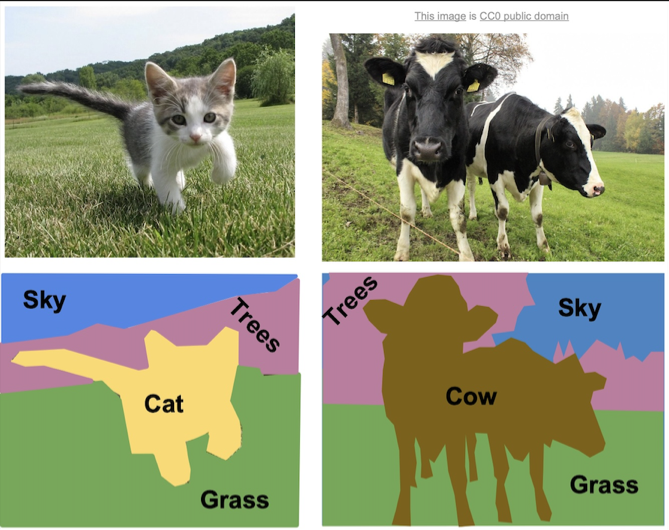
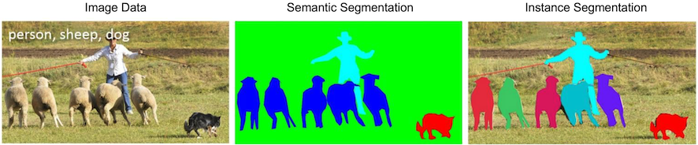
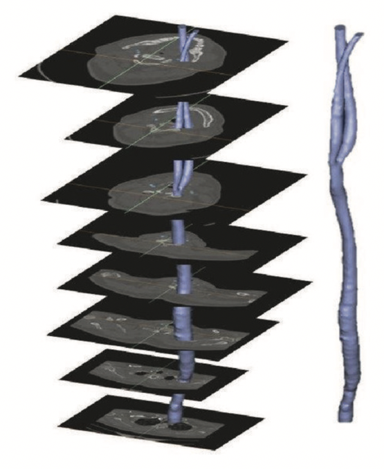
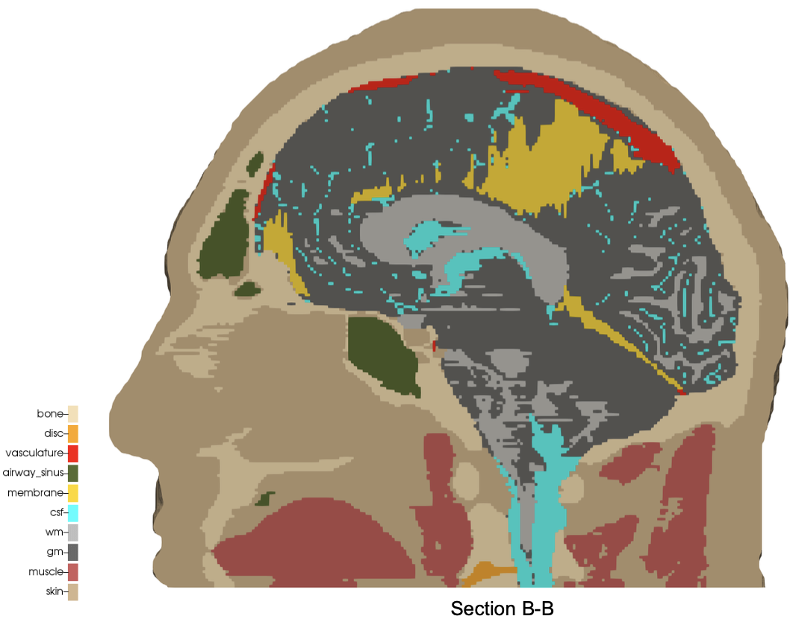
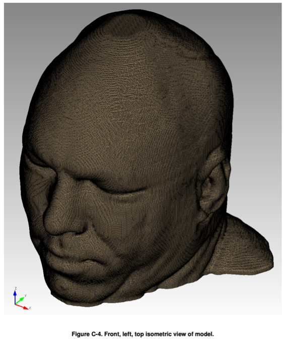
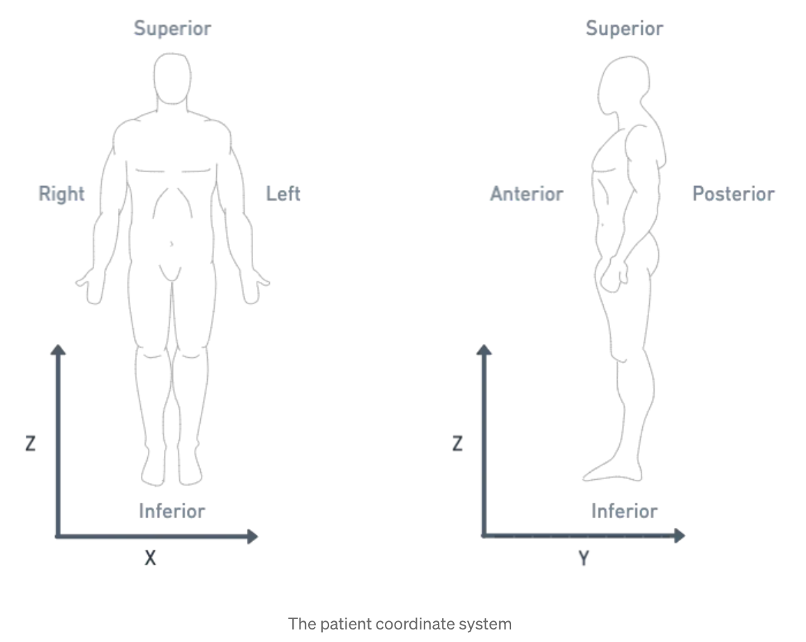

# Introduction

`automesh` is an open-source Rust software program that uses a **segmentation**,
typically generated from a 3D image stack,
to create a finite element **mesh**,
composed either of hexahedral (volumetric)
or triangular (isosurface) elements.

`automesh` **converts** between
segmentation formats (`.npy`, `.spn`)
and
mesh formats (`.exo`, `.inp`, `.mesh`, `.stl`, `.vtu`).

`automesh` can **defeature** voxel domains,
apply Laplacian and Taubin **smoothing**,
and output mesh quality **metrics**.

`automesh` can also **segment** a mesh back into a voxel domain, **remesh** a
triangular surface with uniform or curvature-adaptive sizing, **extract** a
sub-range of voxels from a segmentation, and **diff** two segmentations to
show where they differ.

## Segmentation

Segmentation is the process of categorizing pixels that compose a digital image
into a *class* that represents some subject of interest.  For example, in the
image below, the image pixels are classified into classes of sky, trees, cat,
grass, and cow.

Figure: Example of semantic segmentation, from Li *et al.*[^Li_2017]

* **Semantic segmentation** does not differentiate between objects of the same class.
* **Instance segmentation** does differentiate between objects of the same class.

These two concepts are shown below:

Figure: Distinction between semantic segmentation and instance segmentation, from Lin *et al.*[^Lin_2014]

Both segmentation types, semantic and instance, can be used with `automesh`.  However, `automesh` operates on a 3D segmentation, not a 2D segmentation, as present in a digital image.  To obtain a 3D segmentation, two or more images are stacked to compose a volume.

The structured volume of a stack of pixels composes a volumetric unit called a voxel.  A voxel, in the context of this work, will have the same dimensionality in the `x` and `y` dimension as the pixel in the image space, and will have the `z` dimensionality that is the stack interval distance between each image slice.  All pixels are rectangular, and all voxels are cuboid.

The figure below illustrates the concept of stacked images:

Figure: Example of stacking several images to create a 3D representation, from Bit *et al.*[^Bit_2017]

The digital image sources are frequently medical images, obtained by CT or MR, though `automesh` can be used for any subject that can be represented as a stacked segmentation.  Anatomical regions are classified into categories.  For example, in the image below, ten unique integers have been used to represent
bone, disc, vasculature, airway/sinus, membrane, cerebral spinal fluid, white matter, gray matter, muscle, and skin.

Figure: Example of a 3D voxel model, segmented into 10 categories, from Terpsma *et al.*[^Terpsma_2020]

Given a 3D segmentation, for any image slice that composes it, the pixels have been classified
into categories that are designated with unique, non-negative integers.
The range of integer values is limited to `256 = 2^8`, since the `uint8` data type is specified.
A practical example of a range could be `[0, 1, 2, 3, 4]`.  The integers do not need to be sequential,
so a range of `[4, 501, 2, 0, 42]` is also valid, but not conventional.

Segmentations are frequently serialized (saved to disc) as either a NumPy (`.npy`) file
or a SPN (`.spn`) file.

A SPN file is a text (human-readable) file that contains a single
column of non-negative integer values.  Each integer value defines a
unique category of a segmentation.

Axis order (for example,
`x`, `y`, then `z`; or, `z`, `y`, `x`, etc.) is not implied by the SPN structure;
so additional data is needed to uniquely interpret the pixel tile and voxel
stack order of the data in the SPN file.  `automesh` takes this as the
`--nelx`, `--nely`, and `--nelz` command line arguments.

For subjects that are human anatomy, we use the *Patient Coordinate System* (PCS), which directs the
`x`, `y`, and `z` axes to the `left`, `posterior`, and `superior`, as shown below:

| Patient Coordinate System: | Left, Posterior, Superior $\mapsto$ (x, y, z)
| :--: | :--:
|  | 

Figure: Illustration of the patient coordinate system, left figure from Terpsma *et al.*[^Terpsma_2020] and right figure from Sharma.[^Sharma_2021]

## Mesh

`automesh` writes several mesh formats: `.exo`, the EXODUS II finite element
data model;[^Schoof_1994] `.inp`, the Abaqus input format;[^Dassault] `.mesh`,
the Medit format;[^Frey_2001] and `.vtu`, the VTK XML UnstructuredGrid
format.[^Kitware]

## References

[^Li_2017]: Li FF, Johnson J, Yeung S.  Lecture 11: Detection and Segmentation, CS 231n, Stanford University, 2017.  [link](https://cs231n.stanford.edu/slides/2017/cs231n_2017_lecture11.pdf)

[^Lin_2014]: Lin TY, Maire M, Belongie S, Hays J, Perona P, Ramanan D, Dollár P, Zitnick CL. Microsoft coco: Common objects in context. In Computer Vision–ECCV 2014: 13th European Conference, Zurich, Switzerland, September 6-12, 2014, Proceedings, Part V 13 2014 (pp. 740-755). Springer International Publishing. [link](https://arxiv.org/pdf/1405.0312v3)

[^Bit_2017]: Bit A, Ghagare D, Rizvanov AA, Chattopadhyay H. Assessment of influences of stenoses in right carotid artery on left carotid artery using wall stress marker. BioMed research international. 2017;2017(1):2935195. [link](https://onlinelibrary.wiley.com/doi/pdf/10.1155/2017/2935195)

[^Terpsma_2020]: Terpsma RJ, Hovey CB. Blunt impact brain injury using cellular injury criterion. Sandia National Lab. (SNL-NM), Albuquerque, NM (United States); 2020 Oct 1. [link](https://www.osti.gov/servlets/purl/1716577)

[^Sharma_2021]: Sharma S. DICOM Coordinate Systems — 3D DICOM for computer vision engineers, Medium, 2021-12-22. [link](https://medium.com/redbrick-ai/dicom-coordinate-systems-3d-dicom-for-computer-vision-engineers-pt-1-61341d87485f)

[^Schoof_1994]: Schoof LA, Yarberry VR. EXODUS II: a finite element data model. Sandia National Lab. (SNL-NM), Albuquerque, NM (United States); 1994 Sep 1. [link](https://www.osti.gov/biblio/10102115)

[^Dassault]: Dassault Systèmes Simulia Corp. Abaqus documentation. [link](https://www.3ds.com/support/documentation)

[^Frey_2001]: Frey PJ. MEDIT: an interactive mesh visualization software. Institut National de Recherche en Informatique et en Automatique (INRIA); 2001 Dec. Technical Report RT-0253. [link](https://inria.hal.science/inria-00069921)

[^Kitware]: Kitware Inc. VTK File Formats. [link](https://docs.vtk.org/en/v9.3.1/design_documents/VTKFileFormats.html)
