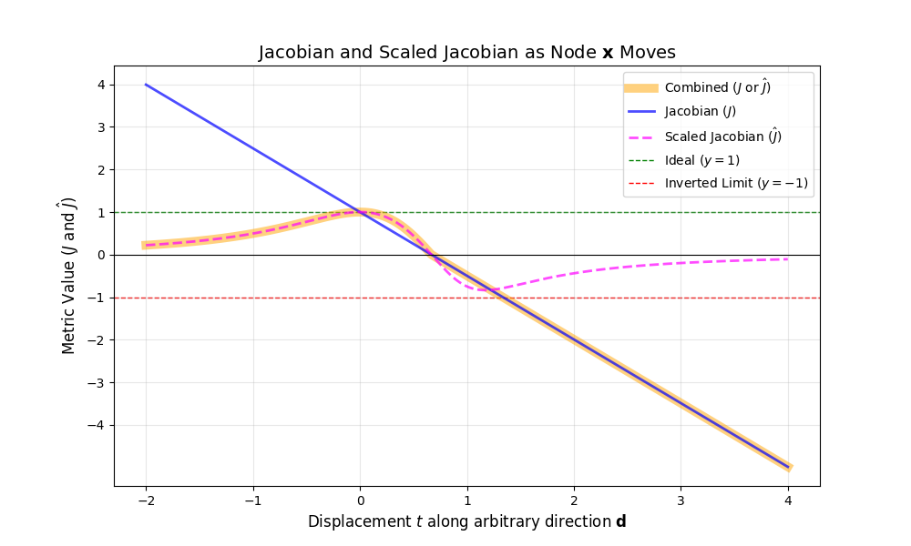
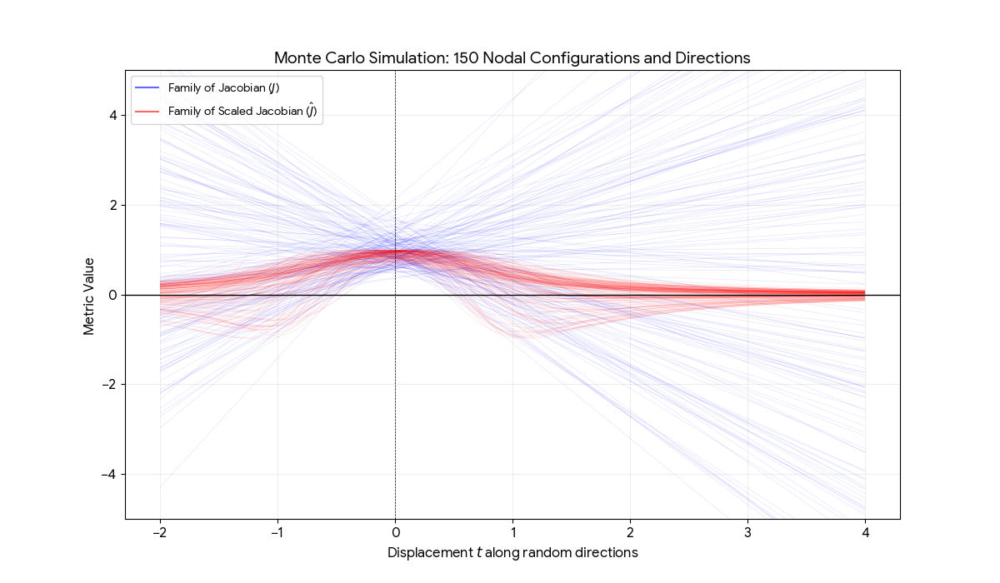

# Review of Tong *et al.* 2024

```code
@article{tong2024hybridoctree_hex,
  title={HybridOctree\_Hex: Hybrid octree-based adaptive all-hexahedral mesh generation with Jacobian control},
  author={Tong, Hua and Halilaj, Eni and Zhang, Yongjie Jessica},
  journal={Journal of Computational Science},
  volume={78},
  pages={102278},
  year={2024},
  doi     = {10.1016/j.jocs.2024.102278},
  url     = {https://doi.org/10.1016/j.jocs.2024.102278},
  publisher={Elsevier}
}
```

* GitHub [repo](https://github.com/CMU-CBML/HybridOctree_Hex)

## Octree **Initialization** with Feature Preservation

* [Target surface](#0-target-surface)
* Octree
  * Refinement
    * Curvature (not as robust as SDF, noisy)
    * Narrow region
    * Shape diameter function (SDF, Michael: works more robust)
* Dualization
* Removal
  * Vertex clearing rule
  * Signed distance function
  * Face normals
* Conformity
  * Node duplication and projection
  * Augmentation (similar but still different from pillowing)
  * Energy minimization (different from Internal Energy)
    * Geometry fitting
    * Minimum scaled Jacobian (for postive-Jacobian hexes)
    * Jacobian (for negative-Jacobian hexes)

### 0. Target Surface

Input:

* **Target Surface:** A closed and manifold surface mesh composed of a 3D triangular elements.
  * See the [HybridOctree_Hex/input boundaries](https://github.com/CMU-CBML/HybridOctree_Hex/tree/main/input%20boundaries) folder for boundary raw files, e.g., `Cup1_tri.raw` ... `wrench_tri.raw`.
  * *Alternatively, might `.stl` files be available?*
  * For example, `bunny_tri.raw` (33,739 lines, 618kB) has the format (11,248 points, 22,490 elements):  
```code
11248 22490  # line 1
0.121904 0.714156 0.831321  # line 2, coordinates
0.121904 0.714156 0.831321
0.943086 1.00012 1.6947
...
0.263885 1.15905 1.42424
0.389988 0.897909 1.43231
0.268144 0.793896 1.27816  # line 11249
7752 1374 1  # line 11250, connectivity
1 1374 10841
3831 7752 1
...
10983 11126 11129
11149 11061 11102
11220 11234 11103  # line 33739
```

Based on the [README.md](https://github.com/CMU-CBML/HybridOctree_Hex/blob/main/README.md), the resulting bunny hexahedral FEA mesh has 26,375 vertices, 21,695 elements, and a minimum scaled Jacobian of 0.57.

### 1. Octree: Refined, then Strongly Balanced

The octree is *refined* at regions of high curvature and narrow thickness.

* **Curvature Detection:** Gaussian curvature $G$ is calculated for surface points.  Five thresholds $\{0.5, 1, 2, 4, 8\}$ are used.  If a cell at level $l+4$ satisfies $G > G_{\rm{thresh}}[l]$, it is refined to level $l+5$.
* **Narrow Region Detection:** Thickness $T$ is measured via ray-casting.  If $T < T_{\rm{thresh}}$ (thresholds: $\{16, 8, 4, 2, 1\}$), the cell is refined.

The resulting octree levels for each octant typically range from **level 5 to 9**.

After the initialization, the octree is updated with the following two rules to ensure that the octree is **strongly balanced:**

* **Balancing Rule:** The level difference between neighboring octants must be at most one.
* **Paring Rule:** If an octant is subdivided to meet the balancing rule, its seven siblings must also be subdivided.

### 2. All-Hex Dual Mesh

Five **pre-defined 3D templates** are used to directly extract an all-hexahedral dual mesh.

* **Hanging Nodes:** These occur at transitions between different resolution levels.
* **Templates:** The system detects **transition faces** (shared by two cells of different levels) and **transition edges** (shared by three cells).
* The **5 Templates:** 
  * One (1) handles face transitions and 
  * Four (4) handle various edge transition configurations.
  * This ensures every grid point is shared by exactly eight polyhedra, resulting in a valid hex mesh.

The minimum scaled Jacobian for the templates is **0.258**, which is the starting point before Section 4 optimization.

### 3. Buffer Zone Clearing and Geometric Restriction

The **core mesh** is the subset of the dual mesh that fits completely within the target volume.  It is the largest possible assembly of dual hexes that fits entirely within the target volume while leaving a small gap (the **buffer zone**) for boundary alignment.
* The **core mesh** has a *blockly* (synonyms: *jagged, stair step, sugar cube*) appearance.
* The **core mesh** is created by removing elements from the dual mesh that lie outside or too close to the target surface.

A **boundary point** $\mathbf{x}$ is any vertex that lies on the outer (quadrilateral) surface of the core mesh.

The **buffer zone** is the empty region between the jagged outer boundary of the core mesh and the target surface.

#### 3.1 Clearing

The **clearing** process intentionally removes elements that are potentially too close to the target surface, which could result in a lower quality element.

If we were to keep every hex that is technically "inside" the target surface, some of the core hexes would have vertices that nearly touch the target boundary.  Then, in later steps, when we connect these core vertices to neighboring vertices on the surface, a paper-thin (e.g., 1 percent thickness) element would be created, leading to a bad scaled Jacobian, or even an inverted element if the vertex accidentally crosses the boundary during optimization.

##### Vertex Clearing Function

Let

* $s_{\max}$ be the maximum size (typically as maximum edge length) of all elements sharing a vertex.
* size threshold $\epsilon_s := s_{\max}/2$.

Then,

* **Vertex clearing rule:** If the minimum distance between from a vertex to the boundary falls below the size threshold $\epsilon_s$, all elements sharing that vertex are deleted.

By setting the threshold to half of the size of the largest local element ($s_{\max}/2$), the algorithm ensures that the "gap" (the buffer zone) is of substantial size.  This half-size rule effectively "erodes" the core mesh until there is a guaranteed clearance.  It also ensures tha the final "buffer layer" hexes have a healthy aspect ratio (roughly $1:2$ or better) before the optimization begins.

In short, clearing eliminates interior volume of the core mesh to make room for high-quality boundary hexes.  Without this elimination step, the mesh would likely fail in thin or high-curvature regions.

##### Signed Distance Function (SDF)

The authors then noted, "During implementation, we observed that this setting [the **vertex clearing rule**] can be sensitive to large elements located in size transition regions, potentially leaving holes in the surface.  To address this issue, we calculate the signed distance function for corner points associated with every hex element.  Each hex had eight signed distance functions $f(\mathbf{x}_i)$, where $i=0, 1, 2 \ldots 7$.  We compute $f_{\min}$ and $f_{\max}$ and remove the hex element if the condition $f_{\min} + 0.1 \times f_{\max} < 0$ is met."

To illustrate this problem imagine a large hex sitting next to small hexes (a size transition).  If a single vertex of the large hex is flagged as "too close" to the target surface, the vertex clearing rule forces the deletion of the entire large hex.  Because the hex is large, a massive chunk of the model's interior gets deleted, leaving behind the smaller neighboring hexes that likely are unable to "fill" the gap easily, resulting in a hole or a broken surface of the final mesh.

The authors replaced the brittle vertex clearing rule with the SDF reult.  (Personal communication with Tong on 2026-02-24 indicates they used **both** the vertex clearing function and the signed distance function). While the vertex clearing rule removed everything based on a single vertex rule, the SDF considers all eight corners of a specific hex to decide if it should be eliminated or not.

The weighted decision formula, $f_{\min} + 0.1 \times f_{\max} < 0$ acts as a soft-boundary filter.

Let

* $\mathcal{S}$ be a closed, orientable 2-manifold surface in $\mathbb{R}^3$.
  * A 2-manifold surface is a topological space that, at every point, looks locally like a small piece of the 2D Euclidean plane ($\mathbb{R}^2$).
* $\mathbf{x} \in \mathbb{R}^3$ be a query point (e.g., a corner of a hex element).
* $\mathbf{s} \in \mathcal{S}$ be the closest point on the surface $\mathcal{S}$ to $\mathbf{x}$.
* $\mathbf{n}(\mathbf{s})$ is the **inward-pointing** (not outward-pointing as is typically defined) unit normal vector of the surface $\mathcal{S}$ at the closest point $\mathbf{s}$.
  * If $\mathbf{n}(\mathbf{s})$ lies on a triangle face of $\mathcal{S}$, then a simple face-normal is used.
  * If $\mathbf{n}(\mathbf{s})$ lies on an edge or on a vertex, a *pseudo-normal*, which is weighted combination of the normals of the adjoining faces sharing the vertex or edge, is used.
  * Use of the *inward-pointing normal* is referred to as the *"material convention"*, which is different from the standard convention.
* $\text{sgn}(x)$ is the signum function:

$$
\operatorname{sgn}(x) =
\begin{cases}
-1 & \text{if } x < 0 \\
0 & \text{if } x = 0 \\
1 & \text{if } x > 0 
\end{cases}
$$

The **Signed Distance Function** (SDF) $f: \mathbb{R}^3 \to \mathbb{R}$ for $\mathcal{S}$ is defined as:

$$
f(\mathbf{x}) = 
\text{sgn}
\left[
    \mathbf{n}(\mathbf{s})
    \cdot
    (\mathbf{x} - \mathbf{s})
\right] 
\|\mathbf{x} - \mathbf{s} \|
$$

where:

* The **magnitude** $\| \mathbf{x} - \mathbf{s} \|$ is the shortest Euclidean distance from the query point to the manifold.  It is always non-negative.
* The **direction vector** $(\mathbf{x} - \mathbf{s})$ points from the closest point on the surface to the query point.
  * **Outside the surface:**
    * If the query point $\mathbf{x}$ lies outside of the surface, the vector $(\mathbf{x} - \mathbf{s})$ points opposite of the surface inward normal ~~in the same general direction as the surface outward normal~~ $\mathbf{n}(\mathbf{s})$, making the dot product negative and $f < 0$.
  * **Inside the surface:**
    * If the query point $\mathbf{x}$ lies inside of the surface, the vector $(\mathbf{x} - \mathbf{s})$ points in the same general direction as the surface inward normal $\mathbf{n}(\mathbf{s})$, making the dot product positive and $f > 0$.
  * **On the surface:**
    * If $\mathbf{x}$ is on the surface, $\mathbf{x} = \mathbf{s}$, the distance is $\mathbf{0}$, and the dot product is zero, thus $f=0$.

We remove a hex if $f_{\rm min} + 0.1 \times f_{\rm max} < 0$.

Note the definition of a signed distance must be reversed to keep the core and remove the outside.  There is a slight reversal in the standard mathematical definition of SDF and the removal formula in the paper.

The paper cites [Paragios et al. 2002](https://link.springer.com/chapter/10.1007/3-540-47967-8_52), which likewise in Section 2 of their paper defines positive values to be **inside** the region $\mathcal{R}$ defined by shape $\mathcal{S}$; and negative values to be **outside** of the region $\mathcal{R}$.

If one uses the standard mathematical definition ($f > 0$ is outside) with the paper's formula ($f_{\min} + 0.1 \times f_{\max} < 0$), one will delete the interior of the model and keep the empty air around it.

**Sign Reversal:**  For the paper's criterion to work as intended (to keep "core" and remove "outside"), the paper must be used with the **material convention**:

* **Inside** $f > 0$ (positive distance into the material)
* **Outside** $f < 0$ (negative distance into the void)

###### Examples:

The following example test the logic of the "material convention" (positive = inside), and illustrate why $f_{\min} + 0.1 \times f_{\max} < 0$ is so clever when positive is inside.

* Scenario A: **Deeply Inside**
  * All 8 corner of the hex have $f \approx +10$.
  * $10 + 0.1(10) = 11$.  Since $11$ is **not** $< 0$, the hex is **retained**.
* Scenario B: **Deeply Outside**
  * All 8 corner of the hex have $f \approx -10$.
  * $-10 + 0.1(-10) = -11$.  Since $-11 < 0$ the hex is **removed**.
* Scenario C: **Straddling (but mostly outside)**
  * $f_{\min} = -5$ (far outside), $f_{\max} = +1$ (barely inside).
  * $-5 + 0.1(1) = -4.9$.  Since $-4.9 < 0$, the hex is **removed**.
* Scenario D: **Straddling (but mostly inside)**
  * $f_{\min} = -0.5$ (barely outside), $f_{\max} = +10$ (deeply inside).
  * $-0.5 + 0.1(10) = +0.5$.  Since 0.5 is **not** $< 0$, the hex is **retained**.

**Insight:** The foregoing "weighted" rule allows a hex to stay even if a corner poke slightly out, as long as the rest of the hex is deeply buried inside.  This is exactly what prevents "holes" in size-transition regions.

#### 3.2 Restriction

Simply having the valid core mesh is not sufficient:
* If angles between the faces surrounding a boundary point $\mathbf{x}$ are too sharp, the new hexes created in the buffer zone will be *inverted* or *of extremely poor quality*.

Boundary point $\mathbf{x}$ to target surface $\mathbf{s}$

* **Connectivity:** A boundary point $\mathbf{x}$ is shared by $m$ quadrilateral faces that form the external surface of the core mesh.
* **Role in Meshing:** Every boundary point $\mathbf{x}$ is eventually connected to its closest point on the target surface $\mathbf{s}$ via an edge vector $(\mathbf{x} - \mathbf{s})$.  This connection ~~"stretches"~~ **augments** the mesh to fill in the buffer zone.

The **normal vector** $n_i$ is defined as the normal of a triangle formed by boundary point $\mathbf{x}$ and two of its adjacent boundary points.

The **Restriction:** To prevent poor-quality elements when connecting to the target surface, a normal-based restriction is enforced.  For a boundary point $\mathbf{x}$, any three normals ($n_i$, $n_j$, $n_k$) of the surrounding faces must satisfy $\left( n_i \times n_j \right) \cdot n_k > 0$.
* **Iterative Removal:** Hexes are deleted one-by-one until all boundary points satisfy this geometric restriction.
* This restriction guarantees that the remaining boundary points $\mathbf{x}$ have a geometry that guarantees a scaled Jacobian $> 0$ for the final boundary elements.
* **Deletion Priority:** The algorithm prioritizes hexes with the **highest number of boundary faces** during buffer clearing to avoid creating internal holes.

### 4. Quality Improvement with Jacobian Control

The final step meshes the **buffer zone** by connecting core boundary points $\mathbf{x}$ to their closest surface points $\mathbf{s}$ and optimizing the resulting elements.

* **Smart Laplacian Smoothing:** Performed every 1,000 iterations on the outermost two layers to speed up convergence.
* **Energy Minimization:** A gradient-based method minimizes an energy function $E$:

$$E := E_{\mathcal{S}}({\rm Geometry\;Fitting}) - E_{\rm{J}}({\rm Jacobian}) - E_{\rm SJ}(\rm{Scaled\;Jacobian})$$

or, more compactly,

$$E := E_{\mathcal{S}} - E_{\rm J} - E_{\rm SJ}$$

or, more **explicitly**,

$$E := E_{\mathcal{S}} - J - \hat{J}$$

* **Jacobian Control:** Because the **Scaled Jacobian** is non-differentiable in certain regions, the algorithm switches to the **Jacobian** term for negative-Jacobian elements to ensure they can be *untangled*.
* The paper specifically identifies $E_{\rm J}$ (the Jacobian term) as the mechanism to **untangle** elements with negative Jacobians.
* Using a combined scaled Jacobian and Jacobian helps the optimizer not to get stuck in local minima.
* The novel buffer zone clearance and mesh quality enhancements lead to significantly higher minimum scaled Jacobian $(> 0.5)$.
* **Signage:** Since the goal is to minimize $E$, the two Jacobian-related terms are *subtracted* since the optimization is actually trying to **maximize** the Jacobian-terms (improve mesh quality) while trying to **minimize** the distance between the mesh and the surface.

#### Gradient $\nabla E_{\mathcal{S}}$

Let $\mathbf{x}$ be any vertex belonging to the boundary $\partial \Omega$ of the core mesh $\Omega$ composed of dual hexahedral elements. 

Let point $\mathbf{s}$ be the closet point projection of node $\mathbf{x}$ onto surface $\mathcal{S}$.

In general, $\mathbf{s} \in \mathcal{S}$ and $\mathbf{x} \in \partial \Omega$.  We seek to make the domain's boundary $\partial \Omega$ conform to surface $\mathcal{S}$.  

Let the gap vector $\mathbf{g}$ from the
closet point projection $\mathbf{s}$
to the
hexahedral vertex $\mathbf{x}$
be defined as:

$$\mathbf{g} := \mathbf{x} - \mathbf{s}$$

The objective of the *surface energy* is to characterize the gap energy between surface $\mathcal{S}$ and the domain boundary $\partial \Omega$ in a pointwise manner.

Let this **surface energy mismatch** be defined as

$$
E_{\mathcal{S}} := \sum_{i=0}^{n_{\rm vert} - 1}
\frac{ \|\mathbf{x}_i - \mathbf{s}_i \| }{2}^2
$$

for the $n_{\rm vert}$ surface vertices,
then
the gradient at $\mathbf{x}$ is simply

$$
\nabla_{x_i} E_{\mathcal{S}} = \sum_{i=0}^{n_{\rm vert} - 1}
( \mathbf{x}_i - \mathbf{s}_i )
$$

The term acts as a *spring* that pulls the current vertex $\mathbf{x}$ toward its target surface position $\mathbf{s}$.

#### Gradient $\nabla J$

For any hexahedral element that has a negative Jacobian, we seek to maximize the Jacobian energy term, $E_{\rm J} = J$, which will tend to move the Jacobian from negative to positive (untangling).

For any hexahedral element, we evaluate the Jacobian at node $\mathbf{x}$.  We denote the three edge-sharing vertices as $\mathbf{a}, \mathbf{b}, \mathbf{c}$.

The Jacobian is defined as

$$
\begin{aligned}
J
: &=
\left[
    (\mathbf{a} - \mathbf{x}) 
    \times
    (\mathbf{b} - \mathbf{x})
    \right]
    \cdot
    (\mathbf{c} - \mathbf{x})
    \\
&= \left[
    (\mathbf{b} - \mathbf{x}) 
    \times
    (\mathbf{c} - \mathbf{x})
    \right]
    \cdot
    (\mathbf{a} - \mathbf{x})
    \\
&= \left[
    (\mathbf{c} - \mathbf{x}) 
    \times
    (\mathbf{a} - \mathbf{x})
    \right]
    \cdot
    (\mathbf{b} - \mathbf{x})
\end{aligned}

$$
It will be convenient to define **edge vectors** as follows:

$$\mathbf{u} := \mathbf{a} - \mathbf{x}$$
$$\mathbf{v} := \mathbf{b} - \mathbf{x}$$
$$\mathbf{w} := \mathbf{c} - \mathbf{x}$$

Then, the Jacobian is defined as

$$
J := (\mathbf{u} \times \mathbf{v}) \cdot \mathbf{w} 
= (\mathbf{v} \times \mathbf{w}) \cdot \mathbf{u}
= (\mathbf{w} \times \mathbf{u}) \cdot \mathbf{v}
$$

Finally, define a **vector area** of on of the faces meeting at node $\mathbf{x}$,

$$
\begin{align}
\mathbf{n}_{ab} &:= \mathbf{u} \times \mathbf{v} 
\\
\mathbf{n}_{bc} &:= \mathbf{v} \times \mathbf{w}
\\
\mathbf{n}_{ca} &:= \mathbf{w} \times \mathbf{u}
\end{align}
$$

which are vectors normal to the face formed by
$[\mathbf{x}, \mathbf{a}, \mathbf{b}]$,
$[\mathbf{x}, \mathbf{b}, \mathbf{c}]$, and
$[\mathbf{x}, \mathbf{c}, \mathbf{a}]$, respectively.

Then, the Jacobian is defined as

$$
J := (\mathbf{n}_{ab} \times \mathbf{n}_{bc}) \cdot \mathbf{n}_{ca}
= (\mathbf{n}_{bc} \times \mathbf{n}_{ca}) \cdot \mathbf{n}_{ab}
= (\mathbf{n}_{ca} \times \mathbf{n}_{ab}) \cdot \mathbf{n}_{bc}
$$

##### Partial Gradient $\nabla_a J$

By inspection of the second form of the preceding definition, the gradient of $J$ with respect to $\mathbf{a}$ is simply

$$
\nabla_a J = 
    (\mathbf{b} - \mathbf{x}) 
    \times
    (\mathbf{c} - \mathbf{x})
= \mathbf{v} \times \mathbf{w}
= \mathbf{n}_{bc}
$$

Since $(\mathbf{b} - \mathbf{x}) \times (\mathbf{c} - \mathbf{x})$ is the normal vector to the face formed by $\mathbf{x}, \mathbf{a}, \mathbf{b}$, the
gradient increases as point $\mathbf{a}$ moves away from this plane in the normal 
direction.

Similar expressions can be found for gradients with respect to $\mathbf{b}$ and $\mathbf{c}$

##### Partial Gradient $\nabla_b J$

$$
\nabla_b J = 
    (\mathbf{c} - \mathbf{x}) 
    \times
    (\mathbf{a} - \mathbf{x})
= \mathbf{w} \times \mathbf{u}
= \mathbf{n}_{ca}
$$

##### Partial Gradient $\nabla_c J$

$$
\nabla_c J = 
    (\mathbf{a} - \mathbf{x}) 
    \times
    (\mathbf{b} - \mathbf{x})
= \mathbf{u} \times \mathbf{v}
= \mathbf{n}_{ab}
$$

> **Physical interpretation:** The volume (i.e., the Jacobian) increases when a particular node ($\mathbf{a},$ $\mathbf{b},$ or $\mathbf{c}$) moves away from the other three remaining nodes in a direction that is perpendicular to the face created by the those three remaining nodes.

##### Partial Gradient $\nabla_x J$

The gradient with respect to $\mathbf{x}$ can be seen by inspection of the three preceding gradients, with a flip of the sign and use of the chain rule,

$$
\nabla_x J = - (\nabla_a J + \nabla_b J + \nabla_c J)
$$

The gradient is simply the negative sum of these three face normals:

$$\nabla_x J = 
-(
  \mathbf{n}_{bc} +
  \mathbf{n}_{ca} +
  \mathbf{n}_{ab}
)
$$

The can also be seen by using the gradient of the scalar triple product.  By applying the product rule for cross and dot products, we find:

$$
\nabla_x J = 
- (
\mathbf{v} \times \mathbf{w} + 
\mathbf{w} \times \mathbf{u} +
\mathbf{u} \times \mathbf{v}
)
$$

which is the same result.

> **Physical Interpretation:** The volume (i.e., the Jacobian) increases when $\mathbf{x}$ moves in a direction opposite to the summed normals of the three perpendicular faces. 

#### Gradient $\nabla \hat{J}$

For any hex elements that have a **positive Jacobian**, we seek to maximize the scaled Jacobian energy term, $E_{\rm SJ} = \hat{J}$, which will drive the MSJ toward their maximum value of unity.

Once the hexes transition from negative to positive Jacobian (they thus become untangled, $J > 0$), we cease using these hexes the $E_{\rm J}$ term, considering them instead as participants in the $E_{\rm SJ}$ term.

The normalized version of the Jacobian, the **scaled Jacobian** is defined as

$$
\hat{J} :=
    \frac{
    \left[
    (\mathbf{a} - \mathbf{x}) 
    \times
    (\mathbf{b} - \mathbf{x})
    \right]
    \cdot
    (\mathbf{c} - \mathbf{x})
    }{
    \|\mathbf{a} - \mathbf{x}\|
    \;
    \|\mathbf{b} - \mathbf{x}\|
    \;
    \|\mathbf{c} - \mathbf{x}\|
    }
$$

or, using the edge vector definitions defined previously,

$$
\hat{J} :=
\frac{(\mathbf{u} \times \mathbf{v}) \cdot \mathbf{w}}{
    \|\mathbf{u}\|
    \;
    \|\mathbf{v}\|
    \;
    \|\mathbf{w}\|
}
$$

The gradient requires the **quotient rule** to account for the changing edge lengths in the denominator.  Let

$$
L :=
    \|\mathbf{u}\|
    \;
    \|\mathbf{v}\|
    \;
    \|\mathbf{w}\|
$$

which is the product of the three lengths.  Then

$$
\hat{J} :=
\frac{(\mathbf{u} \times \mathbf{v}) \cdot \mathbf{w}}{
    \|\mathbf{u}\|
    \;
    \|\mathbf{v}\|
    \;
    \|\mathbf{w}\|
}
= \frac{J}{L}
$$

The gradient

$$
\nabla \hat{J} = 
\frac{
\left(
\nabla J \; L \;-\; J \; \nabla L
\right)
}{L^2}
$$

Thus, the gradients for each of the four nodes,

$$
\nabla_a \hat{J} = 
\frac{
\left(
\nabla_a J \; L \;-\; J \; \nabla_a L
\right)
}{L^2}
$$

$$
\nabla_b \hat{J} = 
\frac{
\left(
\nabla_b J \; L \;-\; J \; \nabla_b L
\right)
}{L^2}
$$

$$
\nabla_c \hat{J} = 
\frac{
\left(
\nabla_c J \; L \;-\; J \; \nabla_c L
\right)
}{L^2}
$$

$$
\nabla_x \hat{J} = 
\frac{
\left(
\nabla_x J \; L \;-\; J \; \nabla_x L
\right)
}{L^2}
$$

where the length gradient terms are:


$$
\nabla_a L = 
    \|\mathbf{v}\|
    \;
    \|\mathbf{w}\|
    \;
    \frac{\mathbf{u}}{
    \|\mathbf{u}\|}
$$

$$
\nabla_b L = 
    \|\mathbf{w}\|
    \;
    \|\mathbf{u}\|
    \;
    \frac{\mathbf{v}}{
    \|\mathbf{v}\|}
$$

$$
\nabla_c L = 
    \|\mathbf{u}\|
    \;
    \|\mathbf{v}\|
    \;
    \frac{\mathbf{w}}{
    \|\mathbf{w}\|}
$$

$$
\nabla_x L = 
-
\left(
    \|\mathbf{v}\|
    \;
    \|\mathbf{w}\|
    \;
    \frac{\mathbf{u}}{
    \|\mathbf{u}\|}
+
    \|\mathbf{w}\|
    \;
    \|\mathbf{u}\|
    \;
    \frac{\mathbf{v}}{
    \|\mathbf{v}\|}
+
    \|\mathbf{u}\|
    \;
    \|\mathbf{v}\|
    \;
    \frac{\mathbf{w}}{
    \|\mathbf{w}\|}
\right)
$$

Like the Jacobian, the scaled Jacobian and its gradient can be calculated for each of the eight element nodes per hex, as well as in the element center, where the edge vectors connect the opposite face centers.

> **Implementation note:**  When $L$ is small, $L^2$ is very small, which can lead to numerical instability when it sits in the denominator.  To reduce the risk of numerical instability, the following forms are provided: 

First, precompute

$$
\hat{\mathbf{u}} = \frac{\mathbf{u}}{\|\mathbf{u}\|},
\quad
\hat{\mathbf{v}} = \frac{\mathbf{v}}{\|\mathbf{v}\|},
\quad
\hat{\mathbf{w}} = \frac{\mathbf{w}}{\|\mathbf{w}\|},
$$

Then,

$$
\begin{align}
\nabla_a \hat{J} &= \frac{\mathbf{n}_{bc}}{L} - \frac{\hat{J} \hat{\mathbf{u}}}{\|\mathbf{u}\|}
\\
\nabla_b \hat{J} &= \frac{\mathbf{n}_{ca}}{L} - \frac{\hat{J} \hat{\mathbf{v}}}{\|\mathbf{v}\|}
\\
\nabla_c \hat{J} &= \frac{\mathbf{n}_{ab}}{L} - \frac{\hat{J} \hat{\mathbf{w}}}{\|\mathbf{w}\|}
\\
\nabla_x \hat{J} &= 
- \left[
    \left(
        \frac{\mathbf{n}_{bc} + \mathbf{n}_{ca} + \mathbf{n}_{ab}}{L} 
    \right)
    -
    \hat{J}
    \left(
        \frac{\hat{\mathbf{u}}}{\|\mathbf{u}\|}
        +
        \frac{\hat{\mathbf{v}}}{\|\mathbf{v}\|}
        +
        \frac{\hat{\mathbf{w}}}{\|\mathbf{w}\|}
    \right)
\right]
\end{align}
$$

> **Physical interpretation:** The first term, $\mathbf{n}/L$, is an **orthogonality force** that pushes the node to make the corner more orthogonal.  The second term, $\hat{J}\hat{\mathbf{\bullet}}/\|\mathbf{\bullet}\|$, is an **aspect ratio constraint**.  It prevents numerical inflation of the Scaled Jacobian through the elongation of a localized edge vector.

#### Gradient Descent

At iteration $k$, we update the position of $\mathbf{p}^{(k)}$ by an amount $-\alpha \nabla E$, where $\alpha \in \mathbb{R}^+ \subset (0, 1)$ is the step size (also known as the **learning rate**), which controls how far the vertex $\mathbf{p}$ moves in a single iteration:

$$
\mathbf{p}^{(k+1)} := 
\mathbf{p}^{(k)} -
\alpha
\nabla E 
$$

Tong *et al.* choose $\alpha = 0.8 \times 10^{-3}$ for all tested models in their paper.

#### Plot of Jacobian and Scaled Jacobian - Orthogonal Case



```python
<!-- cmdrun cat jacobian_evolution.py -->
```

The **Jacobian** is a *linear* function of the displacement $t$.  The curve is straight
because the volume of a parallelpiped (or tetrahedron) changes linearly with the distance of one vertex from the plane formed by the other three.
The **zero crossing** is where the line crossed the $x$-axis, representing the moment
node $\mathbf{x}$ enters the plane of its neighbors $\mathbf{a}, \mathbf{b}, \mathbf{c}$.
Beyond this point, $J$ becomes negative and the the hex element is inverted.

The **scaled Jacobian** is a *nonlinear* function because the denominator contains the lengths of the edges (square roots of quadratic functions).   The curve is bounded between $[-1, 1]$.  As the node moves very far away, the scaled Jacobian will grow toward zero as the angles between the edges become extremely sharp.  The peak of the curve represents the *ideal* position for node $\mathbf{x}$ relative to its neighbors, and this peak will approach a value of unity for the orthogonal case.

The above plot explores node $\mathbf{x}$ moving along a line parameterized by time $t$ as:

$$\mathbf{x}(t) = \mathbf{x}_0 + t \mathbf{d}$$

where $\mathbf{d}$ is an arbitrary direction and $\mathbf{x}_0$ = $\{0, 0, 0\}$, and the Jacobian functions take the forms

* $J(t) = C_1 + C_2 \; t$ a linear function,
* $\hat{J}(t) = \frac{C_1 + C_2\;t}{\sqrt{Q_1(t) Q_2(t) Q_3(t)}}$ a nonlinear curve, where $Q$ are quadratic polynomials

#### Plot of Jacobian and Scaled Jacobian - Monte Carlo

To visualize an entire family of nodal positions, we use a **Monte Carlo** simulation.  We perturb positions $\mathbf{a}, \mathbf{b}, \mathbf{c}$ and vary the direction of vector $\mathbf{d}$ on a unit sphere to generate a *bundle* of curves that represent a range of possible behaviors in a real, distorted mesh.

The plot below shows the Monte Carlo results.



The Monte Carlo view shows why the learning rate $\alpha$ must be chosen carefully.

* **Consistency:** For the Jacobian, the gradient (slope of the blue lines) is constant for a given configuration.
* **Sensitivity:** For the scaled Jacobian, the gradient changes rapidly.  Near $t=0$, the current position, the curves are steep, meaning that small moves have a large image on quality.
* **Global Maximum:** The overlap of these curves suggest that in a complex mesh, there is no single "perfect" direction.  The optimizer must balance many competiting $J$ and $\hat{J}$ terms simultaneously.

#### A two-domain, piecewise approach

The Piecewise Energy Function is defined based on the Jacobian value being positive or negative.
One can define the quality energy for a single hexahedron $h$ by checking the sign of its Jacobian $J$. This ensures that "tangled" (inverted) elements are prioritized for unfolding before they are refined for shape quality.

$$
E_Q(h) = 
\begin{cases} 
-\hat{J}(h) & \text{if } J(h) > \epsilon \quad {\rm positive/smoothing}\\
-J(h) & \text{if } J(h) \leq \epsilon \quad {\rm negative/untangling}
\end{cases}
$$

where

* $E_Q(h)$ is the quality energy for a single hex $h$.
* $J(h)$ is the standard Jacobian (signed volume).
* $\hat{J}(h)$ is the scaled Jacobian (normalized shape metric).
* $\epsilon$ is a small positive tolerance (e.g., $10^{-6}$) used to identify inverted or degenerated elements.

Since gradient descent minimizes energy, we subtract the quality metric to maximize it.

## Hessians

To compuete the Hessians for the Jacobian $J$ and Scaled Jacobian $\hat{J}$, we must take the second partial derivatives of the energy terms.

### Hessian of the Jacobian $\mathbf{H}_J$

The Jacobian $J$ is **bilinear** with respect to any two distinct vertices.
This means its second derivative with respect to the *same* node is zero; only the
cross-derivaties are non-zero.

Let 

$$
\mathbf{H}_{mn} = \frac{\partial^2 J}{\partial \mathbf{m} \partial \mathbf{n}}
$$

Because $J$ is linear with respect to any single node position (when the others are fixed):

$$
\mathbf{H}_{aa} 
= 
\mathbf{H}_{bb} 
= 
\mathbf{H}_{cc} 
= 
\mathbf{H}_{xx} 
=
\mathbf{0}_{3 \times 3}
$$

The **cross-node Hessians** are essentially the derivatives of the face normals.  
For example, to find $\mathbf{H}_{ab}$:

$$
\nabla_a J = (\mathbf{b} - \mathbf{x}) \times (\mathbf{c} - \mathbf{x})
$$

$$
\frac{\partial}{\partial \mathbf{b}}
\left(
\nabla_a J
\right)
= \frac{\partial}{\partial \mathbf{b}}
\left[
    \left(
        \mathbf{b} - \mathbf{x}
    \right)
    \times
    \mathbf{w})
\right]
$$

Using the property of the cross product,

$$
\frac{\partial}{\partial \bullet} \left(\bullet \times \mathbf{k}\right) = 
\left[
\mathbf{k}\right]_{\times}
$$

where $[\mathbf{k}]_{\times}$ is a skew-summetric matrix, we obtain

$$
\begin{align}
\mathbf{H}_{bc} = \left[\mathbf{u}\right]_{\times} \quad \quad
\mathbf{H}_{cb} = - \left[\mathbf{u}\right]_{\times}
\\
\mathbf{H}_{ca} = \left[\mathbf{v}\right]_{\times} \quad \quad
\mathbf{H}_{ac} = -\left[\mathbf{v}\right]_{\times}
\\
\mathbf{H}_{ab} = \left[\mathbf{w}\right]_{\times} \quad \quad
\mathbf{H}_{ba} = -\left[\mathbf{w}\right]_{\times}
\\
\mathbf{H}_{ax} = \left[\mathbf{w}\right]_{\times} - \left[\mathbf{v}\right]_{\times} \quad \quad
\mathbf{H}_{xa} = \left[\mathbf{v}\right]_{\times} - \left[\mathbf{w}\right]_{\times}
\\
\mathbf{H}_{bx} = \left[\mathbf{u}\right]_{\times} - \left[\mathbf{w}\right]_{\times} \quad \quad
\mathbf{H}_{xb} = \left[\mathbf{w}\right]_{\times} - \left[\mathbf{u}\right]_{\times}
\\
\mathbf{H}_{cx} = \left[\mathbf{v}\right]_{\times} - \left[\mathbf{u}\right]_{\times} \quad \quad
\mathbf{H}_{xc} = \left[\mathbf{u}\right]_{\times} - \left[\mathbf{v}\right]_{\times}
\end{align}
$$

### Hessian of the Scaled Jacobian $\mathbf{H}_{\hat{J}}$

For the Scaled Jacobian $\hat{J} = J / L$, the cross-Hessians with $\mathbf{x}$ require cross-gradients of the length product $L$.

The term $\mathbf{H}_{L,ax}$ is

$$
\mathbf{H}_{L,ax} = \frac{\partial}{\partial \mathbf{x}}
\left(
    \| \mathbf{v} \|
    \| \mathbf{w} \|
    \hat{\mathbf{u}}
\right)
$$

Since $\mathbf{x}$ appears in the demoninator and numerator of the unit vector
$\hat{\mathbf{u}} = \frac{\mathbf{a} - \mathbf{x}}{\|\mathbf{a} - \mathbf{x} \|}$, the following results,

$$
\mathbf{H}_{L,ax} = 
-\frac{\| \mathbf{v} \| \; \| \mathbf{w} \|}{\| \mathbf{u} \|}
\left[
\mathbf{I} - \hat{\mathbf{u}} \hat{\mathbf{u}}^T
\right]
$$

> **Note on Symmetry:** In a valid emergy formulation, the Hessian must be symmetric.  For the Jacobian $J$, because the skew-symmetry, $\left[\mathbf{\bullet}\right]_{\times}$ is is anti-symmetric, $\left[\bullet \right]^T_{\times} = - \left[\bullet\right]_{\times}$.  These interactions provide a *twist* (i.e., a torque) that untangles the element when one nodes mores relative to the others.

## References

* Rousson M, Paragios N. Shape priors for level set representations. InEuropean Conference on Computer Vision 2002 Apr 29 (pp. 78-92). Berlin, Heidelberg: Springer Berlin Heidelberg.  https://link.springer.com/chapter/10.1007/3-540-47967-8_6
* Signed Distance Functions and Ray-Marching, https://youtu.be/hX3mazz8txo?si=O7Ee81LF2REuf9WV
* Tong H, Halilaj E, Zhang YJ. HybridOctree_Hex: Hybrid octree-based adaptive all-hexahedral mesh generation with Jacobian control. Journal of Computational Science. 2024 Jun 1;78:102278.  https://doi.org/10.1016/j.jocs.2024.102278
* Zhang Y, Liang X, Xu G. A robust 2-refinement algorithm in octree or rhombic dodecahedral tree based all-hexahedral mesh generation. Computer Methods in Applied Mechanics and Engineering. 2013 Apr 1;256:88-100.  https://doi.org/10.1016/j.cma.2012.12.020
* Zhang Y, Bajaj C. Adaptive and quality quadrilateral/hexahedral meshing from volumetric data. Computer methods in applied mechanics and engineering. 2006 Feb 1;195(9-12):942-60.  https://doi.org/10.1016/j.cma.2005.02.016