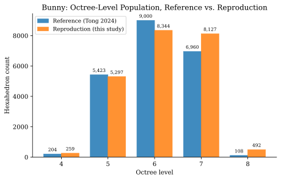

# Reproducing Tong 2024

*Part of the [Tong 2024](../tong_2024.md) review — a case study.*

[HybridOctree_Hex](../tong_2024.md)'s Table 2 reports final numbers for twelve test models: vertex and element counts, a quality range, a refinement level, a runtime. This page walks through independently reproducing those numbers. The method is to build and run the paper's own published `v1.0` source, rather than to read the paper alone. The gap between the two turns out to be instructive. Several things Table 2 states as simple facts about each model turn out, on inspection of the running code, to be measured quantities and per-model tuning choices. The paper does not fully spell these out.

The full working log behind this page is kept as a standalone document, not reproduced here in full. It covers every model attempted, every configuration tried, and the complete reasoning trail.[^analysis_md]

## Ground truth: the paper's own reference meshes

The repository accompanying HybridOctree_Hex includes an `our results/` directory of finished meshes, one per test model. Git history shows these were committed by the paper's first author. In every case checked, that commit predates the earliest commit that includes any source code at all, by up to several days. That makes the reference meshes the closest available thing to ground truth. They are not a re-derivation from the paper's stated method. They are the paper's own output.

## An exact match: `bone`

`bone` is not one of Table 2's twelve models. It is a smaller sample model, shipped in the same repository, useful here as a fast, cheap first check. This study built and ran the shipped `v1.0` source against `bone`, entirely unmodified. The output matches `bone`'s reference mesh **byte-for-byte**: identical vertex count, identical element count, identical cell connectivity.

This result matters on its own. A companion tool from the same research group, [HexOpt](https://github.com/hovey/HexOpt), turned out to implement a materially different algorithm than the one its own paper claims.[^hexopt] An exact match here is not something to take for granted. It says plainly that the algorithm in this one surviving source snapshot is not broken. Whatever gap remains, for Table 2's own twelve models, is a matter of finding the right *inputs* to a working method. It is not a matter of fixing a wrong one.

## Measuring refinement level directly

[Octree Construction](octree_construction.md#refinement-level-is-measurable-not-fixed) introduced the level formula, Equation 3 on that page:

$$\text{level} = \operatorname{round}\!\left(\log_2\frac{100}{\bar{e}}\right), \qquad \bar{e} = \tfrac{1}{12}\sum_{k=1}^{12} \ell_k$$

Every model is normalized into a 100-unit cube before meshing, so this formula applies to every hexahedron of a reference mesh directly. Applying it to Bunny's own reference mesh gives:

| Level | Count | Share |
| --- | --- | --- |
| 4 | 204 | 0.9% |
| 5 | 5,423 | 25.0% |
| 6 | 9,000 | 41.5% |
| 7 | 6,960 | 32.1% |
| 8 | 108 | 0.5% |

Levels 4 through 7 carry essentially the whole mesh. Level 8's 108 cells look, at first glance, like a thin fifth tier. But Table 2 reports Bunny's refinement level as **4**. That disagrees with the naive reading. So which is right?

### The distortion-tail test

Direct experiment answers the question, not just inspection of the histogram. This study built the source with the octree's maximum depth capped *below* level 8, so a real level-8 leaf cell became structurally impossible. Run against the same input, that build produces a mesh with **145,049 vertices and 126,800 elements**, against Bunny's reference count of 26,375 and 21,695. That is a fivefold overshoot. A tree that is genuinely five tiers deep is a dramatically different, much larger mesh. It is not a close cousin of the reference with one thin tier added.

Level 8's small population in the reference mesh is therefore not a fifth tier of real refinement. It is an artifact of the quality-improvement stage described in [Buffering](buffering.md). That stage smooths and repositions boundary nodes, until a handful of already-shallower hexahedra happen to measure as one level deeper by the edge-length formula above. A small, sharply-dropping-off population at the deepest level present is the signature of this artifact, not a genuine tier. This study confirmed the signature with the strongest available test: build an octree in which that tier is structurally unreachable, then check whether the same small population persists anyway. It does.

With that resolved, Bunny is four real tiers, at octree levels 3 through 6, with a maximum leaf level of 7. That matches Table 2's reported refinement level exactly.

This study's best Bunny reproduction, shown above, matches the reference tier by tier, levels 4 through 7, to within a few percent each. The small level-8 population is present in both meshes, at a comparable size. That is consistent with it being the same smoothing artifact in each, rather than a real difference in the underlying octree.

## The per-tier refined-parent-count diagnostic

Comparing two meshes' *total* element counts hides where they actually differ. A sharper comparison recurses each level's population upward. A level-$(L{+}1)$ population of $N$ cells implies $N/8$ **refined parent cells** at level $L$. Repeating this recursion gives one count per tier, directly comparable against the reference, tier by tier. This localizes *which* threshold is off, not just *how far* off it is. [Threshold Fitting as a Mechanical Procedure](threshold_fitting.md) uses this diagnostic throughout its fitting procedure.

## Results across five models

| Model | Reproduction (verts / elems) | Table 2 target (verts / elems) | Difference | Worst SJ, reproduction | Worst SJ, Table 2 | Refinement level |
| --- | --- | --- | --- | --- | --- | --- |
| `bone` *(not in Table 2)* | 10,356 / 8,619 | 10,356 / 8,619 | exact | 0.610 | 0.61[^bone_readme] | — |
| Bottle1 | 35,535 / 29,943 | 36,091 / 30,145 | −1.5% / −0.7% | 0.570 | 0.560 | 4 |
| Bunny | 27,175 / 22,525 | 26,375 / 21,695 | +3.0% / +3.8% | 0.010[^stall] | 0.570 | 4 |
| Dragon Stand2 | 62,307 / 50,603 | 62,576 / 50,853 | −0.43% / −0.49% | 0.010[^stall] | 0.560 | 4 |
| Ramses | 46,329 / 39,529 | 44,790 / 37,993 | +3.4% / +4.0% | 0.570 | 0.590 | 4 |

The vertex and element counts match closely on every model, Bunny and Dragon Stand2 included. Worst SJ does not, on those same two models. That gap is not a quality shortfall in the reproduced mesh. It is the convergence stall described in [Buffering](buffering.md#stalls-and-a-crash-not-yet-explained): the ratchet never advanced past its initial gate on those two runs, so the worst-SJ column stayed frozen near zero while mesh size and topology, fixed upstream of that stage, converged normally. Bottle1 and Ramses did not stall, and their worst-SJ values land close to Table 2's own.

[^bone_readme]: Published in this study's fork's own `README.md`, not in Table 2. `bone` is not one of the paper's twelve test models.
[^stall]: Reproduced mesh converged to its final size and topology normally. The worst-SJ ratchet itself never advanced past its initial checkpoint. See [Buffering](buffering.md#stalls-and-a-crash-not-yet-explained).

Every model above needed its own `C_THRES`/`H_THRES` configuration. None of the five share the same threshold values. Every attempt in this study to transfer one model's fitted values directly to another failed, by tens of percent. Refinement level transferred perfectly, by contrast. Reading it off each reference mesh, by the method above, and building with the corresponding ladder position, was correct on every model checked. That includes the seven Table 2 models not yet fully reproduced end to end. One property is measurable and model-invariant. The other requires its own fit every time. That split is the throughline of this case study, and the subject of the next page.

[^analysis_md]: `analysis.md` in [hovey/HybridOctree_Hex](https://github.com/hovey/HybridOctree_Hex/blob/main/analysis.md), a fork of the paper's own repository set up for this reproduction study.
[^hexopt]: [hovey/HexOpt](https://github.com/hovey/HexOpt) is a fork of [CMU-CBML/HexOpt](https://github.com/CMU-CBML/HexOpt), the paper's optimizer companion repository. Its restored optimizer code matches HybridOctree_Hex's own older algorithm structurally, not the augmented-Lagrangian/L-BFGS method its paper describes. See that fork's README for the date-based evidence.

---

Previous: [Buffering](buffering.md).  Next: [Threshold Fitting as a Mechanical Procedure](threshold_fitting.md).
