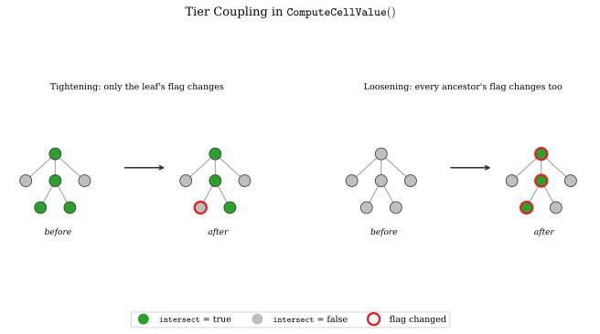

# Threshold Fitting as a Mechanical Procedure

*Part of the [Tong 2024](../tong_2024.md) review — a case study, continued.  See [Reproducing Tong 2024](reproduction.md) for the results this page explains how to reach, and [Octree Construction](octree_construction.md) for the curvature/thickness threshold ladder itself.*

Every model reproduced in this study needed its own `C_THRES`/`H_THRES` values. No threshold set found for one model transferred cleanly to another. This study tried several scaling rules, to take one model's fitted thresholds and apply them to a second model. Each rule failed, by tens of percent. Read naively, that makes threshold-fitting a fresh, unguided search for every new model. It is not. The published source's own refinement logic contains a one-directional coupling between tiers. Once found, that coupling turns the fit into a small, mechanical, guaranteed-to-converge procedure.

## The mechanism

A cell's refinement decision, for any level above the tree's deepest, is not evaluated in isolation.[^child_check] The routine first checks all eight of the cell's children. If **any** child needs refining, the routine marks the parent as needing refinement too. The parent's own curvature/thickness threshold test is never even reached in that case. Only when *none* of the eight children need refining does the cell fall through to test its own threshold.

Two consequences follow. Both were confirmed by direct experiment, not just by inspection of the source.

* **Tightening a tier's threshold changes that tier, and only that tier.** Suppose a cell now fails its own, tightened, threshold test. That cell provably had no refining children either. If it had, the child-check above would already have marked it, before its own test ever ran. Tightening a tier can therefore only remove cells that were already leaves at that exact level. Nothing at a shallower tier is affected. This study verified the claim directly: tightening one tier's threshold in isolation left every shallower tier's refined-parent count **bit-identical**, across two otherwise-matched runs.
* **Loosening a tier's threshold propagates upward, through every shallower tier.** A newly-refining deep cell trips the child-check at its parent. That marks the parent for refinement too, and the parent's parent, and so on, regardless of whether any shallower tier's own threshold changed at all. This study verified the claim directly too: loosening one deep tier's candidate count by 22% pulled the tier immediately above it up by 6.8%, with that shallower tier's own threshold completely untouched.

The asymmetry is exact, not approximate. It is a structural property of the recursive check, not a rule of thumb.

## The procedure

The coupling gives a fitting recipe that always converges. It never needs to search blindly.

1. **Measure the reference mesh's own refined-parent count, tier by tier.** [Reproducing Tong 2024](reproduction.md#the-per-tier-refined-parent-count-diagnostic) introduces this diagnostic.
2. **Start from a baseline that overshoots at every tier.** The shipped default thresholds, at the correct ladder position for the target model, reliably serve this role.
3. **Tighten each tier's own threshold until its parent count matches the reference, in any order.** Tightening never affects another tier, so the order does not matter. No tier's fit can be undone by fitting another.
4. **Sweep threshold values cheaply before committing to a full run.** Candidate counts (how many vertices or triangles pass a given curvature or thickness threshold) can be computed directly from the input surface, in seconds, without running the full octree-construction stage. Narrow each tier's threshold this way before spending minutes to hours on a real run.

Hold to one rule strictly: never loosen a tier relative to a baseline that already overshoots everywhere. Its effect on shallower tiers is real and consistently one-directional, but not reliably predictable in magnitude ahead of time. A first attempt at fitting Dragon Stand2 read one tier as "slightly too tight" in isolation, and loosened it.[^dragonstand2_scratch] That attempt went the wrong way entirely, once the propagated increase at shallower tiers was accounted for, and had to be discarded.

## Worked example: Ramses in two rounds

Ramses' shipped-threshold baseline overshot Table 2's target by **+448% vertices, +473% elements**, the most severe mismatch of any model in this study.[^ramses_finding] The mismatch was concentrated almost entirely in one tier. That tier's refined-parent count ran over **30 times** the reference's, while the tier immediately above it was already within 15%.

* **Round 1** tightened the two deepest tiers' curvature thresholds, and left the already-close shallow tier untouched. Result: **+132% / +138%**, a large improvement. But curvature tightening alone bottomed out at a thickness-driven floor before closing the gap fully.
* **Round 2** tightened the same tiers' thickness thresholds as well, and broke through that floor. Result: **+3.4% / +4.0%**, with every tier's refined-parent count within 14% of the reference, and the smallest tier within 3%.

Two rounds closed the worst shipped-threshold mismatch found in this study. Dragon Stand2 needed six rounds to discover the coupling rule in the first place. That gap is the payoff of understanding the mechanism, rather than fitting by trial and error.

## A general lesson

The coupling traces to a single line of code: a short-circuit, added in all likelihood purely as a performance optimization, that skips a cell's own threshold test once a child has already answered the question for it.[^child_check] That kind of check is a natural, almost invisible thing to write in any recursive refinement criterion. Its semantic consequence is easy to miss for the same reason. The parameter space it gates becomes directionally asymmetric: safe to tighten independently, not safe to loosen independently. The check reads as pure efficiency. It does not read as logic that changes what the algorithm computes. The general question is worth asking of any hierarchical or recursive refinement scheme, this one included: does a short-circuit written for speed silently change which parameters are independent?

## Open questions

This study left two things unresolved. They are recorded here rather than left implicit.

* **The convergence stalls and the crash**, described in [Buffering](buffering.md#stalls-and-a-crash-not-yet-explained), remain unexplained. They occurred across enough different models and input meshes, with no shared defect, that they look like a property of the projection method itself rather than isolated bad luck. No root cause has been identified.
* **Whether any single threshold rule generalizes at all is still open.** This study attempted several scale-relative corrections. One, built directly from the shipped thresholds' own internal proportionality, reproduced Bunny well ($\pm$8%) and then undershot Bottle1 by 45% when cross-validated against it.[^scale_relative] Every correction attempted reproduced one model well and failed on a second, in both directions: overshoot on one, undershoot on the other. The mechanical procedure above always converges *given* a reference mesh to fit against. It is not a substitute for having one. Nothing found so far predicts a new model's thresholds without measuring its reference mesh first.

[^child_check]: [`hexGen::ComputeCellValue()`, `HexGen.cpp`, line 1008](https://github.com/hovey/HybridOctree_Hex/blob/c3069751423f15eb972836c326d1e71f0ae9e7ff/HybridOctree_Hex_v1.0/HexGen.cpp#L1008). The child loop precedes the cell's own threshold test, and returns early once any child intersects.
[^dragonstand2_scratch]: Recorded in the Dragon Stand2 fitting session's own working notes, referenced from [Finding 15, `analysis.md`](https://github.com/hovey/HybridOctree_Hex/blob/main/analysis.md#finding-15--the-five-refinement-tiers-are-not-independent-knobs-and-the-asymmetry-is-exact-not-approximate).
[^ramses_finding]: "Ramses — the worst shipped-threshold mismatch found this session," in [`analysis.md`, the Bunny section](https://github.com/hovey/HybridOctree_Hex/blob/main/analysis.md#bunny-genus-0), in this study's fork of the paper's repository. Ramses is one of Table 2's twelve models; the finding is logged under Bunny's section because Ramses was explored as a follow-on check within that same working session.
[^scale_relative]: The shipped arrays double `C_THRES` and halve `H_THRES` between adjacent tiers. This correction applied half that step in log-space instead: `C_THRES` scaled by $\sqrt{2}$, `H_THRES` scaled by $1/\sqrt{2}$, between the ladder position Bottle1 needed and the one Bunny needed. See [`analysis.md`'s Synthesis section](https://github.com/hovey/HybridOctree_Hex/blob/main/analysis.md#synthesis-what-bone-bottle1-and-bunny-collectively-show) for the full cross-validation.

---

Previous: [Reproducing Tong 2024](reproduction.md).  This is the final page of the review.
