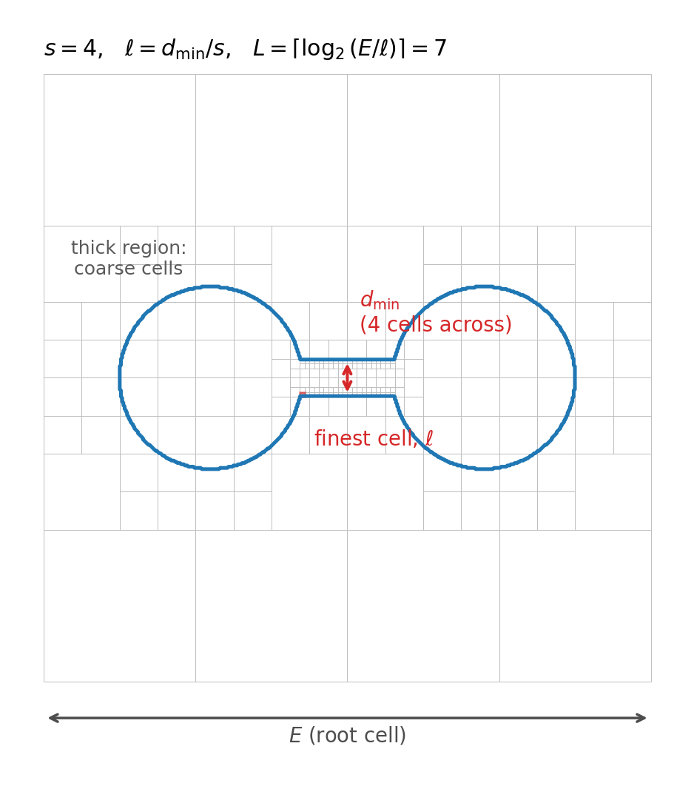

# Hexahedral Meshing from a Surface

Given a **closed, manifold, triangular surface** — an `stl` tessellation, for example — `automesh` produces an **all-hexahedral** volume mesh of the region the surface encloses.  This page describes the algorithm end to end.

```sh
automesh mesh hex --input surface.stl --output mesh.exo --scale 8
```

The method is a *dual* method: Rather than fitting hexahedra to the surface directly, it builds an octree over the enclosed volume and constructs the **dual** of that octree.  The dual of a balanced octree is all-hexahedral by construction, which guarantees the output mesh to consist of only hexahedral elements.

### Two Meshes, Two Vocabularies

Because a dual method involves two distinct meshes at once, it is worth fixing terminology before describing the algorithm.  Throughout this page:

* A **cell** is a box of the *octree* — the primal structure.  A **leaf cell** is one that has not been subdivided further.  Cells are what the octree refines, balances, and pairs.
* A **hexahedron**, or **element**, belongs to the *dual mesh* — the output.  Hexahedra are what the finished mesh is made of, and what quality metrics are computed on.

The two are related by the dual correspondence, which inverts dimension:

| Octree (primal) | Dual mesh (output) |
| --- | --- |
| leaf cell | node, at the cell center |
| vertex where cells meet | hexahedron, joining those cells' center nodes |

So a dual **node** sits at the center of each octree leaf cell, and a dual **hexahedron** is formed around each octree **vertex**, joining the centers of the eight leaf cells meeting there.  Where the octree is uniform, this is exactly eight equal cells meeting at a corner and the resulting hexahedron is a perfect cube.  Where the octree changes level, fewer or unequal cells meet, and a **template** supplies the connectivity instead — the subject of [Dualization](#dualization).

The pipeline has five stages, and **stage 3 is the pivot between the two vocabularies**: everything upstream of it operates on octree *cells*, and everything downstream operates on dual *hexahedra*.

| Stage | | Operates on |
| --- | --- | --- |
| 1 | [**Octree construction**](#octree-construction) from the shape diameter function | cells |
| 2 | [**Equilibration**](#equilibration), which balances and pairs the octree | cells |
| 3 | [**Dualization**](#dualization), which converts cells into hexahedra via templates | cells → hexahedra |
| 4 | [**Trimming**](#trimming), which discards hexahedra lying outside the surface | hexahedra |
| 5 | [**Buffering**](#buffering), which projects the boundary onto the surface | hexahedra |

Stage 3 consumes the octree and emits the dual mesh.  **The octree plays no further role once dualization is complete** — trimming and buffering never consult it, and never subdivide, coarsen, or otherwise revisit a cell.  Whatever the templates produced is what the remaining stages must work with, which is why the interior quality bound established at stage 3 survives to the finished mesh.

Cutting the pipeline the other way: stages 1–3 produce the interior of the mesh and are purely combinatorial, so their quality is bounded in advance (see [Template Quality](#template-quality)).  Stages 4–5 fit that interior to the actual geometry, and are the only stages that can degrade quality.

> **The input surface is not validated.**  `automesh` performs no up-front check for holes, non-manifold edges, or inconsistent orientation.  A defective surface will either produce a poor mesh or fail late, during buffering, with a `non-manifold boundary` error.  Verify the surface before meshing.

> **Consider `--strong` for quality-critical work.**  The balancing rule chosen during equilibration determines the guaranteed interior mesh quality.  The default is *weak* balancing; passing `--strong` raises the guaranteed minimum scaled Jacobian of every interior element from $\approx 0.246$ to $\approx 0.258$, at the cost of a larger mesh.  See [Balancing](#balancing).

## Octree Construction

The octree is sized from the **shape diameter function** (SDF) of the tessellation, a per-facet estimate of the local thickness of the solid, obtained by casting rays inward from each facet and measuring the distance to the opposite side.

Let $s$ denote the `--scale` argument, $d_{\min}$ the smallest positive shape diameter — the thinnest part of the model — and $E$ the largest extent of the surface bounding box.  Then the **finest cell size** $\ell$ and the **maximum tree depth** $L$ are

$$\ell = \frac{d_{\min}}{s}, \qquad L = \left\lceil \log_2 \frac{E}{\ell} \right\rceil.$$

Each symbol has a direct physical reading:

| Symbol | Is | Measured in |
| --- | --- | --- |
| $d_{\min}$ | thickness of the thinnest part of the solid | length |
| $E$ | edge length of the root cell, which encloses the model | length |
| $\ell$ | edge length of the smallest cell the tree may create | length |
| $s$ | **how many cells are placed across the local thickness** | count |
| $L$ | how many times the root may be halved to reach $\ell$ | count |

The one to build intuition on is $s$.  Rearranging $\ell = d_{\min}/s$ gives $d_{\min}/\ell = s$: the thinnest feature is spanned by exactly $s$ cells.  And because the octree stops subdividing a cell once it is no larger than the *local* thickness divided by $s$, this holds throughout the model, not just at its thinnest point.

> **`--scale` is the number of cells placed through the thickness of the solid.**  At `--scale 4`, a thin plate gets four cells through its thickness, and so does a thick block through its own.

$\ell$ and $L$ then follow as bookkeeping: $\ell$ is the resolution the thinnest feature demands, and $L$ is the depth needed to reach that resolution from a root cell of size $E$, since halving $L$ times gives $E/2^{L} \approx \ell$.



The figure shows a 2D quadtree analogue at $s = 4$ for a dumbbell — two thick lobes joined by a thin bar.  Note that the fine cells appear **only along the thin bar**; the lobes are meshed coarsely, because four cells across *their* thickness is a much larger cell.  The red square is the finest cell $\ell$, sized by $d_{\min}$ at the bar.

Three consequences are worth stating plainly:

* **`--scale` is not a tree depth.**  It is a divisor on local thickness.  Because depth enters logarithmically, doubling `--scale` adds approximately one level of refinement, not twice as many.
* **Refinement is local, not global.**  A thin feature is refined finely; thick regions elsewhere are not.  A sliver raises the depth *budget* $L$, but only cells near the sliver actually descend to it.
* **Refinement is surface-driven.**  Cells are subdivided only where they straddle the surface.  The deep interior of a thick region stays coarse regardless of $s$.

The default is `--scale 3`, which is deliberately coarse.  Meshes of any detail generally require considerably more; see [Choosing a Scale](#choosing-a-scale).

## Equilibration

Two conditions must hold before the octree can be dualized: the tree must be **balanced**, and its transition regions must be **paired**.

### Balancing

Balancing limits the depth difference between neighboring cells.  `automesh` offers two rules, and the choice between them is the single most consequential quality decision available to the user.

* **Weak balancing** — the default — constrains only cells sharing a **face**.
* **Strong balancing** — `--strong` — additionally constrains cells sharing an **edge** or a **vertex**.

Strong balancing is the more restrictive condition, so it refines more cells and yields a larger mesh.  In exchange, it admits a strictly smaller set of dual templates, and therefore guarantees better interior quality:

| | Weak (default) | Strong (`--strong`) |
| --- | --- | --- |
| Neighbors constrained | face | face, edge, vertex |
| Distinct template configurations | 12 | 10 |
| Guaranteed interior minimum scaled Jacobian | $\sqrt{2/33} \approx 0.246$ | $1/\sqrt{15} \approx 0.258$ |
| Relative mesh size | smaller | larger |

For the Stanford bunny at `--scale 10`, strong balancing produced about 11% more elements at the dualization stage than weak — a modest cost for eliminating the two lowest-quality template configurations entirely.  **When interior element quality matters, prefer `--strong`.**  The catalogs behind this table are given in [Template Quality](#template-quality).

Note that the two bounds coincide on simple convex geometry: a sphere attains $1/\sqrt{15}$ under either rule.  The distinction only emerges on topologically complex models — which are precisely the models where quality is hardest to recover afterward.

### Pairing

Pairing ensures that transition regions are configured such that a dual template exists for every cell.  `automesh` uses the *regular* pairing rule.

The two conditions interact: enforcing one can violate the other.  Equilibration therefore alternates between balancing and pairing, repeating until a pass makes no further change — a fixed point — rather than applying each once in sequence.

## Dualization

With the octree equilibrated, the dual mesh is assembled as described in [Two Meshes, Two Vocabularies](#two-meshes-two-vocabularies): a node is placed at the center of every leaf cell, and hexahedra are formed around the octree's vertices.

Where eight equally sized leaf cells meet at a vertex, the hexahedron is immediate — join the eight cell centers, and the result is a cube.  The difficulty is at **transitions**, where cells of differing refinement level meet and no such clean set of eight exists.  Templates resolve these cases, and are applied in three passes:

1. **Face templates**, for transitions across a shared face,
2. **Edge templates**, for transitions along a shared edge — five distinct configurations, and
3. **Vertex templates**, for transitions at a shared vertex, including the *star* configuration.

This is why equilibration must precede dualization: balancing and pairing exist precisely to guarantee that every transition in the octree matches some template in the catalog.  An unbalanced or unpaired octree can present configurations no template covers.

Every hexahedron in the interior of the mesh therefore comes from a **finite catalog** of local configurations, each with fixed geometry.  This is the central property of the method: the interior mesh quality does not depend on the input surface at all.

## Template Quality

Because the interior is assembled exclusively from a finite catalog of templates, its quality is **bounded below by construction**, before any smoothing is applied.  The catalogs below were measured directly from the dualization stage.

Under **strong balancing**, the catalog admits ten distinct values of the minimum scaled Jacobian:

| Minimum scaled Jacobian | Closed form |
| --- | --- |
| 0.258199 | $1/\sqrt{15}$ |
| 0.402015 | $4/\sqrt{99}$ |
| 0.438562 | |
| 0.447214 | $1/\sqrt{5}$ |
| 0.548202 | |
| 0.577350 | $1/\sqrt{3}$ |
| 0.727273 | $8/11$ |
| 0.894427 | $2/\sqrt{5}$ |
| 0.904534 | $3/\sqrt{11}$ |
| 1.000000 | cube |

The interior quality bound under strong balancing is therefore

$$\min \text{MSJ} \;\geq\; \frac{1}{\sqrt{15}} \approx 0.258.$$

Under **weak balancing** — the default — two additional configurations become reachable, both below $1/\sqrt{15}$:

| Minimum scaled Jacobian | Closed form |
| --- | --- |
| 0.246183 | $\sqrt{2/33}$ |
| 0.257130 | $2\sqrt{2}/11$ |

relaxing the bound to

$$\min \text{MSJ} \;\geq\; \sqrt{\tfrac{2}{33}} \approx 0.246.$$

These two configurations arise only on topologically complex inputs.  Simple convex shapes such as a sphere attain $1/\sqrt{15}$ under either balancing rule, so the difference between the two bounds becomes visible only on demanding geometry.

Two practical consequences follow.

**Any element below the bound came from the boundary.**  Trimming and buffering are the only stages that deform geometry, so sub-bound quality in a finished mesh is always attributable to them.  The interior is never the culprit, and no amount of octree refinement will fix a boundary problem.

**The bound is a choice, not a constant.**  Passing [`--strong`](#balancing) removes the two sub-$1/\sqrt{15}$ configurations from the catalog outright.  This is the only control `automesh` currently offers over interior quality — nothing downstream optimizes it — so it is worth setting deliberately rather than accepting the default.

## Trimming

The octree is built over the bounding box of the surface, not the surface itself, so dualization produces hexahedra throughout that box — including regions outside the solid.  Trimming discards them.

From this stage onward the octree is no longer consulted; trimming and buffering operate purely on the dual hexahedra.

Each dual **node** is classified inside or outside by casting rays against a bounding volume hierarchy of the surface and inspecting the orientation of the first facet hit.  Three separate ray directions are used, and rays that graze a facet nearly tangentially are rejected in favor of the next direction — a single ray is not robust against grazing hits and coincident facets.

A **hexahedron** is then retained only if **every** one of its eight nodes is inside *and* every node clears the surface by at least half the length of the element's shortest edge.  This clearance margin reserves room for the buffer layer that follows.

Trimming only removes elements; it never moves a node.  Elements that survive trimming retain exactly their template geometry, and therefore their guaranteed quality.

## Buffering

Trimming leaves a blocky, stair-stepped boundary that does not follow the surface.  Buffering resolves this by adding one conforming layer:

1. The exterior faces of the trimmed mesh are extracted.
2. Each boundary node is projected to its closest point on the surface.
3. A hexahedron is extruded from each boundary face out to the projected nodes.

Before projecting, the extracted boundary is checked for manifoldness: every edge must be shared by exactly two faces.  If not, meshing fails with

```
Error: non-manifold boundary.
```

This check is on the **output** boundary, not the input surface, and it is the only manifoldness test in the pipeline.  It is a common failure — see [Failure Modes](#failure-modes).

The buffer elements are the only elements whose geometry is fitted to the surface, and consequently the only elements whose quality is unbounded.  A poorly resolved or highly curved surface region will show up here and nowhere else.

## Quality Assessment and Improvement

Element quality is reported with `--metrics`, which writes maximum edge ratio, minimum scaled Jacobian, maximum skew, and element volume per element:

```sh
automesh mesh hex --input surface.stl --output mesh.exo --scale 8 --metrics quality.csv
```

Quality can be improved after meshing with Taubin or Laplace smoothing:

```sh
automesh mesh hex --input surface.stl --output mesh.exo --scale 8 smooth --method Taubin
```

Taubin smoothing is preferred over Laplace, which shrinks the mesh; see [Smoothing](smoothing.md).

Optimization-based quality improvement — in particular BFGS-driven untangling and quality maximization, as described by Protais et al. — is the intended direction for `automesh` but is **not yet implemented**.  At present, no stage of the pipeline optimizes element quality; the interior relies on the template bound, and the boundary on smoothing.

## Choosing a Scale

Quality does **not** improve monotonically with `--scale`.  Raising it refines the octree, which improves the resolution of the surface, but also produces more transition regions and more buffer elements — and past a point the latter dominates.

For the remeshed unit sphere [`sphere_n10.stl`](../examples/mesh/sphere_n10.stl), sweeping `--scale` gives:

| `--scale` | Elements | Minimum scaled Jacobian |
| --- | --- | --- |
| 3 | 7 | 0.531 |
| 4 | 37 | 0.215 |
| 5 | 73 | 0.171 |
| 6 | 183 | 0.058 |
| 7 | 235 | 0.058 |
| 8 | 393 | **0.280** |
| 9 | 551 | 0.009 |
| 10 | 804 | −0.165 |

Scale 8 is the sweet spot here; scale 10 produces **inverted** elements.  The practical guidance is to **sweep `--scale` and inspect `--metrics`** rather than assuming that a larger value is better.  The optimum is model-specific.

## Failure Modes

**`non-manifold boundary`.**  Raised during buffering.  Frequent causes:

* **Smoothed input tessellations.**  Dualizing a Taubin-smoothed surface reliably triggers this error.  Smooth the *hexahedral mesh* after meshing, not the surface before it.
* **Surfaces with holes, or self-intersections.**  The Stanford bunny [`stanford_bunny.stl`](../examples/remesh/stanford_bunny.stl) fails at every scale for this reason, even though its octree dualizes without complaint.

**Degenerate or inverted elements.**  A minimum scaled Jacobian at or below zero indicates elements produced by the buffer layer that could not be fitted.  Causes:

* **Thin shells.**  The method fills an enclosed *volume*.  A one-element-thick shell has almost no interior, so nearly every element is a buffer element and the template bound does not apply.
* **Excessive `--scale`**, as shown above.

**A far denser mesh than expected.**  Refinement is driven by *local* thickness, so an unintentionally thin feature — a sliver, a near-degenerate facet, a self-intersection that reads as thin — is resolved at $s$ cells across its own small thickness, and the balancing rules then propagate some of that refinement into its neighborhood.  Inspect the model for unintended thin features, or coarsen `--scale`.

## References

* Protais et al., *Versatile Volume Fitting*, 2026.
* [SIBL — quadtree](https://github.com/sandialabs/sibl/blob/master/geo/doc/quadtree.md)
* [SIBL — dual quad transitions](https://github.com/sandialabs/sibl/blob/master/geo/doc/dual_quad_transitions.md)
* [SIBL — dual lesson 11](https://github.com/sandialabs/sibl/blob/master/geo/doc/dual/lesson_11.md)

See also [Dualization](dualization.md) for the underlying quadtree and octree dual constructions, and [Hexahedral Metrics](metrics_hexahedral.md) for the definition of the minimum scaled Jacobian.
