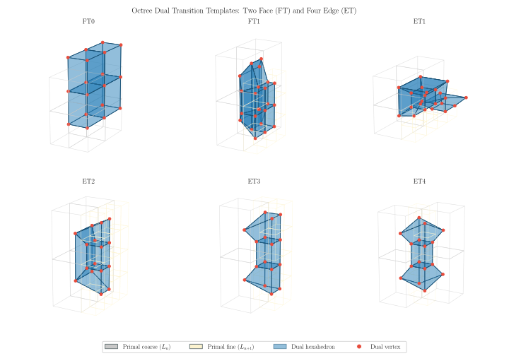

# Dualization

*Stage 3 of five — the pivot.  Consumes **cells**, emits **hexahedra**.  See [Hexahedral Meshing from a Surface](../hex_from_surface.md) for the pipeline overview and terminology.*

With the octree equilibrated, the dual mesh is assembled as described in [Two Meshes, Two Vocabularies](../hex_from_surface.md#two-meshes-two-vocabularies): a node is placed at the center of every leaf cell, and hexahedra are formed around the octree's vertices.

Where eight equally sized leaf cells meet at a vertex, the hexahedron is immediate — join the eight cell centers, and the result is a cube.  The difficulty is at **transitions**, where cells of differing refinement level meet and no such clean set of eight exists.  Templates resolve these cases, and are applied in three passes:

1. **Face templates**, for transitions across a shared face — two configurations, FT0 and FT1,
2. **Edge templates**, for transitions along a shared edge — **four** configurations, ET1–ET4, and
3. **Vertex templates**, for transitions at a shared vertex, including the *star* configuration.

The figure shows the two face and four edge templates.  In each panel the primal octree cells are drawn as wireframes — gray for the coarse level $L_n$, pale yellow for the fine level $L_{n+1}$ — with the dual hexahedron shaded blue and its dual vertices marked in red.  Reading a panel is a direct illustration of the [dual correspondence](../hex_from_surface.md#two-meshes-two-vocabularies): every red vertex sits at the center of a primal cell, and the blue element spans the primal vertex where those cells meet.

> **A fifth edge template exists under weak balancing.**  The four templates above are the complete set under `--strong`.  Weak balancing — the default — additionally admits a fifth edge configuration that strong balancing rules out.  This is the structural reason the two balancing modes have different quality bounds: the extra template is the source of the sub-$1/\sqrt{15}$ configurations reported in [Template Quality](../hex_from_surface.md#template-quality).

This is why [equilibration](equilibration.md) must precede dualization: balancing and pairing exist precisely to guarantee that every transition in the octree matches some template in the catalog.  An unbalanced or unpaired octree can present configurations no template covers.

Every hexahedron in the interior of the mesh therefore comes from a **finite catalog** of local configurations, each with fixed geometry.  This is the central property of the method: the interior mesh quality does not depend on the input surface at all.  The catalog and the quality bound it guarantees are tabulated in [Template Quality](../hex_from_surface.md#template-quality).

Once this stage completes, the octree has served its purpose and is not consulted again.

---

Previous: [Equilibration](equilibration.md).  Next: [Trimming](trimming.md), which discards the hexahedra lying outside the surface.
