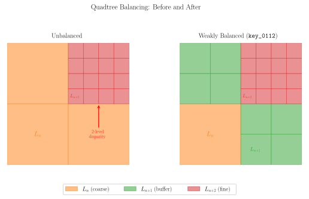

# Equilibration

*Stage 2 of five.  Operates on **cells**.  See [Hexahedral Meshing from a Surface](../hex_from_surface.md) for the pipeline overview and terminology.*

Two conditions must hold before the octree can be dualized: the tree must be **balanced**, and its transition regions must be **paired**.

## Balancing

Balancing limits the depth difference between neighboring cells.  `automesh` offers two rules, and the choice between them is the single most consequential quality decision available to the user.

* **Weak balancing** — the default — constrains only cells sharing a **face**.
* **Strong balancing** — `--strong` — additionally constrains cells sharing an **edge** or a **vertex**.

The figure shows the 2D quadtree analogue.  Balancing inserts intermediate cells — the buffer level $L_{n+1}$ — wherever a coarse cell at $L_n$ would otherwise abut a fine cell at $L_{n+2}$ directly, so that no two neighbors differ by more than one level.

Strong balancing is the more restrictive condition, so it refines more cells and yields a larger mesh.  In exchange, it admits a strictly smaller set of dual templates, and therefore guarantees better interior quality:

| | Weak (default) | Strong (`--strong`) |
| --- | --- | --- |
| Neighbors constrained | face | face, edge, vertex |
| Distinct template configurations | 12 | 10 |
| Guaranteed interior minimum scaled Jacobian | $\sqrt{2/33} \approx 0.246$ | $1/\sqrt{15} \approx 0.258$ |
| Relative mesh size | smaller | larger |

For the Stanford bunny at `--scale 10`, strong balancing produced about 11% more elements at the dualization stage than weak — a modest cost for eliminating the two lowest-quality template configurations entirely.  **When interior element quality matters, prefer `--strong`.**  The catalogs behind this table are given in [Template Quality](../hex_from_surface.md#template-quality).

Note that the two bounds coincide on simple convex geometry: a sphere attains $1/\sqrt{15}$ under either rule.  The distinction only emerges on topologically complex models — which are precisely the models where quality is hardest to recover afterward.

## Pairing

Pairing ensures that transition regions are configured such that a dual template exists for every cell.  `automesh` uses the *regular* pairing rule.

The two conditions interact: enforcing one can violate the other.  Equilibration therefore alternates between balancing and pairing, repeating until a pass makes no further change — a fixed point — rather than applying each once in sequence.

---

Previous: [Octree Construction](octree_construction.md).  Next: [Dualization](dualization.md), which converts the equilibrated octree into hexahedra.
