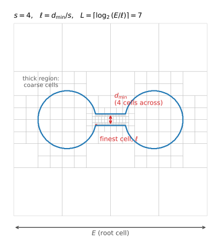

# Octree Construction

*Stage 1 of five.  Operates on **cells**.  See [Hexahedral Meshing from a Surface](../hex_from_surface.md) for the pipeline overview and terminology.*

The octree is sized from the **shape diameter function** (SDF) of the tessellation, a per-facet estimate of the local thickness of the solid, obtained by casting rays inward from each facet and measuring the distance to the opposite side.

Let $s$ denote the `--scale` argument, $d_{\min}$ the smallest positive shape diameter — the thinnest part of the model — and $E$ the largest extent of the surface bounding box.  Then the **finest cell size** $\ell$ and the **maximum tree depth** $L$ are

$$\ell = \frac{d_{\min}}{s}, \qquad L = \left\lceil \log_2 \frac{E}{\ell} \right\rceil.$$

Each symbol has a direct physical reading:

| Symbol | Is | Measured in |
| --- | --- | --- |
| $d_{\min}$ | thickness of the thinnest part of the solid | length |
| $E$ | edge length of the root cell, which encloses the model | length |
| $\ell$ | edge length of the smallest cell the tree may create | length |
| $s$ | **how many cells are placed across the local thickness** | count |
| $L$ | how many times the root may be halved to reach $\ell$ | count |

The one to build intuition on is $s$.  Rearranging $\ell = d_{\min}/s$ gives $d_{\min}/\ell = s$: the thinnest feature is spanned by exactly $s$ cells.  And because the octree stops subdividing a cell once it is no larger than the *local* thickness divided by $s$, this holds throughout the model, not just at its thinnest point.

> **`--scale` is the number of cells placed through the thickness of the solid.**  At `--scale 4`, a thin plate gets four cells through its thickness, and so does a thick block through its own.

$\ell$ and $L$ then follow as bookkeeping: $\ell$ is the resolution the thinnest feature demands, and $L$ is the depth needed to reach that resolution from a root cell of size $E$, since halving $L$ times gives $E/2^{L} \approx \ell$.

The figure shows a 2D quadtree analogue at $s = 4$ for a dumbbell — two thick lobes joined by a thin bar.  Note that the fine cells appear **only along the thin bar**; the lobes are meshed coarsely, because four cells across *their* thickness is a much larger cell.  The red square is the finest cell $\ell$, sized by $d_{\min}$ at the bar.

Three consequences are worth stating plainly:

* **`--scale` is not a tree depth.**  It is a divisor on local thickness.  Because depth enters logarithmically, doubling `--scale` adds approximately one level of refinement, not twice as many.
* **Refinement is local, not global.**  A thin feature is refined finely; thick regions elsewhere are not.  A sliver raises the depth *budget* $L$, but only cells near the sliver actually descend to it.
* **Refinement is surface-driven.**  Cells are subdivided only where they straddle the surface.  The deep interior of a thick region stays coarse regardless of $s$.

The default is `--scale 3`, which is deliberately coarse.  Meshes of any detail generally require considerably more; see [Choosing a Scale](../hex_from_surface.md#choosing-a-scale).

---

Next: [Equilibration](equilibration.md), which balances and pairs the octree this stage produced.
