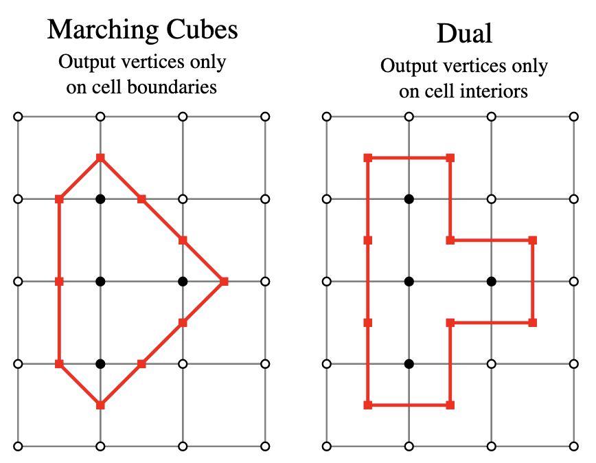

# Dual Contouring

Dual Contouring (DC) was originally proposed by Ju *et al.*[^Ju_2002] in 2002.

DC improves upon the MC algorithm.  DC uses the dual grid of the voxel data, locating nodes of the surface *within* the voxel, rather than on the edge of the voxel (as done with MC).

Boris[^Boris_2025] created a figure, reproduced below, that illustrates the differences between MC and DC.

Figure: Reproduction of the figure from Boris[^Boris_2025], illustrating, in two dimensions, the differences between MC and DC.  White circle are outside points.  Black circles are inside points.  In MC, the red points indicate surface vertices at edge intersections.  In DC, the red points indicate surface vertices within a voxel.

## Advantages

* "[C]an produce sharp features by inserting vertices anywhere inside the grid cube, as opposed to the Marching Cubes (MC) algorithm that can insert vertices only on grid edges."[^Rashid_2016]

## Disadvantages

* More complicated than MC since DC uses both position and normal (gradient) information at voxel edges to locate the surface intersection.
* "...unable to guarantee 2-manifold and watertight meshes due to the fact that it produces only one vertex for each grid cube." "DC is that it does not guarantee 2-manifold and intersection-free surfaces. A polygonal mesh is considered as being 2-manifold if each edge of the mesh is shared by only two faces, and if the neighborhood of each vertex of the mesh is the topological equivalent of a disk." [^Rashid_2016]

## References

[^Ju_2002]: Ju T, Losasso F, Schaefer S, Warren J. Dual contouring of hermite data. In Proceedings of the 29th annual conference on Computer graphics and interactive techniques 2002 Jul 1 (pp. 339-346).  [link](https://dl.acm.org/doi/pdf/10.1145/566570.566586)

[^Boris_2025]: Boris. Dual Contouring Tutorial. Available from: https://www.boristhebrave.com/2018/04/15/dual-contouring-tutorial/ [Accessed 18 Jan 2025]. [link](https://www.boristhebrave.com/2018/04/15/dual-contouring-tutorial/)

[^Rashid_2016]: Rashid T, Sultana S, Audette MA. Watertight and 2-manifold surface meshes using dual contouring with tetrahedral decomposition of grid cubes. Procedia engineering. 2016 Jan 1;163:136-48. [link](https://doi.org/10.1016/j.proeng.2016.11.037)
