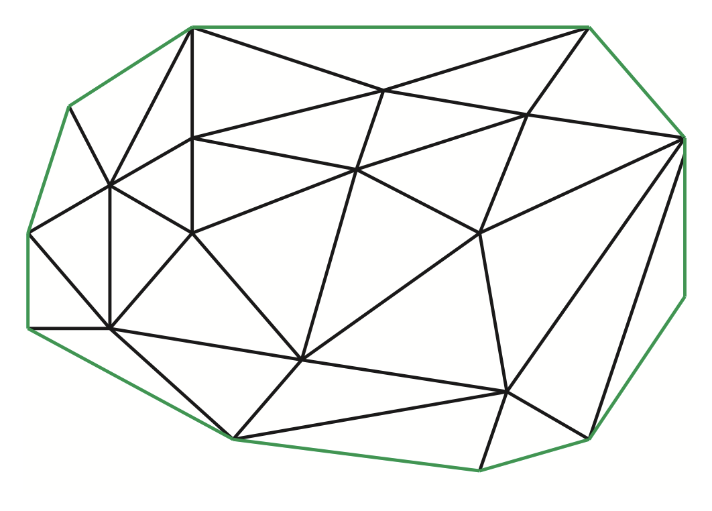
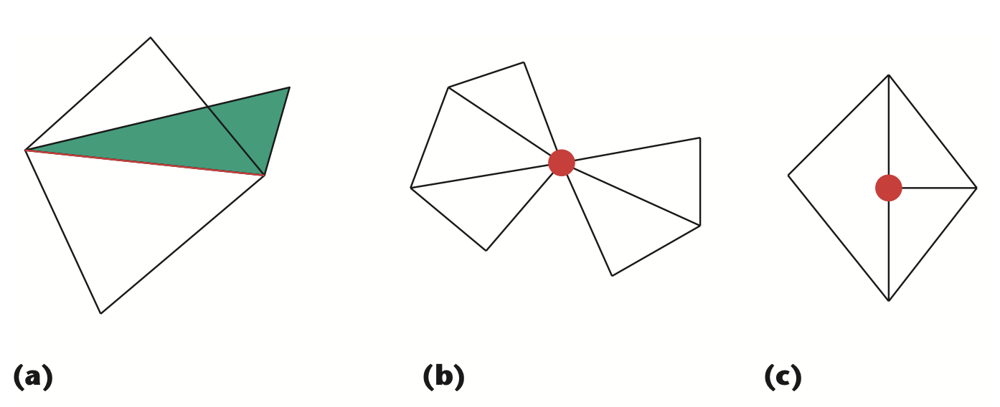

# Marching Cubes

Lorensen and Cline[^Lorensen_1987] originally proposed Marching Cubes (MC)
in 1987.

MC operates on each voxel in the 3D grid on a independent basis.
For each voxel, the eight nodes of the voxel are evaluated as outside (`0`) the scalar field or inside (`1`) the scalar field.  The eight nodes, classified as either `0` or `1`, create 256 ($2^8$) possible configurations.  Of these combinations, only 15 are unique configurations, after symmetry and rotation considerations.  For each configuration, MC generates a set of triangles to approximate the isosurface.

## Advantages

* Simple implementation; uses only interpolation between voxel corners.
* Results in smooth surfaces because it interpolates along edges between voxel corners.  This can be an advantage when smooth meshes are desired but is a disadvantage when sharp edges are desired.

## Disadvantages

* Can produce ambiguous cases wherein the isosurface can be represented in multiple (non-unique) ways.  This can result in a surface artifacts.
* Can produce non-manifold edges.

> **Manifold:** "The mesh forms a 2D manifold if the local topology is everywhere equivalent to a disc; that is, if the neighborhood of every feature consists of a connected ring of polygons forming a single surface (see Figure 2 of Luebke[^Luebke_2001] reproduced below). In a triangulated mesh displaying manifold topology, exactly two triangles share every edge, and every triangle shares an edge with exactly three neighboring triangles. A 2D manifold with boundary permits boundary edges, which belong to only one triangle."

manifold | non-manifold
:---: | :---:
 | 

Figure: Reproduction of Luebke[^Luebke_2001] Figure 2 (left) showing a manifold mesh, and Figure 3 (right) showing a non-manifold mesh because of (a) an edge shared by more than two triangles, (b) a vertex shared by two unconnected sets of triangles, and (c) a T-junction vertex.

## References

[^Lorensen_1987]: Lorensen WF. Marching cubes: A high resolution 3D surface construction algorithm. Computer Graphics. 1987;21. [link](http://academy.cba.mit.edu/classes/scanning_printing/MarchingCubes.pdf)

[^Luebke_2001]: Luebke DP. A developer's survey of polygonal simplification algorithms. IEEE Computer Graphics and Applications. 2001 May;21(3):24-35. [link](https://ieeexplore.ieee.org/iel5/38/19913/00920624.pdf)
