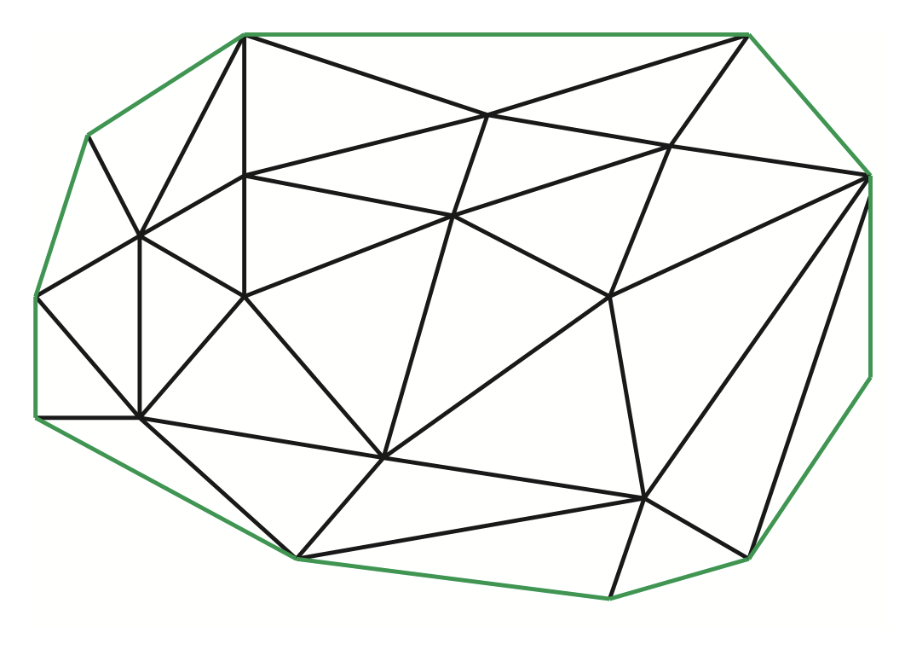
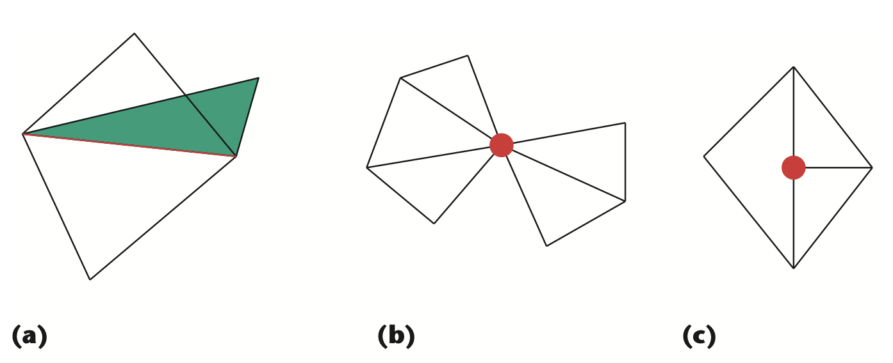

# Marching Cubes

Marching Cubes, originally proposed by Lorensen and Cline in 1987[^Lorensen_1987],
operates on each voxel in the 3D grid on an independent basis.
For each voxel, the eight nodes of the voxel are evaluated as outside (`0`) the scalar field or inside (`1`) the scalar field.  The eight nodes, classified as either `0` or `1`, create 256 ($2^8$) possible configurations.  Of these combinations, only 15 are unique configurations, after symmetry and rotation considerations.  For each configuration, Marching Cubes generates a set of triangles to approximate the isosurface.

## Ambiguous Cases

Some configurations of the original table have more than one valid triangulation.
An example is a cube face with two diagonal nodes inside and two outside.
The original table picks one triangulation per configuration.
Two cubes that share such a face can then pick incompatible triangulations.
The result is a crack, or an edge shared by more than two triangles.

> **Manifold:** "The mesh forms a 2D manifold if the local topology is everywhere equivalent to a disc; that is, if the neighborhood of every feature consists of a connected ring of polygons forming a single surface (see Figure 2 of Luebke[^Luebke_2001] reproduced below). In a triangulated mesh displaying manifold topology, exactly two triangles share every edge, and every triangle shares an edge with exactly three neighboring triangles. A 2D manifold with boundary permits boundary edges, which belong to only one triangle."

manifold | non-manifold
:---: | :---:
 | 

Figure: Reproduction of Luebke[^Luebke_2001] Figure 2 (left) showing a manifold mesh, and Figure 3 (right) showing a non-manifold mesh because of (a) an edge shared by more than two triangles, (b) a vertex shared by two unconnected sets of triangles, and (c) a T-junction vertex.

Lewiner *et al.*[^Lewiner_2003] resolve the ambiguous cases.
Their algorithm adds the missing cases to the original table.
It picks each triangulation so that two cubes sharing a face agree on that face.
This removes the cracks that the original table can produce.
`automesh` uses this variant.

A binary field needs one further caution.
It takes only the values `0` and `1`, so the level `0.5` equals the field value at the saddle of an ambiguous face.
At such a tie, the Lewiner method can leave an edge shared by more than two triangles.
The tie arises only where the segmentation contains an ambiguous configuration.
The [unit sphere](../../examples/gallery/academic/unit_sphere_v2.md) does not create this pathology.

## Marching Cubes in `automesh`

`mesh tri --cubes marching` extracts the surface of each material separately.
`automesh` builds the scalar field from the segmentation, one material at a time:

* The field is `1.0` at every voxel of the material and `0.0` elsewhere.
* A one-voxel border of `0.0` surrounds the field, so the surface closes at the edge of the grid.
* The surface sits where the field equals `0.5`, halfway between `0` and `1`.
* Every grid edge that the surface crosses runs from a `0` to a `1`, so the surface crosses it at its midpoint.
  Every output vertex therefore sits at the midpoint of a grid edge.
* Degenerate triangles are not output.

`mesh hex --marching` and `--inflate` use the same extraction on a uniform lattice cut by a tessellation.

## Advantages

* Simple implementation; uses only interpolation between voxel corners.
* Interpolates along edges between voxel corners.  With a continuous scalar field, this gives a smooth surface.
  This can be an advantage when smooth meshes are desired but is a disadvantage when sharp edges are desired.
* With the Lewiner variant, the ambiguous cases do not produce cracks or inconsistent triangulations.

## Disadvantages

* The surface is only as smooth as the scalar field.
  `automesh` supplies a binary field, so the interpolation puts every vertex at an edge midpoint.
  The surface is a chamfered version of the voxel staircase, not a smooth surface.
  `mesh tri smooth` removes more of it.
* It cannot place a vertex inside a voxel, so it does not preserve sharp features.
  [Dual Contouring](dual_contouring.md) does.

## Multi-material interfaces

`automesh` runs Marching Cubes once per material, and each run extracts that material's boundary independently.
Each material gets its own block of triangles.
Two adjacent materials each carry a copy of their shared interface.
The two copies coincide in position, and they are separate nodes, so the mesh is not merged across the interface.

Wu and Sullivan[^Wu_Sullivan_2003] classify each cube by the set of labels that touch it.
Frisken[^Frisken_2022] extends the Dual Contouring family the same way.
Either would be the reference for a multi-label method.

## References

[^Lorensen_1987]: Lorensen WF. Marching cubes: A high resolution 3D surface construction algorithm. Computer Graphics. 1987;21. [link](http://academy.cba.mit.edu/classes/scanning_printing/MarchingCubes.pdf)

[^Lewiner_2003]: Lewiner T, Lopes H, Vieira AW, Tavares G. Efficient implementation of Marching Cubes' cases with topological guarantees. Journal of Graphics Tools. 2003;8(2):1-15. [link](http://thomas.lewiner.org/pdfs/marching_cubes_jgt.pdf)

[^Wu_Sullivan_2003]: Wu Z, Sullivan JM Jr. Multiple material marching cubes algorithm. International Journal for Numerical Methods in Engineering. 2003;58(2):189-207. [link](https://doi.org/10.1002/nme.775)

[^Frisken_2022]: Frisken SF. SurfaceNets for multi-label segmentations with preservation of sharp boundaries. Journal of Computer Graphics Techniques. 2022;11(1):34-54. [link](https://jcgt.org/published/0011/01/03/paper.pdf)

[^Luebke_2001]: Luebke DP. A developer's survey of polygonal simplification algorithms. IEEE Computer Graphics and Applications. 2001 May;21(3):24-35. [link](https://ieeexplore.ieee.org/iel5/38/19913/00920624.pdf)
