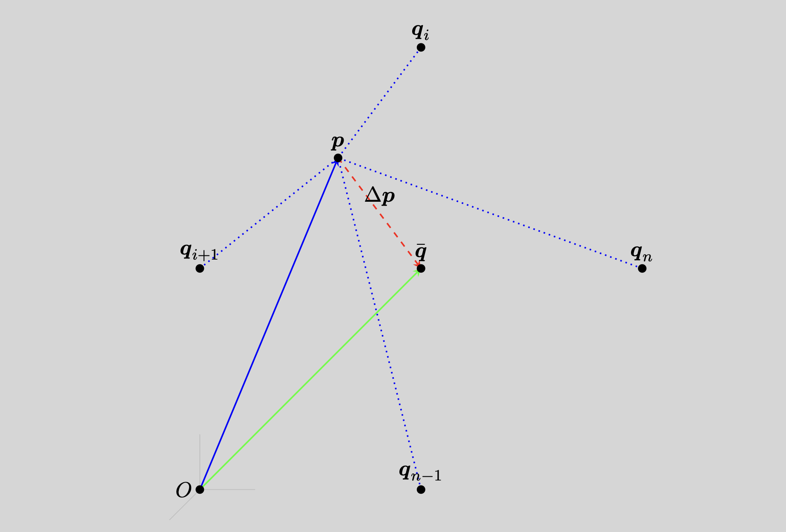
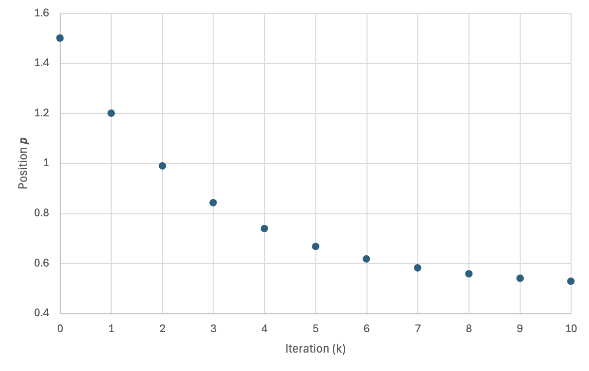

# Smoothing

Both Laplacian smoothing and Taubin smoothing are smoothing operations that adjust the positions of the nodes in a finite element mesh.

Laplacian smoothing, based on the Laplacian operator, computes the average position of a point's neighbors and moves the point toward the average.  This reduces high-frequency noise, but can result in a loss of shape and detail, with overall shrinkage.

Taubin smoothing is an extension of Laplacian smoothing that seeks to overcome the shrinkage drawback associated with the Laplacian approach.   Taubin is a two-pass approach.  The first pass smooths the mesh.  The second pass re-expands the mesh.

## Laplacian Smoothing

Consider a subject node with position $\boldsymbol{p}$.  The subject node connects to $n$ neighbor points $\boldsymbol{q}_i$ for $i \in [1, n]$ through $n$ edges. 

For concereteness, consider a node with four neighbors, shown in the figure below.

Figure: The subject node $\boldsymbol{p}$ with edge connections (dotted lines) to neighbor nodes $\boldsymbol{q}_i$ with $i \in [0, n]$ (withouth loss of generality, the specific example of $n=4$ is shown).  The average position of all neighbors of $\boldsymbol{p}$ is denoted $\bar{\boldsymbol{p}}$, and the gap $\boldsymbol{g}$ (dashed line) originates at $\bar{\boldsymbol{p}}$ and terminates at $\boldsymbol{p}$.

Define $\bar{\boldsymbol{p}}$ as the average position of all $\boldsymbol{q}_i$ neighbors of $\boldsymbol{p}$

$$ \bar{\boldsymbol{p}} := \frac{1}{n} \sum_{i=1}^n \boldsymbol{q}_i.  $$

Define the gap vector $\boldsymbol{g}$ as originating at $\bar{\boldsymbol{p}}$ and terminating at $\boldsymbol{p}$ (*viz.*, $\bar{\boldsymbol{p}} + \boldsymbol{g} = \boldsymbol{p}$),

$$ \boldsymbol{g} := \boldsymbol{p} - \bar{\boldsymbol{p}}. $$

Let $\lambda \in \mathbb{R}^+ \subset (0, 1)$ be a scaling factor for the gap $\boldsymbol{g}$.

At iteration $k$, update the position of $\boldsymbol{p}$ by an amount $-\lambda \boldsymbol{g}$ to $\boldsymbol{p}'$ as

$$ \boldsymbol{p}' := \boldsymbol{p} - \lambda \boldsymbol{g}, $$

since $\bar{\boldsymbol{p}} = \boldsymbol{p} - \boldsymbol{g}$ when $\lambda = 1$.

We typically select $\lambda < 1$ to avoid overshoot of the update.  

### Example

For a 1D configuration, consider a node with initial position $\boldsymbol{p} = 1.5$ with two neighbors (that never move) with positions $\boldsymbol{q}_1 = 0.0$ and $\boldsymbol{q}_2 = 1.0$ ($\bar{\boldsymbol{p}} = 0.5$).  With $\lambda = 0.3$, the table below shows updates for for position $\boldsymbol{p}$.

Table: Iteration updates of a 1D example.

$k$ | $\bar{\boldsymbol{p}}$ | $\boldsymbol{p}^{(k)}$ | $\boldsymbol{g}^{(k)} = \boldsymbol{p}^{(k)} - \bar{\boldsymbol{p}}$ | $\lambda \boldsymbol{g}^{(k)}$
--- | --- | --- | --- | ---
0 | 0.5 | 1.5 | 1 | 0.3
1 | 0.5 | 1.2 | 0.7 | 0.21
2 | 0.5 | 0.99 | 0.49 | 0.147
3 | 0.5 | 0.843 | 0.343 | 0.1029
4 | 0.5 | 0.7401 | 0.2401 | 0.07203
5 | 0.5 | 0.66807 | 0.16807 | 0.050421
6 | 0.5 | 0.617649 | 0.117649 | 0.0352947
7 | 0.5 | 0.5823543 | 0.0823543 | 0.02470629
8 | 0.5 | 0.55764801 | 0.05764801 | 0.017294403
9 | 0.5 | 0.540353607 | 0.040353607 | 0.012106082
10 | 0.5 | 0.528247525 | 0.028247525 | 0.008474257

Figure: Convergence of position $\boldsymbol{p}$ toward $0.5$ as a function of iteration $k$.

## Taubin Smoothing

* Taubin[^Taubin_1995]
* Used by Chen[^Chen_2010]
  * Hierarchical mesh Laplacian smoothing with Taubin strategy to conserve mesh volume, and avoid volume shrinkage from conventional Laplacian smoothing techniques. Used eight (8) smoothing iterations.

### Chen Mesh Smoothing

Goal: Given that a conversion of image voxels to a hexahedral mesh creates "jagged edges on mesh surface and material interfaces", causing numical artifacts, smooth the outer and inner surfaces.

* **Step 1: Hierarchy**
  * For all nodes in the mesh, classify each node as a surface, interface, or interior node, and assign a hierarchical order accordingly,
    * `surface_node` with `hierarchy_order = 3`
    * `interface_node` with `hierarchy_order = 2`
    * `interior_node` and `hierarchy_order = 1`
* **Step 2: Neighborhoods**
  * For all surface nodes and interface nodes, define neighborhoods with hierarchical constraints.
    * General neighborhoods
      * A `surface_node` that lies a corner, edge, or face will typically has three, four, or five neighbors, respectively.
      * An `interface_node` will typically have six neighbors.
      * For completeness, an `interior_node` will typically have six neighbors, but we don't need to define neighborhoods for interior nodes.
    * Hierarchical neighborhoods - only nodes with the same or greater `hierarchy_order` can be neighbors.
      * A `surface_node` will only consider another `suface_node` to be a neighbor; it will not consider an `interface_node` or an `internal_node` to be a neighbor.
      * An `interface_node` will consider either a `surface_node` or an `interface_node` to be a neighbor, but will not consider an `interior_node` to be a neighbor.
      * Let the set of neighbors of node $i$ be denoted $i*$.
* **Step 3: Smoothing**
  * Define
    * $\lambda = 0.6307$
    * $\mu = -0.6732$
    * $k$ iteration counter
    * $k_{\max}$ (number of smoothing interations), $k_{\max}=8$ in the Chen paper, as too many mesh smoothing interations can cause severe element distortion.
    * For the position of any node $\boldsymbol{p} = (x, y, z)$ with $n$ neighbors $\boldsymbol{q}_i$, for $i \in [1, n]$
  * Smooth
    * for $k=0, k<k_{\max}, k = k+1$
      * $\Delta \boldsymbol{p} = \frac{1}{n} \sum_{i=1}^n (\boldsymbol{q}_i - \boldsymbol{p})$
        * if $k$ is even:
          * $\boldsymbol{p}' = \boldsymbol{p} + \lambda \Delta \boldsymbol{p}$
        * else ($k$ is odd):
          * $\boldsymbol{p}' = \boldsymbol{p} + \mu \Delta \boldsymbol{p}$
  * Remarks
    * Conventional Laplacian smoothing causes volume shrinkage.  The Chen algorithm conserves mesh volume.  *(??? Would like to see the proof or constraint equations that makes this a true statement.)*
    * Seems like an even number of interations should be used to provide both a smoothing/deflation step followed by an inflation step.

## References

[^Taubin_1995]: Taubin G. A signal processing approach to fair surface design. In *Proceedings of the 22nd annual conference on Computer graphics and interactive techniques* 1995 Sep 15 (pp. 351-358). [paper](https://dl.acm.org/doi/pdf/10.1145/218380.218473)

[^Chen_2010]: Chen Y, Ostoja-Starzewski M. MRI-based finite element modeling of head trauma: spherically focusing shear waves. Acta mechanica. 2010 Aug;213(1):155-67. [paper](https://link.springer.com/content/pdf/10.1007/s00707-009-0274-0.pdf)
